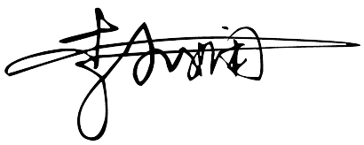

# 作者献词

**来日纵使千千晚星，亮过今晚月亮，都比不起这宵美丽，亦绝不可使我更欣赏，啊哈…… 因你今晚共我唱......**

谢谢本著的每一位读者朋友，我爱你们！我或许是个偏理想主义的理工男。"疗愈自己，赠人玫瑰"是我热爱创作的动力。在撰写这部心作的过程中，我始终致力于追求"幸福平权"的理念，想通过记录与反思自己的成长故事，把对婚恋家庭的心得感悟融入文字，并与大家分享。大龄单身青年数量开封王婆干娘最懂。现在像作者这样的重组家庭也越来越多。人民热评说：满足年轻人"刚需"的《王婆说媒》不应被干扰。我想再加一句：掌握找对象、结婚、生娃、养娃这一条龙的"内功心法"更是"刚需"中的"刚需"，应像九年免费义务教育一样被满足。

生命的起点固然受到诸多不可控因素的影响，但不论身处何种环境，知识的积累与内心的成长都是伴随个体一生的宝贵财富。因此，我们应当聚焦于自我提升，而非过分依赖或抱怨原生家庭。父母赋予我们生命，这已经是最宝贵的礼物。我作为一个80后失去两个小孩的三婚奶爸，常以"久病成医"来形容我自己。在智力方面，我和小娴其实都不低，我是211硕士，小娴是985，而在婚姻方面，我们在遇见彼此之前，没有取得像学业那样圆满的成绩。但正是在我和小娴各自面临人生低谷，婚姻家庭困境时，我们阅读了大量的各流派的心理类治愈类的书。有共同的认知，这也正是我们相遇后，感觉相见恨晚，一拍即合的原因，因为我们有许多共同感悟。为什么做这个公众号？我和小娴都是上班族，公众号是工作之余的时间在做。人到中年，见过经历过太多各式各样的婚姻家庭，才真正发现，我并不是最惨的，很多人甚至对象都没有。时代不同，也许是经历也许是感悟，总之有股莫名的力量激发我：人生干点有意义的事情。于是有了建设"开源幸福成长社区"的想法，小娴也是非常支持我的，公众号也属上了她的名字，这种支持是相互的。我们的核心理念则是男性和女性都能回归家庭责任，同时把小孩教育好。

我和小娴的小女琪琪诞生后，我激动的同时，也马不停蹄地将心得感悟记录总结下来，特别是干货实操（读者亲您若真的太忙，那看我的目录就行），于是撰写、配音、写歌、建网站、做视频，前后可能三个多月，内容上下两篇基本成了体系，小娴则身体力行地支持和共创。虽然带俩娃比较辛苦，但也正因这部心作，我们俩的情感在共同创作中变得更深。全家男女老少，都因我们的带动而思考，因思考而成长。很多原生家庭的矛盾问题，在"好好说话"中无形地解决。我内心的激动之情难以言表，仿佛一股无形的力量让我坚信，在夫妻共同成长、齐心协力的道路上，没有什么困难是无法克服的。因此，我由衷地期盼能与全家人以及所有读者们一道，共同续写"幸福新篇"。

关于服务，这部心作我和小娴其实都是利用工作和带娃之余创作的。虽然辛苦，但是总感觉成长更酷，遇见了更好的自己。出于热爱，同时也为了与时代同频，我们也许会在与读者的互动交流中，保持每月更新修改一版的频率。本著的所有配套文稿和音视频资料，均可通过我们胡瑞阳李小娴频道的官方网站，完整阅读、收听、观看及下载。专属智能体"幸福灵"也将依据本著的全部内容，提供24小时实时对话交流服务。同时，我们还提供24小时免费实时在线视频相亲交友服务，我们为这项视频相亲服务起了个好听的名字"觅结鸶"，鸶（si）代表幸福的鸟儿，寓意"真心♥寻找，希望与另一半结合的幸福鸟儿"，​欢迎后台加微信了解。我自己是个开发者，爱好人工智能和网络通信技术。如今，基础的云服务和人工智能服务都是免费的。此外，我们或根据读者反馈和预定情况，会在线上开展图书签售邮寄活动。如有需要，后台微信并告知收件地址。我们热切期待并欢迎各位提出任何宝贵的意见和建议。

谨以这部著作，献给那些在《千千阙歌》中编织青春记忆的一代。每当那熟悉的旋律响起，仿佛时间逆流，寄托着我们对纯真年代的深深怀念与感慨。愿这部著作能够见证我们的回忆，共同开启并续写我们美好幸福的未来。

{width="2.011111111111111in"
height="0.8625in"}

胡瑞阳

2024年7月

亲爱的读者们，在这本精心雕琢的《爱与成长：连接亲密与亲子世界的智慧》中，我与瑞阳携手，共同探寻女性力量如何在家庭这幅永恒的画卷上，以其独特的笔触，描绘出最温馨、最动人的色彩。我们深知，女性作为家庭的核心，其地位是无可替代的。她们就如同生命之树的根脉，默默承载着家族繁衍与传承的重任。她们的每一次成长与蜕变，都在无声无息中推动着家庭，甚至是整个家族的蓬勃发展。

我们深刻地认识到，婚姻家庭的稳固并不仅仅建立在物质财富的基础上，而更多地依赖于双方精神世界的契合与共鸣。在这其中，情绪管理作为一个看似微不足道，但实则影响深远的因素，对女性而言尤其重要。女性的生理特性与情感细腻性，使她们在情绪管理上扮演着关键的角色。因此，让我们一起驾驭情绪的风帆，不让它成为破坏和谐生活的暗礁，而是让它成为滋养关系的甘泉，为婚姻家庭带来宁静与幸福。

与此同时，身为母亲与家长，我们的职责远远超出了生育和抚养子女的基本要求。育儿经验十多年的我们深知，身为家庭无形课堂的教师，我们传授的不仅是知识，更涵盖了情感智慧、生活艺术及人格塑造。诚然，学校的教育对于孩子们的成长至关重要，但家庭却是他们最初感知幸福、学习相处之道的温馨港湾。

在这个特殊的课堂里，父母之间的相互尊重与深情厚谊，成为了孩子们人生必修课程中最生动、最真实的教学范本。我们不仅是他们的引路人，更是他们成长道路上的坚强后盾。通过家庭课堂的教诲，我们帮助孩子们建立正确的人生观、价值观，为他们未来的人生奠定坚实的基础。

这部心作完全是公益性质，我们非常认真。如果您真的忙，那就先翻翻目录吧。我们特意把干货整理成了目录，方便读者快速了解内容。另外，我们一家人也在饭前抽出五分钟时间，轮流朗读并反复学习这部心作，目的就是温故知新，学以致用。正如，王阳明先生所言，人生是一个心的修行过程。在一个家庭里，好好说话，人生开挂。情绪管理是要每天修炼的。

在撰写本著的过程中，瑞阳以其独特的编程视角，为作品注入了严谨的逻辑架构与深邃的思考，并且秉持开源精神，创新性地通过技术，赋予本著音视频，网站及智能体等多模态的内容和服务，使本著更加生动。而我则倾力于探索女性内在的坚韧与母婴育儿的实践智慧。我们二人都曾经历过婚姻的破碎与困厄，但正是这些磨砺，让我们学会了自我治愈，勇敢地接纳并拥抱真实的自我。我们广泛涉猎心理学的丰富知识，却不拘泥于理论和数据量表，而是倡导以实际行动来书写每个人独特的故事。我们衷心期待，每一位读者都能够在我们的作品中，开始踏上遇见更好自己的旅程。

这部著作，既是我们对过往经历的提炼，也是对未来期许的播种。愿所有女性姐妹都能凭借自身独特魅力滋养家庭，让爱在日常琐碎中点亮光芒。爱在点滴，心之所向。最后，向每一位在生活中砥砺前行的女性姐妹致以最高的敬意与诚挚的祝福！

{width="2.21875in"
height="0.8875in"}

李小娴

2024年7月

# 作者序

这是一个爱与成长交织的时代，我们满怀热忱向您推荐这部充满心血的合订版作品------《爱与成长：连接亲密与亲子世界的智慧》。这部心作是《爱在点滴》的姊妹篇合集，包括上下两篇：《亲密关系之缘起韵舞与心絮织梦》和《亲子关系之深度连接与良性互动》。

我们是一对历经人生坎坷，依然相信并遇到真爱的重组家庭夫妻。希望通过自己的亲身经历和深入观察，为您描绘出各种生动的家庭生活场景。用理工男的理性和女性的细腻，共同谱写了一部关于爱、成长、责任和梦想的交响乐。通过全面研究恋爱、婚姻的秘密以及亲子教育的智慧，为广大读者提供一把解锁幸福家庭大门的钥匙。这部心作不仅回顾总结了过去的经历，更是对未来的美好期待和实践指南，激励人们在寻找灵魂伴侣的恋爱婚姻阶段，或在培养下一代的亲子教育过程中，更加成熟、智慧地活出自己的生命节奏。

在上篇，我们深入探讨了亲密关系中爱情的本质与婚姻的艺术，揭示了情感智慧与个人成长的力量，提供了实用的婚恋技巧，引领您在日常点滴中发现并深化爱的内涵。而在下篇，关注家庭的亲子关系微观世界，从幼儿身心发展到青少年成长的各个阶段，详细解析了如何通过有效沟通、情绪管理以及个性化的学习成长策略，构建和谐的亲子关系，确保孩子在爱与自由中茁壮成长。

在本著即将与广大读者见面之际，我们心中涌动着无尽的感激与敬畏。此刻，我们想特别感谢一路以来支持、陪伴我们的家人和读者朋友。是您们的鼓励让这段创作旅程变得意义非凡，也让我们有了持续前行的动力。虽然我们在创作过程中竭尽所能，但深知作品中难免存在疏漏与不足。因此，我们诚挚地邀请每一位读者，为这部心作提供宝贵的批评与建议，您的每一个观点都将为我们带来宝贵的启示与提升。

{width="0.5833333333333334in"
height="0.6965277777777777in"}最后，再次衷心感谢大家的支持与陪伴，我们期待着与您的共同成长！

{width="2.1666666666666665in"
height="0.8666666666666667in"}

{width="1.9368055555555554in"
height="0.83125in"}

胡瑞阳李小娴夫妇

2024年7月

# 长辈序

作为胡瑞阳之母，亦是李小娴之婆婆，当这部著作作为一份深情的礼物呈现在我眼前，并由这对有心人恳请我为之作序时，一股暖流瞬间涌上心头，这份感动难以用言语表达。

他们这一代人的婚恋跟我们60后有很大的差别，我们那时候结婚啊，大多是父母和单位说了算，爱情得排在后面，先看两家条件合不合，政治背景对不对得上，至于两个人感情，婚后慢慢培养。那时人们对婚姻较为保守，离婚是很罕见的事。也就是说，即使夫妻之间感情不和，吵吵闹闹也都这样过一辈子。

此外，家庭结构方面的变化也是不可忽视的。由于时代背景和计划生育政策的影响，我们那一代人大多是多孩家庭出生的独生子女。而到了下一代，独生子女与独生子女的结合变得普遍，生育二孩三孩的现象已不再罕见。这一变化无疑对当代社会结构和家庭观念产生了深远的影响。

加之，现代社会的生活节奏加快。工业智能化程度大幅提高，电商短视频带货的兴起，房地产行业的落寞，减少了大量的传统人工岗位，甚至颠覆了行业原有的商业模式，导致当今就业压力不降反增。这些最终都传导到千家万户普通人们，使得家庭经济情况不稳，人的心理压力增加。

近年来，越来越多的抑郁症患者出现在我们的视野中，就是很好的证明。这些患者的问题往往源于婚姻家庭或心理情感方面的困扰。婚姻家庭的矛盾、夫妻关系的紧张、亲情的缺失等因素，都可能成为导致抑郁症的诱因。与此同时，我们也观察到离婚率的不断攀升，这无疑加剧了心理健康问题的严重性。在这样的背景下，我们更应当重视婚姻与家庭关系的和谐与情感的沟通，为个体创造更加健康的生活环境，以减少抑郁症等心理健康问题的发生。

相信这部心作能够起到一些帮助。虽然回不到年轻时，但看完这部心作，我依然收获很大。我也有幸亲眼见证了瑞阳和小娴从一对善于思考、关心他人的年轻夫妇，逐步成长为两个热衷于帮助他人解决婚恋难题、提升婚姻生活品质的作家。我为有这样的儿子儿媳感到欣慰。

本著，胡瑞阳李小娴夫妇俩基于自身理论和实践，对恋爱、婚姻、家庭关系进行深度剖析的成果。以独特的视角，揭示了在婚恋关系中个体身心健康所发挥的重要作用。本著主张，有健康的心理才有健康的婚恋。我深感，每一个家长都应该认真思考，如何在孩子的成长过程中，为其创造一个有利于心理健康的和谐友爱家庭环境，以培养其健康的身心素质。同时，作为一位母亲，我深知教育子女的艰辛与责任。夫妇俩在作品中对亲密关系的深刻剖析，对父母角色的独到见解，都令我深有启发。我相信，"青出于蓝胜于蓝，一代更比一代强"。老人长辈应逐渐把家庭的接力棒交给子女，让子女带领家庭向前。老人长辈则成为家庭中的精神支柱与智慧传承者，而不是固守心智、不肯交棒的老小孩。成年父母家长只有在完成自己的心理成长后，才能更好地指导孩子，给予他们人生重要的关爱。本著恰好提供了一整套切实可行的参考方案。

我深深地期望，每一位读者、每一位家长，都能从这部心作中汲取到更多的智慧与力量，从而更加珍视自己，深爱那些我们生命中至关重要的人。让我们一同致力于提升我们的情感生活品质，让每一天都充满温暖、爱与和谐。

{width="2.0993055555555555in"
height="0.6472222222222223in"}
应优红

2024年7月

# 编者按

本著《爱与成长：连接亲密与亲子世界的智慧》是对当代婚恋与家庭生活进行了全面而深刻的剖析与指导。它不仅深度探索了个体心理成长与婚恋幸福的奥秘，还智慧地集成了亲子教育与家庭和谐的理念。作者胡瑞阳与李小娴夫妇结合自身经历与专业见解，以独特的视角揭示了在现代社会背景下，如何构建健康的婚恋关系与亲子关系的秘诀。

在本著中，读者将发现：

婚恋与家庭新视角：爱情滋养心灵，婚姻促进成长。作者提出口号："清官难断家务事，家的尽头四句话。"即："我承认，对不起，谢谢你，我爱你。"强调"承认、道歉、感谢、爱"对家庭关系的重要性。

情绪与心理的深度剖析：重视个体心理健康，提倡有效情绪管理，为构建稳定家庭关系打下坚实基础。

亲子教育的实践智慧：以游戏化互动、情商培养、个性化学习等策略，为孩子创造一个健康、快乐的成长环境。

沟通与理解的艺术：提倡"先跟后引"的沟通技巧，强调积极倾听与情绪处理，促进家庭成员间的理解与支持。

生活与工作的平衡之道：在快节奏的现代生活中，引导读者如何调整节奏，平衡婚恋与职业，享受更加和谐丰富的生活。

此合订版不仅为正在寻找爱情真谛的单身男女、步入婚姻殿堂的情侣，以及肩负育儿重任的家长提供了全面的指导与启示，更是对所有渴望家庭幸福、个人成长的读者发出的深情邀请。让我们一起，通过《爱与成长：连接亲密与亲子世界的智慧》，在爱的旋律中舞动，在成长的旅程中共鸣，共同书写属于每个家庭的幸福篇章。

[]{#_Toc8168 .anchor}目录

[作者序 [8](#作者序)](#作者序)

[长辈序 [10](#长辈序)](#长辈序)

[编者按 [13](#编者按)](#编者按)

[目录 [15](#_Toc8168)](#_Toc8168)

[上篇 爱在点滴：亲密关系之缘起韵舞与心絮织梦
[25](#双比心上篇-爱在点滴亲密关系之缘起韵舞与心絮织梦)](#双比心上篇-爱在点滴亲密关系之缘起韵舞与心絮织梦)

[第一章 恋爱婚姻基石：做好婚恋前身心准备
[29](#第一章-恋爱婚姻基石做好婚恋前身心准备)](#第一章-恋爱婚姻基石做好婚恋前身心准备)

[一、人心智成长的八个阶段(Eric H. Erikson)：人类从生到死的心理发展历程
[32](#一人心智成长的八个阶段eric-h.-erikson人类从生到死的心理发展历程)](#一人心智成长的八个阶段eric-h.-erikson人类从生到死的心理发展历程)

[二、身心语法程式学NLP（Neuro-Linguistic
Programming）：调度身心卓越性能的套路
[38](#二身心语法程式学nlpneuro-linguistic-programming调度身心卓越性能的套路)](#二身心语法程式学nlpneuro-linguistic-programming调度身心卓越性能的套路)

[（一）"我好，你好，世界好！"
[38](#一我好你好世界好)](#一我好你好世界好)

[（二）"用身体和心灵去理解父母"
[40](#二用身体和心灵去理解父母)](#二用身体和心灵去理解父母)

[（三）"提升自我价值以实现内在成长"
[42](#三提升自我价值以实现内在成长)](#三提升自我价值以实现内在成长)

[三、"家庭系统排列"( family constellation)：君子如兰 向下扎根 向上开花
[46](#三家庭系统排列-family-constellation君子如兰-向下扎根-向上开花)](#三家庭系统排列-family-constellation君子如兰-向下扎根-向上开花)

[四、修炼三十六项关键能力素质：锻造健康身心
[49](#四修炼三十六项关键能力素质锻造健康身心)](#四修炼三十六项关键能力素质锻造健康身心)

[五、情绪管理智慧：从内心出发的艺术
[52](#五情绪管理智慧从内心出发的艺术)](#五情绪管理智慧从内心出发的艺术)

[【专题】青春期"早恋"：家长应开放心态，提供指导并陪伴成长
[55](#专题青春期早恋家长应开放心态提供指导并陪伴成长)](#专题青春期早恋家长应开放心态提供指导并陪伴成长)

[【专题】婚恋市场的暗流：婚骗现象与情感服务的警醒
[58](#专题婚恋市场的暗流婚骗现象与情感服务的警醒)](#专题婚恋市场的暗流婚骗现象与情感服务的警醒)

[（一）婚骗现象的"多样面孔"
[58](#一婚骗现象的多样面孔)](#一婚骗现象的多样面孔)

[（二）婚恋平台不道德经营及消费者权益保护
[60](#二婚恋平台不道德经营及消费者权益保护)](#二婚恋平台不道德经营及消费者权益保护)

[（三）情感主播传授所谓的"大结果"秘籍
[62](#三情感主播传授所谓的大结果秘籍)](#三情感主播传授所谓的大结果秘籍)

[（四）面对市场暗流乱象：安全守护"心"与"财"
[63](#四面对市场暗流乱象安全守护心与财)](#四面对市场暗流乱象安全守护心与财)

[【专题】生产之痛：世间疼痛的层次与母爱的伟大
[66](#专题生产之痛世间疼痛的层次与母爱的伟大)](#专题生产之痛世间疼痛的层次与母爱的伟大)

[【终解】爱别人先好好爱自己，向内探寻才是"王道"：体验人生二十瓣"心香"
[70](#终解爱别人先好好爱自己向内探寻才是王道体验人生二十瓣心香)](#终解爱别人先好好爱自己向内探寻才是王道体验人生二十瓣心香)

[第二章 爱之"初体验"：恋爱理想与现实的碰撞
[80](#第二章-爱之初体验恋爱理想与现实的碰撞)](#第二章-爱之初体验恋爱理想与现实的碰撞)

[一、心灵的镜像：相见欢、同住难
[83](#一心灵的镜像相见欢同住难)](#一心灵的镜像相见欢同住难)

[二、激情之爱：认识爱情这把双刃剑
[86](#二激情之爱认识爱情这把双刃剑)](#二激情之爱认识爱情这把双刃剑)

[三、"爱"与"拥有"：束缚他人等于束缚自己
[90](#三爱与拥有束缚他人等于束缚自己)](#三爱与拥有束缚他人等于束缚自己)

[四、"我"与"你"的结合：未必能构筑起 完整的"我们"
[93](#四我与你的结合未必能构筑起-完整的我们)](#四我与你的结合未必能构筑起-完整的我们)

[五、共同信念与价值：美满婚姻的基石
[95](#五共同信念与价值美满婚姻的基石)](#五共同信念与价值美满婚姻的基石)

[六、倾听内心的声音：爱情的真谛与无私的付出
[98](#六倾听内心的声音爱情的真谛与无私的付出)](#六倾听内心的声音爱情的真谛与无私的付出)

[七、异地恋的挑战与建议
[101](#七异地恋的挑战与建议)](#七异地恋的挑战与建议)

[八、平衡爱情、性与共同生活：超越理想， 寻求务实
[103](#八平衡爱情性与共同生活超越理想-寻求务实)](#八平衡爱情性与共同生活超越理想-寻求务实)

[【个案讨论】 [106](#个案讨论)](#个案讨论)

[案例一：小芳错恋虚伪赌徒
[106](#案例一小芳错恋虚伪赌徒)](#案例一小芳错恋虚伪赌徒)

[案例二：小琴杀害新生骨肉
[109](#案例二小琴杀害新生骨肉)](#案例二小琴杀害新生骨肉)

[案例三：小梅的执着与悲歌
[112](#案例三小梅的执着与悲歌)](#案例三小梅的执着与悲歌)

[第三章 婚姻中的常见问题和应对建议
[114](#第三章-婚姻中的常见问题和应对建议)](#第三章-婚姻中的常见问题和应对建议)

[一、感觉对方魅力不再：接纳，而后培养新的彼此吸引力
[117](#一感觉对方魅力不再接纳而后培养新的彼此吸引力)](#一感觉对方魅力不再接纳而后培养新的彼此吸引力)

[二、觉得对方不再了解自己：自己都难了解自己，何况对方
[120](#二觉得对方不再了解自己自己都难了解自己何况对方)](#二觉得对方不再了解自己自己都难了解自己何况对方)

[三、托付心态：培养独立人格，实现婚姻平等
[124](#三托付心态培养独立人格实现婚姻平等)](#三托付心态培养独立人格实现婚姻平等)

[四、我进步了，TA却停在原地：默默平等地带动TA前进
[126](#四我进步了ta却停在原地默默平等地带动ta前进)](#四我进步了ta却停在原地默默平等地带动ta前进)

[五、各执己见：家就没有对错，重要的话说三遍
[130](#五各执己见家就没有对错重要的话说三遍)](#五各执己见家就没有对错重要的话说三遍)

[六、因为孩子或工作，忽略了对方："忙"等于"心亡 "
[134](#六因为孩子或工作忽略了对方忙等于心亡)](#六因为孩子或工作忽略了对方忙等于心亡)

[七、夫妻吵架：精心设计的沟通机制\"太空对话\"
[137](#七夫妻吵架精心设计的沟通机制太空对话)](#七夫妻吵架精心设计的沟通机制太空对话)

[八、事业发展或地域考验：以牢固情感纽带为重
[139](#八事业发展或地域考验以牢固情感纽带为重)](#八事业发展或地域考验以牢固情感纽带为重)

[【专题】关于短婚未育：以成熟姿态让爱再启航
[143](#专题关于短婚未育以成熟姿态让爱再启航)](#专题关于短婚未育以成熟姿态让爱再启航)

[【专题】感情伴侣能不能一起干事业？
[146](#专题感情伴侣能不能一起干事业)](#专题感情伴侣能不能一起干事业)

[案例一：并肩创业的李明与王丽
[146](#案例一并肩创业的李明与王丽)](#案例一并肩创业的李明与王丽)

[案例二：张强与赵晴的平衡之道
[147](#案例二张强与赵晴的平衡之道)](#案例二张强与赵晴的平衡之道)

[【专题】与老人关系紧张：人生何所求？独立与自由
[149](#专题与老人关系紧张人生何所求独立与自由)](#专题与老人关系紧张人生何所求独立与自由)

[【专题】关于第三者的出现：苍蝇不叮无缝的蛋
[154](#专题关于第三者的出现苍蝇不叮无缝的蛋)](#专题关于第三者的出现苍蝇不叮无缝的蛋)

[第四章 婚姻裂痕：牵动孩子心灵的痛
[163](#第四章-婚姻裂痕牵动孩子心灵的痛)](#第四章-婚姻裂痕牵动孩子心灵的痛)

[一、家暴：情感风暴对家庭成员身心的双重煎熬
[165](#一家暴情感风暴对家庭成员身心的双重煎熬)](#一家暴情感风暴对家庭成员身心的双重煎熬)

[二、分居：亲情的纽带遭受冲击
[167](#二分居亲情的纽带遭受冲击)](#二分居亲情的纽带遭受冲击)

[三、离婚：颠覆家庭结构影响孩子
[170](#三离婚颠覆家庭结构影响孩子)](#三离婚颠覆家庭结构影响孩子)

[四、婚姻出现裂痕后：将对孩子的伤害降至最低
[173](#四婚姻出现裂痕后将对孩子的伤害降至最低)](#四婚姻出现裂痕后将对孩子的伤害降至最低)

[（一）向孩子坦诚相待 [173](#一向孩子坦诚相待)](#一向孩子坦诚相待)

[（二）避免归咎痛苦于他人
[173](#二避免归咎痛苦于他人)](#二避免归咎痛苦于他人)

[（三）父母对孩子的爱永不改变
[174](#三父母对孩子的爱永不改变)](#三父母对孩子的爱永不改变)

[（四）用父母而非法院视角妥善处理探视与抚养
[175](#四用父母而非法院视角妥善处理探视与抚养)](#四用父母而非法院视角妥善处理探视与抚养)

[（五）放下旧怨 勇敢生活
[176](#五放下旧怨-勇敢生活)](#五放下旧怨-勇敢生活)

[（六）避免急于投入新恋情
[177](#六避免急于投入新恋情)](#六避免急于投入新恋情)

[（七）再婚家庭中尊重非婚生孩子感受
[178](#七再婚家庭中尊重非婚生孩子感受)](#七再婚家庭中尊重非婚生孩子感受)

[第五章 爱之永恒：支持彼此成为更好的自己
[180](#第五章-爱之永恒支持彼此成为更好的自己)](#第五章-爱之永恒支持彼此成为更好的自己)

[一、解开心锁，打开心门：用爱和行动去 叙述自己的故事
[183](#一解开心锁打开心门用爱和行动去-叙述自己的故事)](#一解开心锁打开心门用爱和行动去-叙述自己的故事)

[二、珍视每一份情意：岁月静好，与君语
[186](#二珍视每一份情意岁月静好与君语)](#二珍视每一份情意岁月静好与君语)

[三、 强大是一个男人最后的退路：男人是山， 给家庭依靠
[189](#强大是一个男人最后的退路男人是山-给家庭依靠)](#强大是一个男人最后的退路男人是山-给家庭依靠)

[（一）勇敢稳重，确保家庭的和谐安宁
[189](#一勇敢稳重确保家庭的和谐安宁)](#一勇敢稳重确保家庭的和谐安宁)

[（二）坚韧不拔，共同抵御生活的风雨
[190](#二坚韧不拔共同抵御生活的风雨)](#二坚韧不拔共同抵御生活的风雨)

[（三）大气包容，构建家庭的和谐氛围
[191](#三大气包容构建家庭的和谐氛围)](#三大气包容构建家庭的和谐氛围)

[（四）细腻体贴，感知家庭的细微需求
[192](#四细腻体贴感知家庭的细微需求)](#四细腻体贴感知家庭的细微需求)

[四、 温柔是一个女人最强的力量：女人如水， 给家庭滋养
[194](#温柔是一个女人最强的力量女人如水-给家庭滋养)](#温柔是一个女人最强的力量女人如水-给家庭滋养)

[（一）润物无声，编织家庭情感纽带
[194](#一润物无声编织家庭情感纽带)](#一润物无声编织家庭情感纽带)

[（二）以柔克刚，智慧解决家庭矛盾
[196](#二以柔克刚智慧解决家庭矛盾)](#二以柔克刚智慧解决家庭矛盾)

[（三）细腻关怀，促进家庭身心成长
[197](#三细腻关怀促进家庭身心成长)](#三细腻关怀促进家庭身心成长)

[（四）维系传统，守护中华文化美德
[198](#四维系传统守护中华文化美德)](#四维系传统守护中华文化美德)

[（五）坚韧不拔，伟大女性榜样力量
[200](#五坚韧不拔伟大女性榜样力量)](#五坚韧不拔伟大女性榜样力量)

[五、支持彼此成为更好的自己：相濡以沫， 彼此成就
[203](#五支持彼此成为更好的自己相濡以沫彼此成就)](#五支持彼此成为更好的自己相濡以沫彼此成就)

[（一）山的坚韧与水的柔韧------相互支撑， 共渡难关
[203](#一山的坚韧与水的柔韧相互支撑-共渡难关)](#一山的坚韧与水的柔韧相互支撑-共渡难关)

[（二）花的芬芳与树的挺拔------携手成长， 见证蜕变
[204](#二花的芬芳与树的挺拔携手成长-见证蜕变)](#二花的芬芳与树的挺拔携手成长-见证蜕变)

[（三）家的和谐与个人成长------相互成就， 共创未来
[206](#三家的和谐与个人成长相互成就-共创未来)](#三家的和谐与个人成长相互成就-共创未来)

[下篇 爱在点滴：亲子关系之深度连接与良性互动
[209](#img_256下篇-爱在点滴亲子关系之深度连接与良性互动)](#img_256下篇-爱在点滴亲子关系之深度连接与良性互动)

[第六章 亲子关系核心理念阐述
[213](#第六章-亲子关系核心理念阐述)](#第六章-亲子关系核心理念阐述)

[一、共同成长：家长与孩子和谐互动
[215](#一共同成长家长与孩子和谐互动)](#一共同成长家长与孩子和谐互动)

[（一）人无完人 家长亦然
[216](#一人无完人-家长亦然)](#一人无完人-家长亦然)

[（二）家长与孩子有着同样需求
[218](#二家长与孩子有着同样需求)](#二家长与孩子有着同样需求)

[（三）孩子成长离不开家长爱与支持
[220](#三孩子成长离不开家长爱与支持)](#三孩子成长离不开家长爱与支持)

[二、构建亲子关系的十大核心原则
[223](#二构建亲子关系的十大核心原则)](#二构建亲子关系的十大核心原则)

[（一）承认人与人之间的差异
[223](#一承认人与人之间的差异)](#一承认人与人之间的差异)

[（二）通过自我变革来引导他人变化
[224](#二通过自我变革来引导他人变化)](#二通过自我变革来引导他人变化)

[（三）沟通效果取决于听者反馈
[225](#三沟通效果取决于听者反馈)](#三沟通效果取决于听者反馈)

[（四）影响孩子的是家长行为情绪，而非指令
[226](#四影响孩子的是家长行为情绪而非指令)](#四影响孩子的是家长行为情绪而非指令)

[（五）寻找孩子行为背后的积极动机
[227](#五寻找孩子行为背后的积极动机)](#五寻找孩子行为背后的积极动机)

[（六）给孩子更优的解决方案
[228](#六给孩子更优的解决方案)](#六给孩子更优的解决方案)

[（七）办法总比困难多 [228](#七办法总比困难多)](#七办法总比困难多)

[（八）用持续学习来促进成长
[229](#八用持续学习来促进成长)](#八用持续学习来促进成长)

[（九）助力而非替代孩子自主成长
[230](#九助力而非替代孩子自主成长)](#九助力而非替代孩子自主成长)

[（十）无条件的爱 [231](#十无条件的爱)](#十无条件的爱)

[三、塑造和谐的家庭关系：尊重、独立与共同成长
[232](#三塑造和谐的家庭关系尊重独立与共同成长)](#三塑造和谐的家庭关系尊重独立与共同成长)

[（一）尊重与独立 [232](#一尊重与独立)](#一尊重与独立)

[（二）诚实负责与求同存异
[234](#二诚实负责与求同存异)](#二诚实负责与求同存异)

[（三）用积极心态共创家庭价值
[235](#三用积极心态共创家庭价值)](#三用积极心态共创家庭价值)

[（四）培养同理心与爱心 [236](#四培养同理心与爱心)](#四培养同理心与爱心)

[（五）学习与鼓励思考 [237](#五学习与鼓励思考)](#五学习与鼓励思考)

[（六）重视情感分享的过程
[238](#六重视情感分享的过程)](#六重视情感分享的过程)

[四、孩子自我信念体系的培育
[242](#四孩子自我信念体系的培育)](#四孩子自我信念体系的培育)

[（一）"信念、价值、规则"构成自我信念体系
[242](#一信念价值规则构成自我信念体系)](#一信念价值规则构成自我信念体系)

[（二）"播种、浇灌、防虫、施肥"培育孩子的信念体系
[243](#二播种浇灌防虫施肥培育孩子的信念体系)](#二播种浇灌防虫施肥培育孩子的信念体系)

[（三）"收获"满园的信念之果
[244](#三收获满园的信念之果)](#三收获满园的信念之果)

[【专题】家长与孩子自我内驱成长探讨
[246](#专题家长与孩子自我内驱成长探讨)](#专题家长与孩子自我内驱成长探讨)

[（一）家长的自我修炼 [246](#一家长的自我修炼)](#一家长的自我修炼)

[1.家长工作繁忙，亦不可忽视沟通
[246](#家长工作繁忙亦不可忽视沟通)](#家长工作繁忙亦不可忽视沟通)

[2.传统教育理念失效，应不断更新知识
[246](#传统教育理念失效应不断更新知识)](#传统教育理念失效应不断更新知识)

[3.沉重心理压力，不转嫁给孩子
[247](#沉重心理压力不转嫁给孩子)](#沉重心理压力不转嫁给孩子)

[4.控制情绪波动，保护孩子心灵
[247](#控制情绪波动保护孩子心灵)](#控制情绪波动保护孩子心灵)

[5.家长在自我成长中与孩子共同进步
[247](#家长在自我成长中与孩子共同进步)](#家长在自我成长中与孩子共同进步)

[（二）孩子素质的提升 [248](#二孩子素质的提升)](#二孩子素质的提升)

[1.沟通能力：建立自信与表达自我
[248](#沟通能力建立自信与表达自我)](#沟通能力建立自信与表达自我)

[2.团队协作：学会合作与共同成长
[249](#团队协作学会合作与共同成长)](#团队协作学会合作与共同成长)

[3.创新思维：高效学习与未来竞争力
[249](#创新思维高效学习与未来竞争力)](#创新思维高效学习与未来竞争力)

[4.情绪管理：健康心理与情感发展
[249](#情绪管理健康心理与情感发展)](#情绪管理健康心理与情感发展)

[5.健全人格：道德、责任与担当的培养
[250](#健全人格道德责任与担当的培养)](#健全人格道德责任与担当的培养)

[第七章 理解并满足孩子成长教育需求
[251](#第七章-理解并满足孩子成长教育需求)](#第七章-理解并满足孩子成长教育需求)

[一、孩子大脑发育的关键阶段
[253](#一孩子大脑发育的关键阶段)](#一孩子大脑发育的关键阶段)

[（一）神经元的形成与早期连接
[253](#一神经元的形成与早期连接)](#一神经元的形成与早期连接)

[（二）神经元连接网络的建立与优化
[254](#二神经元连接网络的建立与优化)](#二神经元连接网络的建立与优化)

[（三）学习窗口期的出现与高效利用
[255](#三学习窗口期的出现与高效利用)](#三学习窗口期的出现与高效利用)

[二、孩子心理发展的五个阶段概述
[257](#二孩子心理发展的五个阶段概述)](#二孩子心理发展的五个阶段概述)

[（一）婴儿对信任的感知0到1岁
[257](#一婴儿对信任的感知0到1岁)](#一婴儿对信任的感知0到1岁)

[（二）幼儿自主性的培养2到3岁
[257](#二幼儿自主性的培养2到3岁)](#二幼儿自主性的培养2到3岁)

[（三）儿童主动性的发展4到5岁
[258](#三儿童主动性的发展4到5岁)](#三儿童主动性的发展4到5岁)

[（四）少先队员建立勤奋感和自尊心6到11岁
[258](#四少先队员建立勤奋感和自尊心6到11岁)](#四少先队员建立勤奋感和自尊心6到11岁)

[（五）青少年探索自我身份角色12到21岁
[258](#五青少年探索自我身份角色12到21岁)](#五青少年探索自我身份角色12到21岁)

[三、0至5岁婴幼儿期 [260](#三0至5岁婴幼儿期)](#三0至5岁婴幼儿期)

[（一）新生婴儿心理现象的发生
[260](#一新生婴儿心理现象的发生)](#一新生婴儿心理现象的发生)

[（二）幼儿身心的发展 [261](#二幼儿身心的发展)](#二幼儿身心的发展)

[（三）幼儿动作与感知能力的发展
[262](#三幼儿动作与感知能力的发展)](#三幼儿动作与感知能力的发展)

[四、6至11岁少儿期 [265](#四6至11岁少儿期)](#四6至11岁少儿期)

[（一）右脑学习与整体吸收
[265](#一右脑学习与整体吸收)](#一右脑学习与整体吸收)

[（二）逻辑推理与左脑发展
[265](#二逻辑推理与左脑发展)](#二逻辑推理与左脑发展)

[（三）神经元连接与表达能力
[266](#三神经元连接与表达能力)](#三神经元连接与表达能力)

[（四）行为特点与发育成长
[266](#四行为特点与发育成长)](#四行为特点与发育成长)

[（五）合理安排电子产品使用
[267](#五合理安排电子产品使用)](#五合理安排电子产品使用)

[五、12至18岁青少年期 [268](#五12至18岁青少年期)](#五12至18岁青少年期)

[（一）青少年期的定义与特点
[268](#一青少年期的定义与特点)](#一青少年期的定义与特点)

[（二）青少年期的挑战与问题
[268](#二青少年期的挑战与问题)](#二青少年期的挑战与问题)

[（三）教养青少年子女的要诀
[269](#三教养青少年子女的要诀)](#三教养青少年子女的要诀)

[（四）青少年不良行为的分类与应对
[269](#四青少年不良行为的分类与应对)](#四青少年不良行为的分类与应对)

[（五）青少年对家长反应的回应
[270](#五青少年对家长反应的回应)](#五青少年对家长反应的回应)

[（六）应对青少年不良行为的有效方法
[270](#六应对青少年不良行为的有效方法)](#六应对青少年不良行为的有效方法)

[（七）青少年问题的根源与家长的角色调整
[271](#七青少年问题的根源与家长的角色调整)](#七青少年问题的根源与家长的角色调整)

[【专题】早恋问题：孩子与家长的角色转变
[272](#专题早恋问题孩子与家长的角色转变)](#专题早恋问题孩子与家长的角色转变)

[第八章 妥善地认知和处理孩子的情绪
[274](#第八章-妥善地认知和处理孩子的情绪)](#第八章-妥善地认知和处理孩子的情绪)

[一、家长常见的错误处理模式介绍
[276](#一家长常见的错误处理模式介绍)](#一家长常见的错误处理模式介绍)

[（一）交换式：易忽视孩子的内心感受
[277](#一交换式易忽视孩子的内心感受)](#一交换式易忽视孩子的内心感受)

[（二）惩罚式：实际情况只会变得更糟
[279](#二惩罚式实际情况只会变得更糟)](#二惩罚式实际情况只会变得更糟)

[（三）冷漠式：最亲陌生人带来的痛苦
[281](#三冷漠式最亲陌生人带来的痛苦)](#三冷漠式最亲陌生人带来的痛苦)

[（四）说教型：家庭不是讲道理的地方
[283](#四说教型家庭不是讲道理的地方)](#四说教型家庭不是讲道理的地方)

[二、情商型模式：转化为建立更紧密亲子关系的机会
[285](#二情商型模式转化为建立更紧密亲子关系的机会)](#二情商型模式转化为建立更紧密亲子关系的机会)

[（一）认同是心灵的共鸣：以同理心接近孩子情感世界
[286](#一认同是心灵的共鸣以同理心接近孩子情感世界)](#一认同是心灵的共鸣以同理心接近孩子情感世界)

[（二）倾听是心声的连接：用耐心架起亲子间情感桥梁
[288](#二倾听是心声的连接用耐心架起亲子间情感桥梁)](#二倾听是心声的连接用耐心架起亲子间情感桥梁)

[（三）规范是行为的戒尺：帮助孩子减少犯错的可能性
[289](#三规范是行为的戒尺帮助孩子减少犯错的可能性)](#三规范是行为的戒尺帮助孩子减少犯错的可能性)

[（四）引导是启发的力量：激法孩子自主解决问题潜能
[290](#四引导是启发的力量激法孩子自主解决问题潜能)](#四引导是启发的力量激法孩子自主解决问题潜能)

[【专题】 家长缓解自身压力的方法
[294](#专题-家长缓解自身压力的方法)](#专题-家长缓解自身压力的方法)

[第九章 亲子或是两三代人共同的事： 情商家庭理论到实操
[299](#第九章-亲子或是两三代人共同的事-情商家庭理论到实操)](#第九章-亲子或是两三代人共同的事-情商家庭理论到实操)

[一、"情商"Emotional Intelligence概念解读
[301](#一情商emotional-intelligence概念解读)](#一情商emotional-intelligence概念解读)

[二、建立高情商家庭的八大经典方法
[303](#二建立高情商家庭的八大经典方法)](#二建立高情商家庭的八大经典方法)

[三、引导情绪"自驾"：孩子迈向快乐人生的助手
[305](#三引导情绪自驾孩子迈向快乐人生的助手)](#三引导情绪自驾孩子迈向快乐人生的助手)

[四、掌握与珍爱告别的艺术：尘归尘，土归土
[307](#四掌握与珍爱告别的艺术尘归尘土归土)](#四掌握与珍爱告别的艺术尘归尘土归土)

[五、处理人际冲突的睿智：寻找各方利益的平衡点
[309](#五处理人际冲突的睿智寻找各方利益的平衡点)](#五处理人际冲突的睿智寻找各方利益的平衡点)

[六、培养责任感的关键意义：对不起！我承认，我错了！
[311](#六培养责任感的关键意义对不起我承认我错了)](#六培养责任感的关键意义对不起我承认我错了)

[七、积蓄自我价值的能量：照亮成长前路的灯火
[313](#七积蓄自我价值的能量照亮成长前路的灯火)](#七积蓄自我价值的能量照亮成长前路的灯火)

[八、"共同信念与价值"专题：从夫妻到孩子与老人
[316](#八共同信念与价值专题从夫妻到孩子与老人)](#八共同信念与价值专题从夫妻到孩子与老人)

[（一）夫妻之间：坚定地支持彼此成为更好的自己
[316](#一夫妻之间坚定地支持彼此成为更好的自己)](#一夫妻之间坚定地支持彼此成为更好的自己)

[（二）亲子关系：留出成长空间，赋予"准大人"地位
[320](#二亲子关系留出成长空间赋予准大人地位)](#二亲子关系留出成长空间赋予准大人地位)

[（三）与老人之间：接纳父母的不完美
[322](#三与老人之间接纳父母的不完美)](#三与老人之间接纳父母的不完美)

[第十章 优化亲子关系的实用沟通技巧
[326](#第十章-优化亲子关系的实用沟通技巧)](#第十章-优化亲子关系的实用沟通技巧)

[一、家长勿被"孩子听话"标准束缚
[328](#一家长勿被孩子听话标准束缚)](#一家长勿被孩子听话标准束缚)

[二、积极有效的赞扬：给孩子春风化雨般的滋养
[333](#二积极有效的赞扬给孩子春风化雨般的滋养)](#二积极有效的赞扬给孩子春风化雨般的滋养)

[三、孩子的"欢乐时光"：情感交融的宝贵时刻
[335](#三孩子的欢乐时光情感交融的宝贵时刻)](#三孩子的欢乐时光情感交融的宝贵时刻)

[四、用好"沟通二十条"并时常作对照检查
[338](#四用好沟通二十条并时常作对照检查)](#四用好沟通二十条并时常作对照检查)

[五、国有国法，家有家规 [342](#五国有国法家有家规)](#五国有国法家有家规)

[（一）订立家规"小妙招" [342](#一订立家规小妙招)](#一订立家规小妙招)

[（二）家长下达"指令"话语艺术
[343](#二家长下达指令话语艺术)](#二家长下达指令话语艺术)

[（三）家庭座谈：给问题一"兜底"解决办法
[345](#三家庭座谈给问题一兜底解决办法)](#三家庭座谈给问题一兜底解决办法)

[六、情绪激动时的处理：我承认 对不起 谢谢你 我爱你
[349](#六情绪激动时的处理我承认-对不起-谢谢你-我爱你)](#六情绪激动时的处理我承认-对不起-谢谢你-我爱你)

[第十一章 寻找个性化高效学习成长之路
[353](#第十一章-寻找个性化高效学习成长之路)](#第十一章-寻找个性化高效学习成长之路)

[一、成材并非"一定要比别人强"：不断超越过去的自己
[355](#一成材并非一定要比别人强不断超越过去的自己)](#一成材并非一定要比别人强不断超越过去的自己)

[二、探索如何激发孩子学习兴趣与动力
[357](#二探索如何激发孩子学习兴趣与动力)](#二探索如何激发孩子学习兴趣与动力)

[三、左右脑协同：感性与理性的完美融合
[360](#三左右脑协同感性与理性的完美融合)](#三左右脑协同感性与理性的完美融合)

[四、运用视觉、听觉、感觉等"内感官"力量提升学习能力
[363](#四运用视觉听觉感觉等内感官力量提升学习能力)](#四运用视觉听觉感觉等内感官力量提升学习能力)

[【案例分析】个体"内感官"的差异与潜能挖掘
[367](#案例分析个体内感官的差异与潜能挖掘)](#案例分析个体内感官的差异与潜能挖掘)

[五、培育孩子对学习正确的信念及价值观
[369](#五培育孩子对学习正确的信念及价值观)](#五培育孩子对学习正确的信念及价值观)

[六、助力孩子成长法宝：抽离、愿景、借力
[373](#六激发孩子自信的三大法宝情绪解绑梦想绘图能量汲取)](#六激发孩子自信的三大法宝情绪解绑梦想绘图能量汲取)

[（一）情境抽离 [373](#一情绪解绑抽离法)](#一情绪解绑抽离法)

[（二）创造愿景 [375](#二梦想绘图愿景法)](#二梦想绘图愿景法)

[（三）借力法 [377](#三能量汲取借力法)](#三能量汲取借力法)

[第十二章 给婚姻受困家长的建议
[380](#第十二章-给婚姻受困家长的建议)](#第十二章-给婚姻受困家长的建议)

[一、面临婚姻危机但未破裂的家长：退一步海阔天空
[382](#一面临婚姻危机但未破裂的家长退一步海阔天空)](#一面临婚姻危机但未破裂的家长退一步海阔天空)

[二、已经分居或离异的家长：对孩子的伤害降到最低
[384](#二已经分居或离异的家长对孩子的伤害降到最低)](#二已经分居或离异的家长对孩子的伤害降到最低)

[三、不能生育或"小孩掉了"：保重身体，共度难关
[386](#三不能生育或小孩掉了保重身体共度难关)](#三不能生育或小孩掉了保重身体共度难关)

[四、配偶离世的单亲家长：走出哀伤，迎接更好的明天
[389](#四配偶离世的单亲家长走出哀伤迎接更好的明天)](#四配偶离世的单亲家长走出哀伤迎接更好的明天)

[五、终极建议：珍视家庭，彼此支持，守护孩子成长
[392](#五终极建议珍视家庭彼此支持守护孩子成长)](#五终极建议珍视家庭彼此支持守护孩子成长)

[附：《爱与成长三十六计》
[394](#附爱与成长三十六计)](#附爱与成长三十六计)

[反侵权盗版声明 [398](#反侵权盗版声明)](#反侵权盗版声明)

[后记 [400](#后记)](#后记)

# {width="0.7388888888888889in" height="0.8819444444444444in"}上篇 爱在点滴：亲密关系之缘起韵舞与心絮织梦

上篇

爱在点滴：亲密关系之

缘起韵舞与心絮织梦

上篇《爱在点滴：亲密关系之缘起韵舞与心絮织梦》重点探讨了亲密关系中的爱情本质与婚姻艺术，以及在婚恋中如何做好身心准备，以期达到理想的和谐状态。

首先，作者通过埃里克森的心智成长八阶段理论，引领读者追溯生命的轨迹，理解人生从婴儿期的信任与不信任，青春期的自我同一性危机，直至成人后的爱情与奉献的每个阶段。这一理论帮助读者更好地定位自己，明白在婚恋的舞台上，自己站在哪个阶段，以及如何优雅转身，迈向下一幕。

其次，NLP（身心语法程式学）为调度身心卓越性能提供了有效路径。NLP的核心理念是"我好，你好，世界好！"这是一种积极的生活态度和方法论。通过"用身体和心灵去理解父母"，可以"提升自我价值以实现内在成长"。

再次，了解"家庭系统排列"对于构建和谐家庭至关重要。家庭是社会的细胞，而个体则是家庭的基石。作者强调了个人成长和家庭和谐之间的关系，即根深则叶茂，花好则果硕。

此外，作者还强调了修炼包括思想、学习、自我、人格、情理、人际等六方面，三十六项关键能力素质的重要性。这些能力素质是婚恋前必须完成的"功课"，只有从小事做起，从自我做起，逐步建立起强健的身心，才能在婚恋中应对各种挑战。

同时，情绪管理智慧被描述为从内心出发的艺术。在情感世界中保持平静，在人际关系中保持清晰，需要有如"静水深流"的智慧和定力。

在作者序中，李小娴和胡瑞阳分享了他们作为重组家庭夫妻的经历和深度思索，希望为读者描绘出各种生动的家庭生活场景。他们通过全面研究恋爱、婚姻的秘密以及亲子教育的智慧，提供了打开幸福家庭大门的钥匙。这本书不仅回顾总结了过去的经历，更是对未来的美好期待和实践指南。

最后，作者提醒读者，在再婚家庭环境中，强迫孩子称呼继父或继母为"爸爸"或"妈妈"可能会引发孩子强烈的心理抵触。明智的做法是尊重孩子的个人感受，允许他们使用"叔叔"、"阿姨"等称呼，并明确告诉孩子，没有任何人能够取代他们亲生父母在他们心中的位置。继父或继母也应该坦诚地表达自己的立场，尊重孩子亲生父母在孩子心中的位置。

第五章"爱之永恒：支持彼此成为更好的自己"通过"解开心锁，打开心门"的比喻，倡导在婚姻中保持心灵的透明与沟通的真诚。夫妻间唯有心灵相通，才能在生活的琐碎中发现彼此的闪光点，共同编织岁月的诗篇。

总之，《爱在点滴：亲密关系之缘起韵舞与心絮织梦》不仅提供了关于婚恋的深刻见解，还为读者提供了实用的建议和策略，以期帮助读者在爱的旅途中不断成长和成熟。

# 第一章 恋爱婚姻基石：做好婚恋前身心准备

在人生的旅途中，婚恋是一道不可或缺的重要关卡。正如古语所云："修身齐家治国平天下"，个人的成长与家庭的和谐密不可分。本文旨在探讨如何在迈向婚恋之前，做好充分的身心准备，以期达到"身心合一，家庭和谐，社会安宁"的理想境界。

本章，首先，让我们追溯生命的轨迹，借由社会学家埃里克·埃里克森的心智成长八阶段理论，洞悉人生从懵懂无知至睿智老成的全貌。从婴儿期的信任与不信任，到青春期的自我同一性危机，直至成人后的爱情与奉献，每一阶段皆是心灵成长的里程碑。正如谚语所言，"树大自直"，了解这一历程，我们方能更好地定位自己，明白在婚恋的舞台上，我们正站在哪一章节，又将如何优雅转身，迈向下一幕。

其次，身心语法程式学（NLP）为我们提供了调度身心卓越性能的有效路径。NLP的核心理念可以概括为："我好，你好，世界好！"这不仅仅是一句口号，而是一种积极的生活态度和方法论。通过"用身体和心灵去理解父母"，我们能够"提升自我价值以实现内在成长"，正如"滴水穿石，非力敌也，功在不舍"。

再次，了解"家庭系统排列"对于构建和谐家庭至关重要。家庭是社会的细胞，而个体则是家庭的基石。君子如兰，既要"向下扎根"，根就是家庭父母，也要"向上开花"，即自我实现和超越。根深则叶茂，花好则果硕，这是对个人成长和家庭和谐的最好诠释。

还有，修炼包括思想、学习、自我、人格、情理、人际等六方面，三十六项关键能力素质，锻造健康身心，这是我们在婚恋前必须完成的"功课"。如同"千里之行，始于足下"，我们必须从小事做起，从自我做起，逐步建立起强健的身心。

同时，情绪管理智慧，是从内心出发的艺术。如何在波涛汹涌的情感世界中保持平静，如何在纷繁复杂的人际关系中保持清晰，这需要我们有如"静水深流"的智慧和定力。

另外，谈及青春期的"早恋"问题，常常让家长和孩子们陷入困惑。在这个问题上，家长应成为孩子的灯塔，开放心态，提供指导，陪伴孩子们成长，而不是简单的禁止或放任。理解并引导他们安全度过这段敏感时期。

此外，婚恋之路并非总是铺满玫瑰。婚恋市场的暗流涌动，婚骗现象与情感服务的警醒，提醒我们在婚恋的道路上要"明辨是非"，"慎独慎微"，保护自己的情感不受伤害。

最后，学会好好爱自己，是婚恋成功的前提。正如谚语所说："自爱者方能爱人。"只有当我们将自己视为值得被爱的个体，才能在未来的岁月中，以满溢的爱意温暖另一半，共同书写属于两人的美好篇章。

总而言之，婚恋不仅仅是两个人的结合，更是两个家庭、两个世界的融合。在这个过程中，我们需要有如"磨刀不误砍柴工"的准备，不断提升自我，以期在婚恋的旅途中，能够"扬帆远航，乘风破浪"。

## 一、人心智成长的八个阶段(Eric H. Erikson)：人类从生到死的心理发展历程

社会学家埃里克·埃里克森（Eric H.
Erikson）在其著名的理论中，详细阐述了一个人从生到死所经历的八个心智成长的阶段。这些阶段不仅仅是年龄的标志，更是个人心理和社会角色发展的里程碑。

首先，婴儿期（Infancy）是生命中最初的阶段，这时的主要挑战是基本的信任与不信任。婴儿通过与主要照顾者的互动来建立对世界的基本信任感，这对他们未来的安全感至关重要。

接下来是儿童早期（Early
Childhood），此时孩子开始形成自主与害羞、怀疑的冲突。他们试图控制自己的身体和环境，同时也在学习如何适应社会和家庭的规则。

进入学龄初期（Preschool
Age），孩子们开始形成主动性与内疚感的冲突。他们开始尝试独立行动，并在这一过程中体验到成功和失败带来的不同情感。

学龄期（School
Age）则是孩子们在学校和社交环境中形成勤奋感与自卑感的阶段。他们努力学习各种技能，并与同龄人建立友谊，这些经历将塑造他们的自尊和自我价值感。

青少年期（Adolescence）是个人发展中的关键时期，青少年们面临着自我认同与角色混乱的冲突。他们试图找到自己的身份，并决定自己未来的方向。

成年早期（Early
Adulthood）是建立亲密关系和职业选择的重要阶段。人们开始寻找伴侣，建立稳定的亲密关系，并在职业上寻求发展。

接下来是成年中期（Middle
Adulthood），此时人们面临着家庭和职业的双重挑战，同时也开始思考自己的生活和价值观。

最后，老年期（Late
Adulthood）是人生的最后一个阶段，人们开始回顾自己的一生，形成智慧与失望、绝望的冲突。在这个阶段，许多人开始反思自己的人生，寻找生活的意义和价值。

埃里克·埃里克森的心智成长阶段理论，是一个全面的框架，阐述了人类从生到死的心理发展历程。理解这些阶段有助于我们更好地认识自己和他人，应对人生挑战和机遇。总之，埃里克·埃里克森的心智成长阶段理论为我们提供了宝贵的视角，帮助我们更好地理解人类心理发展的全过程。

例如，从家长的角度出发，关心孩子成长的心路历程需要理解其心理需求与行为模式：

孩子的成长是一个复杂而微妙的过程，它不仅涉及生理上的变化，更包括心理和情感的成熟。了解孩子在不同成长阶段的需求，对于家长和教育者来说至关重要。本文将根据所提供的图表内容，探讨孩子在各个成长阶段的心理需求及其未能得到满足时可能出现的行为和性格特点。

第一阶段：婴儿期（1岁以前）

在生命的最初阶段，婴儿对安全感的需求至关重要。当孩子的基本生理需求如饥饿和哭泣得到及时的响应和满足时，他们会感到生长在一个安全的环境中。这种早期的信任感是孩子健康成长的基石。然而，如果孩子在这个阶段未能获得足够的家庭支持和安全感，他们可能会发展出对被遗弃的极度恐惧，以及对依赖关系的强烈需求。这可能导致成年后出现难以信任他人、偏执狂症状，甚至是暴饮暴食或过分依赖他人赞美的行为。

第二阶段：幼儿早期（2岁至3岁）

随着孩子开始学习如何控制自己的生理机能，如控制大小便，他们也开始意识到自己对这个世界有一份影响力。在这个阶段，孩子需要家长的支持和尊重，以培养自主能力。如果孩子在尝试控制生理机能时受到恶意批评和嘲笑，他们可能会产生害羞和羞愧的感觉，影响其自我认知和社交能力的发展。

第三阶段：学前期（4岁至5岁）

在这个阶段，孩子开始发展出主动性和好奇心，喜欢幻想和创造。家长的支持可以帮助孩子表达自己的想法和情绪，培养健康的自我概念。相反，如果孩子的尝试受到不支持和惩罚，他们可能会感到内疚和犯罪感，停止主动探索，变得害怕表达内心感受。

第四阶段：学龄期（6岁至11岁）

学龄期的孩子开始与同龄人竞争和比较。如果老师和家长鼓励孩子学习，并认为他们与其他孩子同样有能力，孩子会变得更有信心和活力。然而，如果孩子经常受到严厉批评或被忽略，他们可能会不信任自己，产生不配做某件事或比不上别人的感觉。

第五阶段：青春期（12岁至21岁）

青春期是一个充满变化和挑战的时期。孩子需要找出适应世界的方法，接受自己的生理变化、想法和感觉，并尝试新的生活方式。如果这个阶段的孩子得到适当的支持和引导，他们将能够发展成为一个接受自己、确定人生方向的成熟个体。反之，缺乏支持可能导致反叛或轻浮的个性，依赖物质、人际关系和工作成就来定义自己的身份。

孩子成长的每个阶段都有其独特的心理需求。家长和教育者的理解、支持和引导对于孩子形成健康的心理和情感基础至关重要。通过认识和满足这些需求，我们可以帮助孩子们成长为自信、有责任感和能够适应社会的成年人。附表：

  --------------------------------------------------------------------------------------------------------------------------------------------------------------------------------------------------------------------------------------------------------------------------------------------------------------------------------------------------------------------------------------------------------------
  **阶段**   **年龄**     **孩子的需要或行为**                                                         **若需要得到满足**                                                                     **若需要未能满足**
  ---------- ------------ ---------------------------------------------------------------------------- -------------------------------------------------------------------------------------- ------------------------------------------------------------------------------------------------------------------------------------------------------------------------------------------------------------------
  第一阶段   1岁以前      肚饿---被喂食物；受惊---被拥抱；哭泣---被拥抱                                孩子会觉得生长在一个安全的地方。长大后，会是一个开朗及信任别人的人。                   孩子若生长在不安全环境，未得到足够家庭支持，长大后可能展现出多种性格特点。他们可能极度害怕被遗弃，寻求强烈的依赖关系，极度需要他人的照顾。他们可能难以信任他人，并出现偏执狂症状，如暴饮暴食或过分依赖他人赞美。

  第二阶段   2岁一3岁     孩子开始学习如何控制自己的生理机能，注意到身休的能力及限制(如控制大小便)。   受到家长支持及尊重，他会获得充满自主能力的感觉，觉得他自己对这个世界有一份影响力。     孩子在成长过程中，若缺乏鼓励或受到恶意批评和嘲笑，特别是在学习控制大小便的过程中，容易产生害羞和羞愧的感觉。这种情况下，孩子可能不清楚自己真正的需求，难以拒绝他人要求，害怕新经验，也害怕面对他人的愤怒。

  第三阶段   4岁一5岁     喜欢幻想、创造及按照白己的主意行事；发展出主动性。                           受到家长的支持，他会常常说出他的想法，表达他的情绪，并且他会发展出一份健康的好奇心。   家长不支持并处罚他的尝试，他会感到内疚和犯罪感，停止主动或秘密行动。他无法认识或表达内心感受，害怕说出内心事情，对感情关系承担过多责任，并持续讨好他人。

  第四阶段   6岁一11岁    这一阶段的孩子，会开始与别人竞争及比较。                                     老师和家长鼓励孩子学习，认为孩子与其他孩子同样有能力，这种激励会让孩子变得有活力。     经常严厉地批评或忽略了孩子，孩子会不信任自己，或者不会自觉地做事。他会产生不配做某件事或不及别人的感觉。凡事要求完美；经常拖延及耽搁；不知如何达到目标。

  第五阶段   12岁一21岁   找出适应世界的方法；接受生理变化；界定异性和同性身份；确定人生方向。         允许他去探索自己梦想及感觉，尝试新想法，他会发展成为一个接受自己的人。                 不支持也不引导，强逼其进入角色，易形成反叛或轻浮个性。需不断恋爱，依赖财物、人脉和工作成就来定位人生。
  --------------------------------------------------------------------------------------------------------------------------------------------------------------------------------------------------------------------------------------------------------------------------------------------------------------------------------------------------------------------------------------------------------------

## 二、身心语法程式学NLP（Neuro-Linguistic Programming）：调度身心卓越性能的套路

身心语法程式学NLP（Neuro-Linguistic
Programming）是一项强大的工具，它有助于个体优化自身的思维模式，提高沟通效果，并在个人发展和人际关系中增强能力。NLP通过调整思维方式和语言运用，为个人成长和实现目标提供了有力的支持。以下是对身心语法程式学NLP某些观点的深入解读，这些观点对于建立婚姻恋爱前的"自我价值"体系具有重要的指导意义。

### （一）"我好，你好，世界好！"

"我好，你好，世界好！"这句话，简洁而富有力量，蕴含了一种乐观、积极、和谐的生活哲学。这不仅是NLP（神经语言程序学）所倡导的核心价值之一，更是我们每一个人在生活中应有的态度。

首先，我们来看"我好"。这并不仅仅意味着个人的物质满足或身体健康，更重要的是内心的平静和喜悦。当我们以正面的态度看待自己，接受自己的优点和不足，愿意为自己的成长和进步付出努力，我们就能够享受到来自内心的满足和幸福感。这种自我接纳和积极自我形象的塑造，有助于我们建立自信，从而更好地面对生活的挑战。

其次，"你好"则体现了一种对他人的尊重和善意。当我们以善意和包容的心态去对待他人，尊重他们的观点和选择，我们就能够建立和谐的人际关系。在NLP中，这被称为"同理心"或"共感"的能力，即能够站在他人的角度去理解他们的感受和需求。这样的态度不仅能够让我们赢得他人的尊重和信任，还能够让我们在人际交往中更加游刃有余。

最后，"世界好"则是一种对世界的积极认知和态度。当我们以积极、乐观的心态去看待世界，相信世界是充满美好和可能性的，我们就能够更容易地发现生活中的美好，感受到世界的温暖和善意。这样的认知不仅能够让我们更加珍惜和感恩生活，还能够激发我们的创造力和创新精神，为社会的进步和发展做出贡献。

综上所述，"我好，你好，世界好"这种积极向上的生活态度，不仅有助于我们个人的成长和幸福，还能够促进人际关系的和谐发展，推动社会的进步和繁荣。因此，我们应该时刻保持这样的态度，用积极、乐观的心态去面对生活中的每一个挑战和机遇。同时，我们也可以通过学习和实践NLP等心理学知识，提升自己的沟通和人际交往能力，更好地实现"我好，你好，世界好"的愿景。

例如，我们可以通过主动倾听他人的观点和需求，表达对他人的关心和理解，来建立更加和谐的人际关系。我们也可以通过自我反思和积极调整，提升自己的自我认知和自我管理能力，实现更好的自我成长和发展。同时，我们还可以积极参与社会公益活动，为社会贡献自己的力量，让世界因为我们的存在而变得更加美好。

总之，"我好，你好，世界好"是一种积极向上、充满希望和正能量的生活态度。让我们以这样的态度去面对生活，去拥抱未来，让我们的生活充满阳光和喜悦，让世界因为我们的存在而变得更加美好。

### （二）"用身体和心灵去理解父母"

在NLP（神经语言程序学）的理念中，沟通的艺术不仅限于言辞之间，它更多地是关于心灵与心灵的碰撞。而在所有的人际关系中，亲子关系无疑是最为特殊和复杂的一种。NLP强调，为了建立健康、和谐的亲子关系，我们需要"真正用身体和心灵来理解父母"。

"用身体理解父母"意味着我们需要通过实际行动去体验他们的生活，去感受他们所经历的一切。这不仅仅是一种情感上的共鸣，更是一种生活态度上的贴近。例如，我们可以尝试参与父母的日常活动，如工作、家务等，从中了解他们的辛劳和付出。这样的体验能够让我们更加珍惜和感激父母为我们所做的一切。

而"用心灵理解父母"则是指我们需要深入地去感受他们的内心世界，去理解他们的想法、感受和需求。这需要我们站在父母的角度去思考问题，去想象他们的处境和感受。通过这样的方式，我们可以更好地理解父母的期望和担忧，进而与他们建立更加紧密、和谐的关系。

在理解父母的过程中，我们还需要注意一些细节。首先，我们需要保持耐心和尊重，不要轻易打断或否定父母的观点。其次，我们需要善于倾听，真正地听取父母的想法和感受。最后，我们需要给予父母足够的支持和鼓励，让他们感到被理解和被支持。

通过这样的方式，我们可以为自己将来迈入婚姻、为人父母做好充分的准备。因为我们已经学会了如何与他人建立健康、和谐的关系，如何用心去理解和支持对方。这些经验和技能将伴随我们一生，成为我们生活中最宝贵的财富。

总之，NLP教导我们用身体和心灵去理解父母，不仅是为了建立更加紧密的亲子关系，更是为了培养我们自身的情感智慧和生活技能。通过这样的方式，我们可以更好地与他人相处，为自己和他人创造更加美好的生活。

### （三）"提升自我价值以实现内在成长"

"提升自我价值以实现内在成长"与身心语法程式学（NLP）实际上是一种相互促进的关系。身心语法程式学，作为一种研究人类语言与思维模式的科学，为我们提供了一种全新的视角来理解和改善自身的沟通、学习和决策能力。通过深入学习和实践NLP的理念和技巧，我们可以更加清晰地认识自己的思维模式和沟通方式，从而有针对性地进行自我调整和提升。

反过来，随着我们自我价值的提升和内在的成长，我们也能够更好地理解和应用NLP的原理。这种成长不仅体现在我们的认知能力和逻辑思维上，更体现在我们的情感管理和人际关系处理上。这样，我们在运用NLP技巧时，会更加得心应手，更加自然流畅。

因此，提升自我价值、实现内在成长与学习和实践NLP是一个相辅相成的过程。在这个过程中，我们不仅能够实现个人的成长和发展，也能够更好地理解和运用NLP这一强大的工具，帮助自己在生活和工作中取得更好的成果。

身份，这一深植于我们潜意识的概念，往往难以用言语来准确描述和解释。它更多地依赖于比喻和例证来揭示其内涵。当我们意识到自己的身份有所不足时，实际上已经踏上了自我提升与成长的道路。这是因为我们的潜意识具备比较和反省的能力，会驱使我们去寻找和发展新的神经元网络。

在个体的成长过程中，自信、自爱和自尊是构建自我价值的三大支柱。这些要素并非凭空而来，而是在我们与周围成人的互动中逐渐形成的。成人如何引导我们理解事物，如何教导我们做出反应，都在无形中塑造着我们的自我价值。简而言之，自信是信赖自己具备应对挑战的能力，自爱是对自己持有深厚的关怀和爱护，而自尊则是对自我价值的尊重和维护。

一个拥有充足自我价值的人，不仅自信满满，更能够自爱并尊重自己。自信是建立自爱和自尊的基础，因为只有当一个人对自己充满信心时，他才会珍视和尊重自己的存在。相反，自我价值不足的人往往缺乏自信，难以爱护和尊重自己，这也导致他们难以赢得他人的尊重和爱护。

真正自信的人并非那些一味展示力量的人，而是那些无论与谁相处都能让人感到自然和尊重的人。他们的自信源于内心深处，无需借助外力来证明。而对于自我价值不足的人来说，他们可能会采取两种策略来弥补内心的不足：一种是过度强调自己的能力和价值，以掩盖内心的空虚；另一种是过度退缩和逃避，害怕承担责任和面对挑战。

这些行为模式在青少年时期尤为明显，他们可能会通过追求名牌、崇拜明星、标新立异等方式来提升自己的外在形象，以弥补内心自我价值的不足。然而，这些行为往往只是表面上的努力，无法真正提升他们的自我价值。

在成长过程中，我们可能会形成一些关于身份的局限性信念，这些信念可能阻碍我们的自我提升和成长。其中最常见的三种局限性信念分别是："我没有能力"（无助感）、"我没有可能"（绝望感）和"我没有资格"（无价值感）。这些信念可能源于过去的经历或环境，但我们可以通过自我反省和学习来打破这些限制，重新建立积极的自我信念。

总之，身心语法程式学NLP为我们提供了一种全新的视角和思考方式，帮助我们建立更加积极、健康的生活态度。通过运用NLP的技巧和方法，我们可以在婚姻恋爱前建立起一个坚实的"自我价值"体系，这对于个人的成长和发展至关重要，也为未来的婚姻恋爱关系奠定了坚实的基础。

## 三、"家庭系统排列"( family constellation)：君子如兰 向下扎根 向上开花

君子宛如兰花。这娇艳的花卉，以其优雅的姿态和高洁的气质，长久以来都被人们赞誉为君子的化身。兰花的生命力顽强而坚韧，它向下深深扎根于土壤中，汲取养分；而向上，则毫无畏惧地迎接挑战，努力生长，最终绽放出独特而绚烂的花朵。正如兰花一样，我们在生活中也需要展现这种坚韧不拔的精神，勇于面对困难与挑战。经过不断的努力和坚持，我们也终将像兰花一样，绽放出属于自己的美丽花朵。

兰花的绽放不仅仅是对外部环境的适应和回应，更是其内在品质和精神力量的展现。同样，作为君子，我们的行为和态度也应该源于内在的品质和修养。兰花的向下扎根，正如我们与家人之间的深厚联系。这块滋养我们内心的土地，便是我们的家族和父母。当我们与自己的父母建立了稳固的连接，对于与配偶的父母的关系，我们也会更加从容和自信。因为，这种深厚的家庭情感基础，将成为我们面对生活挑战时的坚强后盾，也是我们成长和发展的重要动力。

"家庭系统排列"这一由伯特·海灵格所创的家庭治疗技术，以其独到的视角重新解读了家庭关系的复杂性与深度。透过对这种理论的系统理解与实践，我们能够更加精准地洞察并处理自己在婚姻和恋爱中所遭遇的情绪、态度和行为上的挑战，进而实现人际关系的和谐与个人成长的提升。

海灵格特别强调了亲子关系中的深厚纽带。这种联系是如此之坚固，以至于几乎无法被任何外在因素所动摇。无论生活如何困苦，教育机会如何匮乏，或是面临生存的威胁，孩子们依然对与父母共度时光抱有强烈的渴望。领养这一行为可能会触及孩子内心深处对于被父母遗弃的恐惧，给他们带来心理上的创伤。同样，成长过程中的父母离异、再婚、长时间的分离或是感受到父母的偏爱转移，都可能让孩子觉得自己被遗弃，进而对他们的成长和人际关系造成深远的影响。

我们的生命之根，深深扎在赋予我们生命的父母之中。虽然他们可能在某些时刻犯下错误，甚至有可能已经离我们而去，但他们所赋予我们的生命之恩，我们应当永远铭记在心，充满感激。这份感激不仅是对他们生育之恩的认可，更是对我们自身存在的珍视。

综上所述，君子之品质犹如兰花，其形态优雅高洁，而内在则坚韧勇敢。通过结合理论与实践，从更为高远和新颖的视角出发，我们可深入领悟并应用家庭系统排列等心理学理论，从而全面审视家庭关系，有效应对个体成长过程中的种种挑战。这将有助于我们塑造更为卓越的内在品质，实现个人的全面发展与提升。同时，我们亦能更加巧妙地处理家庭内部的复杂关系，帮助自己和他人妥善处理婚姻恋爱中涉及的情绪、态度和行为难题，从而建立更为健康和谐的人际关系，推动个人成长。最终，我们共同营造出一个更加美好、和谐且健康的家庭环境。

## 四、修炼三十六项关键能力素质：锻造健康身心

现代人物质生活复杂，人际关系问题多。心理未成熟的人难以成为合格父母。成长过程中需要独立思考决策、积累经验、养成良好的行为习惯。

健康的身心，一般倡导包含三十六项基础能力素质。这三十六项基础能力素质，分为6大类:1.思想态度---最基本的处理生活中各种事件的态度；2.学习提升---保持与时共进、乘风驭浪的能力；3.自我管理---有效地照顾自己的人生；4.人格发展---有效地为自己进行定位；5.情理共融---做自己情绪的主人；6.人际沟通---有效地与其他人相处。这三十六项基础能力素质都可以从思想和模式上呈现出来。如下表：

+-------------+--------------------------------------------------------+
| **类别**    | **心理素质**                                           |
+:===========:+========================================================+
| 思想态度    | 1.  对所有人、事、物持"三赢"态度：                      |
|             |                                                        |
|             | 我好、你好、世界好                                     |
+-------------+--------------------------------------------------------+
|             | 2\. 常怀"我如何能做得更好？"的态度                     |
+-------------+--------------------------------------------------------+
|             | 3\. 经常思考如何提升自身能力                           |
+-------------+--------------------------------------------------------+
|             | 4\. 在困难中能够刻苦坚持                               |
+-------------+--------------------------------------------------------+
|             | 5\. 灵活                                               |
+-------------+--------------------------------------------------------+
|             | 6\. 富有创意，具备幽默感                               |
+-------------+--------------------------------------------------------+
| 学习提升    | 7\. 对多种事物有兴趣                                   |
+-------------+--------------------------------------------------------+
|             | 8\. 有效运用内感官                                     |
+-------------+--------------------------------------------------------+
|             | 9\. 想掌握相关学问和知识                               |
+-------------+--------------------------------------------------------+
|             | 10\. 多问"为什么"和"如何"                              |
+-------------+--------------------------------------------------------+
|             | 11\. 不满足于简单答案，渴望了解更多                    |
+-------------+--------------------------------------------------------+
|             | 12\. 有尝试勇气，能付诸行动                            |
+-------------+--------------------------------------------------------+
| 自我管理    | 13\. 自己能做的不假手他人                              |
+-------------+--------------------------------------------------------+
|             | 14\. 自己想要的自己去争取、创造                        |
+-------------+--------------------------------------------------------+
|             | 15\. 以能照顾自己为荣                                  |
+-------------+--------------------------------------------------------+
|             | 16\. 爱护和尊重自己                                    |
+-------------+--------------------------------------------------------+
|             | 17\. 有效时间管理                                      |
+-------------+--------------------------------------------------------+
|             | 18\. 有效安排自己要做的事                              |
+-------------+--------------------------------------------------------+
| 人格发展    | 19\. 认识自己拥有和未有的能力                          |
+-------------+--------------------------------------------------------+
|             | 20\. 能够改变妨碍自己成长的信念                        |
+-------------+--------------------------------------------------------+
|             | 21\. 具备有效思维能力                                  |
+-------------+--------------------------------------------------------+
|             | 22\. 肯定自己拥有与别人一样的资格                      |
+-------------+--------------------------------------------------------+
|             | 23\. 尊重每个人的界限                                  |
+-------------+--------------------------------------------------------+
|             | 24\. 认识并珍惜自己对世界的影响                        |
+-------------+--------------------------------------------------------+
| 情理共融    | 25\. 明白情绪源于个人信念系统                          |
+-------------+--------------------------------------------------------+
|             | 26\. 接受自己的情绪                                    |
+-------------+--------------------------------------------------------+
|             | 27\. 具备管理自己情绪的能力                            |
+-------------+--------------------------------------------------------+
|             | 28\. 关心他人的感受                                    |
+-------------+--------------------------------------------------------+
|             | 29\. 明白负面情绪的正面意义                            |
+-------------+--------------------------------------------------------+
|             | 30\. 能够接受"失去"                                    |
+-------------+--------------------------------------------------------+
| 人际沟通    | 31\. 有效表达自己的意思                                |
+-------------+--------------------------------------------------------+
|             | 32\. 能够主动与人接触                                  |
+-------------+--------------------------------------------------------+
|             | 33\. 接受与自己不同的人                                |
+-------------+--------------------------------------------------------+
|             | 34\. 能妥善处理他人不当言行                            |
+-------------+--------------------------------------------------------+
|             | 35\. 能面对公众说话                                    |
+-------------+--------------------------------------------------------+
|             | 36\. 良好的谈判辩论能力                                |
+-------------+--------------------------------------------------------+

这三十六项基础能力素质，非天生具备，需在成长过程中培养。它们不限制人生方向，但能提升生活满意度和成功度。这些心理素质可通过家庭和学校教育建立。

未成熟的人在恋爱婚姻中常遇难题，如缺乏责任感、逃避问题、抱怨等。他们希望在婚姻中找到如父母般的依靠，但配偶难以满足此需求，导致失望和不满，进而影响婚姻幸福。当双方均未成熟时，争吵不断，分手时痛苦难舍。有些人急于寻找新的感情寄托，但结果往往是再次的失败和失望。了解自身状态与需求，通过自我提醒和约束，可以弥补成长不足。这一过程需要时间，身心语法程式学（Neuro-Linguistic
Programming）可加速并优化这一过程。

## 五、情绪管理智慧：从内心出发的艺术

1\. 情绪源于个人内心深处，改变内在观念和认知可改变情绪；

2\.
情绪的作用关键在于如何影响看法和行动，负面情绪对个人成长和培养应对挑战的能力影响深远；

3\. 逐步抽离法可减少情绪反应，增强心理韧性，冷静理性面对问题；

4\.
面对伴侣情绪波动，应避免错误应对方式，采取正确技巧步骤，如：接受、分享、引导和策划。

情绪，这一复杂而多变的心理现象，其实并非仅仅受外界因素的左右，更多地，它是源于个人的内心深处。每个人的信念、价值观和规条，都在无形中塑造着他们对事物的情绪反应。当这些内在的观念和认知发生改变时，即便是面对同一件事物，他们的情绪也会发生相应的变化。因此，要改善情绪，关键在于调整个人对事物的看法和认知，而不是一味地试图改变外界环境。

情绪本身并无正负之分，关键在于它如何影响我们对事物的看法和行动。每种情绪都有其独特的价值和意义，比如愤怒可以激发我们改变现状的力量，而痛苦则能引导我们寻找新的道路和方向。传统教育往往使人们避讳负面情绪，然而实际上，这些情绪对于个人成长和应对挑战都是至关重要的。过度压抑或逃避情绪只会使问题恶化，进而影响我们的身心健康。

情绪与压力之间有着密切的联系。当情绪受到外界因素的影响时，我们往往会感受到压力的存在。压力是身体对外部挑战的一种自然反应，适量的压力可以激发我们的警觉性和推动力。然而，长期承受过高的压力会削弱我们的各种能力，并对生理健康造成不良影响。为了有效减轻压力，我们可以采取多种方法，如运动、听音乐、社交活动、艺术创作等。同时，保持积极的人生观和正确的自我评价也是应对压力的关键。

在面对情绪时，传统的压抑和逃避方式可能在短期内看似有效，但长期来看并不可取。一个更为积极和实用的方法是逐步抽离法。这个方法可以帮助我们逐步减少对事情产生的情绪反应，更积极地面对挑战和压力，增强自身的心理韧性，使我们更加冷静和理性地面对问题。

实践这一技巧时，我们首先需要找一个宁静的地方坐下来，回忆起那些让自己感觉最为糟糕的时刻。然后，站起身来，看着刚才坐过的椅子，想象上面坐着的是那个被情绪所困的"我"。接下来，我们可以尝试与这个"情绪的我"进行沟通，让它逐渐释放那些负面情绪。通过这种方式，我们可以找到解决问题的方法，并让自己更加从容和自信地面对挑战。

此外，当伴侣陷入情绪波动时，我们也应该采取积极的方式来应对。避免冷漠和过度说教等常见的错误应对方式是非常重要的。相反，我们应该采取接受、分享、引导和策划等正确的情绪应对技巧。通过表达关心和理解来接受对方的情绪，关注对方的情绪感受并分享自己的经验和建议。同时，引导对方看到问题的积极方面并一起探讨解决方案也是很有帮助的。

总之，情绪是我们内心世界中不可或缺的一部分。通过调整个人对事物的看法和认知、采取积极的方式来应对压力和情绪问题、以及采取正确的情绪应对技巧来处理伴侣的情绪波动，我们可以更好地掌控自己的情绪并享受更加健康和充实的生活。

## 【专题】青春期"早恋"：家长应开放心态，提供指导并陪伴成长

1\. 早恋的发生往往因为家庭缺乏关爱和成长帮助。

2\. 恋爱是人生重要环节，有助于认识异性朋友和建立亲密关系。

3\. 家长应该允许孩子结识异性朋友，并给予必要的支持和指导。

4\. 父母需要与孩子建立朋友关系，以便在恋爱中给予指导。

5\.
父母应该避免用冠冕堂皇的理由阻止孩子谈恋爱，而应该采取实际可行的方法来帮助孩子成长。

早恋现象的产生，往往源于孩子在家庭中缺乏足够的关爱与陪伴，他们渴望在异性身上找到那份缺失的情感寄托。青春期的少男少女，虽然对异性有着天然的好奇与向往，但如果他们的家庭环境充满温暖与关爱，他们便不会急于涉足恋爱。心理学家指出，很多人在情感上的模糊与误解，常常导致他们做出错误的决策。比如，焦虑可能让人误以为想要吃东西，而寻求关怀的感觉可能被误解为性冲动。现代媒体更是充斥着大量误导青少年的信息，加深了他们对情感和情绪的误解。

恋爱，作为人生旅程中不可或缺的一环，其意义远超过我们所能想象。它连接着相识、相知、相爱的过程，最终导向婚姻和家庭的建立。恋爱，是人类繁衍的重要环节，它如同纽带一般，连接着个体与家庭，维系着人类社会的延续。

然而，面对孩子的恋爱问题，一些家长显得手足无措，甚至采取禁止孩子与异性交往的极端措施。这种做法尤其在有女孩的家庭中更为常见。但回避问题并不意味着问题就不会存在。家长应该明白，恋爱经验需要通过实践来积累，只有让孩子在与异性的交往中学会如何相处，他们才能在未来的恋爱和婚姻中做出更明智的选择。

盲目禁止孩子结识异性，最终只会让孩子在社交圈中孤立无援，而家长却对此一无所知。当孩子第一次与异性约会时，他们内心充满紧张与不安，渴望得到指导与支持。如果此时家长能够及时伸出援手，孩子不仅会感激涕零，还能更好地应对这一人生挑战。

在孩子10至13岁的叛逆期，父母需要调整教育方式，与孩子建立朋友般的关系。过于强硬和指令式的管教只会让孩子对恋爱问题更加隐瞒和抗拒。相反，如果父母能与孩子建立良好的沟通渠道，他们就能成为孩子在恋爱过程中的得力顾问，帮助孩子处理情感关系，保护他们免受伤害。

恋爱是孩子成长过程中的一部分，它教会孩子如何选择合适的伴侣，并让他们学会如何在恋爱中保持自我。家长应该引导孩子正确看待恋爱，让他们明白在恋爱中既要付出也要保护自己。同时，家长也需要理解，阻止孩子结识异性和谈恋爱的做法并不可取。与其用冠冕堂皇的理由去阻止孩子，不如从实际出发，给予孩子必要的支持和指导。

总之，恋爱是孩子成长过程中的必经之路。家长应该用开放的心态去面对孩子的恋爱问题，给予他们必要的支持和指导。只有这样，孩子才能在恋爱中学会成长，为未来的婚姻和家庭生活打下坚实的基础。

## 【专题】婚恋市场的暗流：婚骗现象与情感服务的警醒

在当今社会，随着网络技术的飞速发展，婚恋交友平台和情感咨询服务日益普及，为人们提供了前所未有的交流机会。然而，这片看似充满希望的海洋中却暗藏着诸多风险，尤其是婚骗现象的频发与部分情感博主的不良操作，不仅损害了无数人的财产与情感，还引发了公众对于网络诚信和社会道德的深刻反思。本文旨在剖析当前婚恋市场中存在的问题，并提出相应的防范对策。

### （一）婚骗现象的"多样面孔"

现今社会，年轻人寻找理想伴侣面临多重挑战。忙碌的工作和生活节奏减少了面对面交流的机会，导致社交圈子变窄。教育和生活质量的提高使人们在择偶时更加挑剔，高标准加大了找对象的难度。经济压力增大，高房价和生活成本提高了结婚和维持家庭的经济门槛，对经济条件一般的年轻人不利。快节奏生活和数字化社交减少了深入了解的机会，导致难以建立稳定关系。性别比例失衡、职场内卷、沟通缺失和婚姻观念变化等因素也加剧了找对象的难度。

然而，一些不法分子恰恰抓住这部分人找对象的内心焦虑。在互联网时代，婚骗手段层出不穷，从伪造身份背景到编织悲惨故事，再到利用虚假成功案例诱导消费，骗婚者们运用五花八门的手段，瞄准了那些渴望爱情与稳定关系的单身男女。他们不仅在各大婚恋网站活跃，还逐渐渗透至社交媒体和直播平台，编织情感陷阱，让无数人深受其害。网络上记录了多起案例，这些案例展示了骗婚者们五花八门的诈骗手段和受害者的不同经历。以下是一些总结的要点：

**爱上"体面"的他：**
央视网曾报道一起案例，揭示了骗婚者通过营造体面的社会形象，骗取信任与感情，进而诈骗受害者钱财。

**骗色骗财的多样手段：**
某网站新闻提到，婚姻诈骗者活跃于线上线下，利用相亲交友平台，对单身大龄女性和离异女性实施骗财骗色，手法虽不新鲜，但依然频繁得手。

**美貌女子的巨额诈骗：**
一名24岁女子为了偿还房贷和个人挥霍，假装与人交往并索要高额彩礼，最终骗取了28万余元，被警方抓获。

**网络婚骗的常见伎俩：**
西湖检察院检察官总结了近年来网络婚骗的案件特点，指出在13个案例中，大部分为男性骗女性，使用各种伪装和情感操纵手段。

**从关心到诈骗：**
有案例显示，骗婚者开始时通过日常的关怀和帮助逐步获取对方信任，如主动买早餐、帮忙解决问题等，最终使受害者深陷情感陷阱。

**电信网络诈骗的新趋势：**
近年来，骗婚者还利用电信网络，通过社交软件添加好友，建立虚假的亲密关系，再诱导受害者参与金融诈骗或其他类型的财产转移。

综合来看，"婚骗"案例中，骗婚者通常会精心设计自己的身份和背景，利用受害者的孤独、渴望爱情或改善生活条件的心理，通过长时间的情感投资建立信任，随后以各种理由要求金钱援助或进行财产诈骗。防范此类诈骗的关键在于提高警惕，验证对方身份的真实性，以及在涉及财物交易时格外小心。

### （二）婚恋平台不道德经营及消费者权益保护

在2024年央视3·15晚会上，珍爱网被曝光。央视的报道显示，2023年12月，记者先后通过了珍爱网、世纪佳缘、恋爱课等多家婚恋公司的面试，成为一名婚恋红娘。记者发现，红娘培训的主要内容，包括带有虚假宣传的"话术"。

以央视315晚会对珍爱网曝光为例，曝光内容主要集中在以下几点：

**不正当竞争及欺诈行为：**深圳市珍爱网信息技术有限公司因存在不正当竞争行为被处以170万元的罚款。这一处罚与之前央视315晚会的报道直接相关，晚会中揭露了珍爱网及其它婚恋平台的不当经营手法。

**虚假宣传与诱导消费：**晚会报道指出，珍爱网等婚恋网站使用优质的异性资源、无门槛的吸引广告以及虚构的成功案例作为宣传噱头，以此吸引并欺骗消费者。这些做法旨在激发用户的婚恋焦虑，促使他们购买服务。

**内部培训揭露：**一名315晚会记者通过面试成为珍爱网的"婚恋红娘"，参与了公司内部培训。培训内容令人惊讶地集中在如何"抛诱饵"，即捏造符合客户需求的虚拟人物资料，通过这种方式诱导客户付费升级服务或购买更昂贵的套餐。

**客户被视为"猎物"：**报道揭示婚恋平台将客户视为可以被策略性捕获的"猎物"，采用一系列精心设计的策略来诱导客户消费，而非真诚提供匹配服务，这严重违背了诚信经营的原则。

综上所述，315晚会通过对珍爱网的曝光，揭示了婚恋行业存在的欺诈性和不道德经营问题，强调了保护消费者权益、打击不正当商业行为的重要性。

### （三）情感主播传授所谓的"大结果"秘籍

当前短视频直播平台上的确存在一些情感博主或咨询师，他们利用个人影响力提供情感咨询服务，这其中包括一对一服务、情感指导课程等。其中，不乏一些正面的例子，确实帮助了一些人在情感困惑中找到方向，促进了心理健康教育的普及。然而，这个领域也存在一些问题：

**贩卖焦虑：**部分情感博主可能为了吸引流量和增加用户粘性，故意夸大情感问题的普遍性和严重性，制造或加剧受众的焦虑感，进而推销其服务或产品。

**过度商业化：**在利益驱动下，一些服务可能过于强调销售技巧，通过"逼单"、限时优惠等营销手段，促使用户在非理性状态下做出消费决定，忽视了真正的情感需求和个性化服务。

**缺乏专业技能：**情感咨询是一个需要专业知识和技能的领域，但网络上部分提供服务的博主可能没有接受过正规训练，靠直播话术和美颜等吸粉，传授如何包装自己勾引富婆小鲜肉的伎俩，这可能导致内容有悖于社会功德甚至有害。

**隐性传销模式：**有些情况下，这些服务可能采用多层次营销或"拉人头"的方式扩大客户群体，鼓励现有客户推荐新客户加入，并从中获利，这种模式与传销相似，需警惕。

因此，对于寻求情感咨询服务的个人来说，重要的是要保持理性判断，选择具有专业资质、良好口碑的服务提供者。同时，对那些过度渲染问题、急于推销服务的行为保持警惕，必要时可通过官方渠道验证其资质，或寻求第三方评价和建议。保护好自己的情感与经济安全，是享受健康情感咨询服务的前提。

### （四）面对市场暗流乱象：安全守护"心"与"财"

面对婚恋和情感服务市场的诱惑、欺诈甚至骗局，广大有婚恋情感服务需求的朋友可以采取以下措施来保护自己：

**提高警惕与辨识能力：**认识到网络婚恋诈骗的存在，对过于完美或不合常理的个人介绍保持怀疑态度。不轻易相信未经证实的信息，特别是对方的经济状况、职业背景等。核实身份信息：在深入交往前，通过多种渠道验证对方身份的真实性。可以请求查看身份证件、工作证明等，并利用可信的官方渠道进行核验。

**深入了解对方：**通过长时间、多场景的交流了解对方的性格、生活习惯、家庭背景等，避免"闪婚闪离"。

**保护个人信息：**在未确定对方可信度之前，不要轻易透露个人隐私信息，包括但不限于财务信息、住址、工作单位等。

**选择可靠平台：**注册婚恋交友网站时，优先选择有良好口碑、已通过安全认证、并采取严格审核机制的平台。关注平台的安全提示和用户反馈。

**谨慎对待金钱往来：**对涉及金钱的要求保持高度警惕，无论对方以何种理由借钱或要求转账，都需审慎考虑。婚恋初期尽量避免大额财务往来。

**及时沟通与求助：**与家人或朋友分享你的交往情况，他们的意见可能帮你发现潜在的问题。一旦发现被骗迹象，立即停止交往并考虑报警。

**学习法律知识：**了解基本的法律法规，知晓在遭遇诈骗时如何通过法律途径维权。

**心理准备：**保持理性，不要因为急于求成而放松警惕。情感投资需谨慎，以免情感与经济双重受损。

**利用技术手段：**利用反诈APP或者工具，部分应用能够提供风险提示或诈骗号码识别功能。

上述措施能降低遭遇婚恋诈骗的风险，保护个人情感及财产安全。婚恋与情感服务应助人寻找幸福，而非成为诈骗与商业利益的牺牲品。通过个人警觉、行业自律、法律监管和社会共治，可逐步净化此领域环境，让真诚与信任成为主流。

## 【专题】生产之痛：世间疼痛的层次与母爱的伟大

在纷繁复杂的感受世界中，疼痛是人类共有的深刻体验之一，它以不同的形式和强度存在，影响着我们的身心。虽然疼痛的感受因人而异，但根据医学研究和社会共识，疼痛被广泛分为若干等级，而在这些等级中，生产之痛常被誉为"顶级疼痛"，象征着生命诞生的伟大与母性的光辉。

表：疼痛的分类

  -----------------------------------------------------------------------
  疼痛等级            描述               相关例子
  ------------------- ------------------ --------------------------------
  1级                 轻微不适           浅表划伤、蚊虫叮咬

  2级                 明显不适           头痛、轻微肌肉拉伤

  3级                 中度疼痛           牙痛、重感冒症状

  4级                 重度疼痛           骨折、严重烧伤

  5级                 极重度疼痛         心脏病发作、晚期癌症疼痛

  6级（顶点）         生产疼痛           自然分娩过程中的宫缩痛
  -----------------------------------------------------------------------

生产疼痛，被许多人视为自然界赋予女性的最极端考验，它不仅仅是一种生理现象，更是心灵与肉体的双重洗礼。这一过程中的疼痛，源自于子宫的强烈收缩，推动婴儿通过狭窄的产道，进入这个世界。这种痛，是如此剧烈，以至于医学上将其列为疼痛等级的顶点，几乎无法通过简单的言语来完全传达其深度与广度。

尽管科技发展已使得分娩过程中的疼痛管理手段日益多样，包括无痛分娩技术的应用，但许多母亲仍然选择自然分娩，以此作为与新生命第一次紧密连接的方式。这种选择，是对母爱力量的直接体现，是生命赋予女性的特殊勇气与牺牲精神的彰显。

表：疼痛感知的社会调查概览

  -----------------------------------------------------------------------
  疼痛类型           认为属"非常痛"比例   平均疼痛评分（满分10分）
  ------------------ -------------------- -------------------------------
  自然分娩           90%                  9.5

  深度手术切口       80%                  8.8

  烧伤               75%                  8.2

  骨折               65%                  7.6

  牙痛               50%                  7.0

  浅表伤口           10%                  3.5
  -----------------------------------------------------------------------

请注意，上述数据是基于假设的示例，旨在说明不同类型的疼痛在社会认知中的大致分布和评价，实际情况会因个体差异、文化背景、个人经历等因素而有所不同。

如上所述，虽然"最痛是生小孩"这一说法在某种程度上描绘了生育过程的艰辛与考验，但更为关键的是，它揭示了母爱的非凡与崇高。每一位经历过分娩之痛的母亲，都在以自己独特的方式，书写着关于生命、勇气与爱的辉煌史诗。

在这一过程中，每一位母亲都是无可替代的英雄，她们以自己的亲身经历诠释了母爱的伟大与永恒。分娩之痛，是大自然最为神秘而崇高的赠予，它不仅为我们带来了新生命的喜悦，更是对世间所有母亲无畏奉献精神的最高颂歌。她们的存在，不仅赋予了生命新的意义，也让我们对母爱的力量有了更深刻的理解与感悟。因此，让我们铭记这份痛楚，更让我们永远赞美那些为了爱与生命，勇敢承受这一切的伟大母亲。

## 【终解】爱别人先好好爱自己，向内探寻才是"王道"：体验人生二十瓣"心香" 

爱别人之前，首先要学会爱自己，这是建立健康人际关系的基石。自爱并不是自私，而是一种自我关怀和自我尊重的体现。它意味着认识到自己的价值，理解自己的需求，并给予自己必要的关怀和支持。当我们内心充满爱和力量时，我们才能更好地去爱别人，去给予他人温暖和帮助。

因此，我们应该注重"向内探寻"，即通过深入了解自己的内心世界，我们可以发现自己的潜力和局限，从而更好地规划自己的生活和职业道路。向内探寻也包括了对情感的理解和表达，它帮助我们建立更深层次的自我认同和自我实现。实现一种理想的、正确的生活态度和行为方式。达到内在的平和与和谐，最终通过自我成长来影响和改善外部世界。

如何好好爱自己，向内探寻，笔者用心总结了二十瓣"心香"，以飨读者：

一、【自知之明，心香初启】

在心灵的秘境深处，潜藏着一方未被世俗触及的净土，那里孕育着自我本质的种子，静静等待觉醒的时刻。当我们步入内观的静谧之境，仿佛晨曦初露，将心灵深处的幽径一一照亮。自知之明，便是心灵成长的启明星，它让我们明了，每个人都是天地间独一无二的存在，拥有自己的光芒和色彩。古语有云："温故而知新"，正是在对过往的深沉反思中，我们学会了如何更好地解读自我，如何在纷扰的世界中保持清晰的自我认知。这一过程，如同开启心灵之旅的第一步，让我们踏上探寻自我本质的旅程，向着更高远的精神境界迈进。

二、【悦纳自我，心香温润】

自爱，便是一场静默而深远的革命，如同春日的绵绵细雨，轻轻地，无声无息地，滋养着世间万物。我们在这份温柔中，学会接纳自身的不完美，让自爱如花朵般在心田深处，悠然绽放。古人曾言："物自芳则心自荣"，这其中的深意，正是告诉我们，当我们真正学会欣赏自己，悦纳自我，心中的花朵便会自然而然地散发出温暖而淡雅的香气，它不仅滋养了我们的内心世界，更使得生命的每一个角落都充满了生机与活力。这样的自爱，是一种内心的平和与宁静，是对自我价值的深刻认知与尊重，也是我们追求幸福生活的坚实基石。

三、【身心对话，心香和谐】

身体，作为心灵的温馨归宿，其低语般的信号传递着与心灵的紧密连接。通过倾听这份来自内部的诉说，我们能够触及到最真挚的心灵对话。搭建起身心之间的桥梁，让内在的和声与外在的律动和谐共鸣，共同编织生命的和谐乐章。正如古代智慧典籍《黄帝内经》所云："形与心俱，而后生。"这意味着身心二者相辅相成，共同构筑着生命的平衡与和谐。当我们致力于促进身心的和谐交融，便能在内外之间找到平衡的关键，从而实现更高层次的生命和谐。

四、【情绪花园，心香培育】

心中的花园，那是一片静谧而温暖的土壤，情感的种子在这里生根发芽，绽放出五彩斑斓的花朵。在这里，喜怒哀乐如同四季般更迭，每一种情绪都如同精心培育的花朵，在心灵的土地上自由生长，相互辉映，形成一幅和谐的画卷。正如古老的《诗经》所云："心之忧矣，于我歌兮。"我们学会将心中的情感化作歌声，让那些沉淀在心灵深处的喜怒哀乐得以释放和传递。这样的歌声，如同泉水般潺潺流淌，汇聚成内心的力量，源源不断，给予我们无尽的慰藉与力量。在这心中的花园里，我们与自己的情绪和谐共处，倾听它们的声音，感受它们的节奏。无论是明媚的阳光还是阴霾的云层，都是这片花园中不可或缺的风景。我们珍惜每一份情感的绽放，因为那是我们生命中最真实的写照，也是我们与世界对话的独特方式。

五、【梦想导航，心香引路】

梦想，作为心灵的灯塔，其光辉璀璨，照亮了我们前行的道路。每一个怀揣梦想的人，都是星空中熠熠生辉的明星，他们凭借坚定的信念和不懈的努力，照亮自我实现的辉煌道路。正如伟大的诗人李白所吟咏的那样："长风破浪会有时，直挂云帆济沧海。"让我们将心中的梦想，化作指引方向的光芒，照亮前行的每一步。

六、【当下之舞，心香轻盈】

生活是一幅丰富多彩的画卷，每个瞬间都是这幅画中最亮的色彩。我们在时间的旋律中翩翩起舞，感受着每一个细微而美好的时刻。正如《庄子》中所言："逍遥游"，让我们在生活的当下，领略真正的自由与欢愉，与宇宙共舞，与世界共鸣。让我们拥抱每一个现在，尽情舞动，让生命的舞蹈绽放出最灿烂的光彩。

七、【自我界限，心香守护】

划定界限，是对自我最深沉的关爱。正如花园四周的篱笆，不仅为花朵提供了安全的庇护，还为蝴蝶们创造了一个自由飞翔的空间。孔子在《论语》中曾言："君子和而不同，小人同而不和。"这告诉我们，真正的智者既能周全自我，又能尊重他人，既保持独立又追求和谐。通过设定个人边界，我们不仅能够保护自己，还能为他人留下足够的空间，实现真正的共赢。

八、【成长之树，心香滋养】

内心深处的成长之树，需由持续不断的学习与累积的经验精心浇灌。这棵树的智慧与见识，犹如繁茂的树叶，枝繁叶茂，最终孕育出丰硕的果实。正如《易经》所云："学而不厌，诲人不倦。"让我们将成长镌刻为生活的常态，化作一种习惯，一种对待生活的积极态度。在知识的海洋中遨游，让智慧的阳光洒满心田，让我们的成长之树更加茁壮，结出更加丰硕的果实。

九、【人际桥梁，心香传递】

人与人之间的关系，犹如一座座精心雕琢的桥梁，它们跨越了心灵之间的鸿沟，连接着彼此的内心世界。当我们用真诚与理解作为建桥的材料，这些桥梁便如同心香随风般传递着温暖与深情，从而收获了深厚而真挚的情谊。正如古代经典《礼记》所云："礼之用，和为贵。"在纷繁复杂的人际交往中，和谐宛如璀璨的明珠，是最值得珍视的宝藏。通过尊重、理解与包容，我们可以共同营造出一个和谐美好的人际环境，让彼此的心灵得以相互滋养与成长。

十、【感恩回响，心香悠长】

感恩，那是一种源自内心深处的回响，它如潺潺流水，滋养着我们的生命之树，使其枝繁叶茂，根深蒂固。每一次真诚的感恩，都如一颗璀璨的明珠，镶嵌在生命的画卷上，为它增添无尽的深度与广度。养成感恩的习惯，让每一次感谢都化作心灵的回音，在寂静的夜空中回荡，成为我们生命中的美丽旋律。正如《诗经》中所言："报之以李，报之以栗。"我们以微小的善意回报他人的大恩大德，让心中的芬芳如花香般悠长，弥漫在生活的每一个角落。让我们珍视每一份感恩，让它在我们的心灵深处回荡，成为我们生命的底色，为我们的生活增添更多的色彩与温暖。

十一、【创意翱翔，心香飞扬】

展开创造力的羽翼，让思绪在无尽的天空中自由翱翔。心中的芬芳随着每一个灵感的闪现而飘然而起，将生活编织成一幅绚丽多彩的冒险画卷。正如张九龄深情地吟咏："海上生明月，天涯共此时。"让我们内心的创意如同那皎洁的明月，照亮前行的道路。

十二、【宁静致远，心香静谧】

在这个喧嚣的世界里，我们都渴望找到心灵的宁静。正如古人所言，"宁静以致远"，在静谧中，我们的思绪得以沉淀，目光得以远眺，洞察世间万象，思考生命真谛。《道德经》亦云："致虚极静，守静笃。"在寻求心灵平静的过程中，要达到虚无至极的境地，方能品味出宁静的真谛。让我们学会在纷扰的世界中，寻觅内心的宁静，让心灵在静谧中绽放。在宁静的怀抱里，我们洞察世事，思考人生的意义和价值。珍惜宁静，感受它带给我们的美好与力量。宁静的力量深不可测，让我们在喧嚣的世界中找到心灵的归宿。

十三、【健康生活，心香盈满】

健康的生活方式，无疑是我们内心喜悦与满足的源泉。一个均衡的饮食、适量的运动以及充足的休息，共同构建了我们的身心健康，让我们的生活充满活力。正如《黄帝内经》所言："形神兼顾，以养生息。"只有身体与心灵都得到充分的滋养，我们的生活才能更加美好。让我们把健康的生活习惯，作为心灵的养分，让身心在和谐中绽放光彩。

十四、【自然怀抱，心香归真】

重归自然的怀抱，与大地母亲再次紧密相连，这是一种无法言喻的亲近与温暖。让我们的心灵在广袤的山川湖海之间自由游弋，寻找那久违的纯真与灵感。《山海经》这部古老的典籍，记录着无数令人惊叹的自然景观，它们无声地诉说着大自然的神奇与奥秘，同时也提醒着我们，要珍视这份与自然的深厚联系，与之和谐共生。

十五、【艺术熏陶，心香雅致】

沉浸在艺术的广袤海洋中，无论是沉醉于他人的创作，还是挥洒自己的灵感，都能让美的体验如甘泉般滋养心灵。这种对美的追求和感悟，使我们的内心散发出一种非凡的雅致。正如唐代诗人王维所描绘的那样："终南阴岭秀，积雪浮云端。"艺术之美，宛如那云端的积雪，清新脱俗，超凡入圣。

十六、【坚韧不拔，心香坚韧】

在遭遇挑战与困境之时，我们必须培育出坚定不移的毅力，让心灵在逆境中愈发坚强，绽放出无畏不屈的光芒。正如《孟子》所言："天将降大任于斯人也，必先苦其心志。"坚韧精神，就如同心灵的试金石，它能在风雨中检验我们的意志，使我们在逆境中屹立不倒，绽放出最耀眼的光芒。

十七、【宽容包容，心香宽广】

用博大的胸怀去拥抱多元，深入理解他人的观点和感受。当我们敞开心扉，容纳各种差异，内心的香气会因此变得更为馥郁，促进我们心灵的和谐共处。《中庸》有言："宽则得众。"宽容不仅是一种崇高的美德，更是智慧的象征。它使我们能够更好地融入世界，与人和谐共舞，展现真正的包容与大爱。

十八、【笑声朗朗，心香欢畅】

在生活的画板上，撒上一抹幽默的色彩，让欢声笑语如甘甜的调味料般点缀其间。这种乐观的人生态度，如同明亮的烛光，照亮内心的芬芳，驱散生活的阴霾，为我们带来阳光般灿烂的希望。幽默，如同生活中的开心果，它不仅能够为我们带来欢乐，更能在困境中为我们提供力量。当我们以乐观的心态面对生活的曲折，我们就能发现，那些曾经看似难以逾越的障碍，其实只是我们人生旅途中的一道美丽风景。因此，让我们保持那份幽默感，让它成为我们生活中的一道亮丽风景线。让欢声笑语成为我们心灵的滋养，让我们在乐观的态度中感受生活的美好，享受每一个灿烂的瞬间。

十九、【独立自主，心香自立】

培养独立思考与行动的能力，是一种至关重要的内在修行。它使我们在生活中散发出自信的光芒，像一朵心香在自主中悠然绽放。成为自己的避风港，不仅仅是一种生活的态度，更是一种精神的寄托。《孟子》中有言："不以物喜，不以己悲。"这正是独立自主精神的高度概括。独立自主，不仅是外在行为上的自由，更是内心世界的成熟与坚韧。它让我们在风雨飘摇中稳固自我，成为生活中最坚实的支柱。

二十、【爱的传递，心香永续】

最终，将我们所学所得转化为对他人的深情厚爱，正如心香般不断传递，播撒爱的种子于四方。让这生命的华章永远灿烂绽放，永不落幕。正如古人所云："爱人者，人恒爱之。"爱，它是心灵的永恒之火，温暖而炽热，照亮我们前行的道路，让我们共同谱写这爱的华章，将善意与关怀传递给家人及身边每一个人。

# 第二章 爱之"初体验"：恋爱理想与现实的碰撞

在爱情与婚姻的广阔舞台上，理想与现实的碰撞犹如潮涨潮落，既有春暖花开的浪漫，亦不乏秋风落叶的凄凉。本章将深入剖析恋爱与婚姻中诸多矛盾的根源，以期为读者在情感的海洋中点亮一盏明灯，指引航向。

本章，首谈"心灵的镜像"，小梅的故事如同一面棱镜，折射出人性的光辉与阴影。她将爱情理想化，如同《红楼梦》中贾宝玉对林黛玉的痴情，期望对方完美无瑕，却忘了人无完人，金无足赤。理想与现实的差距，让她陷入了一种"水中捞月"的虚妄，最终导致了悲剧。正如古语所云："画虎画皮难画骨，知人知面不知心。"小梅的悲剧，是对"嫁鸡随鸡，嫁狗随狗"传统观念的反噬，揭示了在婚姻中过分依赖对方，忽视自我成长的危险。

再论"激情之爱"，激情似火，可以燎原，也可烧毁一切。恋爱之初，男女双方常如胶似漆，眼中只有对方的好，却往往忽略了"相爱容易相处难"的古训。正如《西厢记》中张生与莺莺的炽烈爱恋，激情过后，还需面对生活的平淡与琐碎。激情之爱，如同《诗经》中的"靡不有初，鲜克有终"，起初轰轰烈烈，却很难做到始终如一。因此，真正的爱，不仅要有"一日不见，如隔三秋"的热烈，还需有"相看两不厌"的平淡坚守。

谈及"爱与拥有"，古语云："得之我幸，失之我命。"在爱情中，试图占有对方的一切，就如同握沙于掌，越紧流失越快。《庄子·外物》有云："鱼相造乎水，人相造乎道。"真正的爱，应是如鱼得水般的自然与和谐，而非囚鸟之笼，限制了彼此的飞翔。爱，是成全，而非束缚。

至于如何看待"我与你"结合后的"我们"，"知音难觅，伯牙绝弦。"婚姻不仅是两个人的结合，更是两颗心的融合。理想中的"我中有你，你中有我"，实则仍需双方保持个性的独立与尊重。正如《易经》所言："一阴一阳之谓道。"婚姻之美，在于阴阳调和，而非一方对另一方的完全吞噬。

探讨"共同信念与价值"，正如《礼记·大学》所云："物有本末，事有终始，知所先后，则近道矣。"婚姻的稳固，根基在于双方共享的价值观和目标。若无共同的信念，婚姻便如无根之木，难抵风雨侵袭。但是，正如"世上没有两片相同的叶子"，往往在两人相遇之前，共同的信念与价值几乎是没有的，只是结合后，相互影响下，慢慢地趋同。

最后，倾听内心的声音，爱情的真谛在于无私的付出。《孟子》云："爱人者，人恒爱之。"在爱情的天平上，无私的付出与回报往往相辅相成。平衡理想与现实，在成长的道路上，务实地爱自己，爱对方。成就一段"执子之手，与子偕老"的佳话。

综上所述，恋爱与婚姻的双重奏，是一曲理想与现实交织的交响乐。在理想与现实的碰撞中，我们需学会在激情与平淡之间寻找平衡，明白"爱是给予而非索取"的道理，培养独立的人格，树立共同的信念，倾听内心的呼唤，以智慧与勇气，共同书写属于自己的爱情篇章。如是，方能在漫漫人生路上，携手共赏"山高月小，水落石出"的风景，成就一段佳偶天成的传奇。

## 一、心灵的镜像：相见欢、同住难

1\. 理想化的画像往往难以实现，容易让人陷入失望和孤独终老的境地。

2\. 将注意力放在对方的美好之处，更容易培养深厚的感情。

3\. 懂得适时放下心中的画像，才能真正找到适合自己的伴侣。

4\. 真正的幸福不在于追求完美，而在于懂得珍惜与成长。

5\. 理想的画像只是寻找伴侣的初步标准，关键在于关注对方本身的特质。

世间之人，往往展现出截然不同的态度对待他人。有者时刻指责，有者始终珍视。这截然不同的背后，究竟隐藏了何种深意？

那些总是抱怨他人不足之处的人，他们所爱的，往往是自己心中所描绘的一幅理想画卷，而非眼前真实的个体。在成长的道路上，我们不断受到"理想对象应该如何"的观念熏陶，涉及外貌、言语、行为、态度等方方面面。时间推移，这幅画逐渐根深蒂固于我们内心深处，男士心中是那位完美无瑕的"白雪公主"，女士心中则是风度翩翩的"白马王子"。然而，这种理想化的"完美"往往遥不可及，即便存在，也未必能为我们的生活带来真正的幸福与满足。

于是，人们依据这幅心中的画像，四处寻觅，终于找到那个似乎与心中所绘相差无几的人，满怀期望地交付真心，共度一生。但时间往往会无情地揭露真相。曾经的美好未曾出现，而那些未被察觉的缺陷却渐渐暴露无遗。于是，不满与抱怨随之而来，期待对方不断改变以迎合自己。恋爱的甜蜜期，双方总是尽力取悦对方，然而，这种幻象终究难以持久。

与此同时，另一种人选择将注意力放在对方的美好之处。或许，他们开始时也抱有那份理想化的画像，但随着感情的深入，他们开始真正关注对方，发现那些曾经忽视的优点，甚至发现对方身上比画像更加珍贵、对自己更有意义的东西。他们逐渐将重心从画像转移到真实的对方身上。

这种心态，使他们即使在传统的包办婚姻中，也能培养出深厚的感情。相反，即便是青梅竹马、两小无猜的婚姻，也可能因过于执着于理想化的画像而走向破裂。过于依赖画像寻找伴侣，容易与现实脱节，结果往往是一次又一次的失望，最终可能导致孤独终老或困于一段失意的婚姻中。

因此，心中的画像固然可以作为寻找伴侣的初步标准，但关键在于懂得适时放下。尤其是当我们遇到一个让自己满意并深感愉悦的人时，或许应该将画像搁置一旁，仅凭对方本身的特质冷静思考：这些特质是否能在漫长的人生旅程中与我们相互契合，共同创造幸福成功的生活。

换个角度审视心中的画像，即便里面的人完美无缺，我们也不禁要问：自身并不完美，又怎能强求一个完美的伴侣？更何况，完美的人往往只是"中看不中用"。正如广东人常说的："相见欢、同住难。"与完美的人共度时光，很快就会让我们感到自惭形秽或是受到对方的厌倦。因此，真正的幸福，不在于追求完美，而在于懂得珍惜与成长。

## 二、激情之爱：认识爱情这把双刃剑

1\.
激情的爱会让人感到深刻而难以形容的感觉，会让人变得笨拙、不善言辞、有点痴呆、手足无措。

2\.
激情的爱是一份刻骨铭心的感觉经验，使人感到幸福，能够促进生理机能的协调工作。

3\.
激情的爱能够推动人做出很多好事，但也可能使人消沉、沦落、造成悲剧，需要做出调整去配合。

4\.
爱可以不讲道理，但要考虑到一些社会的规则，成熟的人能够默默地爱一个人而完全不干扰这个人的生活。

5\.
爱情需要感性成分和理性成分的平衡，需要考虑到三赢(我好、你好、人家好)的规则。

当爱情的火焰燃烧到顶点时，那份热情洋溢的爱会带给我们深沉而难以言喻的感触。在恋爱的漩涡中，双方仿佛有无数的话语想向对方倾诉，尤其在彼此分离的时刻；然而，当重逢之际，却又仿佛言语尽失。TA无时无刻不在思念着对方，渴望相见，而一旦相见，却满足于仅仅牵手或凝视对方，无论做什么，TA都无怨无悔。在爱人的面前，TA可能变得笨拙、不善言辞、甚至有些痴呆、手足无措，这些表现与TA往日的言行举止截然不同。

TA总是不由自主地重复着"我爱你"的誓言。TA会竭尽全力为所爱之人付出：赠送礼物、为对方排忧解难、时刻想着如何满足对方的需求。TA的思维比任何时候都更加积极正面，致力于将每件事做到最好。这份热情的爱，是一种刻骨铭心的情感体验，难以用言语表达。最能形容这种感觉的，也许是那句"朝闻道，夕死可矣！"

若你正沉醉于这种美妙的感觉，实在是值得庆贺！你正在享受着世间最浓烈的爱情。在这个世界上，能找到一个你深爱的人已是莫大的幸福，而如果对方也深深地爱着你，你便拥有了世间最大的幸福。请怀揣感恩之心去珍惜这份幸福，因为能真正品味爱与被爱的幸福的人寥寥无几。

从生理学的角度来看，当一个人的内心充满爱与被爱时，他的心跳节奏会显得尤为和谐，有助于免疫系统、内分泌系统等生理机能的协调运作。因此，沐浴在爱情中的人，总会显得分外美丽动人。

世间万物总是存在正反两面，爱情亦是如此。激情的爱能激发一个人为善，使世界更加美好，同时也能让个人的人生更加成功和快乐。然而，它同样有可能让人消沉、堕落，甚至伤害到他人，造成悲剧，尤其是在这份激情的爱与不成熟的性格相遇时。

虽然激情的爱珍贵而难得，但它也可能让人疲惫不堪。沉浸在这种爱中的人们，往往会发现工作效率下降，思考问题时难以周全，甚至可能对那些本该去做的事情失去兴趣。尽管激情的爱如此珍贵，我们也不应该因此而放弃生活中的其他重要事务。成熟的人会懂得如何调整自己的状态，但年轻人可能会因为这份爱而在人生的其他方面止步不前。

一个尚未成熟的人，带着这份激情，可能会不顾自己的承受能力而疯狂地购买礼物，使自己陷入困境，同时荒废了事业和学业。而成熟的人则会利用这份爱来推动自己在事业和学业上取得更好的成绩，使自己更有资格去享受这份爱。

一个尚未成熟的人在寻找恋爱对象时，可能会不自觉地寻找父母的影子，因此会向对方索取过多，抱怨不断。而那些持有传统错误信念的人（如"我爱TA，所以TA应该爱我"、"TA应该受我的控制"以及"TA应该负责我的快乐"等），会在两人之间制造紧张和冲突，最终扼杀了这份爱的美好意义。

人们常说，爱情是盲目的，这可能是因为每当爱情降临时，感性总是比理性更容易占据上风。因此，爱情往往没有明确的道理可讲，也没有合理的理由可分析。我们往往是先有了爱的感觉，然后才开始寻找那些支持我们爱对方的理由。例如，我们可能会说："因为她漂亮，所以我喜欢她"，但事实往往是："因为我喜欢她，所以我注意到了她的漂亮"。

虽然爱情可以不讲道理，但作为一个希望在世界上实现三赢（我好、你好、人家好）的人，我们必须考虑到一些社会规则。因此，即使我们拥有这份激情的爱，一个成熟的人仍然可以约束自己。TA可以默默地爱着对方，而不干扰对方的生活，只在环境允许的时候为对方付出。通过这种方式，成熟的人可以在满足自己对对方的爱的同时，也保持了对对方的尊重和理解。

## 三、"爱"与"拥有"：束缚他人等于束缚自己

1\. 爱是一种情感，但并不等同于控制对方。

2\. 爱一个人并不能要求对方也爱自己。

3\. 爱一个人并不能控制对方的思想和行为。

4\. 爱一个人不能要求对方负责自己的快乐。

5\. 过度追求上述三项权利可能导致婚恋问题。

6\. 错误的优越感和控制欲可能导致关系紧张和破裂。

7\. 应该将注意力放在如何促使对方做出积极的改变上。

8\. 通过自身的改变和努力，两人的关系将得以升华和提升。

"爱"是一种情感，它赋予我们为某人付出的动力，但它并不赋予我们控制那个人的权力。当我们渴望对某人好，或希望为他们做些什么时，我们必须明确，这样的愿望并不等同于拥有那个人。因为从根本上说，没有任何人能够"拥有"另一个人。

"因为我爱一个人，所以对方应该爱我。"这是一个常见的误解，因为它错误地假设了两者之间存在直接的因果关系。试想，若有十个人都以此逻辑对你表达情感，你是否会愿意接受他们的爱？更重要的是，你是否能够回应每一份情感？

我们必须认识到，一个人不能控制或改变另一个人。每个人能够改变的，只有他自己。在某些情况下，我们的改变可能会影响到他人，使他们做出与我们相一致的决策或行为。但这并不意味着我们控制了他们。正如你在路上开车，跟在你后面的车并不是受你的控制而跟随，他们只是选择了同一条路而已。

因为我们对某人的爱，我们可能会错误地认为有权力要求他们的思想和行为必须符合我们的期望。这种态度将爱扭曲为了一种控制他人的工具，使得原本崇高的情感变得功利和束缚。当激情消退后，对方可能会渴望逃离这种被控制的感觉，而不是不再爱你。

"爱一个人"并不赋予我们以下权利:

1\. 要求TA也爱你；

2\. 控制TA的思想和行为；

3\. 要求TA负责你的快乐。

爱一个人，仅仅赋予我们想要为TA付出的权利。但即使如此，这也需要TA的接受，我们不能强迫他们接受我们的爱。超过九成的婚恋问题，都源于对上述三项权利的误解和过度追求。

有些人声称在爱情中失去了自由。这通常是因为他们错误地认为爱一个人就拥有了上述三项权利。然而，当我们真心喜欢做某件事情，并沉浸其中时，我们并不会感到失去了自由。只有当我们试图控制或束缚他人时，才会感受到束缚和不自由。

理解这一点后，我们应该将注意力放在如何促使对方做出积极的改变上，而不是试图控制他们。通过我们自身的改变和努力，两人的关系将得以升华和提升。

当一个人错误地认为已经"拥有"了对方（例如："他是我的"、"她属于我"），他们很可能会产生优越感，试图控制对方，向对方提出各种要求。这种压力会使对方感到窒息，产生反抗的冲动。每当对方感到不满或愤怒时，他们可能会用言语或态度来表达这种反抗。而对于那些坚持认为应该拥有上述三项权利的人来说，他们的行为可能会让对方感到无力，进而错误地认为需要加强对对方的控制。这种恶性循环会使两人的关系越来越紧张，最终可能导致关系的破裂。

## 四、"我"与"你"的结合：未必能构筑起 完整的"我们"

婚姻，这一神圣而庄重的纽带，让两个独立的个体携手共度人生。但所谓的"共同"，究竟意味着什么呢？是简单地共享同一屋檐下的空间，还是更深层次的相互扶持与配合？设想一下，在一辆喧嚣的公交车上，两个人虽面对面坐着，却各自沉浸在自己的世界里，他们的对话仅限于自言自语。这样的两个人，即便身处同一空间，也无法构成真正意义上的"我们"。真正的"我们"，需要两人有共同的兴趣爱好，能够倾心交谈，分享彼此的喜怒哀乐，甚至在笑声中都能找到共鸣。

每个人都有自己的信仰和价值观体系，这些观念在很大程度上塑造了个体的行为和决策。当两个人决定携手步入婚姻殿堂时，这意味着他们的信仰和价值观中存在着足够的共同点。然而，不可避免地，每个人都会有自己独特的信念、价值观和规则，与伴侣存在差异。只要这些共同点足够强大，这些差异通常不会对婚姻造成太大的影响。但是，当共同之处逐渐减少，这些差异可能会成为破坏婚姻和谐的不稳定因素。

以饮食习惯为例，妻子可能不喜欢肥肉，而丈夫可能对歌剧不感兴趣。这些差异并不会阻止他们建立一段幸福美满的婚姻。然而，在其他方面，如果两人因为各种琐事导致感情出现裂痕，那么这些原本看似无足轻重的差异可能会被放大。妻子可能会抱怨："嫁给你这么多年，你从未陪我看过一场歌剧！"而丈夫则可能回应："娶了你这么多年，你也从未陪我吃过一次肥肉！"

因此，要建立起一个稳固的"我们"，两人都需要有所付出。他们必须愿意接纳对方独特的部分，同时也可能需要放弃自己的一些固有观念。如果没有这样的准备和诚意，那么即使两人生活在同一个屋檐下，也难以建立起和谐长久的婚姻关系。真正的"我们"，需要双方共同努力，不断磨合和成长。

## 五、共同信念与价值：美满婚姻的基石

1\. 信念、价值观和规则构成了我们的"信念系统"。

2\. 明白自己的信念系统只对自己有效，是一种正确的人生态度。

3\. 尊重他人的选择，不应将自己的信念系统强加于他人。

4\.
差异使得我们的世界变得丰富多彩，尽管两个人的信念系统可能不同，仍可以和谐相处。

5\.
共同信念和共同价值是人们相处的基础，增加共同信念和共同价值是维护婚姻美满的关键。

6\. 美满的婚姻需要双方共同努力，建立良好的沟通机制来处理不同的意见。

人活在世间，对于所遭遇的人、事、物，我们持有的态度，其实都源自内心的一套信念、价值观和规则。信念，是我们对世界的认知，是我们头脑中的世界运行法则，解答着"这个世界是如何运作的"以及"事情应该如何发展"的问题。价值，则体现在事物给我们带来的"利益"上，揭示着每件事物对我们而言的重要性以及可能带来的收益。而规则，则是我们为了实现这些价值和信念，所形成的一套行为准则。

信念、价值观和规则，这三者共同构成了我们的"信念系统"。这一系统是在我们成长过程中，通过不断的人生经历逐渐发展和积累起来的。由于每个人的成长经历都是独一无二的，因此，每个人的信念系统也各具特色。

明白自己的信念系统只对自己有效，是一种正确的人生态度。我们不应将自己的信念系统强加于他人，而应尊重他人的选择。尽管两个人的信念系统可能不同，但这并不意味着他们无法和谐相处。实际上，正是这些差异使得我们的世界变得丰富多彩。

当我们与他人相处时，我们会发现，尽管我们的信念系统有所不同，但我们之间还是存在一些共同之处。这些共同点，就是我们所说的"共同信念和共同价值"。共同信念是指我们对事物发展的看法和期望一致；而共同价值则是指我们虽然追求的价值可能不同，但我们可以接受对方追求的价值。

然而，每个人的信念系统都会随着生活经验的积累而发生变化。因此，共同信念和共同价值也会随之增加或减少。例如，当一对男女准备结婚时，他们必须拥有足够多的共同信念和共同价值作为基础。如果十年后他们分居，那可能是因为他们的共同信念和共同价值已经逐渐减少；而如果十年后他们仍然恩爱如初，那则是因为他们在共同的努力下，增加了更多的共同信念和共同价值。

在现实生活中，很多人结婚后便以为婚姻自然会美满，不再为增加两人的共同信念和共同价值付出努力。然而，随着时间的推移，婚前的浪漫情意可能会逐渐消失，而共同生活中的不和谐也会逐渐显现。这时，如果没有及时增加共同信念和共同价值，婚姻生活可能会走向失望。

美满的婚姻并不是天赐的，也不是单凭爱情就能维持的。它需要双方共同努力，不断扩张共同信念和共同价值，同时建立良好的沟通机制来处理不同的意见。只有这样，我们才能培养出美满的婚姻生活，让爱情在岁月的长河中永不褪色。

## 六、倾听内心的声音：爱情的真谛与无私的付出

生活如同一部丰富多彩的交响乐，每个人都是其中的独奏者，用各自独特的音符编织着各自的旋律。对于生活的种种，人们的看法总是千差万别，这是因为每个人都是独一无二的个体，拥有着不同的生活经历和情感体验。因此，在面对生活的分歧时，我们往往选择听从内心的声音，而不是盲从他人的意见。

关于爱情中的承诺，比如"永远"、"一生"、"每天"等词所表达的，往往带有浓厚的情感色彩。然而，我们必须明白，这些承诺虽然动听，却并非现实。我这样说，或许会让一些人感到心痛，但这是生活的真相。如果我们不能正视这一点，又怎能期望爱情能够长久稳定呢？

我们在出生后，都会经历一个从依赖母亲到独立的过程，这个过程是心理成长的必经之路。只有在这个过程中得到足够的爱与关怀，我们才能顺利地完成这个"断奶"期。如果一个孩子在成长过程中没有得到足够的爱，那么他可能会一直依赖母亲，甚至在成年后也无法独立。因为孩子对父母的爱，是超越人生中任何其他情感的深厚情感。这份爱，让我们相信自己能够在这个世界上生存下去，它包含着对父母的无条件信任、接受和爱。

然而，受中国传统文化的影响，有些父母并不愿意看到孩子完全独立，因此他们会灌输给孩子一些观念，这些观念会让孩子更加依赖母亲。在这种文化环境下，我们对"爱"的理解出现了偏差，导致每个人都活得很辛苦。

当孩子们谈恋爱时，他们无意识地会把对母亲的需要和期望投射到对方身上。他们可能会认为，"我爱你"就意味着有权利要求对方按照自己的意愿生活，听从自己的话。然而，真正的爱是无私的，它不会要求对方回应或改变。如果你真的爱一个人，你会默默地为他付出，而不会去索取任何东西。

这样的爱是没有占有的爱，它很纯粹、很真实，同时也是没有负担的爱。你不需要告诉对方你的付出，因为对方或任何人都不会知道。这样，你可以同时爱很多人而不会有任何责任问题，最终你可以爱全世界的人。然而，在整天争论着"拥有谁"、"属于谁"等问题的圈子里，这种爱是不存在的。

你可能会认为我是在提倡独身主义。其实不然，我只是在阐述一个事实：真正的爱是无私的，它不需要回报。那么，怎样才能获得美好的爱情呢？我认为，一对男女要获得美好恒久的爱情，直至共同走向婚姻，需要满足两个条件。首先是对对方没有要求；其次是两人都能独立地照顾自己的人生。只有这样，我们才能建立起真正健康的爱情关系。

当一个能够完全照顾自己的人与一个同样有能力的人相遇并相爱时，他们不会要求对方做什么，也就不会抽走对方的力量。相反，他们会不断地为对方付出很多东西，两个人都能从对方那里得到很多，感到很满足、很幸福。这样的感情关系可以用另一个方式表达出来：1+1＞2。这就是真正使人幸福的爱情。

所以，在一份没有要求的感情关系里，两个人才能给予对方更多，同时自己也能得到更多。这样的恋人每天都会为对方的付出而感到惊喜、感激和满足，从而更加珍惜对方的存在。这样的爱情关系才能长久稳定地发展下去，让两个人都感到幸福和满足。因此，我们应该学会珍惜身边的那个人，用无私的爱去呵护TA，让爱情在彼此之间不断滋润和成长。

## 七、异地恋的挑战与建议

在当今中国，异地婚恋现象普遍。我们认为，长期的异地恋是不切实际的，特别是当双方可能长期分居、缺乏真实的夫妻生活时。这种特殊的恋爱与婚姻模式，对双方的情感维系提出了高要求，并考验着个体的心理承受力、独立生活能力和未来规划能力。心智不成熟的个体很难应对这些挑战，可能导致感情不稳定，进而影响双方的心理健康和生活质量。因此，我们主张应谨慎对待异地恋。

首先，异地恋情侣，尤其在长期分居时，因无法共享日常陪伴与生活经历，限制了情感交流、理解与支持的深度与频度。恋爱中的共同经历、矛盾处理、社交活动等在异地状态下难以实现，这对增进情感联结和建立深层次信任构成了障碍。心智不成熟的个体在应对情感沟通、分离焦虑和孤独感方面存在困难，加剧了异地恋的脆弱性。

其次，异地恋要求个体具备较高的心理承受力和独立生活能力，以应对生活中的挑战。独立面对工作压力、生活琐事、突发情况，甚至自我调适在生病或遭遇挫折时，都对心理成熟度提出了要求。心智未成熟者可能因困难而感到无助，对异地伴侣过度依赖，或在不及时得到支持时产生怨怼，长期下来会严重侵蚀感情关系。

再者，异地恋情侣需面对未来生活的规划与妥协。协调职业发展与居住地选择、结束异地状态、增进亲密感等需双方具备清晰长远规划和坚定决心。心智成熟度欠缺的个体在决策过程中可能犹豫不决或过于理想化，忽视现实困境，加大了异地恋修成正果的难度。

基于以上考量，我们认为异地恋需要谨慎处理，尤其是可能长期分居的情况。对于已经处于此类关系中的人士，我们建议他们共同努力，尽早结束异地状态，争取在同一城市共同生活。这不仅有助于增强情感连接，提高生活质量，也有利于双方在面对生活挑战时相互支持，共同成长。在实现共同生活的过程中，可能需要牺牲一部分个人利益，如调整职业规划、适应新的生活环境等，但这些都是为了构筑更为稳固、满足双方需求的婚姻关系所必需的付出。

## 八、平衡爱情、性与共同生活：超越理想， 寻求务实

爱情、性、共同生活，这三者虽然经常被人们相提并论，但它们实际上是三个独立而重要的方面。它们之间并非"三位一体"，不可分离。拥有其中一项，并不意味着另外两项自然而然地会变得美好。反之，缺少其中一项，也并不意味着另外两项就无法存在。以这种片面的观点去处理两人之间的关系，只会使双方更加困惑，无法看清如何改变才能带来更好的结果。

社会标准和人们的期望往往希望这三者紧密相连，我也赞同人们应该努力追求三方面的满足，因为这确实是人生最美好的境界。然而，在当今社会，许多人过于追求所谓的标准答案或理想愿景，而忽视了现实生活中的每一天。他们总是沉浸在对天堂的幻想中，却忘记了自己正生活在人间。这样的人，往往难以体验到真正的快乐。因此，务实的态度是面对现实，思考如何改变现状。

爱情可能会让两个人选择同居，但能否愉快地共同生活，与爱情的存在并没有必然联系。那些曾经有过这种体验的人，或许更能深刻体会到深爱着一个人却无法愉快相处的痛苦。单纯依靠大量的爱，并不能保证共同生活能带来多少乐趣。要快乐地生活在一起，除了爱之外，还需要一种特殊的心态和一定的技巧。如果缺乏这两点，爱只会让人忍受和原谅对方在共同生活中造成的痛苦和伤害。随着时间的推移，这种爱可能会变得更加沉重，承受更多的痛苦和伤害。更糟糕的是，如果对方也有深深的爱意，看到对方的痛苦也会让他们感到痛苦、内疚和无力。这种"互馈机制"可能会将两人推向深渊，这在心理治疗上被称为"互相依赖"。

美国西部牛仔歌曲中有句歌词："Not Strong Enough to Leave You, and too
Weak to Let
Go"，这也表达了相似的无奈。在国内有许多案例显示，即使没有性，感情关系仍然可维持得很好。这不仅仅是因为伤病而失去性能力的情况，也反映了中国国情下许多恋人和夫妻因工作而分居两地的现实。即使一年里见面的时间有限，他们的感情依然可以保持得很好。

如果两个人拥有充分的爱情，并且性生活满意，但在一起生活时却产生很多冲突，那么问题的根源可能在于两人的性格使他们不愿对自己的信念系统进行改变，而只希望对方改变。NLP可能会帮助这样的夫妻找到突破的方法，但这需要两人都持有自愿和投入的学习态度。

最美满的婚姻是当爱情、性和共同生活三个方面都能让人满意。这需要双方将"给予对方所需要的"看得比"得到自己所需的"更重要，并且两人都持有这样的态度。

## 【个案讨论】

### 案例一：小芳错恋虚伪赌徒

本案例取材于2022年某地方报纸的社会版报道。

案情概述：

19岁的女大学生小芳于近日选择服药过量结束了自己的生命。小芳出生在一个破裂的家庭，父母在她年幼时离异，父亲远赴海外重组家庭，母亲则沉溺于社交活动，与一位富商保持着暧昧关系。小芳对此深感痛苦，曾对朋友透露父母对她漠不关心。

现任男友阿杰，26岁，曾是当地赌场的常客，以赌博维生，近半年来处于失业状态，生活全靠小芳接济。尽管小芳深知阿杰对她并非真心，只是为了获取经济支持，但她仍深陷这段感情无法自拔。年初，小芳曾因前任男友的背叛尝试自杀，所幸被及时发现救回，但这段经历令她的学业深受影响，成绩大幅下滑。之后，她与阿杰相识并迅速坠入情网。

数月前，小芳为了远离家庭纷扰，搬至校外租房独居，房租及生活费用主要由母亲承担。不久，阿杰便搬入与其同住。然而，近期两人因金钱问题屡起争端，阿芳不堪重负，精神状态每况愈下。

自杀前，小芳留下一封长信，详述了她因家庭矛盾、感情困扰、学业压力以及经济负担而萌生轻生念头，字里行间充满了对生活的极度疲惫和无奈。

问题分析：

1\.
家庭问题：小芳的家庭破裂，父母各自组建新生活，忽视了对她的关爱与支持。父亲远在他乡，母亲忙于社交，两人都未能给予小芳应有的情感关注与家庭教育，导致她内心深处缺乏安全感和归属感。

2\.
与父母关系矛盾：小芳与父母之间存在严重的心理距离和情感疏离。她认为父母对她缺乏关心，这种情感忽视让她在面对生活困难时得不到家庭的慰藉与指导，进一步加剧了内心的孤独感。

3\.
能力缺失：小芳在处理复杂情感关系、应对学业压力以及管理个人财务方面表现出明显的能力不足。她未能摆脱对不良伴侣的依赖，纵容男友的经济剥削；面对学业挫折时，未能有效调整心态，恢复学习动力；在经济独立与自我保护方面，缺乏必要的决断力和自我保护意识。

案例点评：

本案例揭示了一个在破碎家庭中成长的女孩如何在感情世界中寻求慰藉，却不幸陷入与赌徒的错恋关系，最终走向绝望的悲剧。小芳的家庭问题主要表现为父母离异后的冷漠对待与情感忽视，这导致她与父母关系疏远，内心深处对亲情极度渴望却又极度失望。

在这样的背景下，小芳在感情生活中表现出极强的依赖性，轻易陷入与赌徒阿杰的不稳定关系，明知对方动机不纯，却因内心空虚与渴望关爱而无法自拔。学业上的挫折和经济压力进一步加重了她的心理负担，使她在面对情感、学业与经济困境时显得无所适从。

小芳的悲剧揭示了家庭环境对子女心理健康及生活能力塑造的重要性。当孩子在家庭中得不到应有的关爱与引导，他们在建立个人关系、应对生活挑战以及实现自我价值的过程中往往会遇到重重困难，甚至走向自我毁灭的道路。这一现象在全球范围内普遍存在，警示所有父母应重视家庭和谐、亲子关系的建设以及对孩子的情感教育，避免类似悲剧的重演。

### 案例二：小琴杀害新生骨肉 

本案例取材自2023年某地新闻网站的报道。

案情概述：

21岁的女大学生小琴因杀害亲生婴儿被捕。小琴出生于一个表面上看似和谐，实则暗藏矛盾的家庭。父母虽未离婚，但常年冷战，对小琴的生活鲜少关心。小琴在日记中曾多次表达对家庭氛围的厌恶和对亲情的渴望。

在校期间，小琴与一名已婚教授秘密交往，不久后发现自己怀孕。教授得知消息后坚决要求她堕胎，并承诺支付相关费用。小琴出于对教授的依赖和对父母的恐惧，选择隐瞒家人，独自承受怀孕的压力。然而，随着孕期推进，小琴对教授的感情逐渐冷却，开始质疑他的真心。

2023年春，小琴在宿舍独自产下一女婴，由于缺乏生产知识和心理准备，她极度恐慌。此时，教授不仅没有履行承诺前来照顾，反而指责小琴给他带来麻烦。使得小琴一度产后抑郁精神失常，绝望的小琴在产后第三天深夜，将婴儿杀害并将尸体遗弃在校园附近的公园角落，被晨练的路人顺着血迹和脚印发现并报警。

问题剖析：

1.家庭状况：小琴的家庭表面平静，实则内在冲突重重，父母关系冷漠，对小琴缺乏关爱与心灵滋养，导致她在成长过程中内心孤独，缺乏安全感。

2.亲子关系冲突：小琴与父母之间存在沟通壁垒与情感隔离。她对家庭氛围感到压抑，渴望得到亲人的理解和接纳，但又害怕父母的指责，选择独自承受怀孕的痛苦与心理压力。

3.应对能力欠缺：小琴在处理复杂情感关系、应对意外怀孕以及承担母亲职责方面展现出显著的应对能力不足。她轻易陷入与已婚教授的不正当关系，在面临怀孕抉择时过于依赖对方，未能理性评估未来风险。成为母亲后，由于缺乏心理准备，面对新生儿时惊恐失措，加之无法承受教授指责带来的打击，最终酿成了悲剧。

案例点评：

本案例揭示了一个在冷漠家庭中成长的年轻女性，如何在感情世界中误入迷途，遭遇意外怀孕后，因无法妥善应对而走向杀害亲生婴儿的犯罪道理。小琴的家庭问题主要体现在父母关系淡漠，对她的生活和情感诉求缺乏关注，导致她内心深处对亲情既向往又排斥。

在这种家庭环境下，小琴在感情生活中呈现出过度依赖和草率决策的特点，轻易陷入与已婚教授的不正当恋情，并在怀孕后对其寄予过高期待。然而，当教授显露出自私与冷漠时，她未能及时调整心态，理性审视现状。面对突如其来的育儿重任，小琴由于缺乏心理准备和育儿知识，陷入了深深的恐慌，最终做出了极端举动。

小琴的悲剧再度警示我们，家庭环境对子女的心理健康及生活应对能力具有深远影响。当孩子在家庭中感受不到温暖与支持，他们在面对生活挑战，特别是复杂的感情纠葛和重大的生活事件时，往往容易作出错误判断，甚至触犯法律。作为家长，应注重营造温馨的家庭氛围，增进与子女的心灵沟通，引导他们树立健康的恋爱观念，学会理智、负责任地应对人生困境，防止类似悲剧的发生。

### 案例三：小梅的执着与悲歌

案情概述：

2019年7月15日，《民生时报》发布一篇深度报道，聚焦一名35岁的女性小梅因婚姻破裂而选择投湖自尽的事件。小梅与丈夫小张于2012年喜结连理，婚姻生活一度美满，但在2017年因小张被发现与同事发生婚外情而陷入危机。同年10月，小张向法院提起离婚诉讼。数月后，小梅留下一封长信和一盒亲录磁带，含泪告别年幼的儿子，最终结束了自己的生命。

问题剖析：

1\.
媒体立场与社会影响：报道以悲情视角描绘小梅为婚姻破裂的无辜受害者，小张则被塑造成无情的背叛者。尽管这种叙事符合社会舆论对弱势群体的普遍同情，但它未能提供有效解决方案，反而可能导致读者强化对伴侣过错的归因，增加无力感和自杀风险。

2\.
婚姻观念误区：小梅在磁带中对儿子的告别语透露出其对婚姻的误解。她认为离开是为了捍卫家庭，将自身死亡与丈夫不忠关联，暗示儿子是维系婚姻的工具，而非独立个体。这种观念导致她留给儿子的遗产是父母间的矛盾与痛苦，对孩子的心理健康构成潜在威胁。

3\.
责任归属与婚姻本质：报道对小张的责任与动机着墨不多，公众难以全面评判。然而，无论小张是否有过错，当婚姻无法挽救时，法律赋予双方离婚的权利。小梅坚守"白头偕老"的传统观念，忽视了现代婚姻基于情感共鸣与互相尊重的本质，不应单方面承受牺牲。

4\.
自杀行为与应对方式：小梅多次试图以自杀手段唤起小张的关注，包括服用过量安眠药、割腕等，均被及时阻止。小张对此的冷漠态度表明其离婚决心，但小梅拒绝接受现实，持续以自我伤害的方式试图挽回婚姻，直至酿成悲剧。

案例点评：

小梅的悲剧由多方面因素交织而成，主要包括对婚姻的错误认知、过度依赖丈夫以及无法面对婚姻失败的现实。她的离世不仅给自身及亲人带来深重痛苦，也为孩子留下难以抚平的心理创伤。面对婚姻危机，个体应摆脱受害者心态，理性分析问题，积极寻找沟通途径与解决方案，避免沉溺于绝望之中。社会层面，应当倡导建立在平等沟通、共同承担责任基础上的健康婚姻观，以预防此类悲剧的再度发生。

# 第三章 婚姻中的常见问题和应对建议

在婚姻的誓言中，无论是在东方还是西方，我们总能听到"相互照顾，至死不渝"的承诺。当两个人决定牵手走向婚姻的殿堂时，他们心中确实充满着这样的期许。当然，实现这一承诺无疑是美好的，世界上也确实有许多夫妻能够享受到这样的幸福。

然而，随着现代社会生活模式的演变，人们的价值观和信念也在悄然改变。我们注意到，中国的离婚率正在以每年200万对的速度递增。而在那些尚未走到离婚这一步的夫妻中，真正能感到满意和幸福的又有多少呢？我的个人猜测是，这样的夫妻不超过一成。其他的夫妻或多或少都存在某种程度的不满，他们选择在不希望婚姻破裂的前提下，默默忍受着。

中国人历来有着忍受痛苦以维持表面和谐的特质。许多夫妻在忍受了多年后，终于在冲突中爆发，坦言："我忍受了20年，受够了！"这不禁让我们思考，勉强忍受并不是解决问题的良策，反而可能为问题提供更多的滋长空间，直到无法再忍而爆发。从这个意义上说，勉强忍受反而成了日后关系破裂的催化剂。

再换一个角度看，如果一对夫妻能够忍受长达20年的岁月，为何他们不能继续忍受下去呢？这也再次证明，忍受并不是解决问题的根本之道。

传统的婚姻观念在国人的心中根深蒂固，但它们往往会孕育出貌合神离的婚姻关系。首先，那种"嫁鸡随鸡、嫁狗随狗"的观念似乎在暗示着某种契约的存在：女方期望婚姻能提供永久的归宿，而男方则承诺永远接受对方。然而，这种契约实际上是不存在的，否则我们就不会看到那么多的离婚、分居和名存实亡的婚姻了。既然永久的归宿和被人接受被视为婚姻手续的必然部分，那么结婚后，夫妻双方可能会对两人的感情不再努力，而是顺其自然。这样的态度无疑会使两人的关系逐渐恶化。

其次，很少有人在婚前有机会接受关于如何成为成功的丈夫或妻子的教育。大多数人只是通过观察自己父母的行为来学习，并认为只要有足够的爱，就能解决一切问题。然而，问题是，父母的行为也是从他们的父母那里学来的，如果父母关系不和谐，孩子就难以学会夫妻之间如何和谐共处。即使父母关系和谐，他们当时适用的方法在今天也不一定适用。当夫妻遇到问题并寻求他人意见时，他们听到的往往是基于传统文化和社会习俗的观点。这些建议听起来似乎很有道理，但实际操作起来却往往不知所措；即使尝试了，也总觉得不是滋味，要么自己不甘心，要么对方不领情，很快就回到了原点。

在这一章中，我们将探讨当今社会环境中最常出现的八大婚姻问题。我们将研究这些问题背后的心理因素，并寻找一些能够预防、减少和解决这些问题的思想和行为技巧。这八大常见问题囊括了众多关系中的潜在挑战：

1."感觉对方魅力不再"；

2."觉得对方不再了解自己"；

3."托付心态"；

4."我进步了，TA却停在原地"；

5."各执己见"；

6."因为孩子或工作，忽略了对方"

7."夫妻吵架"；

8."事业发展或地域考验"

这些问题都可能成为影响关系稳定的隐患，需要双方共同努力去理解和解决。通过深入探讨这些问题，我们希望能够帮助夫妻们更好地理解彼此，从而建立起更加和谐、稳定的婚姻关系。

## 一、感觉对方魅力不再：接纳，而后培养新的彼此吸引力

当我们提及"感觉对方魅力不再"，这背后其实涵盖了两个核心议题，需要我们细致审视和深度思考。

首先，是关于对方曾经吸引你的特质是否已经消失的问题。人类是一个不断发展和变化的生物，无论性格还是外貌，都在时光的流转中悄然演变。特别是外貌，即便是再美丽的容颜，也难以抵挡岁月的侵蚀。而我们自身，同样在不断地成长与转变。那些曾让我们深深沉醉的特质，可能如今已变得不那么显著，或者已经发生了微妙的转变。然而，期待对方永远保持一成不变，实际上是一种不切实际的幻想。真正的爱，应该是包容并接受对方的变化，而非仅仅执迷于过去的影子。

当两人携手共度人生的旅程，成熟的心态是能够将目光从那些理想化的形象转移到现实生活中真实的对方。在此过程中，我们会发现对方身上新的闪光点，这些闪光点同样具有吸引力。通过深入的沟通与交流，我们可以共同发掘新的兴趣，找到双方都钟爱的事物。当双方都愿意积极参与这些共同的兴趣时，这种默契与互动本身就是一种强大的吸引力。

真正的爱，是基于对现实的接纳和欣赏，而非对过去的留恋。那些总是对对方不满的人，其实他们爱的是自己心中那幅理想化的照片，而非真实的对方。而真正懂得爱的人，即使对方有诸多不足，他们依然能够发现对方身上的美好，并给予充分的肯定。

其次，是关于那些曾经吸引你的特质是否已不再具有吸引力的问题。这实际上是一个关于两人在婚后是否能够继续培养出新的吸引力的问题。许多人误以为结婚后，两人之间的关系会自然而然地变得更加亲密和稳定。然而，事实并非如此。如果双方不再努力维系和培养感情，那么原本的吸引力很可能会逐渐减弱。同时，随着共同生活的开始，对方的缺点也可能逐渐暴露出来。再加上生活和工作中的种种压力，很容易使两人陷入失望和沮丧的情绪中。

因此，要想让婚姻关系长久稳定，双方都需要持续投入时间和精力去维系和培养感情。新婚时期就应该开始建立良好的沟通机制，懂得如何共同培养共同的兴趣爱好和活动。这样，即使面对生活中的种种挑战和困难，双方也能够相互支持、共同成长，保持彼此之间的吸引力和魅力。

综上所述，"感觉对方魅力不再"是一个复杂而深刻的议题。它涉及到个人成长、变化、沟通等多个层面。只有当我们真正理解并接纳这些方面，才能够更好地维护和发展我们的婚姻关系，让爱情在时间的洗礼中愈发坚定和美好。

## 二、觉得对方不再了解自己：自己都难了解自己，何况对方

婚姻中，夫妻双方应及时分享内心情愫，不逃避情感深层面交流。自己不主动向对方表达，对方不是自己肚里蛔虫，怎么可能知道。例如，许多个体易为情绪所控，导致做出后悔的决定。在婚姻中，情绪波动常引发争执，使伴侣间关系疏远。我们期待对方不带情绪回家，但自己往往难以控制内心情感。成长过程中，父母多教我们如何行事，却少教我们如何管理情绪，导致我们在情感漩涡中挣扎。我们期望伴侣以平和态度回家，但为维护关系，常寻求其他途径宣泄情感，这可能引发如婚外情等问题，威胁婚姻稳定。应鼓励伴侣分享情感，沉默只会加重对方担忧，损害婚姻质量。坦诚讨论情感是思想成熟的表现。

真正的理解并非全然洞悉，人心似海，深不可测。一个人难以彻底解读自己，因此不能期待他人能完全了解自己。就如同广东人对蛇肉的钟爱，与上海人对臭豆腐的痴迷，彼此难以理解对方为何会对这样的食物情有独钟。因此，真正的相处之道并非追求彼此的了解，而是学会为对方留有一席之地，包容对方的不同。尽管存在不理解，但仍能接受对方的存在，并尝试在接纳中寻找和谐共处的可能。例如，当丈夫享受蛇宴时，妻子可能正与同乡分享臭豆腐的美味。

然而，我们不能盲目地相信"顺其自然"就能使关系更加和谐。顺其自然，往往意味着任由时光流逝，将两人越拉越远，直到距离遥远到无法触及，才恍然大悟。结婚后，两人需要不断地、刻意地安排时间，以维持良好的沟通。让话题聚焦在提升彼此关系的层面，共同探索新的兴趣和活动，为增进了解创造更多空间。

如果过去没有做到这一点，现在感到对方并不了解自己，那么需要明白，造成这种局面的责任并非全在对方。至少，应该尝试去弥补那些未曾付出的努力。如果总是抱怨："那个时候你不了解我，现在也不了解。"那么这样的人就属于那种"因误会而结合，因了解而分手"的类型。确实有人如此，他们潇洒地结束一段感情，又迅速投入另一段，自以为学聪明了、明白了，却很快又失望地收场。他们可能经历数次痛苦的分手，却仍然不明白问题的根源所在。

曾有一个案：一位女士在11年里经历了四次痛苦的分手，每次经历都相似：遇到满意男士，热恋后结婚或同居，然后争吵不断，最终丈夫对她施暴。她怀疑自己注定会有这样的命运，但渴望能有不同的未来。因她35岁，外貌出众，机会仍多。四次分手过程相似，每段感情时间都比上次短。问题的根源在于她的原生家庭塑造的价值观和标准，影响了她的感情生活。她出生于中等家庭，父亲英俊、活泼、健壮、性急，善于谈笑，母亲崇拜父亲。她有很多兄弟姐妹，父亲忙于社交，很少陪伴孩子。为了引起父亲的注意，她故意做父亲不喜欢的事，结果激怒父亲而遭到殴打。母亲安慰她，告诉她父亲是为了她好。长大后，她在感情生活中重复了童年的行为模式，将儿时的行为模式"投射"在了恋人身上。因此，我们不能期待上次的失败能让下次变得更好，或者"希望"能遇到一个更理想的伴侣。如果没有从过去的经历中学习，不明白自己需要做出哪些改变，那么下次很可能只会重蹈覆辙。这样的人很多，他们只会责怪别人或抱怨自己的运气、命运不好，却不懂得从过去的经历中汲取教训。

"感觉对方不再理解自己"这样的想法，往往源于误解。因此，我们不应因这样的误解而轻易选择分手。如果双方真的走到了这一步，那么责任必然是共同的，无需相互指责。此时，更需要的是平静而坦诚的交流，共同找出问题的症结所在。对方的意见和看法，往往会成为我们看清自己需要改进之处的镜子。如果我们能够以真诚的态度去听取对方的建议，或许还能挽回这段婚姻。

然而，如果关系已经无法挽回，那么最好的方式就是平和地结束这段关系，并努力保持友好的态度。这样，即便是在分手之后，我们也能为未来的新生活留下更多的可能性。对于有孩子的离婚父母来说，这样的处理方式更是能够最大程度地减少对孩子造成的伤害。当然，这并不是说有了孩子就不应该分手，因为生活中的种种原因，两个人无法继续共同生活的可能性是存在的。但更好的情况是，我们能够在理解和深知原因的基础上，做出分手的决定。

在这个过程中，明确自己的需求和期望，以及为何无法满足这些需求和期望，都是非常重要的。只有这样，我们才能做出明智的举动，避免未来的矛盾和困扰，为我们自己和孩子的未来铺平道路。

## 三、托付心态：培养独立人格，实现婚姻平等

1\. 托付心态不仅限于女性，也包括男性。

2\. 托付心态削弱个人自主性和责任感。

3\. 托付心态的婚姻难以带来真正的幸福

4\. 培养独立人格，才能实现婚姻中的平等、尊重和共同成长。

在婚姻的纷繁复杂中，有一种心理模式常常暗中破坏关系的和谐，那就是"托付心态"。这种心态的本质，是将自我成长和幸福的责任完全寄托在对方身上。在封建社会中，女性常被期望遵循"三从四德"的教条，这虽已随着时代的进步而被现代女性所拒绝，但那种依赖和托付的心态在今天的爱情和婚姻观念中仍有所残留。

值得注意的是，托付心态并不仅仅局限于女性。在现代社会，男性同样可能抱有此种心态，他们可能期望企业、社会或政府为他们的一生提供庇护。这种对外部力量的过度依赖，不仅削弱了个人的自主性和责任感，也在无形中增加了婚姻中的压力。

健康的婚姻关系应当建立在双方各自具备独立人格的基础之上。这意味着，每个人都应有足够的能力去照顾自己的人生，同时，当两人走到一起时，他们能够相互激发、相互成就，共同创造出一个更加美好和成功的未来。这样的关系，才是实现真正意义上的"1+1＞2"，因为每个人都在为共同的目标和愿景努力，放大了彼此的能量，而不是简单地将希望寄托在对方身上。

相反，抱有托付心态的婚姻，往往只能达到"1+1=1.1"的效果。在这样的关系中，双方都会感到疲惫不堪，因为他们都在努力维持一个不平衡的状态，而不是共同创造一个更加美好的未来。这样的婚姻，不仅难以带来真正的幸福和满足感，还可能因为长期的压力和不满而走向破裂。

因此，我们应当警惕托付心态的陷阱，努力培养自己的独立人格。只有这样，我们才能在婚姻关系中实现真正的平等、尊重和共同成长。

## 四、我进步了，TA却停在原地：默默平等地带动TA前进

"原地踏步"的问题在恋爱和婚姻中时有出现。热恋和新婚的甜蜜过后，日常生活的琐碎与挑战便浮现了出来。原先吸引人的闪光点或许变得平淡无奇，而性格与行为模式中的不足却逐渐凸显。当其中一方固执地坚持"我就是这样，没有错"，而另一方即便怀揣着满腔热情去尝试改变，也难免会产生"我进步了，他却还停在原地"的感觉。年轻人由于耐性不足，这种情况很容易导致矛盾的产生，使关系逐渐恶化。

然而，对于那些经历了多年婚姻的夫妻来说，生活的磨砺使他们变得更加平和，除非有其他因素介入，否则这种问题不太可能出现。这些其他因素可能包括宗教或心灵修行的追求、个人内心的成长不足，或是生活环境的巨大变化，如移民、子女问题等。

"我进步了，他却还停在原地"的情况，往往出现在沟通不畅的关系中。这就像是在清晨醒来，突然发现身边的人已经不在床上了，让人不禁想问：这段时间你到底去了哪里？对方又去了哪里？造成今天这样的局面，两个人都有责任。为了对自己负责，我们应该采取积极的行动，而不是一味地抱怨对方。

那么，我们来深入分析一下那些说"我进步了，他却还停在原地"的人的心态。很明显，他们觉得与配偶之间的距离越来越远，已经到了难以接受的程度。但是，说这句话的人就真的比配偶"高"一等吗？存在这样差距的婚姻就真的无法维持了吗？一些男性在事业成功后，财富增加，社交圈子改变，可能会开始嫌弃自己的妻子；同样，一些成功的女性在创业或职场地位提升后，也可能会对从事教师、技术人员或艺术家工作的丈夫感到不满。但是，懂得品尝西餐和葡萄酒的人并不一定就比只爱吃中国菜的人更高尚，知识和权力也不能决定一个人是否比另一个人优越。说到底，并不是自己真的进步了，而只是自己的"状态"发生了变化：以前的价值观和信念已经改变，因此对配偶的要求也随之改变。试想，如果经历了金融风暴或非典疫情等生活变故，那些曾经拥有财富和地位的人或许会更加珍惜身边的伴侣。

很多学者和教授，他们的妻子在外表上看似平凡，但他们的感情却非常深厚。同样，许多从政的女性和大公司的高层管理者也拥有幸福的婚姻生活。他们都懂得如何将事业与爱情分开，不让工作环境中的心态和要求影响到家庭生活。因此，回到家里，最好不要带着工作中的心态和期望。

如果不是因为事业和财富让人迷失方向，那么出现这种问题的原因往往是因为追求心理成长和心灵修行等方面的学习。例如，参加某些课程后改变了自己对世界的看法，而配偶却仍坚持原有的观念。在这种情况下，指责或批评对方并不是解决问题的办法。很多人都说自己能接受批评，但配偶的批评往往更加刺耳。这是因为在夫妻关系中，双方内心深处都认为自己是平等的，对对方不设防。如果没有建立起共同的讨论机制，突如其来的批评会让对方感到身份受到了威胁，从而产生抗拒反应。他们抗拒的并不是对方说的话，而是那些话背后所暗示的身份改变：我不愿意你一下子变得比我高。

在和朋友们的交流中，我们经常会听到他们满怀期待地表示，自己在进步和成长的道路上取得了不小的收获，并希望能激励和带动自己的伴侣做出积极的改变。当问及他们有何具体计划时，他们往往满怀信心地说："我要教他如何思考、如何表达、如何行动！"然而，想要实现这一目标，最有效的策略往往是沉默是金。

当你试图通过言语来指导对方时，你无形中在传递一个信息：你拥有某些他尚未掌握的珍贵知识或经验。这样的姿态很容易使你在关系中占据高位，导致对方产生压力。相反，如果你能通过自己的行动来展示你的改变和进步，对方会更容易在无形中感受到你的影响。

随着时间的推移，对方可能会开始好奇你为何有如此大的转变。此时，你无需如洪水般倾泻而出，因为过于激烈的表达可能会让对方觉得自己的身份和地位受到了威胁。相反，你应该保持轻松和谦逊，只透露一些皮毛，让对方对你的改变产生浓厚的兴趣。然后，再选择一个合适的时机，与他进行深入而平和的讨论。这样，你不仅能保持彼此的尊重和理解，还能更有效地推动对方朝着积极的方向改变。

在平等沟通讨论之前，我们需要先营造和谐的氛围。这可以通过共进晚餐、散步等活动来实现，同时避免在这些场合提及批评或指责的话题。然后，在这样的氛围下，双方共同商讨并建立一个机制来处理可能出现的矛盾或冲突。这个机制的目的是在不伤害彼此关系的前提下，共同讨论和解决看法不一致的问题。为了测试和完善这个机制，我们可以从小事情做起，比如讨论下周末去哪里吃饭等。最后，当双方都感到状态良好时（即心境平和、思维敏捷），再提出对对方的看法和建议。

## 五、各执己见：家就没有对错，重要的话说三遍

当我们深入思考一段值得一生投入的感情关系时，不禁会问自己：为了维持和改善这样的关系，我们应该投入多少心血和时间呢？这是每个个体都需要独立回答的问题。然而，现实中，许多人往往在没有充分了解伴侣、努力改善关系的情况下，便轻易以"意见不合"作为关系恶化的借口。他们忙于指责对方不适合，而忽视了在关系中的付出与沟通。这就像是一个在沙滩上堆砌又摧毁塔堡的孩子，最终只留下一片混乱，一无所获。

我们不禁要问，为什么当初选择结婚时，对方似乎如此契合自己的心意，而现在却觉得处处意见不合呢？从结婚至今，我们是否真正做过努力，是否有所作为，又或者有些应当做的事情尚未完成？

对于"意见不合"的问题，人们有着各不相同的看法。有人认为理想的伴侣应当与自己志趣相投，性格喜好一致；也有人认为，理想的伴侣应该是能够互补自己不足的人。然而，如果双方总是坚持己见，那么世上又怎会有真正的"互补不足"呢？那些看似与伴侣互补不足的人，难道他们就从未遭遇过"意见不合"的困境吗？

事实上，任何两个人之间，既有相似之处，也有相异之处。相似之处让我们感受到对方的支持，而异处则促使我们共同学习和成长。因此，"意见不合"并非只有负面影响。它可以成为双方成长的契机，也可以成为冲突的导火索。关键在于我们如何处理这些差异：

首先，双方之间是否保持了足够的沟通？有效的沟通是解决问题的关键，它能够帮助我们理解对方的想法和需求，从而找到双方都能接受的解决方案。

其次，我们是否愿意为了关系的和谐而放弃一些个人的信念和价值，建立起更多的共同信念和价值？这意味着我们要准备好降低"我"的地位，以提升"我们"的地位。

曾有一对夫妻，他们的爱好截然不同：丈夫喜欢研究蝴蝶，而妻子则热爱阅读和写作。然而，他们却找到了一个处理差异的方法。在结婚前，他们约定保持各自的兴趣空间，并在出现问题时坐下来坦诚交流。他们从不批评或要求对方改变，而是专注于表达自己的需求和愿望，并探讨如何满足这些需求和愿望。经过一段时间的努力，他们的感情不仅没有因为兴趣差异而疏远，反而变得更加深厚。现在，他们经常一起参与对方的兴趣活动，互相支持和鼓励。

在处理"意见不合"的问题时，我们或许应该思考：与一件具体事情的"意见不合"相比，一段伴随自己一生的感情关系究竟哪个更重要？这是一个需要我们自己做出决定的问题。人生就是一个不断选择、不断承担后果的过程。

很多时候，我们其实可以在追求个人目标与维护感情关系之间找到平衡。试着去发掘那些既能满足个人需求又能增进双方关系的解决方案吧。也许你会发现，原来两者并非不可兼得。

此外，我们也要意识到，很多时候所谓的"意见不合"其实只是表面现象。在深层次上，双方的目标可能是一致的，只是实现目标的方式和规则有所不同。如果我们能够暂时放下自己的坚持，耐心倾听对方背后的信念和价值观，我们或许能够找到一种更加和谐、一致的方式来解决问题。

"求同存异，婚姻之道"，这句话深刻地揭示了婚姻中妥协和接受不同观点的重要性。这不仅是维持婚姻和谐的关键，更是经营好婚姻的精髓所在。在这个过程中，试着以开放和包容的心态去看待对方的意见和想法。也许你会发现其中有许多值得学习和借鉴的地方。当我们都能够这样做时，共识便会自然而然地产生。而这样的共识将为我们的感情关系注入更多的稳定性和深度。故此，通过相互理解和包容，夫妻双方可以共同创造出一个充满爱与和谐的家庭环境。

## 六、因为孩子或工作，忽略了对方："忙"等于"心亡 "

生活，并非只有欢愉的余音。从家庭系统的核心原则出发，夫妻关系的重要性往往超越了他们与孩子的关系。夫妻，作为一个独立的系统，而孩子则是这个系统后来的补充，因此在整个系统中，孩子的地位，或者说是重要性，是相对较低的。孩子的成长状况，无论好坏，都与父母间的和谐关系紧密相连。也就是说，即便孩子对妻子而言至关重要，但若妻子与丈夫的关系失和，她作为母亲的角色亦难以称得上是成功的。

生儿育女，理应是夫妻二人共同商议、一致决定的重大事项。不论如何，一旦有了孩子，养育孩子的责任都应由双方共同承担，而不应只由母亲一人肩负。如果夫妻二人尚未做好为人父母的准备，或者缺乏必要的育儿能力，那么他们就不应该急于生育。既然选择了孕育生命，那么二人就需要携手面对并共同承担责任。这样的态度，不仅能使夫妻关系因孩子的到来而更加紧密，更能确保孩子不会成为父母关系破裂的牺牲品。如果孩子内心深处抱有这样的恐惧，他们的一生都将受到极大的心理困扰，难以充分发挥自己的潜能，享受成功与快乐的生活。

那些因过度关注孩子而忽略了与丈夫关系的女性，往往会把孩子当作自己的情感寄托，甚至将孩子视为自己生命中的另一半。这样的心态，不仅会导致孩子在成年后的婚姻生活中出现问题，还会引发一系列的家庭矛盾。例如，母亲可能会对孩子的伴侣过于挑剔，与儿媳关系紧张，甚至抱怨孩子"娶了媳妇忘了娘"。在某些极端情况下，母亲甚至可能阻止孩子结婚，或者强行干涉孩子的婚姻选择。实际上，这些行为都是母亲内心深处将孩子视为自己情感寄托的表现，她无法容忍其他女性与自己的孩子建立亲密关系。

一个健康的家庭观念应当是这样的：在一个家庭中，夫妻关系的重要性应占据主导地位，占据约51%的比重，而父母与孩子的关系则占据剩余的49%。不论孩子的状况如何，夫妻之间都应当始终维持一种亲密而和谐的关系，这是维系家庭和谐稳定的关键。

同时，工作与生活之间的平衡对于实现成功的人生来说至关重要。尽管工作在我们的生活中占据了重要的位置，但一个成功的人生绝不仅仅局限于工作的成就。我们还需要重视其他重要的方面，如健康和家庭。一个健康的身体和温馨的家庭环境是我们追求事业成功的基础。

作为父母，我们肩负着帮助孩子健康成长的重要责任，并为他们将来能够独立生活做好充分的准备。这意味着我们需要为他们提供关爱、教育和支持，让他们在面对挑战时能够充满信心。而在这个过程中，夫妻二人所建立的和谐系统将成为他们最坚实的依靠。一个充满爱与理解的家庭环境将为孩子提供无尽的力量和勇气，帮助他们成为有责任感、有担当的人。

## 七、夫妻吵架：精心设计的沟通机制\"太空对话\"

1\. 提前达成共识，选择舒适宁静的环境。

2\. 避免争论、抱怨和未解决问题。

3\. 约定特殊信号提醒对方遵守规则。

4\. 提出"太空对话"以修复关系。

5\. 共同放下尘世纷扰，加强情感连接。

夫妻吵架是家庭冲突的一种形式，虽然有助于情绪释放和意见表达，但频繁或激烈的争吵会对婚姻关系造成长远负面影响。频繁吵架会导致双方情感疏远、信任度下降，长期以往会侵蚀婚姻基础，使双方疲惫不满。此外，紧张的家庭氛围不仅影响夫妻心理健康，还可能对孩子造成心理阴影，影响其情感发展和安全感的建立，传递不良沟通模式。因此，寻找健康沟通方式，学会情绪管理和冲突解决技巧，对维护和谐夫妻关系至关重要。

在此，我们引入精心设计的沟通机制：\"太空对话。提及"太空对话"，非指穿梭星辰，而是夫妻间的特殊宁静时光，仿佛置身太空。

为了让"太空对话"真正发挥作用，夫妻双方需要提前达成共识，明确这段时间的目的和规则。选择一个舒适宁静的环境至关重要，远离任何可能引起争执的场所。在"太空对话"里，他们应避免争论、抱怨和提及未解决的问题，而是聚焦于美好的回忆、梦想和老朋友的故事。"太空对话"中，夫妻双方放下纷扰，抛却负面情绪，如同搭乘宇宙飞船离开地球。他们彼此分享真实感受，注入关怀、支持和爱的力量。此时，负面情绪和态度无法侵蚀，旨在加强情感连接，避免关系疏远和沟通断裂。

夫妻关系裂痕时，"太空对话"是及时良药。冷战后，一方可提议进行"太空对话"修复关系，口头或书面均可。一次对话或可修复，也可深入探讨冲突。但冲突讨论应与对话分开，以免影响正面感受。"太空对话"成功在于两点：无条件接受并尽早安排提议，约定特殊信号以提醒遵守规则。若一方三次提醒不改，对方有权中断对话。

总之，"太空对话"是加强夫妻情感联系和沟通的精心设计的沟通机制，要求双方共同遵守规则，用心倾听和表达，尊重对方感受。在这宁静的星空下，夫妻可共同感受宁静，享受陪伴，心灵得到抚慰。星辰见证情感升华，重新点燃夫妻爱的火花。

## 八、事业发展或地域考验：以牢固情感纽带为重

牛郎织女是中国古代传说中的一对恋人，他们因为种种原因被迫分离，但始终坚守着对彼此的深厚感情。在现实生活中，我们也经常面临着各种事业或地域上的考验，这些考验可能会对我们的情感纽带造成一定的影响。当我们在事业或地域上遭遇困难时，很容易因为忙碌、疲惫或其他原因而忽略了对伴侣的关心和照顾，这可能会导致双方之间的情感出现裂痕。

在繁华的广州城，一对年轻的夫妻，他们的生活轨迹因机遇与抉择而面临分歧：男方获得了一份极具吸引力的北京工作，然而女方却深爱着她的现有职业，不愿离穗。他们困惑于如何在婚姻与事业之间找到平衡。是的，人生道路上的每一次重大决策，无论是将事业置于婚姻之巅，还是为婚姻舍弃锦绣前程，都应由当事人自己决定并承担其后果。旁人无权指摘，唯有引导他们看清内心的价值排序，理清情感与职业的天平。

后来，这对年轻人，在专业咨询老师的引导下，从不同角度审视问题：若婚前有类似的工作机遇，他们是否会为追求事业而割舍爱情？若男方赴京，两人将面临数月难得一聚的生活，如此长久分离，他们的感情会否如牛郎织女般坚韧，抑或在时空距离中逐渐淡漠？是否有兼顾之策，既能抓住机遇，又能维系亲密关系？反之，若男方为婚姻留守广州，是否会错失其他可能，又或是女方能否舍弃现有安稳，随他北上开启新生活？

在一系列设问与情景模拟中，他们开始深入思考，最终决定暂且搁置北京之约，优先寻找能共同生活的就业机会。不出数月，男方果真在广州黄埔觅得一份前景更为光明的工作，夫妻关系因共度难关而愈发紧密。

这一案例揭示了以下几个关键点：

1\.
婚姻与事业的权衡：每个人都有权且有责任确定这两者在自己心中的权重。婚姻，通常承载着相伴一生的期许；而职业生涯，尽管重要，却鲜有人将其视为终身寄托。婚姻质量的掌控权很大程度上在于自身，而工作环境的稳定则受到诸多外部因素影响。因此，牺牲稳定的婚姻关系以换取看似诱人的职业机会，除非后者价值无比巨大，否则实为不明智之举。

2\.
机会的真实面：许多所谓的"良机"，往往仅是美好愿景，待置身其中，或许会发现种种不如意：上下级关系紧张、工作要求苛刻、企业文化冲突，甚至公司战略失误。在把握机会前，应冷静评估潜在风险，预设退路，以免陷入进退两难的境地。

3\.
新旧交替的辩证观：崭新的道路或许充满光明，却也可能隐藏隐患；而看似平淡的既有路径，或许蕴藏着意想不到的收获。变化并非总是最佳选择，坚守亦能孕育生机。

4\.
牛郎织女式生活的警示：若他们选择效仿传说中的牛郎织女，忍受长期异地，这令人深感忧虑。这种模式对感情的持久性构成严峻考验，要么导致一方失业，要么导致婚姻破裂。既然选择了步入婚姻，又怎能任由工作或其他因素轻易拆散彼此？

现实生活中，不乏类似困境。以"腐败移民"现象为例，丈夫留国任职工作捞钱，将妻子儿女移居海外并转移资产，看似保全了两方利益，实则不仅终日提心吊胆，同时也付出了高昂的情感代价，最后锒铛入狱。长期分离导致的孤独、抱怨、抑郁，乃至家庭关系的破裂，甚至对孩子的心理健康造成深远影响。那些出于"为孩子未来"而移民的家庭，往往忽视了变动对家庭稳定性的冲击，反而给孩子带来更大的压力与困扰。

综上所述，婚姻与事业的抉择，绝非简单的取舍，而是一场关于价值观、生活方式及个体幸福感的深度探索。无论身处何种情境，夫妻双方都应以维护情感纽带为首要考量，寻找能够兼顾双方需求的解决方案。在瞬息万变的世界中，真正的幸福并不在于地理坐标，而在于身边有挚爱之人共享风雨、同赏彩虹。与其盲目追求远方的幻影，不如珍惜眼前人，携手共绘生活画卷。

## 【专题】关于短婚未育：以成熟姿态让爱再启航

1\. 尊重彼此，好聚好散；

2\. 自我市场定位，选优质婚恋服务。

3\. 发掘自身潜能，展示魅力；

4\. 双向选择，理性对待；

5\. 积极追求幸福，用行动去叙述自己的故事。

近年来，随着社会变迁和人们价值观念的转变，短婚未育现象逐渐成为一种不可忽视的社会现象。针对这一现象，我们应以理性、成熟的态度来面对生活的起伏与转变，从而更好地适应社会的快速发展。

首先，好聚好散是一种成熟而明智的选择。在现代社会中，婚姻观念的转变使得人们更加注重个人幸福感和自由选择。当夫妻双方发现彼此不再适合时，果断地结束婚姻关系，尊重彼此的选择，是一种对双方负责任的表现。这样，双方都能从这段经历中解脱出来，为开始新的人生道路铺平道路。

其次，我们需要从这段经历中汲取教训，更清晰地明白自己想要什么，并认识自己在"婚恋市场"中的定位。
短婚未育并不意味着我们的人生就此停步，相反，它可能是我们成长和进步的一个契机。在寻求新的伴侣时，我们可以依托本地婚恋服务平台，特别是那些服务优质、口碑良好的平台。付费用户通常能享受到更专业、更贴心的服务，这将有助于我们更快地找到适合自己的人。

在洞察婚恋真谛之后，我们仍应坚定信仰爱情的力量。爱情是人类永恒的主题，它给予我们力量去勇敢面对生活的种种挑战。我们应该发掘自身潜能，勇敢展示自己的魅力，以得体大方的方式与异性交往。在选择伴侣时，优先考虑同样经历短婚未育的离异无孩者，不失为一种理性的选择。这样，双方都能更好地理解彼此，共同面对未来的挑战。

当然，这是一个双向选择的过程，无法完全由个人意愿决定。但我们要积极贯彻"用行动去叙述自己的故事"的理念，勇敢追求幸福。通过参加各种社交活动、提升自己的综合素质、拓展人际关系等方式，我们可以增加遇到合适伴侣的机会。同时，我们也要保持开放的心态，接纳不同的可能性和选择。

综上所述，尽管短婚未育经历可能带来一定挫折感，但我们不应丧失信心。相反，我们应保持乐观心态，坚定信念，理性面对现实，积极重构自己的人生。相信在真爱的指引下，我们终将找到属于自己的幸福。这是笔者所倡导的健康、积极的生活态度。同时，我们也应关注社会对此现象的包容度和支持力度，为更多短婚未育者创造一个良好社会环境。

## 【专题】感情伴侣能不能一起干事业？

1\. 两人决定之前需要仔细客观的分析讨论；

2 事业发展应放在两人关系之后考虑；

3\. 面对失败和分歧，应各自承担责任。

伴侣能不能一起干事业？让我们从案例入手来分析：

### 案例一：并肩创业的李明与王丽

李明和王丽是一对令人羡慕的夫妻，他们共同创立了一家科技创新公司。在决定一起创业之前，他们花了数月时间进行市场调研，同时深入探讨了各自的期望、优势和潜在的分歧点。李明擅长技术开发，而王丽则在市场营销方面有着丰富的经验。他们意识到，尽管工作上的密切合作可能会带来额外的压力，但只要能够保持工作与私生活的界限，利用各自的专业优势互补，就能形成强大的团队合力。

在合作过程中，他们坚持每周举行非正式的家庭会议，既讨论公司策略，也分享个人感受，确保工作不会侵蚀到他们的夫妻关系。面对挑战时，他们总是以理性和建设性的态度沟通，避免让情绪影响决策。通过这样的努力，他们的公司在短短几年内迅速崛起，而他们的婚姻关系也因此更加坚固，成为了事业与爱情双丰收的典范。

### 案例二：张强与赵晴的平衡之道

张强与赵晴的故事则是一个关于如何在事业与家庭之间寻找平衡的启示。他们共同经营一家设计工作室，起初，因为过分投入于业务拓展，忽略了家庭生活，导致关系一度紧张。赵晴感到自己在家庭中的角色被忽视，而张强则因工作压力巨大，无暇顾及赵晴的感受。

经过一番深思熟虑，他们决定重新审视自己的生活方式和工作室的运营模式。张强提议引入外部管理人才，减轻他们直接参与日常运营的压力，而赵晴则建议设立"家庭日"，确保每周至少有一天完全脱离工作，专注于家庭时光。他们开始重视情感交流，不再让工作议题成为晚餐桌上唯一的谈资。

通过这些调整，张强与赵晴不仅重燃了彼此间的情感火花，也让工作室在更加健康的运营模式下持续增长。他们学会了在追求事业的同时，珍惜和维护彼此的感情，证明了事业与爱情可以并行不悖，关键在于找到合适的平衡点和有效的沟通机制。

这两个案例深刻地展示了，无论是在决定成为事业伙伴的初期，还是在合作过程中，夫妻双方都需要有清晰的自我认知、合理的分工定位、开放的沟通渠道以及对家庭情感的持续呵护，这些都是夫妻搭档成功不可或缺的要素。

综上，首先，感情伴侣能否成为事业伴侣并没有标准答案。关键在于双方在合作前是否进行了充分的分析和讨论，以及是否能够在合作过程中保持理智和客观的态度。其次，我们不能将事业的重要性置于两人关系之上。在追求事业成功的同时，我们也应该珍惜和维护彼此之间的感情。最后，正确的定位和沟通是夫妻搭档成功的关键。双方需要明确各自的角色和责任，并在遇到问题时及时沟通和解决。总的来说，夫妻搭档在商界中的成功并非易事，但只要我们能够充分分析、理智沟通并珍惜彼此之间的感情，就能够实现事业与家庭的双赢。

## 【专题】与老人关系紧张：人生何所求？独立与自由

1\. 尊重并孝顺老人，但也要追求个人独立与自由。

2\. 父母允许孩子脱离家庭，支持孩子建立自己的家庭系统。

3\. 与老人同住可能给夫妻关系带来压力，需寻找和谐平衡的相处方式。

如何处理与老人关系的问题，同时保持夫妻关系的和谐与个人的独立性，这是许多中国家庭所面临的共同挑战。受传统价值观影响，我们始终尊重并孝顺老一辈，特别是在过去的中国社会中，老人在家庭中的地位往往至高无上。传统的父母往往对子女的婚姻大事具有决定权，使得一些女性在婚后遭遇不幸时，只能将希望与感情寄托于子女身上。

然而，随着时代的进步，我们逐渐认识到，尽管尊敬老人是中华民族的传统美德，但在现代社会中，我们也应该追求个人的独立与自由。这并不意味着我们要忽视老人的意愿和感受，而是需要在保持尊重的基础上，寻找一种更为和谐、平衡的相处方式。伯特·海灵格认为，正确的家庭模式应当是父母在适当的时机让孩子离开家庭，去建立自己的家庭系统。当老人家选择与孩子同住时，他们应当接受由孩子担任家庭的主导者。这样，孩子可以在许多事情上对老人表示尊重，但在家庭成员的相处和互动方式上，决定权应当掌握在孩子手中。

每一代人都应在自己最强壮的时期建立家庭，生育并抚养孩子。当孩子进入自己人生的新阶段时，他们应当离开父母的家庭系统，去建立自己的家庭系统。这种模式下，孩子们会优先照顾自己的家庭系统，因为在旧有的系统中，父亲是家庭的照顾者；而在新的系统中，丈夫则是家庭的支柱。这种模式的传承不仅有利于个体的成长和发展，也有利于整个生物种族的进化。如果让种族中并非最强壮的成员负责维持整个系统，那么这个种族就面临着毁灭的危险。

然而，在封建社会和家庭模式下，女性的地位往往被轻视，这使得她们在婚姻中常常处于被动地位。当婚姻出现问题时，她们往往只能将希望寄托于孩子身上。这种环境下成长起来的男孩子，由于缺乏父亲的影响，过分地沉浸在母亲的影响之下，成年后对女性缺乏尊重态度，可能导致他们的妻子重复婆婆的命运。

此外，与老人同住也可能给夫妻关系带来压力。如老人帮助带小孩，难免三代人会生活在一起。父母可能习惯了在家庭中的主导地位，不愿意下放权力给年轻一代。这种情况下，媳妇可能会感到无所适从，不知道应该听从谁的意见：丈夫、公公还是婆婆。这种环境下的婚姻关系很难得到滋润发展。

如果现在已经结婚了并且正在与老人同住，许多因素都可能影响你的决策，包括老人的性格和沟通能力、你与配偶的关系状况、沟通方式、对事情的看法、经济状况和生活环境等。以下是一些建议：

若老人家身体健康状况良好，性格开朗乐观，且能够与子女顺畅沟通，同时你的经济状况允许，那么与老人家分开居住或许是一个理想的选择。在两位老人家都健在的情况下，这种方式最为理想。他们可以居住在隔壁或楼上，每周你们互相探访并共享几顿美食。每个住所都是一个独立的系统，每个系统都需要一个引领者和户主。每个系统都有其独特的规则和习惯，系统内的人需要遵循，而系统外的人则应给予尊重。

然而，若老人家只剩一位，他们可能会感到孤独，或者因年龄增长而健康状况欠佳。在这种情况下，养老院或许是一个对所有人都更为合适的安排。在养老院，老人家能够找到许多易于沟通的伙伴，而在家中，他们可能会感到缺乏陪伴。尽管在某些保守的家庭中，这种安排可能被视作是对老人的遗弃，但在西方国家，将老人送至养老院已经成为一种普遍且被认为是最佳的照顾方式。这是因为在西方国家，雇佣保姆的费用通常很高，难以承受。随着时间的推移，养老院在中国也会逐渐得到接受和普及。

若你无法接受让老人离开家的方案，你可以尝试以下方法来改善与老人的关系：首先，寻找与老人家的在观念或者原则方面的共同点，并在对话中给予充分的认同。其次，对于那些你不能接受的规则，尤其是涉及个人事务的，你可以低调地维持自己的做法，不隐瞒也不否认，但在谈话中不要提及。若被问及，只需自然轻松地承认，不要撒谎掩饰。再次，若你实在无法接受老人家的某些做法，可以先提出替代方案，再找一个老人家心情愉快的时候与他沟通，让他选择其他做法。此外，当老人家的某些态度让你感到难以接受时，尽量避开或运用一些技巧来减低或消除不快的感觉，如"抽离法"。同时，保持一定的单独与配偶在一起的时间，以维护两人的感情关系。避免将老人家带来的不快发泄在配偶身上，因为这只会让他感到无力与无奈。

建立个人的空间，培养一些对身体健康有益的爱好活动，如瑜伽、冥想、参加心灵提升课程等。在减少与老人家发生冲突的同时，增加与配偶和老人家共同参与的活动，以表明你不是逃避，而是改变相处方式。若有需要，可以隔出属于老人家的独立空间。最后，决不说抱怨的话。在实施上述方法前，与配偶进行坦诚沟通，询问是否有更好的建议。若配偶的建议可行且你能接受，则按配偶的建议去做。若有效果则继续并扩展，若无效果或配偶没有更好的建议，则实施上述方法。若改善后的情况你仍然无法接受，应认真、坦诚地与配偶沟通，以避免两人的感情关系受到影响。

## 【专题】关于第三者的出现：苍蝇不叮无缝的蛋

可以肯定地说：苍蝇不叮无缝的蛋！如同无懈可击的鸡蛋无法引来苍蝇的侵扰，完美无缺的事物往往能抵御外界的不良影响。有了第三者的出现。必然先是夫妻两人的关系出现裂痕了，第三者才会出现。

\"第三者\"问题的产生源于三大主要因素。首先，个人成长的缺陷与不足是一个重要原因。每个人的成长历程都是独特而复杂的，若在某个阶段出现了情感、道德或自我认知上的偏差，就可能诱发"第三者"问题。其次，父母的溺爱也是导致"第三者"问题出现的一个重要因素。父母的过度溺爱往往使孩子缺乏独立性和责任感，容易在情感关系中出现问题。最后，两人之间的矛盾与不合也是引发"第三者"问题的关键原因。两人若存在沟通障碍、信任缺失或价值观差异等问题，都可能为第三者的介入提供可乘之机。综上所述，\"第三者\"问题的根源在于个人成长、父母溺爱以及两人之间的矛盾与不合：

一、弥补个人成长的缺陷与不足：自助者，天助之

建立稳定的婚姻基石，需要夫妻双方都具备身心健康的充分条件。忽视心理健康的重要性，往往会导致婚姻中出现各种问题，这些问题的根源往往在于双方的心理能力尚未达到足够的成熟度。
对于那些在成年前未能充分实现心理成长的人来说，他们需要在婚姻中继续进行自我成长，以更好地适应婚姻生活。
缺乏心理成长的人，可能会不断重复过去的失败和失望，因此，他们需要真正努力帮助自己实现心理成长，以更好地应对婚姻中的各种挑战。

心理未成熟的人在婚恋中会寻找"父母"，尤其是妈妈，将婚恋对象视为自己的妈妈，导致婚姻失败。他们潜意识中认为成长必须在父母庇护下，失望时会寻找另一个对象。这种人在关系中常有不合理期望，如要求伴侣无微不至等。

未成熟者不宜结婚。结婚需要身心都具备良好能力，包括生理和经济独立。然而，如果心理能力不足，生孩子后，孩子、自己和身边人都将受苦。婚姻问题多源于心理能力不足，甚至生理问题也常由心理问题引发。心理不成熟的重复行为会导致失败和失望，除非他们认识到失败原因并采取真正有助于成长的行动。心理辅导可能是一个选择，但需要明白上述道理并采用有效方法，如NLP疗法和家庭系统排列等技巧。

案例分析：

曾有一位情感受困女士寻求专业咨询。她与其男友的关系复杂，男友的行为显得幼稚，经常抱怨和制造问题，两人关系反复出现分手与复合的情况。女士对男友的问题有清晰的认识，但在情感上难以割舍。

女士的主要困扰在于如何处理与男友之间复杂的情感关系。她感到困惑，一方面知道男友的行为不成熟，另一方面又无法下决心结束这段关系。

专家在与女士的交流中，提出了以下几点建议：

1\.
尝试扮演男友的母亲角色并不会解决问题，反而可能加剧两人之间的矛盾，阻碍男友的个人成长。

2\.
在关系中，一方可能走得更快，可以拉另一方一把，但对方仍需自己努力前行。如果一方完全停滞不前，那么继续维持这样的关系只会增加负担。

3\.
女士应该明确自己的选择：是继续与男友一起追求幸福，还是选择与其他人或独自生活寻找幸福。

经过专家的建议与引导，女士开始深入思考自己的情感选择。她意识到，人生中有许多选择，而她需要决定的是是否愿意继续在这段可能带来痛苦的关系中挣扎。最终，她决定与男友进行深入的沟通，共同探讨如何改进关系，同时也为自己设定了明确的底线。这个案例突显了情感关系中个体成长与自我选择的重要性，以及专家引导在解决问题中的作用。

二、父母溺爱致无担当精神：责任感才是婚姻稳定的定海神针

婚姻，这一人类社会中最古老而又最复杂的社会关系，始终都需要一种内在的力量来维系其稳定。而这种力量，便是责任感。

婚姻中，需要彼此担当，责任感是稳定关系的关键。双方都需明白各自的责任和义务，以共同应对生活的风雨和挑战。有责任感的伴侣会积极解决问题，而非逃避或指责。他们倾听、尊重对方，基于平等、理解和尊重做出决策。责任感还能提升个人自我认知和价值观，让我们更珍惜婚姻，努力成为更好的伴侣，关注家庭需求，为家庭幸福贡献力量。因此，深化责任意识是维系婚姻稳定的基石。只有双方都具备强烈责任感，婚姻才能如稳固的船只在风浪中前行，抵御挑战和困难。让我们共同努力，培养责任感，为婚姻稳定和幸福贡献力量。

伯特·海灵格在其著作《Love's Hidden
Symmetry》（中文版《谁在我家---海灵格家庭系统排列》）中，为我们揭示了溺爱所带来的深远影响，将导致小孩长大后责任感缺失。特别是当这种溺爱源自父母时，其后果更是严重。

一个长期受到父亲溺爱的女儿，容易变得习惯于他人的迁就与宠爱。随着她的成长，这种习惯会延续到她的感情生活中。她可能会期望男朋友像父亲一样迁就她，因为处处需要迁就，没有想着付出和承担起责任，这便导致双方无法建立平衡且健康的关系。一旦对方无法承受这种压力，关系可能会破裂，或者出现欺骗和隐瞒。

同样，一个被母亲溺爱的男孩，也容易在成长过程中形成对女性的错误观念。他可能会期望女友像母亲一样照顾和迁就他，从而缺乏对女性的尊重。这样的态度不仅影响他与伴侣的关系，还可能影响他对未来伴侣的选择。

为了避免这种情况，伯特·海灵格建议，在女儿10至12岁的关键时期，应让她更多地与母亲建立亲密关系。这样，她可以从母亲身上学到如何尊重男性，并为未来的感情生活打下良好的基础。对于男孩，11至12岁是建立与父亲亲密关系的关键时期，这有助于他形成对女性的正确态度。

然而，在中国传统文化和现代社会背景下，男孩子与父亲的接触往往较少，这导致他们在成长过程中缺乏对女性的尊重和理解。这也在一定程度上解释了为什么在中国社会中，男性普遍对女性尊重不足，以及男性对伴侣不忠的比例较高。在这样的背景下，很多婚姻都只是形式上的存在，失去了真正的意义。

因此，我们应该重视伯特·海灵格的观点，鼓励家庭成员之间建立健康的亲密关系，特别是在孩子成长的关键时期。这样，我们才能培养出尊重他人、有责任感和成熟情感的下一代。因为，责任感才是保障婚姻关系的定海神针。

三、一个巴掌拍不响：共同反思才可能挽回

1\.
双方承认责任，愿调整沟通和相处方式，则可能挽回。若一方摆出不退不让的态度，则难以挽救。

2\. 女性依赖男性时，容易产生"托付心态"。

3.男性易忽略情感表达，可能致婚后无法为妻子提供情绪价值。

4\. 婚姻出现问题，双方都有责任，需要各自反思自身问题。

一个巴掌拍不响，事情的发生往往涉及到多方因素，而不是单一的原因。因此，当出现问题时，我们不能只从一方面去指责或寻找原因，而是需要全面、客观地看待问题，共同反思并寻找解决方案。只有这样，才可能挽回局面，实现真正的进步和改变。

两人间的关系，似乎总是充满着种种变数。我们常常误以为，只要两个人步入了婚姻的殿堂，共同生活在同一屋檐下，他们的感情就会自然而然地加深。然而，真实的生活并非如此简单。同居的日子里，无数的琐碎事务和个性差异往往会成为关系的绊脚石。如果没有一个有效的处理机制和策略来应对这些冲突和问题，双方的关系很容易就会陷入紧张。

再加上，中国人对情感的表达和处理常常存在误解。很多时候，我们更愿意强调理智而回避情感的交流，期望对方能够不带任何情绪地回归家庭。这样的背景下，当某一方感到困扰或需要关怀时，一旦遇到一个愿意倾听或表达关心的异性，这往往为第三者的介入提供了可乘之机。

特别是那些抱有"托付心态"的女士们，她们天真地以为结婚就是找到了一个永恒的依靠。事实上，虽然大多数男性在结婚时都怀有这样的真诚愿望，但维持一段长久的关系需要双方共同的努力。如果女方过于依赖男方，将生活的全部责任都交给他，那么随着时间的推移，原本吸引丈夫的优点可能会消失或减弱，而妻子身上不那么理想的部分却会在共同生活中逐渐暴露。这种情况下，加上生活中的压力、情感冲突以及双方缺乏处理紧张关系的能力，第三者的出现便不再是偶然。

犯罪学中有一句话："犯罪的出现，只是一分动机，九十九分机会"。要避免第三者的出现，关键在于夫妻双方要持续投入于提升沟通和关系的质量，从而消除那些可能引发不忠的微小动机。

恋爱时，男性常常承诺给予女性一生的幸福，而在婚礼上，他们誓言要照顾对方一生。然而，当关系出现问题时，女性往往倾向于将自己视为无辜的受害者，特别是当丈夫有外遇时。但事实上，任何关系的破裂，双方都负有同等责任。不是一方犯了错，就是另一方没有履行应有的职责，导致关系出现裂痕，为第三者提供了可乘之机。因此，妻子不应总是扮演受害者的角色，而应反思自己在关系中的不足，并与丈夫共同解决这些问题。

在中国社会中，女性出轨的情况相对较少，这与上述原因有关。成长过程中，男性往往被教导要更加理性，忽视自己和他人的内心感受，不太擅长表达心事。相比之下，女性则更容易流露情感。因此，婚后，男性可能会忽略妻子的情感需求，就像捕获小鸟后只知喂养而不再关心其他。当妻子感到需要更多的关怀时，如果生活中有其他男性愿意给予，这就为第三者的出现创造了机会。

在大多数涉及第三者的情况中，如果双方都能认识到彼此的责任，并且仍然深爱对方，那么通过坦诚的沟通，加上愿意改变的态度，并采取有效的方法，婚姻仍然有挽回的可能。但这需要双方都承认自己的责任，并且愿意为此付出努力。假设，其中一方坚持"曾经沧海难为水"这样死脑筋的态度，那么这段婚姻也无法挽救，任何努力都只是延缓其终结的到来而已。

同时，另一种情况也许更值得注意。即：如果一方持有"我没有错，但我愿意原谅你"的态度，那么挽救婚姻的努力往往也会失败。因为原谅者往往会在心理上占据一个超越的地位，这破坏了双方之间的平等关系，这样的信任重建其实也非常脆弱。可想而知，用这样的态度处理涉及第三者的婚姻，原谅者始终会处于高于对方的地位，使得被原谅者对于自己的错误记忆深刻，无法释怀。被原谅者必须在内疚中维持这段关系，双方之间无法建立真正的平等，被原谅者迟早会再次犯错或引发其他问题，最终导致婚姻破裂。

总之，一个巴掌是拍不响的，只有双方共同努力，进行深入的反思，才能找到化解方法，实现挽回的可能。

# 第四章 婚姻裂痕：牵动孩子心灵的痛

婚姻的裂痕，犹如一道无声的闪电，虽未震耳欲聋，却在孩子稚嫩的心灵深处刻下深深的烙印。孩童的世界，敏感细腻，他们如同敏锐的天线，捕捉着父母间哪怕最微妙的情感波动。夫妻间的唇枪舌剑，那些尚未被对方清晰感知的刺痛言语，孩子却早已全然接收到。面对如此情境，孩子茫然无措，表面上故作镇定，内心却惶恐不安。父母对此避而不谈，孩子更是噤若寒蝉，将疑惑与恐惧深藏心底，任其在心灵的角落滋生蔓延。

在每个孩子的心中，父母与自己的关系犹如一座坚不可摧的"钢铁三角"，深深植根于他们最深层的潜意识中，被视为无比珍贵、不容亵渎的存在。孩子视此关系为世界的基石，愿意竭尽全力去维护其完整。然而，当目睹父母关系出现裂痕，他们内心既焦急万分，又困惑不解，更不知如何应对，只能以牺牲自我为代价，试图换取父母间的和谐。孩子潜意识中会刻意制造问题，希冀以此转移父母注意力，停止争吵。于是，疾病频发、学业下滑、行为失范，皆成为孩子内心挣扎的外在表征。

当今社会，压力与负面情绪如影随形，人们却往往缺乏有效的情绪管理技能，导致夫妻冲突频发，孩子则在惶恐与怨愤中挣扎。传统观念倡导"家和万事兴"，然而，这种仅停留于表面的"和谐"，犹如苹果皮般光鲜，内部却可能已然腐烂。这种表面化的"和"，反而加速了婚姻走向瓦解的步伐。

在孩子纯真的世界里，父母的形象是神圣而完美的，他们坚信父母永远正确，理应无条件支持。因此，当父母争吵乃至分离，孩子陷入无法理解的困境，对生活的基本认知摇摇欲坠，无力应对人生的种种挑战。可见，婚姻的破裂，对孩子而言，无疑是一场无法回避的伤害，尽管技巧或许能在一定程度上减轻其冲击。

## 一、家暴：情感风暴对家庭成员身心的双重煎熬

家暴，这个看似远离我们日常生活的词汇，实际上却悄然无声地侵袭着无数家庭的安宁。家暴不仅是对个体的身心摧残，更是对整个家庭结构的破坏。

首先，家暴对孩子的影响是深远的。孩子是家暴的隐性受害者，他们可能亲眼目睹父母间的暴力行为，或者在暴力发生时被迫躲在一旁。这种经历会在孩子的心理留下难以磨灭的印记，导致他们产生恐惧、焦虑、自卑等负面情绪，甚至影响他们的社交能力和未来的人生轨迹。此外，家暴还可能导致孩子对家庭、爱情和婚姻产生怀疑和不信任，使他们在成年后难以建立健康的亲密关系。

其次，家暴对夫妻感情的破坏是致命的。家暴不仅仅是对受害者的身体伤害，更是对受害者自尊心的践踏和人格尊严的侵犯。这种行为会严重破坏夫妻间的信任关系，使受害者在情感上感到被孤立和遗弃。长期的家暴行为甚至可能导致受害者产生自杀的念头，对家庭和社会造成无法挽回的悲剧。

最后，家暴对整个家庭的影响也是巨大的。家暴不仅破坏了家庭的和谐氛围，还可能导致家庭结构的解体。在家暴的环境下，家庭成员之间的关系变得紧张而脆弱，家庭的功能和作用无法正常发挥。这样的家庭环境不利于孩子的成长和发展，也无法为夫妻提供情感支持和精神寄托。

面对家暴这一无声的风暴，我们需要正视它的存在，并采取积极的措施来预防和干预。我们需要加强对家暴的宣传和教育，提高公众对家暴的认知和敏感度。同时，我们还需要建立完善的法律制度和援助机制，为受害者提供及时的保护和帮助。只有这样，我们才能为每一个家庭创造一个安全、和谐、温馨的成长环境，让每一个家庭成员都能够享受到应有的幸福和尊严。

## 二、分居：亲情的纽带遭受冲击

1\. 分居对孩子的家庭环境造成冲击，孩子感到害怕、焦虑。

2\. 孩子往往试图吸引父母的注意，希望家庭找回和谐温暖。

3\. 孩子可能表现出叛逆、情绪波动、学业成绩下滑等行为问题。

4\. 孩子将陷入自责和负罪感，对生活失去热情和信心。

5\. 给予孩子更多的关注和支持，包括倾听、引导、鼓励参与活动等。

6\. 通过心理咨询和家庭教育帮助孩子应对困境。

7\. 呼吁社会关注分居家庭中的孩子，提供更多帮助和支持。

在家庭的温馨画卷中，父母如同坚实的支柱，而孩子则是这幅画中最亮丽的色彩。然而，当父母选择分居时，这个原本和谐的家庭画面就会遭受巨大的冲击。对孩子而言，这不仅是一个生活的巨大转变，更是一次心灵的深刻震荡。在他们纯真的心灵中，家庭是一个坚不可摧的"三角"，如今却在一夜之间出现了裂痕，这无疑让他们感到无所适从。

分居对于孩子来说，意味着原本稳定的家庭环境发生了剧变。他们可能会感到害怕、焦虑，甚至产生被遗弃的感觉。在他们的内心深处，渴望能够吸引父母的注意，希望借此能够缓解父母之间的矛盾，让家庭重新找回那份和谐与温暖。然而，现实往往并不如人意，孩子的这些努力很多时候都未能如愿。

面对分居带来的困境，孩子可能会表现出各种行为问题。他们可能会变得叛逆，情绪波动加大，甚至出现学业成绩下滑的情况。这些行为背后，其实是孩子内心对于关注和关爱的渴望。他们试图通过这种方式来吸引父母的注意，希望能够重新找回那份被爱的感觉。

然而，当这些努力都未能如愿时，孩子可能会陷入自责和负罪感之中。他们开始怀疑自己，认为父母的矛盾是因为他们自身的不完美导致的。这种自责和负罪感可能会让孩子陷入深深的自卑和无助之中，甚至对生活失去热情和信心。在这种情况下，学业和人际交往问题也会随之而来，孩子往往难以自主摆脱这些困境。

为了帮助孩子度过这个难关，我们需要给予他们更多的关注和支持。首先，我们要认真倾听孩子的感受，了解他们的需求和困惑。其次，我们要引导孩子正确看待父母的分居问题，让他们明白这并不是他们的错，而是父母之间的个人选择。同时，我们还要鼓励孩子积极参与各种活动，培养他们的兴趣爱好和社交能力，让他们感受到生活的美好和多彩。

此外，我们还可以通过心理咨询、家庭教育等方式，帮助孩子更好地应对分居带来的情感困扰。专业的心理咨询师可以为孩子提供心理支持和建议，帮助他们走出自责和消极的情绪；而家庭教育专家则可以指导家长如何与孩子沟通、如何给予孩子关爱和支持，从而让孩子在家庭的温暖中茁壮成长。

总之，分居对于孩子来说是一次巨大的心灵震荡。在这个过程中，我们需要给予孩子更多的关注和支持，帮助他们正确看待问题、积极应对困境。只有这样，孩子才能从自责和消极的情绪中走出来，重新找回生活的快乐和自信。同时，我们也要呼吁社会各界关注分居家庭中的孩子，为他们提供更多的帮助和支持，让他们在困境中依然能够感受到社会的温暖和关爱。

## 三、离婚：颠覆家庭结构影响孩子

1\. 离婚对家庭结构的影响巨大，对孩子的影响深远且复杂。

2\. 离婚会打破孩子对家庭的期待，使他们感到恐惧、焦虑、失落和愤怒。

3\. 父母离婚过程中互相诋毁会对孩子的心理造成深刻创伤。

4\.
父母离婚后，孩子可能会面临情感上的纠葛和冲突，影响他们的心理健康和人际关系。

5\. 父母应保持冷静和理智，以孩子的利益为优先。

家庭，被誉为社会的基石，而婚姻则是家庭的"金三角"，它代表着爱、责任与承诺。然而，当这个"金三角"面临破裂，即夫妻选择离婚时，家庭结构将经历一次天翻地覆的变化。对孩子而言，这种变化带来的影响更是深远且复杂。

相较于分居，离婚对孩子造成的心理冲击更为剧烈。分居可能意味着父母之间的关系已经疏远，但孩子可能仍抱有希望，期待父母能够和好如初。然而，当父母选择离婚，这种希望被彻底打破，孩子会深刻地感受到，曾经熟悉且稳定的世界已经发生了不可逆的改变。

在这样的情境下，孩子会经历一系列的心理反应。他们可能会感到恐惧、焦虑、失落、愤怒等，因为他们再也无法在父母共同的关爱中茁壮成长。这些情绪反应如果不能得到及时、恰当的引导和处理，可能会转化为行为模式，进而形成持久的性格特征，伴随孩子一生。

如果离婚过程充满了痛苦与仇恨，那么孩子所承受的心灵创伤将更加深刻且长远。当父母中的一方在孩子面前诋毁另一方时，孩子对父母的形象会产生裂痕，他们可能会开始怀疑自己的价值，甚至对人际关系产生恐惧和不信任。

无论孩子最终选择与哪一方生活，他们都可能面临情感上的纠葛和冲突。如果被禁止与另一方接触，他们可能会感到遗憾、内疚和愤怒。而如果他们选择违背禁令偷偷相见，他们可能会对自己的行为感到愧疚，对另一方产生负罪感和歉意。这种复杂的情感纠葛，不仅影响了孩子的心理健康，还可能影响他们的社会适应能力和人际关系。

因此，面对离婚，父母应当尽量保持冷静和理智，以孩子的利益为优先。他们可以通过沟通、协商等方式，尽量减少对孩子的伤害。同时，社会也应当为离婚家庭提供更多的支持和帮助，如心理咨询、法律援助等，以帮助这些家庭更好地应对离婚带来的挑战。

总之，离婚对孩子而言是一次巨大的心理挑战。作为父母和社会，我们应当给予他们更多的关爱和支持，帮助他们走出困境，健康成长。

## 四、婚姻出现裂痕后：将对孩子的伤害降至最低

如何将对孩子的伤害降至最低？应当即便在争吵中，父母依然深爱孩子，即便选择分居或离婚，对孩子的爱亦不曾削减。父母间的感情纠葛属于他们个人之事，作为成年人，他们有权决定自己的生活方式，也应承担由此产生的后果。若真心疼爱孩子，他们可以采取措施，尽可能减轻冲突与分离带给孩子的伤害。

### （一）向孩子坦诚相待

向孩子坦言父母存在意见分歧，解释这是人际关系中的常态，无人能在所有事情上达成一致。诚实地分享争吵后自己的心情低落，但切忌在孩子面前批评、指责对方。不妨说："这次争吵让我疲惫不堪，有些失望。"而非"你爸/妈太不讲道理，让我很累。"如果可能，向孩子传达对对方的肯定："爸/妈有自己的观点，初衷也是为我们好，只是某些方面我难以苟同。"

### （二）避免归咎痛苦于他人

无论我们遭遇何种情绪上的困扰，都应当认识到这是我们自己的人生，是我们自己需要承担的责任。在孩子面前，我们绝不应该抱怨对方，更不应将问题归咎于他们。即便是以玩笑的方式，也不应如此。相反，我们可以如此与孩子沟通：

"亲爱的，每个人都有自己的烦恼和不如意，我现在也正在经历这样的阶段。"

"我与爸爸/妈妈在某些事情上可能会有不同的看法，这是非常正常的。毕竟，没有哪两个人会在所有事情上都持有完全一致的观点。"

"这一切的困扰和矛盾，都与你无关。爸爸妈妈对你的爱从未改变，始终如一。"

若孩子已经长大，能够理解并与父母深入交流内心的感受，那么父母在坚守不批评对方的原则下，可以适度分享自己的内心情绪，帮助孩子更好地理解和应对。

### （三）父母对孩子的爱永不改变

无论生活中遭遇何种波折与挑战，父母对子女的深情厚爱始终如一，坚定不移。在面对冲突时，父母与孩子之间的持续沟通显得尤为重要。虽然孩子在此过程中可能会感受到痛苦和困惑，但他们也会亲眼目睹父母如何处理自己的问题，从而学会自我克制，减少不必要的麻烦，并减轻内心的自责。特别是当父母愿意放下身段，耐心倾听，并鼓励孩子勇敢地表达自己的内心的害怕时，亲子之间的纽带将愈发紧密。

即便最终不得不面临分居或离婚的困境，此前建立的稳固亲子关系将如同坚实的堡垒，为孩子提供心灵的庇护，帮助他们在面对心理困扰时保持冷静与稳定，不至于让情况进一步恶化。此后，父母双方各自与孩子建立更加紧密的联系，互相扶持，让孩子在父母无尽的爱中成长，即使家庭形态发生了改变，孩子的内心依然能够感受到家的温暖与安全。

### （四）用父母而非法院视角妥善处理探视与抚养

分居或离婚带来的诸多问题中，抚养权和探视权的问题尤为突出。不少破碎的婚姻在终结时，双方可能会出于报复心态，将无辜的孩子作为攻击对方的工具。然而，我们必须明白，即便婚姻走向尽头，也应以惋惜而非憎恨的态度面对。利用孩子来伤害对方，不仅无视了孩子的无辜，更是一种逃避身为父母责任的行为。

法院在判定抚养权归属时，通常会考虑双方的经济状况、生活方式、心理状态等因素，但这仅仅是从法律角度出发的考量，而非真正站在父母和孩子的立场上。作为父母，我们应该以"我的婚姻虽然失败了，但我要尽力减少对孩子的伤害"的心态出发，明白对方是孩子的父亲或母亲，孩子渴望与他们多相处。因此，我们应该尽可能地满足孩子的这一愿望，从实际条件和孩子需求出发，协商合理的探视时间和频率。

这样的做法不仅体现了父母对孩子的关爱与责任，也有助于孩子更好地适应家庭变化，减少心理创伤。同时，通过协商和沟通，双方父母也能更好地处理彼此之间的情感纠葛，为孩子创造一个和谐、稳定的成长环境。

### （五）放下旧怨 勇敢生活

释怀过往，勇往直前。放下旧怨，勇敢生活。分离往往伴随着痛苦，这份痛苦往往源于对对方的失望。回顾整个婚姻历程，应认识到自己对婚姻失败同样负有一定责任。人生追求的是成功与快乐，婚姻的目标也是构建理想的家庭生活，实现个人的成功与快乐。然而，这并不局限于与特定的人共度，也可以与他人或独自实现，关键在于不自我设限，把握新的机遇。

接纳分手的事实，意味着放下过去，面向未来，为自己和对方开启新的可能。双方曾为感情付出，也曾因对方的付出而回馈，彼时的付出与回报已相互抵消，无须耿耿于怀。正如佛家所言："因缘相聚，缘尽则散。"以这样的态度看待分手，能放下旧怨，迎接新生。

在分手的痛苦面前，放下怨恨是唯一的出路，这是治愈心灵的必要条件。持续怀抱怨恨只会让自己陷入更深的困境。如果已经做出了分手的决定，不妨尝试在宁静的环境中静坐，让身心得到充分的休息和恢复。通过深呼吸，我们可以平复内心的波动，让思绪变得更加清晰。然后，将注意力转向未来的规划和准备，与过去的自己告别，勇敢地迈向新的生活阶段，不断前进，不断追求更好的自己。

### （六）避免急于投入新恋情

当你刚刚经历分手的痛苦，心灵深处充满了空虚和脆弱，此时极易被新的感情所吸引。然而，这并非明智的选择。在你脆弱的时候，即使是一位出于真诚给予你支持的异性，也可能让你误以为找到了理想的伴侣。这种在脆弱时刻所获得的支持，往往会误导你对新恋情的真实感受。

为了更准确地判断这位异性是否真的适合你，一个明智的做法是在你恢复坚强之后，先与他保持一段时间的普通朋友关系。这样，你将能够更加客观、准确地观察和感受彼此之间的相处。此外，若你未能从上次婚姻的失败中吸取教训，即未能实现个人成长，那么下一段感情很可能会再次重蹈覆辙。

多次的失败与痛苦只会让你对恋爱产生畏惧，甚至封闭自己的心扉。因此，在投入新的恋情之前，请务必深思熟虑，确保自己已经从过去的经历中汲取了教训，并准备好迎接新的感情挑战。

综上所述，面对婚姻破裂，我们应关注其对孩子造成的深远影响，学会正确处理冲突与暴力，理性对待分居与离婚，尊重再婚家庭中的亲子关系，积极疗愈分手之痛，公正分配财产，审慎对待新恋情。如此，方能在困厄中找到出路，为孩子与自己创造一个更健康、更和谐的未来。

### （七）再婚家庭中尊重非婚生孩子感受

在一个再婚的家庭环境中，强迫孩子称呼继父或继母为"爸爸"或"妈妈"可能会引发孩子强烈的心理抵触，甚至可能演变成无法挽回的悲剧。因此，明智的做法是尊重孩子的个人感受，允许他们使用"叔叔"、"阿姨"等称呼。同时，我们需要明确地告诉孩子，没有任何人能够取代他们亲生父母在他们心中的位置。这种理解和尊重将让孩子感到更加舒适，进而促进他们的人格稳定和健康成长。

继父或继母也应该向孩子坦诚地表达自己的立场，例如："我并非你的亲生父母，我深知我无法替代他们在你生命中的特殊地位。但请相信，我会尽我所能为你提供爱、关怀、安全感，并努力营造一个和谐温暖的家庭环境。我期待与你建立起一种愉快而尊重的沟通方式，共同维护你在家庭中的权益。同时，我也会尊重你亲生父母在你心中的位置，希望你也能够同样尊重我。"

# 第五章 爱之永恒：支持彼此成为更好的自己

笔者愿在《爱在点滴：亲密关系之缘起韵舞与心絮织梦》这部情感与理智并重的作品中，第五章如同一部情感的交响乐，以"爱之永恒"为题，奏响婚姻与爱情最动人的旋律，展现在爱的旅途上，如何相互成就，共同铸就辉煌的人生篇章。本章深入浅出，借古喻今，以经典成语、谚语与典故，描绘在风雨同舟中，夫妻如何相濡以沫，彼此成就，实现从"我"与"你"到"我们"的升华。

开篇即以"解开心锁，打开心门"为喻，倡导以爱和行动讲述自己的故事，鼓励人们在婚姻中保持心灵的透明与沟通的真诚。正如古人云："心有灵犀一点通"，夫妻间唯有心灵相通，才能在生活的琐碎中发现彼此的闪光点，共同编织岁月的诗篇。以此为基，期望引领读者领悟"岁月静好，与君语"的温情画面，强调在日常点滴中珍视彼此的情意，方能让爱情历久弥新。

随后，本章以"强大是男人最后的退路"与"温柔是女人最强的力量"为两大主题，巧妙借用了"山"与"水"的意象，比喻男性与女性在婚姻中的角色与贡献。男人如山，坚韧不拔，是家庭的支柱，象征着"泰山崩于前而色不变"的稳重与担当，承担起保护家庭、确保和谐安宁的责任。而女人如水，温婉细腻，象征着"上善若水，水利万物而不争"的智慧与包容，以柔克刚，解决家庭矛盾，滋养家庭情感，促进家庭成员的身心成长。这一对比，不仅是对传统性别角色的深刻理解，也是对现代家庭中性别平等的呼吁，强调了两性互补、相得益彰的重要性。

紧接着，章节深入探讨了如何在家庭中"维系传统，守护中华文化美德"，并将"坚韧不拔，伟大女性榜样力量"作为典范，激励女性在婚姻中发挥其独特作用，同时也强调了男性在家庭中细腻体贴的一面，体现了"男儿有泪不轻弹，只因未到伤心处"的情感细腻性。通过这些生动的描绘，本章倡导夫妻双方共同维护家庭的传统美德，同时与时俱进，创造属于新时代的家庭文化。

在"支持彼此成为更好的自己"部分，笔者提出"山的坚韧与水的柔韧------相互支撑，共渡难关"的理念，强调婚姻不仅仅是两个人的结合，更是两个灵魂的共同成长与蜕变。正如"二人同心，其利断金"，夫妻间的相互扶持与鼓励，能够克服任何困难，共同迈向更高的人生境界。通过"花的芬芳与树的挺拔"之喻，形象地展示了携手成长，见证彼此蜕变的美好图景，寓意在婚姻的沃土上，夫妻双方如同并蒂莲开，各自绽放，又相互映衬。

最后，章节以"家的和谐与个人成就------相互成就，共创未来"为结语，强调了家庭与个人成就的相互依存。正如古语云："家和万事兴"，家庭的和谐是个人发展的重要基石，而个人的成长又反哺于家庭的幸福，两者相辅相成，缺一不可。这一观点，既是对"修身齐家治国平天下"儒家理想的现代诠释，也是对当代家庭建设的深刻启示，鼓励读者在爱的滋养下，共同创造属于自己的幸福新篇章。

综上所述，第五章《爱之永恒》是一曲爱与成长的赞歌，它以古人的智慧与现代的情感视角，揭示了婚姻中相互成就的真谛，强调了夫妻双方在理解、尊重、支持与成长中的重要作用，为读者描绘了一幅理想婚姻的蓝图。在家庭爱的旋律中，我们终将见证从"小我"到"大我"的转变，感受到了爱的力量如何在岁月的河流中汇聚成海，支持彼此成为更好的自己！

## 一、解开心锁，打开心门：用爱和行动去 叙述自己的故事

1.现代社会，生活节奏快，工作压力大，导致婚恋问题日益普遍；

2.社交素导致找对象难；

3.人生故事用爱与行动编织，抓住青春，丰富生命色彩；

4.夫妻相处过程中，用行动来表达理解和接纳对方至关重要；

5.爱与行动在夫妻婚姻生活中能够为孩子树立榜样。

在现代社会中，越来越多的人面临着婚恋关系的困扰和挑战，这一现象呈现出不断上升的趋势。这背后的原因多种多样，诸如生活节奏的加快、工作压力的增大，以及个人发展空间的限制等，都使得人们在寻找理想伴侣时遭遇了诸多不确定性。特别是在社交圈子受限、择偶观念多元化、物质与精神需求平衡等多重因素的影响下，许多人感叹"找对象难"，甚至有的朋友对谈恋爱失去了信心。

然而，即使在找到了合适的伴侣并走进了婚姻之后，问题也并未完全解决。夫妻之间，由于成长环境、教育背景、性格特点、价值观等方面的差异，常常在相处过程中遇到各种摩擦。特别是在热恋的激情逐渐消退，开始与对方的"底线"相处时，相互理解和接纳变得尤为重要。在这个过程中，夫妻间的有效沟通、信任建立、矛盾调适以及共同成长等能力，成为了维护良好婚姻关系的关键。这要求双方都能够解开心锁，用爱和行动去叙述自己的故事，勇敢地面对并解决问题。

青春如同晨曦般短暂而美好，稍纵即逝。用最通俗的话说就是，"青春不常在，抓紧谈恋爱"。因此，我们应该珍惜每一个机会，勇敢地去爱，不留遗憾。爱具有无尽的力量，能够激发我们内心的勇气和自信，驱使我们走出舒适区，去拥抱未知而绚烂的瞬间。同时，在婚姻生活中，爱的表达往往融入于平凡而细腻之处。一个温柔的眼神、一句简单的"我爱你"，都如同潺潺溪流般传递着爱意，滋润彼此。这些看似微不足道的举动，实则书写着不平凡的爱情故事，为家庭生活增添了温馨与浪漫。另外，更重要的是，父母之间爱的行动对于下一代而言具有深远的影响。孩子如同家庭氛围的镜子，从父母的互动中学习如何爱与被爱。因此，一个充满爱的家庭环境对于孩子的成长至关重要。这样的家庭培养出的孩子，往往更懂得如何去爱，并能够在未来的生活中传递这份爱的力量。

综上所述，无论是青春时期勇敢追求爱情，还是婚姻中用心经营每一个细节，乃至作为家长以身作则传递爱的理念，都是用爱与行动编织人生故事的方式。在这个过程中，我们不仅丰富了生命的色彩，也为周围的人带来了温暖与光明。让我们坚信，爱永远是最美妙的语言，而行动则是这语言中最动人的篇章。

## 二、珍视每一份情意：岁月静好，与君语

天底下，没有哪一份关爱，会莫名其妙从天上掉下来。伴侣间的点滴情意都是弥足珍贵的。尤其在情感的世界里，那些基于共同目标的积极信念显得尤为珍贵。这些目标，或许是高远的抱负，或许是日常生活中的微小幸福，但无论大小，它们都应明确、可实现，为我们带来欢愉与满足。就如同燃烧的火种，不仅激发我们前行的动力，更稳固我们情感的根基。

在共同的奋斗与努力中，我们相互支持、彼此依偎，关系的纽带因此而愈发牢固。沟通，作为这一过程中的关键，其重要性不言而喻。真诚的对话、平等的尊重，以及对无谓抱怨的避免，都是实现共同目标不可或缺的要素。通过这样的努力，我们可以共同构筑一个充满爱与理解的和谐世界。

新婚之后，有些情侣婚前的热情与关心似乎逐渐减弱。虽然青春和美貌易逝，但人们却可以通过培养其他价值来超越这些短暂的优势。寻找合适的方式，一同探索新的活动和兴趣，让彼此的热情与关心得以持续，从而维系和增强关系的紧密度。

步入婚姻的殿堂前，许多情侣都倾尽全力去迎合对方的喜好，彼此间洋溢着和谐与美好。然而，婚礼的钟声响起后，某些行为准则似乎开始悄然改变。随着时间的推移，个人的需求逐渐占据主导地位，曾经那份对彼此的呵护与关心似乎被束之高阁。

婚后，男方或许不再赠送娇艳的花朵，女方也不再为约会精心打扮。问及原因，他们或许会淡然一笑，回答："已是老夫老妻，何必再搞这些形式主义呢！"然而，这样的转变究竟意味着什么？

为何作者经常说"青春不常在，抓紧谈恋爱"？我们都知道，潇洒和美丽都是短暂的，无论我们如何努力保持，都不可避免地会面临衰老的现实。那些明白这一点的女性，会在自己依旧美丽的时候，努力培养其他价值来替代甚至超越美貌所带来的魅力。但在这个过程中，如果新的价值尚未建立，而旧的价值却已逐渐消失，那么这段感情就可能面临危机。

因此，新婚之后的两人应找一个合适的时机，共同探讨如何为这段关系注入新的活力。他们可以尝试各种活动，如潜水、滑冰、爬山、远足、壁球、绘画、猜谜、作对联、作诗、玩乐器、歌唱、跳舞等，甚至研究相面、测字、易经、写作、考古、陶瓷、雕刻、书法，收藏字画、山石、古钱，钓鱼、养鱼、养宠物，研究蝴蝶、瑜伽、气功、太极拳、武术，学习跳伞、飞行等。这些不仅可以培养他们的共同兴趣，还可以为他们的关系增添更多色彩和深度。

总而言之，岁月悠悠，与君共度。时光静好，以心印心，此生无憾。婚后两人应继续保持婚前对彼此的欣赏，并在这个过程中发现和发展新的共同点。同时，他们还需共同面对并调和那些生活习惯上的差异和不适应。只有以"先尝试，如果无效再想新的方式"的态度去经营这段关系，他们才能共同营造出一个和谐、融洽的共处模式。这样，他们才能真正实现婚后比婚前更加成功和快乐的人生旅程。

## 强大是一个男人最后的退路：男人是山， 给家庭依靠

在人生的征途中，男人常被寄予厚望，视作家庭的守护者，正如山岳之于大地，以其不可动摇的稳固，给予万物以庇护。"强大"，不仅是肌肉的展示，更是心智成熟与责任感的体现，是男人在风雨飘摇时给予家庭的最后一道防线。男性的强大，如山的形象，为家庭筑起一道安全而温馨的屏障。

### （一）勇敢稳重，确保家庭的和谐安宁

勇敢，那是一份在逆境中屹立不倒的坚定决心，是面对挑战时毫不退缩的果敢。而稳重，则是在这份勇敢之上，增添了一份审慎与深思熟虑的智慧。它让人们在勇往直前的道路上，不忘脚下的步伐，不迷失方向。

正如古代的名将岳飞，他既有"怒发冲冠，凭栏处、潇潇雨歇"的英勇无畏，也有着"三十功名尘与土，八千里路云和月"的沉稳与远见。他的勇敢让人敬佩，他的稳重更是让人赞叹。

在现代社会中，男人的勇敢稳重不仅仅体现在对外界的担当与保护，更体现在对家庭的呵护与守护。他们勇敢地担起家庭的重任，维护着家的尊严与安全；他们稳重地处理家庭琐事，为家人创造一个和谐温馨的生活环境。

他们是家庭的守护者，是家人的坚实后盾。在风雨飘摇的日子里，他们为家人遮风挡雨，让家人在他们的庇护下感受到安宁与温暖。在他们的勇敢稳重中，家庭得以安定，家人得以幸福。

### （二）坚韧不拔，共同抵御生活的风雨

坚韧，是男性灵魂深处不灭的火种，是他们面对逆境时展现出的磐石般的意志。遥想古代，愚公移山的传说便是一曲坚韧不拔的赞歌，愚公面对崇山峻岭，世代挖山不止，这份坚持与毅力，跨越千年，仍激荡人心。在家庭的微观宇宙里，这种坚韧精神化作了默默无闻的守护与付出。正如《史记》记载的苏武牧羊，十九载风霜，持节不屈，他的坚韧不仅在于身体的承受，更在于心灵对信念的坚守，这种精神力量，正是无数家庭支柱在现实重压下，仍旧挺直脊梁，为家人撑起一片天空的生动写照。

在现代社会的洪流中，当经济的波涛汹涌而来，或是健康的大坝面临决堤的风险，男人们仿若古代战场上的勇士，披荆斩棘，咬紧牙关，不言放弃。他们犹如《西游记》中的唐僧师徒，西行路上，妖魔鬼怪层出不穷，但他们凭借坚定不移的信念和彼此间的支持，一步一步向西天迈进。在家庭的航船上，他们既是掌舵者，也是修补漏洞的工匠，确保船体即便在最狂烈的风暴中，也能破浪前行，驶向希望的彼岸。

他们的坚韧，不仅仅是为了生存，更是为了让家庭之舟在生活的汪洋中，能够扬帆远航，享受风雨之后的彩虹，如同那冬日里傲骨凌寒的梅花，越是环境恶劣，越能绽放出生命的芬芳与色彩。正是这份坚韧，使得家庭在困境中不仅生存，而且能够绽放出生机与活力，向着光明与希望生长。

### （三）大气包容，构建家庭的和谐氛围

大气，是男性内在修养与人格魅力的明珠，它不仅映照出接纳万川的海洋之广阔，亦如古代圣贤之德，光耀千古。《周易》有云："地势坤，君子以厚德载物。"此言恰如其分地揭示了大气之于男性品格的重要性，那是一种如大地般承载万物而不厌的气度，是引领家庭航向的灯塔。

回顾历史长河，春秋时期的齐桓公，以"尊王攘夷"之策，广纳贤才，胸襟宽广，终成一代霸主，其大气磅礴，不仅成就了个人的辉煌，更为国家带来安定。在家庭的微观世界里，男性同样需要这份大气来调和家庭的音符，使之奏响和谐的乐章。他们犹如古代的调琴师伯牙，以心会意，理解家人不同的需求与情感，使家庭成员间的不同旋律融合为美妙的和弦。

正如《菜根谭》所述："处世让一步为高，退步即进步的张本；待人宽一分是福，利人实利己的根基。"大气的男性懂得在家庭中适时退让，以宽容之心待人，不仅促进了家庭的和睦，更在无形中树立了权威与敬爱，使家庭成为一个充满爱与理解的温馨城堡。在这样的氛围中，即便是生活的风雨，也无法撼动家庭成员间紧密相连的心，共同铸就"家和万事兴"的美好愿景。

### （四）细腻体贴，感知家庭的细微需求

体贴，这是强大男性内心柔软而温暖的体现，是他们即便在生活的繁忙与重重压力之下，依然能敏锐察觉并尽力满足家人情感需求的能力。正如古代诗人杜甫在《月夜忆舍弟》中所展现的那般深情厚意，即便身处动荡战乱之中，他对家人的思念与牵挂也如清泉般流淌于字里行间。

男人心底最纯粹的善良与责任感，是《诗经》中"采采卷耳，不盈顷筐，嗟我怀人，寘彼周行"那份深情的现代表达。在忙碌与挑战交织的生活中，体贴的男性以其独特的方式，编织着家的温暖，让情感的纽带在不经意间愈发坚韧，证明了在坚硬外壳之下，是更加柔软与炽热的心房。如此，家庭不仅成为了避风的港湾，更是情感交融、灵魂相依的圣殿，让每一份爱意都能找到归宿，每一颗心都能得到慰藉。使得家成为每个人心灵的归宿，无论外界如何纷扰，总有那么一处温暖的港湾，等待着每一位风尘仆仆的归人。

总而言之，强大，对于一个男人而言，是勇猛而不失稳重，坚韧中蕴含包容，大气而不忽略细腻。他们如山一般，以勇敢稳重守护家庭的和谐，以坚忍不拔共度生活的风雨，以大气包容促进家庭的和睦，以细腻体贴温暖家人的内心。在这样的男人身边，家庭成为了一个既坚强又温馨的港湾，无论外界如何变化，家始终是温暖的归宿。

## 温柔是一个女人最强的力量：女人如水， 给家庭滋养

在悠悠历史长河中，女性以其特有的温柔，如同潺潺溪水，悄然滋养着家庭的每一寸土地，乃至社会的广袤田野。古有"柔能克刚"之说，今有"女人如水，给家庭滋养"之赞，温柔不仅是一种性格特质，更是女性内在力量的集中展现。

### （一）润物无声，编织家庭情感纽带

在浩瀚文学中，《诗经》以其质朴无华却又深情款款的笔触，描绘了古代家庭生活的温馨景象。其中，《卫风·硕人》一篇，借"河水洋洋，北流活活"之景，巧妙比喻了女性温柔如水的情感，它不仅滋养着自然万物，更是在家庭中悄悄流淌，润泽着每个成员的心田，让情感的土壤变得肥沃而紧密相连。这种温柔的力量，如同春日细雨，无声地浸润，却在不经意间织就了家庭情感的坚固纽带。

古时候，女性被赞誉为"织女"，不仅因为她们擅长手工织造，更因她们以细腻的情感为线，以无微不至的关怀为梭，织就家庭的和谐与幸福。正如《孔雀东南飞》中的刘兰芝，虽然遭遇不幸，但她对家庭的深情与牺牲，如同绵绵不断的丝线，虽经历曲折，却始终坚韧，维系着家的温度与情感的连结。她的故事，是中国古代女性温柔力量的生动写照，展示了女性如何以柔情编织出家庭的温馨与和谐。

家庭中，她们通过共情与关爱，为家庭注入正能量。这正对应了《孝经》中"亲亲而仁民，仁民而爱物"的理念。尽管，在现代社会，女性的角色已远远超越了传统的家庭界限，但她们在家庭中编织情感纽带的作用依然至关重要。温柔的母亲，用她的倾听和理解，成为家庭成员间沟通的桥梁，化解日常生活的摩擦与误会；慈爱的妻子，以她的支持与鼓励，成为丈夫最坚强的后盾，共同面对生活的风雨。这些看似平凡的日常举动，正是女性温柔力量最直接的体现，它们如同细水长流，虽不轰轰烈烈，却能经年累月，滋养着家庭成员之间的情感，使之日益深厚。

温柔，女性的珍贵品质，不仅是性格展现，更是智慧与力量。在家庭中，女性的温柔如河水滋养情感土壤，让家成为充满爱与理解的港湾。这种力量使家成为独立而紧密相连的岛屿。

### （二）以柔克刚，智慧解决家庭矛盾

在中国悠久的历史长河中，不乏女性以非凡的智慧与温柔力量，在关键时刻化解家庭矛盾，促进家庭和谐的典范。其中，"文王拘而演周易"的故事，不仅是对周文王智慧与坚韧的赞美，同时也是对其夫人太姒温柔智慧的间接颂扬。在周文王被囚羑里期间，太姒以她特有的温柔与坚韧，维系家庭，抚育子女，成为文王精神的支柱。在《诗经》和《列女传》中均有对太姒的赞美。她育有十子，管教有方，造就了周武王姬发、周公姬旦、召公姬爽等人才，被视为贤母良妻的典范。武则天曾尊奉太姒为"文定皇后"，建德陵为其陵寝。她的故事，是女性以柔克刚，智慧解决家庭危机的生动写照，展现了女性的温柔、智慧和力量。

在现代家庭中，女性往往扮演着调和者与和平使者的角色，以温柔的态度和深邃的智慧，巧妙地化解家庭内部的矛盾与冲突。这种力量，不同于直接对抗，它如同春风化雨，悄无声息地消融着冰封的误解与隔阂，重建家庭成员之间的信任与亲密。

再如古代智慧女性班昭在其《女诫》中提倡的"谦让之道"，在意见不合时，不是针锋相对，而是以退为进，用包容的心态去理解对方，用温柔的语言去说服，从而达成共识。

在现实生活中，我们不难发现，许多幸福家庭的背后，都有这样一位温柔而智慧的女性。她们不仅在危机时刻发挥着关键作用，更在日常生活中，以点滴，持续滋养着家庭的情感土壤。如同古代的太姒，她们用自己的方式，诠释了"以柔克刚"的真正含义，向世人展示了女性在维护家庭和谐中的独特价值。

### （三）细腻关怀，促进家庭身心成长

《孟母三迁》的故事，是经典的例证。孟母以她的智慧与细腻，三次迁移住处，只为给孟子营造一个良好的成长环境，这份深沉的母爱和对教育的重视，不仅体现了女性对家庭成员身心成长的深切关怀，更成为了后世传颂的佳话。

《列女传》中的乐羊子妻，观察丈夫学业松懈，以断织劝学激发其羞愧和上进心，最终助其成功。而《颜氏家训》中，颜之推强调家庭教育的重要性，特别提到母亲言传身教的影响力。

再如"岳母刺字"，岳母以"精忠报国"四字，深深刻在岳飞背上，这不仅是对儿子忠诚爱国的期望，更是女性深沉的爱与责任的体现。岳母的这一举动，不仅体现了对国家的忠诚，更是在家庭教育中融入了深远的人生哲理，激励岳飞成为一代名将，成就了非凡的事业。这一故事，再次验证了女性细腻关怀在塑造后代品质、促进其身心全面成长方面的独特力量。

历史上留下的诸多佳话，为现代社会的家庭教育提供了宝贵的经验与启示。在现代家庭中，女性细腻的关怀如同一股潜移默化的力量，渗透在家庭的每一个角落，在精神上提供养分，为家庭成员的身心成长铺就一条充满爱与智慧的道路。

综上所述，母亲或女性成员往往能通过日常的细微观察，捕捉到家庭成员情绪的微妙变化、兴趣的萌芽，及时给予引导和支持，为他们的全面发展铺设基石。

### （四）维系传统，守护中华文化美德

女性作为家庭的守护者，不仅在情感和教育上发挥着重要作用，她们更是文化与美德传承与创新的积极推动者。古往今来，女性以她们特有的温柔与智慧，如同河流般承前启后，既守护着家族的传统文化精髓，又在时代变迁中引入新的元素，为家庭文化的延续与发展注入活力。

《红楼梦》中，贾母不仅是家族的权威象征，更是家族文化的传承者。她通过组织家族宴会、讲述家族往事、教授礼仪规范，将贾府的荣辱兴衰、世代传承的家族文化和道德规范，以生动的形式传递给年轻一代。贾母的形象，正是女性在家族中传承文化、维系传统的典型代表，她以女性特有的细腻与慈爱，确保了家族文化的连续性和凝聚力。

《千字文》中提到"孔怀兄弟，同气连枝"，强调家族成员间的情谊与互助，这背后往往有着女性的默默付出。再如《列女传》中的诸多女性形象，她们在家庭教育中担任重要角色，通过诵读经典、讲述历史故事、传授女红等，不仅传递了知识技能，更将忠诚、孝顺、勤俭等传统美德深植于子女心中，使得文化血脉得以延续。

《木兰诗》讲述了女扮男装、代父从军的花木兰的故事。在这部流传千古的叙事诗中，木兰不仅展现了英勇果敢的一面，更重要的是，她在胜利归来后，选择回归家庭，重新穿上女装，继续履行女儿、姐妹的角色。木兰的故事，不仅颂扬了女性的勇敢与智慧，更深刻体现了女性在家庭中传承孝道与家国情怀的责任。木兰通过自身的行为，向家人乃至后世子孙传达了忠孝两全的美德，她的故事如同家传的宝物，代代相传，激励着无数后人。

在现代社会，女性在传承传统文化的同时，也积极融入现代元素，为家庭文化带来新的生命力。比如，通过家庭聚会时引入传统节日的新庆祝方式，如在中秋节，利用视频，和孩子讲述古老的月亮神话，或是在春节通过视频连线让外地的亲人也能参与到家庭的团圆饭中，这些都展现了女性如何在保持传统的同时，创新家庭文化的表达方式，让传统文化在现代社会焕发出新的光彩。

综上所述，女性作为文化与美德的守护者，通过细腻的情感、智慧的引导，以及对传统与现代的兼容并蓄，不仅维护了家庭文化的连续性，更推动了其创新性发展。

### （五）坚韧不拔，伟大女性榜样力量

在历史的长河中，女性坚韧不拔的品质如同岩石下的溪流，虽然不显山露水，却能穿石破壁，展现出惊人的力量。这一力量在家庭面临风雨时尤为显著，女性以其特有的韧性和坚持，成为了家庭最坚实的后盾，她们的故事激励着每一个面对困难的家庭成员。

中国古代巾帼英雄花木兰的故事，无疑是女性坚韧不拔精神的典型代表。《木兰辞》记载，面对父亲年迈体弱，无法应征入伍的困境，木兰毅然决定女扮男装，代父从军，历经十数载战场洗礼，不仅保家卫国，还赢得了赫赫战功。木兰的故事，超越了性别的界限，展现了女性在逆境中的勇敢与坚韧，成为后世传颂的佳话。在家庭中，女性同样以这样的勇气和决心，面对生活的挑战，守护着家庭的安宁与幸福。

汉朝时期的王昭君，以一介弱女子之身，主动请缨出塞和亲，远赴匈奴，用自己的一生换来了边疆的和平与稳定。她的决定，不仅仅是个人命运的牺牲，更是对国家大义的担当。在家庭的舞台上，女性往往也需要做出类似的选择，牺牲小我，成就家庭的大局，这份坚韧和奉献，是家庭稳定与和谐的基石。

南宋名将韩世忠之妻梁红玉，是一位巾帼不让须眉的女英雄。在黄天荡之战中，梁红玉亲自擂鼓助阵，鼓舞士气，协助韩世忠大败金兵，保卫了南宋的半壁江山。她的故事，展示了女性在关键时刻的智慧与勇敢，以及对家庭和国家的忠诚与守护。在家庭生活中，女性往往以不同的方式"击鼓"，激励家庭成员面对困难，共同进退。

回到现代，董明珠的故事是对"坚韧不拔的女性力量"的当代诠释。在丈夫去世后，董明珠独自抚养儿子，面对生活的重重困难，她没有退缩，而是选择南下珠海，从一名基层业务员做起，最终成为格力集团的领军人物。董明珠的经历，是现代女性在家庭与事业双重压力下，凭借坚韧不拔的意志，实现自我超越的生动案例。她的成功，不仅为家庭带来了物质上的富足，更重要的是，她的精神成为了家庭成员面对挑战时的精神灯塔。

综上所述，从古代的花木兰、王昭君、梁红玉，到现代的董明珠，女性坚韧不拔的力量穿越时空，以不同的形式展现出来。在家庭遭遇挑战时，女性往往以超乎想象的毅力，成为家庭的坚强后盾，用实际行动诠释着"柔弱胜刚强"的深刻哲理。这些女性的故事，激励着每一个人，无论男女，都要在面对困难时展现出坚韧不拔的品质，共同守护家庭的幸福与和谐。

## 五、支持彼此成为更好的自己：相濡以沫，彼此成就

家的风景线是夫妻携手，共绘成长的画卷。在人生的旅途上，每个家庭都是一幅独一无二的风景画，而在这幅画中，夫妻的连结如同画框，坚定地支撑着家庭，成员一同描绘出一幅关于成长、理解与成就的美丽图景。在这幅画里，男人是那座巍峨的山，女人则是那蜿蜒的水，女儿如同绽放的花朵，儿子则茁壮成长为参天大树。他们相濡以沫，彼此成就，共同绘制出家的温馨与力量。

### （一）山的坚韧与水的柔韧------相互支撑， 共渡难关

男人，作为家之砥柱，恰似《诗经》所咏"高山仰止，景行行止"中的崇山峻岭，巍然耸立，为家人遮风挡雨，这份担当与力量，让人联想到古代大禹治水，以坚毅不屈之志，定九州安澜，显男儿本色，成为家人信赖的磐石。

《道德经》中的"上善若水，水善利万物而不争"，女人，以柔情似水，智慧温婉，滋养家庭的每一寸土地。她们如同古代四大美女之一的昭君，以一己之身，平息边疆烽火，以柔韧化解干戈，展现了女性以柔克刚，润物无声的力量。水随山形，山因水活，夫妻间的默契与配合，正如山与水的相得益彰，共同绘就家庭和谐美满的画卷。

在古典文学《红楼梦》中，贾宝玉与林黛玉的情感纠葛，虽是悲剧，却也映射出男女间细腻情感的交织与互补。宝玉的率真与黛玉的聪慧敏感，虽时有冲突，却也相互吸引，共同经历了家族的兴衰，展现了情感与责任的双重考验。

如此，夫妻双方的结合如同古代神话中的盘古开天辟地，男以力劈混沌，女以柔化万物，共同创造了家庭的小天地。在现实生活的风雨飘摇中，他们相互支撑，共渡难关，正如《易经》卦象所示，山泽损，损上益下，损中有益，益中有损，夫妻间的相互成就，在于不断地调整与牺牲，共同成长，使得家庭这艘小船，能在生活的波涛中乘风破浪，稳健前行。

### （二）花的芬芳与树的挺拔------携手成长， 见证蜕变

在山与水的滋养下，女儿如同家庭花园中最娇艳的花朵，她吸收着父母的爱与教诲，绽放出属于自己的光彩，为家增添一抹温馨的色彩。儿子，则是在山的坚毅与水的细腻双重影响下，逐渐成长为一棵挺拔的小树，他的每一次成长都是对家庭责任与梦想的传承。花与树，不仅是自然的馈赠，更是夫妻双方共同培育的成果，他们见证着儿女的成长，也见证着彼此在育儿过程中的自我提升与成熟。

在《诗经》的雅颂之间，花之美喻常伴佳人，如"桃之夭夭，灼灼其华"，女儿便似那花园中的牡丹，承露含章，不仅吸纳了日月之精华，更在父母慈爱的浇灌下，绽放出既温婉又独立的光芒，让家的氛围因她的笑容而更加温暖馨香。

儿子的成长之路，则仿佛《楚辞·橘颂》中所赞美的橘树，"后皇嘉树，橘徕服兮"，在山之坚韧与水之柔韧的双重沐浴下，他从稚嫩幼苗渐长成参天乔木，每一片新叶的舒展，都是对先辈风骨的继承与超越，对家庭责任的深刻理解，以及对未来梦想的勇敢追求。

此情此景，恰如古代儒家所倡导的"格物致知"，父母在陪伴子女成长的过程中，亦是在实践着自我修养与智慧的提升。《礼记·大学》云："修身、齐家"，在培育花与树的同时，夫妻二人也在相互学习，携手并进，共同见证了从育苗到花开、从树芽到参天的每一个蜕变瞬间，实现了家庭和谐与个人成长的双赢。

于是，花的芬芳与树的挺拔，不仅象征着自然界的生机盎然，更成为了家庭教育哲学的生动写照。它们讲述了一段关于爱、成长与传承的故事，记录了一家人携手走过春秋冬夏，共同迈向更加辉煌未来的温馨旅程。

### （三）家的和谐与个人成长------相互成就， 共创未来

家庭是夫妻共同打造的场所，每个人的成长都是家庭的宝贵财富。在相互扶持中，男女双方共同进步，不仅促进了对方的发展，也实现了自我提升。他们向孩子传授爱与责任，而孩子的成长又激励父母不断追求进步。在这个过程中，家成为了每个人心中最温暖的港湾，也是个人成长与实现自我价值最大的底气。夫妻间的支持与理解，让彼此在生活的舞台上更加自信，共同绘制出一幅幅关于成长、爱与幸福的画面。

在《礼记·昏义》的教诲下，夫妇相敬如宾，以"举案齐眉"之态，在岁月的细水长流中，彼此砥砺，互为磐石。男人与女人，正如《易经》乾卦之健与坤卦之顺，阴阳和合，相得益彰，于相互扶持中，既雕琢了对方，也雕琢了自我，成就了一段段"同舟共济，志同道合"的佳话。

在这样的家庭氛围里，爱与责任的种子，犹如《孝经》所言"始于事亲"，在孩子心中生根发芽。孩童们在父母的榜样力量引领下，每一点进步，都如同《孟子》所述"反求诸己"，激励双亲在育儿与自我提升的道路上勇往直前。家庭，由此成为个人精神世界的坚固基石，也是《大学》所谓"治国平天下"之前提------"格物、致知、诚意、正心、修身"。

夫妻间的默契与理解，恰似《庄子·逍遥游》中的大鹏与风，相依相乘，自由翱翔于生活的广阔天地。这份深厚的情感纽带，赋予彼此在各自舞台上的无限勇气与自信，共同绘就一幅幅《桃花源记》中的理想画卷------那里有成长的喜悦，爱的深沉，以及幸福的真谛。在共创未来的旅程中，家，不仅是避风的港湾，更是扬帆起航的力量源泉，引领着一家人向着光明与辉煌携手前行。

总之，家庭是人生旅途中最为美妙的一站，在这方寸天地间，夫妻二人如同那古老诗篇中的"眷巢歌者"，以深情的旋律唱和，用无尽的爱絮编织着共同的梦想与未来。夫妻间坚定的支持与互助，就如同山与水的和谐共生，花与树的相辅相成，共同编织着属于他们的美好故事。在这种充满爱与支持的温馨环境中，每个人都能如同花儿般自由绽放，让共同绘制的生活画卷绽放出更加绚烂多彩的色彩。小小的天地里，每个家庭成员都能够找到属于自己的位置和价值，共同构筑起一个幸福美满的家庭。

# {width="1.1965277777777779in" height="1.1965277777777779in"}下篇 爱在点滴：亲子关系之深度连接与良性互动 

下篇

爱在点滴：亲子关系之

深度连接与良性互动

《亲子关系之深度连接与良性互动》部分，专注于探讨如何在现代家庭环境中，建立和维护和谐的亲子关系，确保孩子在充满爱与自由的氛围中健康成长。这一部分深入浅出地分析了当前社会背景下的家庭结构变化、生活节奏加快对亲子教育的影响，以及如何在这样的环境中，作为父母如何发挥积极作用，引导孩子走向成熟与独立：

一、家庭结构与时代变迁的挑战

首先，作者指出当代家庭与以往相比，经历了显著的变化。多孩家庭向独生子女家庭的转变，以及二孩、三孩政策带来的家庭结构多样性，对父母的育儿方式和家庭内部动力学提出了新的要求。同时，社会的快速工业化、信息化，尤其是电商、短视频的兴起，以及对传统行业的冲击，增加了家庭经济的不稳定性和成员的心理压力，这些都直接或间接影响着亲子关系的构建。

二、亲子教育的现代策略

针对这些挑战，下篇提出了一系列亲子教育的现代策略，包括：

情绪管理与沟通艺术：强调父母应作为榜样，展示有效的情绪管理，采用"先跟后引"的沟通技巧，即首先理解和接受孩子的情绪，然后引导他们以建设性的方式表达和处理情绪，从而促进家庭成员间的理解与支持。

个性化学习与成长：鼓励家长根据孩子的兴趣和天赋，设计个性化学习计划，采用游戏化互动、情商培养等方法，创造一个既能激发孩子潜能又充满乐趣的学习环境，帮助孩子在快乐中成长。

家庭价值观的传承：强调在日常生活中灌输正面的价值观和人生观，让孩子在爱与尊重的氛围中学习相处之道，形成健全的人格。

平衡生活与工作：提供实际建议，帮助家长在繁忙的现代生活中找到工作与家庭生活的平衡点，确保有足够的时间和精力投入到亲子关系的培育中，享受和谐的家庭生活。

三、亲子关系的深度构建

此外，下篇还深入探讨了如何在不同成长阶段，如幼儿期、儿童期、青春期等，通过不同的互动模式与沟通策略，加深亲子间的连接。例如，幼儿期注重安全感的建立，通过肢体接触和语言传达爱意；儿童期则强调规则设定与界限教育，同时保持开放的沟通渠道，让孩子学会责任感；青春期则侧重于理解与尊重，给予孩子自主空间，同时保持指导和支持。

四、情感智慧与心理健康

下篇还特别关注了父母自身情感智慧的提升，指出只有父母具备健康的心理状态，才能更好地引导孩子成长。书中分享了实用技巧，帮助父母处理自身的婚姻压力、职场压力，以及如何在面对家庭矛盾时，运用"我承认，对不起，谢谢你，我爱你"四句金言，维护家庭关系的和谐。

总之，《亲子关系之深度连接与良性互动》章节通过结合实际案例分析、心理学理论和作者亲身经验，为现代家庭提供了一套系统性的指南，帮助父母在理解与尊重的基础上，与孩子建立深厚的情感联结，共同创造一个健康、和谐、充满爱的家庭环境。此部分不仅是对亲子教育的深刻探讨，也是对父母自我成长的召唤，鼓励每位家长在育儿的旅程中，也成为更好的自己。

# 第六章 亲子关系核心理念阐述

本章"核心理念阐述"深入探讨了建立和谐亲子关系的基石，强调家长与孩子间的相互作用与共同成长的重要性。首先，它提出"人无完人家长亦然"，强调家长无需扮演超人角色，而应正视自身的局限性，与孩子共同学习与进步。家长需要有正确的自我定位，意识到自己既是引导者也是学习者，通过展现真实自我，教会孩子如何面对生活的不完美，以及如何在错误中汲取教训，以此促进孩子的情商与逆境适应能力。

接着，本章强调家长与孩子有着相似的情感需求，双方都需要被尊重、公平对待和理解。在这一基础上，建立深厚的情感纽带至关重要，家长应通过日常的关心与互动，加强与孩子的情感联结，营造一个充满爱与支持的家庭环境。

另外，本章阐述了亲子关系中的十个核心原则，包括承认个体差异、自我改变带动他人改变、重视沟通反馈、以身作则影响孩子、理解孩子行为背后的正面动机、为孩子提供更好的解决方案、保持积极的问题解决态度、持续学习促进成长、支持而非包办孩子成长，以及无条件的爱。这些原则为家长提供了指导亲子关系的具体路径，鼓励家长在实践中灵活应用，促进孩子的全面发展。

此外，本章还着重讲述了塑造和谐家庭关系的方法，包括培养家庭成员间的尊重与独立、鼓励诚实与责任感、强化家庭成员间的同理心与爱心、推动学习与批判性思考，以及重视情感分享。这些措施旨在加强家庭成员间的情感联结，共同创造积极向上的家庭文化。

最后，本章讨论了孩子自我信念体系的培育，提出"播种、浇灌、防虫、施肥"的比喻，强调了家长在孩子成长过程中，如何通过积极的引导与支持，帮助孩子形成健康的信念、价值观和行为规则，最终"收获"孩子成长的硕果。通过这些核心理念的阐述，本章为家长提供了建立与孩子之间深度连接与良性互动的理论框架和实践指南。

## 一、共同成长：家长与孩子和谐互动

探究亲子关系，是现代家庭的核心议题。尽管科技产品充斥孩子世界，但他们真正渴求的是人际交往、沟通和情绪调控等生活技能。面对挑战，家长需携手孩子，培养自我认知、人际能力和乐观心态，为未来铺路。有效沟通和情绪管理是亲子和谐的基石，正如我们的亲子书籍，能启开亲子沟通之门。家长无需苛求完美，真诚与尽力便是最好示范。伴随孩子成长，育儿法需灵活进化，坚信已给予爱的土壤，持续探寻优化互动，确保孩子在安全中欢笑成长。本书如导航图，集锦育儿智慧、科研成果与资源，丰富家长学习旅程，提醒我们孩子偶尔的不当行为仅是成长插曲，并非敌意，每个孩子都蕴藏待发现的潜力与快乐。我们以"家长"统称家中所有长辈，旨在增进全家幸福感，呼吁共同以身作则，创造爱的氛围，奠定孩子成功的基石。
家长在孩子的成长过程中扮演着至关重要的角色。要实现家长角色的正确认知，需要家长首先理解自己在孩子教育和发展中的角色，并积极承担相应的责任。通过正确的引导和陪伴，家长可以培养孩子的品格、兴趣和习惯，为其未来的发展奠定坚实的基础。

### （一）人无完人 家长亦然

在与孩子互动中，家长应有合理的自我定位，既不是超人，也不是完美无缺的，而是普通的个体。

在与孩子的互动中，家长的角色定位是一个复杂而微妙的议题。家长不应将自己视为超人，拥有无尽的知识和力量，也不应追求完美无缺，因为这样的期望往往不切实际，而且可能给孩子带来不必要的压力。相反，家长应该把自己看作是一个普通的个体，与孩子共同成长，互相学习。

首先，家长需要认识到自己的局限性。尽管家长在孩子的成长过程中扮演着重要的角色，但他们并不是万能的。家长有自己的优点和不足，也会犯错误。这种自我认知有助于家长在与孩子互动时保持谦逊和开放的态度，愿意倾听孩子的意见，接受孩子的反馈。

其次，家长需要明确自己的责任。作为孩子的引路人，家长有责任为孩子提供稳定的环境，教育他们基本的生活技能和价值观。但这并不意味着家长必须做到完美无缺。事实上，家长可以通过展示自己的努力和成长过程，教会孩子如何面对挫折，如何从失败中学习。

再者，家长应该关注与孩子的情感连接。与孩子建立深厚的情感联系，需要家长在日常生活中多关心孩子，理解孩子的需求和感受。家长可以通过陪伴孩子，参与孩子的活动，分享彼此的快乐和困扰，来加深与孩子的情感联系。这种情感连接不仅有助于孩子的心理健康，还能增强家庭的凝聚力。

最后，家长需要保持持续的学习。随着孩子的成长，他们会遇到各种各样的问题和挑战。为了更好地指导孩子，家长需要不断更新自己的知识和技能。这可以通过阅读相关书籍、参加家长教育课程、与其他家长交流等方式实现。通过学习，家长不仅可以提升自己的育儿水平，还能为孩子树立一个积极向上的榜样。

总之，在与孩子的互动中，家长应该把自己看作是一个普通的个体。这种自我定位有助于家长更好地认识自己，明确自己的责任，建立与孩子的情感连接，并保持持续的学习。通过这样的角色定位，家长可以为孩子创造一个充满爱、理解和支持的家庭环境，促进孩子的健康成长。同时，家长也能在这个过程中实现自我成长和提升，与孩子一起度过美好的时光。

### （二）家长与孩子有着同样需求

家长和孩子都希望得到尊重、公平对待和友善的交往；他们都期望在表现良好时得到赞赏，以及在表现不佳时得到谅解和鼓励；在悲伤、烦恼或沮丧时，他们都需要得到支持和安慰。

在现代社会中，无论是家长还是孩子，他们内心深处都渴望得到尊重、公平对待和友善的交往。这种渴望不仅仅是一种简单的情感需求，更是人类社交互动中不可或缺的一部分。尊重、公平和友善的交往不仅能够促进亲子关系的和谐发展，还能够培养孩子的自尊、自信和社交能力。

首先，尊重是建立良好关系的基础。家长应该尊重孩子的个性和意愿，给予他们足够的自主权，允许他们发表自己的观点和意见。同时，孩子也应该尊重家长的决定和教导，理解家长的辛苦和付出。只有在相互尊重的基础上，家长和孩子才能够建立起一种平等、和谐的关系，实现真正的沟通与交流。

其次，公平对待是维护亲子关系稳定的关键。家长应该给予孩子平等的机会和资源，不偏袒、不歧视，让他们感受到家庭的温暖和关爱。同时，孩子也应该理解并接受家长的决策，尊重家庭的规则和制度。只有在公平的基础上，家长和孩子才能够建立起一种信任、互助的关系，共同面对生活中的挑战和困难。

最后，友善的交往是增进亲子感情的重要途径。家长应该与孩子保持良好的沟通和互动，关心他们的成长和发展，给予他们鼓励和支持。同时，孩子也应该积极与家长交流，分享自己的快乐和烦恼，寻求帮助和建议。只有在友善的氛围中，家长和孩子才能够建立起一种亲密、无间的关系，共同享受家庭生活的美好和幸福。

除了上述三个方面，家长和孩子还需要在表现良好时得到赞赏，以及在表现不佳时得到谅解和鼓励。赞赏能够激发孩子的积极性和自信心，让他们更加努力地表现自己。而谅解和鼓励则能够帮助孩子面对挫折和失败，从中吸取教训，不断提高自己的能力和素质。

此外，在悲伤、烦恼或沮丧时，家长和孩子都需要得到支持和安慰。家长应该给予孩子足够的关爱和支持，让他们感受到家庭的温暖和力量。同时，孩子也应该学会向家长寻求帮助和支持，共同度过难关。这种相互支持和安慰不仅能够缓解孩子的负面情绪，还能够增进亲子之间的感情和信任。

总之，尊重、公平对待、友善交往、赞赏、谅解鼓励以及支持和安慰都是亲子关系中不可或缺的元素。只有在这些元素的共同作用下，家长和孩子才能够建立起一种健康、和谐的关系，共同创造一个温馨、幸福的家庭环境。因此，我们应该在日常生活中注重这些方面的培养和实践，让亲子关系更加美好、更加稳固。

### （三）孩子成长离不开家长爱与支持

家长应始终作为孩子的坚强后盾，为孩子的成功和快乐感到喜悦和欣慰。他们应对孩子的学习与进步给予持续的鼓励与表扬，并在孩子跌倒时鼓励其重新站起。

家长在孩子的成长过程中扮演着至关重要的角色。他们不仅是孩子的养育者，更是孩子的导师和朋友。因此，家长应始终作为孩子的坚强后盾，为他们的成功和快乐感到由衷的喜悦和欣慰。这种支持不仅仅是对孩子成果的认可，更是对孩子努力的鼓励和激励。

为了培养孩子的自信心和自尊心，家长应对孩子的学习与进步给予持续的鼓励与表扬。当孩子取得优异成绩或展现出色表现时，家长应该及时给予肯定，让孩子感受到自己的努力和付出得到了认可。这种正面的反馈可以激发孩子的积极性和动力，促使他们更加努力地追求进步。

然而，孩子成长过程中难免会遇到挫折和失败。在面对困难和挑战时，孩子可能会感到沮丧和失落。这时，家长更应该给予孩子坚定的支持，让他们知道跌倒并不可怕，重要的是重新站起。家长可以通过陪伴孩子分析问题、提供建议，帮助他们从失败中汲取经验教训，培养坚忍不拔的品质。

此外，家长还应该关注孩子的兴趣和特长，为他们提供多样化的学习和发展机会。通过鼓励孩子参与各种活动、探索不同领域的知识和技能，家长可以帮助孩子发现自己的潜力和优势，培养他们的综合素质和竞争力。

因此，家长作为孩子的坚强后盾，应该给予孩子持续的鼓励和支持，让他们感受到自己的成长和进步得到了认可。同时，家长还应该关注孩子的心理健康和成长需求，为他们创造一个积极、健康、快乐的成长环境。这样，孩子才能在成长的道路上茁壮成长，展现出最好的自己。

终上所述，家长需要关注孩子需求、兴趣和个性特点，了解孩子成长规律和发展阶段。家长无需在孩子面前刻意保持完美，而应勇于承认错误，展示真实自我。在与孩子的互动中，家长需要注重情感交流，尊重孩子的意愿和选择，给予孩子足够的关爱和支持。孩子可以在家庭中，从而更好地面对未来的挑战。这种自然、轻松的方式足以引导孩子获得更多安全感和自信心，使之坚强、自信地走过人生旅程。

## 二、构建亲子关系的十大核心原则

（一）承认人与人之间的差异

（二）通过自我变革来引导他人变化

（三）沟通效果取决于听者反馈

（四）影响孩子的是家长行为情绪，而非指令

（五）寻找孩子行为背后的积极动机

（六）给孩子更优的解决方案

（七）办法总比困难多

（八）用持续学习来促进成长

（九）助力而非替代孩子自主成长

（十）无条件的爱

### （一）承认人与人之间的差异

对于同一件事，人们的看法总是因人而异，因此孩子与你的观点不同，这是再正常不过的现象。

正因为人与人之间的差异，才构筑了这个世界的多彩与独特。孩子可能在某些方面超越了你，而你自身的优点和长处，孩子未必全然具备。

个体的信念、价值观及行为规范皆有其独特性。因此，你无法期待孩子具有与你完全相同的性格特质。

个体均为其过去岁月中所形成的信念、价值观及行为规范的体现。你所经历的生活与孩子未来的道路必然迥异，对你而言正确的观点，对孩子而言未必适用。

尊重他人的差异是获得他人尊重的前提。只有当你接纳孩子的独特性时，他才会接纳你的观点。

个体经历的事件及其结果具有不可预测性。因此，你的经验虽然可以为孩子提供参考，但并不能保证成为其行动的正确或可行法则。

### （二）通过自我变革来引导他人变化

个体无法直接改变他人，唯有通过自我变革，才可能引导他人发生相应变化。对于孩子，亦是如此。

无论是家长还是孩子，都无法直接推动他人前行。每个人的进步和成长，都需要依靠自身的动力和努力。

教导他人并非易事，因为真正的学习源自于内心的渴望和动力。因此，比起"教"孩子，更重要的是激发他们的学习兴趣，使他们真正"学"有所得。

我们不能强求他人放弃自己的信念、价值观和规则，去接受另一种观念。理解并尊重孩子的独特观点和价值观，才更有可能使他们接受我们的引导和建议。

良好的动机是推动个体行动的重要因素，但这并不意味着我们可以控制他人或使事情按照我们的意愿发展。过度干预孩子的选择和行为，往往会导致相反的效果。因此，尊重他们的意愿和选择，才能更好地促进他们的成长和发展。

### （三）沟通效果取决于听者反馈

在沟通过程中，自我表达的内容并非最关键，重要的是对方如何理解和接收这些信息。单纯强调自我表达的准确性并不足够，关键在于孩子如何解读和理解这些信息。

语言表达有多种方式，而最佳的沟通方式应该是能够让听者全面、准确地理解讲话者的意图。使用孩子能够理解和接受的语言进行沟通，将会取得更为显著的效果。

每个人对同一信息的反应都是独特的，不同孩子对同一话语的反应可能会有所不同。因此，一个孩子对某句话的反应并不能代表其他孩子也会有相同的反应。

沟通的效果既受到讲话者的控制，也受到听者的影响。孩子的反应可以作为评估沟通效果的重要指标，讲话者可以通过调整语言和方式来影响沟通效果。

若希望改变听者的反应，讲话者需要调整自己的表达方式。无效的沟通方式可能会导致孩子更加抵触，从而进一步降低沟通效果。

### （四）影响孩子的是家长行为情绪，而非指令

家长在处理事务时所展现的行为模式，会成为孩子模仿的样本，孩子在未来遇到类似情境时，可能会模仿家长的行为模式。

当孩子观察到家长在面对特定情境时的情绪反应，他们可能会将这种情绪反应视为正确的，并在遇到相同情境时采取相似的情绪反应。

单纯的言语或文字教导，无法在孩子体内和思维中产生具有学习效果的行为模式或情绪反应。因此，教条式的训导方式往往效果不佳。

若家长发出的指令使用孩子难以理解的语言模式，将增加孩子理解和遵循的难度。在发表指令前，家长应避免只考虑自己的表达，而应先思考这样的表达方式孩子是否能理解。若存在疑惑，应先修正后再传达。

### （五）寻找孩子行为背后的积极动机

每个人的行为都是基于满足自身内在需求的动机。孩子的所有行为，即便他们无法明确意识到，都具有一定的意义。他们的行为是他们在当前环境下认为最符合自己利益的选择，尽管这些选择可能并非总是周全的。

家长在对待孩子的行为时，应将其行为与背后的动机区分开来。我们可以不赞同孩子的某些行为，但应该尊重和理解他们背后的动机。即使孩子的行为可能存在问题或效果不佳，我们也应该认识到他们总是在努力提升自己的知识和能力，这是值得肯定的。

接受孩子的动机，有助于我们更好地接纳他们，并引导他们改变不当的行为。要引导孩子找出更有效的行为方式，首先需要找出他们行为背后的正面动机，并给予肯定。

情绪和动机本身并无对错之分，关键在于它们所驱动的行为是否能达到理想的效果。情绪可以为孩子提供力量和方向，而动机则驱动他们追求进步。作为家长，我们的责任是帮助孩子识别并发展有效的行为方式。

### （六）给孩子更优的解决方案

个体总是倾向于选择能为自己带来最大利益的行为，孩子亦不例外，尽管他们可能无法明确表达这一点。

人们通常抗拒改变，是因为尚未找到更为有效的方法。只有当孩子自己意识到新的方法更为有效时，他们才会接受并做出改变。

当一个人意识到另一种方法能够带来更大的收益，同时付出的代价更小时，他自然会倾向于采用这种方法。与所有人一样，孩子也在不断地寻求这样的方法。

提供更好的方法是一种帮助，它给予对方更多的选择。然而，强制要求对方采用特定方法则可能被视为操纵。人们普遍欢迎帮助，但会抗拒操纵。因此，你的孩子可能欢迎你的帮助，但会抵触你的操纵行为。

### （七）办法总比困难多

如果我们采用的方法尚未达到预期效果，这并不意味着我们失败了。对于孩子的教育，我们应当注重结果而非过程，持续寻找更有效的方法。

当前的方法无法取得预期效果时，我们不能束手无策。世界日新月异，对于孩子的教育方法同样需要不断创新和尝试。

世界上存在许多我们尚未想到或认识到的教育方法。教育是长期的过程，我们需要不断寻找新的方法。停止思考并不是明智之举，只有持续探索，才能找到更好的教育方法。

只有坚信存在未知的有效方法，我们才有机会找到它们并改变现状。消极地认为没有办法只会让我们陷入无助的境地。相信有解决办法，我们才会积极寻找并付诸实践。

无论遇到什么问题，我们至少拥有三个选择的权利。陷入困境往往是因为我们只有一两个选择。当我们能想到第三个选择时，第四个、第五个甚至更好的选择也会随之浮现。

### （八）用持续学习来促进成长

孩子所经历的每件事，无论是所作所为还是所遭遇的情况，都将对他的未来发展产生深远影响。

孩子通过学习和反思所发生的事件，逐步积累处理类似情况的经验和智慧。

孩子尝试各种方法，旨在寻找处理问题的最佳途径。

唯有不断尝试新的方法，孩子才能确定哪一种方法最为有效。

孩子的好奇心旺盛，正是为了汲取更多知识，为未来奠定坚实基础。

### （九）助力而非替代孩子自主成长

家长不应代替孩子完成他们本应自己完成的任务，这是剥夺孩子成长机会的行为。

任何试图代替孩子成长的做法，最终都会对孩子的成长产生不利影响。孩子将无法独立学习和成长，导致缺乏自信和依赖性增强。

如果孩子在成长过程中没有学到应该掌握的知识和技能，他们长大后将不得不付出沉重的代价来弥补这些缺陷。

家长代替孩子完成任务，不会得到孩子的尊重和感激。相反，这样的做法只会让孩子变得更加依赖，并对父母产生抱怨和挑剔的情绪。

鼓励并引导孩子独立完成自己的事情，是帮助他们有效成长的最重要方法。通过这种方式，孩子可以逐渐培养自己的能力和自主性，从而更好地照顾自己。

孩子的自发性、积极态度和自律性都与他们独立完成任务的能力密切相关。这些重要的品质和能力都需要通过孩子自己亲自动手实践来得到培养和提升。

### （十）无条件的爱

"爱"不应作为操控或交换的筹码。家长对孩子的爱，无疑是最为深沉且无私的，它应成为孩子心灵中永恒的庇护所。因此，这份爱绝不应被轻率地用作要挟或交换的工具。这份爱，作为孩子成长过程中的坚实支柱，为其提供了无尽的信心与活力。孩子应毫无疑虑地感受到这份"无条件的爱"之纯粹和深沉。

若家长在言语中，为这份爱附加了任何条件，孩子可能会对亲子关系的崇高与纯粹产生质疑。因为这份爱，正是亲子关系稳固的基石。若因孩子的某些行为而轻易失去这份爱，孩子可能会逐渐对其产生漠视，进而对亲子关系的重要性产生忽视。因此，家长应避免将这份爱作为交换或要挟的条件。

若家长以条件为前提，将爱作为筹码，孩子未来亦可能以同样的方式对待家长的爱。现今社会中，众多亲子关系的破裂，便源于此。我们应当深刻反思，确保这份纯粹而深沉的爱，始终作为亲子关系中最珍贵的纽带。

## 三、塑造和谐的家庭关系：尊重、独立与共同成长

为了让孩子在成长过程中健康、快乐，成为一个具备乐观态度、自信心、能力出众的人，能够在各种环境中与人和谐共处，实现自我目标，对社会有所贡献，并享有美满的家庭生活，我们需要创造一个和谐的家庭环境。在一个和谐的家庭环境中，每个成员都应享有平等的地位和尊严，彼此之间相互尊重、相互支持。这样的家庭关系不仅能够促进每个家庭成员的健康成长，还能为社会的稳定与发展贡献力量。以下是一些关于如何构建尊重、独立与共同成长的健康家庭关系的思考和建议：

### （一）尊重与独立

在一个健康和谐的家庭环境中，尊重与独立的重要性不言而喻。这种尊重并非仅仅停留在表面的礼貌与客套，而是深入骨髓的对每个家庭成员独立人格的认同与珍视。家中的每个成员，无论年长年幼，都应被视为一个拥有独立思想、情感和生活空间的完整个体。

对于孩子，尊重他们的意愿和选择是培养其独立思考和自主生活能力的关键。允许他们在成长过程中犯错误，并从中汲取教训，远比过度干预和包办代替更能促进他们的成长。家长在此过程中，不仅要言传身教，更要以身作则，展示出应有的独立性和自主性，为孩子树立一个值得效仿的榜样。

此外，每个家庭成员都应享有平等的地位和生活空间，得到彼此的尊重与理解。这种尊重并非单向的，而是双向的、互动的。家长尊重孩子，孩子也应尊重家长，同时尊重家中的其他成员。在这样的家庭环境中，每个成员都能感受到自己的价值和存在意义，从而形成一个和谐、融洽的家庭氛围。这样的家庭，不仅能够培养出独立、自主、有尊严的孩子，还能让每位家庭成员都享受到生活的幸福与满足。

总之，尊重与独立是构建健康家庭关系的基石。每个家庭成员，无论年龄大小，都应被视为一个独立的个体，拥有自己的思想、情感和生活空间。尊重孩子的意愿和选择，允许他们犯错误并从中学习，是培养他们独立性和自主性的关键。同时，家长也应以身作则，展示自己的独立性和自主性，为孩子树立榜样。每个家庭成员都应享有独立的地位和生活空间，得到彼此尊重。尊重孩子如同尊重其他家庭成员，是构建健康家庭关系的基础。

### （二）诚实负责与求同存异

其次，诚实、负责与求同存异，这三者相互交织，共同构成了健康家庭关系的稳固基石。在一个和谐的家庭环境中，每个成员都应当秉持诚实的品质，无论是言语还是行为，都要真实可信，不隐瞒、不欺骗。同时，责任感是每个家庭成员不可或缺的品质，它要求我们对自己的行为负责，对家庭负责，对社会负责。家长作为家庭的引领者，更应该以身作则，通过自身的言行来影响和教育孩子。

除了诚实和负责，求同存异也是健康家庭关系中不可或缺的一部分。在一个多元化的家庭中，成员们往往有着不同的观点、做法和兴趣爱好。面对这些差异，我们应该学会尊重和理解，鼓励家庭成员勇于表达自己的看法，敢于尝试新的事物，勇于创新。这样不仅能够培养孩子的批判性思维和解决问题的能力，还能增强家庭成员之间的凝聚力，促进家庭和谐与进步。

总之，诚实、负责与求同存异是构建健康家庭关系的重要原则。只有每个家庭成员都能够秉持这些品质，才能共同营造一个温馨、和谐、充满爱的家庭氛围。诚实、负责与求同存异也是健康家庭关系的重要组成部分。每个家庭成员都应保持诚实，对自己的行为负责。家庭成员应坦诚相待，勇于承认自己的错误并承担责任。家长应以身作则，亦鼓励孩子遵循此原则。同时，尊重家庭成员之间的不同看法和做法，鼓励孩子敢于尝试、勇于创新，培养他们的批判性思维和解决问题的能力。

### （三）用积极心态共创家庭价值

再次，保持积极心态和家庭价值观对于家庭关系的健康发展具有深远的影响。在一个家庭中，每个成员都可能遇到各种挑战和困难，如工作压力、学习问题、生活琐事等。面对这些困境时，保持积极的心态是至关重要的。家庭成员应该相互鼓励、支持，共同寻找解决问题的方法，而不是沉溺于负面情绪中。

同时，珍视家庭价值观也是维系家庭关系的重要纽带。家庭价值观包括信任、支持、爱、尊重、责任等，这些品质超越了血缘关系，成为家庭成员间相互依存的精神支柱。家长应该以身作则，引导孩子理解并珍视这些品质，培养他们的道德观念和责任感。通过共同实践家庭价值观，家庭成员能够建立起更加紧密、和谐的关系，共同创造幸福美满的家庭生活。

总之，保持积极心态和家庭价值观对于家庭关系的健康发展至关重要。家庭成员应积极面对生活中的挑战和困难，相互鼓励、支持，共同面对困境。同时，珍视家庭价值观，如信任、支持和爱，等家庭价值，超越其他一切，是维系家庭关系的重要纽带。家长应引导孩子理解并珍视这些品质，培养他们的道德观念和责任感。

### （四）培养同理心与爱心

另外，同情心与爱心的培养在人的成长过程中亦具有不可替代的重要性。家庭作为孩子成长的摇篮，其氛围和父母的言传身教对孩子的价值观形成具有深远的影响。一个乐于助人、充满爱心的家庭环境，无疑会为孩子提供最好的学习场所。当父母积极参与公益活动，用实际行动诠释同情与爱心时，孩子不仅能从中学会关心他人，更能深刻理解到个人行为对社会的影响。

这样的家庭环境不仅培养了孩子的同情心和责任感，还让他们明白，个人的成长与社会的进步是息息相关的。孩子在这样的环境下长大，更容易形成积极的人生观和价值观，为社会培养出更多有爱心、有责任感的人才。这样的教育不仅限于家庭，更应该延伸到学校和社会，让更多的人认识到同情心和爱心的重要性，共同构建一个更加和谐、有爱的社会。

总之，同情心与爱心的培养同样不容忽视。家庭成员应乐于助人、富有爱心，积极参与公益活动，培养孩子的同情心和责任感。这样的家庭环境有助于孩子形成积极的人生观和价值观，为社会培养出更多有爱心、有责任感的人才。

### （五）学习与鼓励思考

还有，健康家庭关系的关键在于重视学习过程、独立思考以及情感分享。家庭成员应相互鼓励学习和思考，倾听他人想法并寻找积极意义。同时，注重情感分享和共同经历，增进彼此情感联系和认同感。这样的家庭环境有助于孩子形成健全人格和良好心理素质，为未来发展奠定坚实基础。

在塑造健康家庭关系的过程中，我们不可忽视学习、思考和情感分享的重要性。一个健康的家庭环境，应当鼓励每个成员持续学习，不断拓宽知识领域，提升自我认知。同时，家庭成员之间应相互尊重彼此的思考方式，鼓励独立思考，倾听他人的观点，并尝试从中寻找积极的意义。

此外，情感分享同样至关重要。家庭成员应该愿意分享自己的喜怒哀乐，通过共同经历的过程，增进彼此之间的了解和信任。这样的情感交流不仅有助于加强家庭凝聚力，还能让孩子在成长过程中感受到家庭的温暖和支持，从而形成健全的人格和良好的心理素质。

总之，健康的家庭关系不仅仅是物质上的满足，更是精神上的滋养。只有重视学习过程、鼓励独立思考、注重情感分享，我们才能共同创造一个和谐、幸福的家庭环境，为孩子的未来奠定坚实的基础。

### （六）重视情感分享的过程

最后，笔者想说的是：情感分享的过程是培养家庭情感联系的重要方式。

家庭，作为社会的基本单元，承担着维系人们情感联系的重要使命。在家庭中，成员间的情感与经历分享，无疑是增进情感联系的关键。通过分享彼此的内心世界和共同参与活动，家庭成员能够加深相互理解和信任，从而建立起更加紧密的家庭关系。

首先，情感分享在家庭关系中占据重要地位。每个人都有自己的内心世界，其中包含了喜怒哀乐、悲欢离合等各种情感。在家庭中，成员们愿意敞开心扉，分享自己的情感，意味着彼此之间的信任和亲近。当家庭成员愿意分享自己的喜怒哀乐时，他们不仅能够感受到彼此的关心和支持，还能增进相互之间的理解和认同。这种情感分享不仅能够加深家庭成员之间的感情，还能为家庭营造一种温馨、和谐的氛围。

其次，共同参与活动是增进家庭情感联系的另一重要途径。无论是共同参与家务劳动、休闲娱乐还是重大决策，都能让家庭成员感受到彼此之间的依赖和支持。通过共同参与活动，家庭成员能够形成共同的记忆和经历，从而加深彼此之间的情感联系。此外，共同参与活动还有助于培养家庭成员之间的团队协作能力和责任感，使家庭成为一个更加紧密的整体。

在关注家庭情感联系的培养过程中，我们需要注重活动过程而非结果。很多时候，家庭成员在共同参与活动时，可能会因为结果不尽如人意而产生矛盾和争执。然而，如果我们能够关注活动过程，享受其中的乐趣和陪伴，那么即使结果不尽如人意，也能感受到家庭的温暖和力量。这种关注过程而非结果的心态，有助于我们更好地体验家庭的温馨和幸福。

总之，家庭情感联系需要家庭成员们共同维护和培养。通过情感分享和共同参与活动，我们可以增进相互理解和信任，建立更加紧密的家庭关系。在这个过程中，关注活动过程而非结果的心态至关重要。让我们共同努力，共同创造和谐幸福的家庭氛围，让家庭成为我们生活中最温暖的港湾。

在实际生活中，我们可以通过多种方式来实现家庭成员间的情感分享和共同参与活动。例如，家庭成员可以定期举行家庭会议，分享彼此的生活经历、工作和学习情况，以及未来的计划和期望。这样的交流不仅有助于增进彼此的了解，还能为家庭的发展提供有力的支持。此外，家庭成员还可以共同参与家务劳动，如一起做饭、打扫卫生等，这不仅能够培养团队协作能力，还能增进彼此之间的亲密感。

此外，家庭成员还可以共同参与各种休闲娱乐活动，如户外郊游、观看电影、举办家庭晚会等。这些活动不仅能够让家庭成员放松身心，还能增进彼此之间的情感联系。在参与这些活动的过程中，家庭成员可以相互扶持、相互鼓励，共同度过愉快的时光。

最后，我们需要认识到家庭情感联系的培养是一个长期的过程，需要家庭成员们的持续努力和付出。在这个过程中，我们需要保持耐心和信心，相信通过我们的共同努力，一定能够建立起一个和谐幸福的家庭氛围。让我们携手共进，为家庭的幸福和繁荣贡献自己的力量。

综上所述，构建健康家庭关系需要每个家庭成员共同努力。通过尊重与独立、积极心态与家庭价值、诚实负责与差异尊重、同情与爱心培养以及学习与思考鼓励等方面的实践，我们可以共同塑造一个和谐、温馨的家庭环境，为家庭成员的健康成长和社会的繁荣稳定贡献力量。在这个理想的家庭环境中，物质享受并非必要条件，因为与家人的陪伴和相处本身就是最大的享受。这样的环境为孩子提供了最佳的学习动力，有助于他们形成完善的信念和价值观系统，内心充满自信、自爱和自尊。

## 四、孩子自我信念体系的培育

在人生的旅途中，我们的行为、决策以及面对挑战时的内心动力，往往源自于我们内心深处的一个强大的指南针，即信念体系。这一体系像一座灯塔，引导我们在茫茫人生海洋中前行。对于孩子们而言，信念体系的形成更是至关重要，它们如同种子，潜藏着孩子未来成长的无限可能。本文旨在深入探讨如何精心培育孩子的信念体系和自我价值，从而激发他们的内在动力，助力他们茁壮成长。

### （一）"信念、价值、规则"构成自我信念体系

人类的行为反应、决策及内心动力，均源于我们内心深处的信念、价值观和规则系统，简称"信念体系"。深入理解并提升这一体系，对于丰富人生意义、实现个人成就与提升幸福感具有至关重要的作用。信念体系主要由信念（Beliefs）、价值（Values）和规则（Rules）构成，本文简称为"BVR"。价值和规则在本质上属于信念的特定表现形式。

信念体系主要由信念、价值和规则构成，这三者相互依存，共同构成了个体的心理框架。信念是个体对事物应然状态的深层次认知，它是我们行动和决策的基础。价值则体现了事物对我们个人的意义和益处，它决定了我们的目标和追求。规则则是我们行为的具体指南，它告诉我们应该如何行事，以实现我们的价值和信念。

### （二）"播种、浇灌、防虫、施肥"培育孩子的信念体系

#### 1. "播种"积极的信念

一个积极的信念就像一粒种子，它能够在孩子心中生根发芽，激发出无尽的潜能。家长和教育者应该像园丁一样，细心照料这片信念的园地。通过鼓励和赞美，让孩子相信自己拥有无限的可能，相信通过努力，他们能够克服困难，实现目标。

#### 2. "浇灌"正确的价值观

价值观是个体行为的指南针，它决定了我们如何看待世界和自己。在孩子成长的道路上，我们应该注重灌溉正面、健康的价值观。例如，尊重他人、珍视友情、热爱学习等，这些价值观将如同阳光和雨露，滋养孩子的心灵，让他们成为有道德、有责任感的人。

#### 3. "防虫"制定合理的规则

规则是实现价值和信念的具体行为准则。与孩子一起制定合理的规则，不仅能够帮助他们明辨是非，养成良好的行为习惯，还能让他们明白这些规则背后的意义和价值。例如，按时完成作业是对学习责任的体现，尊重师长则是对他人尊重的表达。

#### 4. "施肥"滋养自信与自尊的花朵

自信是自我价值的基础，自尊则是自我价值的重要表现。我们应该为孩子打造一个充满爱与支持的环境，让他们在尝试新事物时敢于冒险，不怕失败。当孩子遭遇挫折时，我们要及时给予关爱和鼓励，帮助他们重新找回自信。同时，我们还要教会孩子尊重自己、爱护自己，培养起健康的自尊感。

### （三）"收获"满园的信念之果

通过精心培育孩子的信念体系和自我价值，我们将会收获一个内心强大、自信满满的孩子。他们将在面对困难和挑战时保持坚忍不拔的精神，勇往直前地追求自己的目标。而这一切的成就，都源于我们为他们种下的那粒信念之种。

因此，让我们共同努力，为孩子们打造一个充满爱与支持的成长环境，让他们的信念体系和自我价值在这里生根发芽、茁壮成长。不断增强成长的内驱动力，绽放出属于他们自己的光彩。

## 【专题】家长与孩子自我内驱成长探讨

### （一）家长的自我修炼

### 1.家长工作繁忙，亦不可忽视沟通

在当今社会，家长们普遍面临着工作与生活的双重压力。他们每日投身于繁忙的工作中，为了家庭的生计和未来努力打拼。然而，这种努力往往伴随着时间的牺牲，导致他们很难腾出足够的时间与孩子进行深入的交流和沟通。很多家长表示，他们知道陪伴孩子成长的重要性，但现实的压力和忙碌让他们无法做到两全其美。这种沟通的缺失，不仅可能让孩子感到孤独和被忽视，还可能导致亲子关系出现裂痕。

### 2.传统教育理念失效，应不断更新知识

随着时代的进步和社会的发展，传统的育儿方法已经无法满足现代孩子的成长需求。许多家长开始意识到，仅仅依靠过去的经验和老一套的方法，很难解决孩子成长过程中遇到的新问题。他们开始寻求更加科学和专业的育儿知识和指导。家长们逐渐明白，要想更好地教育孩子，就必须不断学习新知识，更新自己的教育理念和方法。

### 3.沉重心理压力，不转嫁给孩子

在现代社会中，家长们不仅要面对工作和生活的压力，还要承受来自孩子教育、成长等多方面的挑战。这些压力往往会让家长感到焦虑和不安，有时甚至会将这种情绪转嫁给孩子。这种情绪的传递不仅会对孩子的成长造成负面影响，还会破坏亲子关系的和谐。因此，家长们需要学会管理自己的情绪，为孩子创造一个健康、和谐的家庭环境。

### 4.控制情绪波动，保护孩子心灵

家长在情绪波动时，有时会将不满和焦虑发泄到孩子身上。这种发泄不仅可能让孩子感到害怕和无助，还可能对他们的心理健康造成长期的影响。孩子们在这种环境下长大，可能会变得自卑、胆怯或者叛逆。因此，家长们需要学会控制自己的情绪，避免将负面情绪传递给孩子。同时，也要学会倾听和理解孩子的感受，为他们提供情感上的支持和安慰。

### 5.家长在自我成长中与孩子共同进步

在孩子的成长过程中，家长们也在不断学习和成长。他们开始意识到，教育孩子不仅是为了让孩子成为一个优秀的人，更是为了促进自己的成长和进步。当家长们在教育孩子的过程中不断反思和学习，他们的眼界和思维方式也会得到拓展和提升。这种自我成长不仅可以让家长更好地应对孩子的成长问题，还可以促进亲子关系的和谐发展。因此，家长们应该珍惜与孩子共同成长的每一个时刻，用心陪伴他们走过人生的每一个阶段。

### （二）孩子素质的提升

关于儿童的成长过程，除了学术知识的积累，素质教育亦占有举足轻重的地位。具体而言，这涵盖了以下多个方面：沟通能力、团队协作能力、创造性学习思维、情绪管理能力以及健全人格的培养等。

### 1.沟通能力：建立自信与表达自我

首先，沟通能力对于孩子的成长具有至关重要的作用。在课程实践中，孩子们需要在陌生环境中自我介绍，这一过程中，他们展现出了不同的反应和表现。然而，通过多次尝试和经验的积累，孩子们逐渐克服了紧张和恐惧，学会了在公众场合自如地表达自己。这种沟通能力的培养，不仅有助于孩子建立自信，更能为他们未来的社交和职业发展奠定坚实基础。

### 2.团队协作：学会合作与共同成长

其次，团队协作能力同样是孩子成长过程中不可或缺的一部分。在现今社会，独生子女家庭众多，孩子们往往缺乏与他人合作的机会和经验。因此，我们的课程设计了一系列团队游戏，旨在帮助孩子们学会与他人合作、共同完成任务。通过这些活动，孩子们逐渐认识到团队合作的重要性，并学会了如何在团队中发挥自己的优势，为团队的成功贡献力量。

### 3.创新思维：高效学习与未来竞争力

此外，创造性学习思维的培养也是素质教育中不可或缺的一部分。在学习过程中，孩子们不仅需要掌握知识本身，更需要学会如何高效地学习。因此，我们教授孩子们各种学习方法和技巧，如图记法、形象记忆法等，以帮助他们提高学习效率。同时，我们也鼓励孩子们培养创造性思维，敢于尝试新方法、新思路，从而在未来的学习和工作中更具竞争力。

### 4.情绪管理：健康心理与情感发展

情绪管理能力对于孩子的成长同样具有重要意义。在课程中，我们教授孩子们如何正确地认识和处理自己的情绪，学会用积极、健康的方式表达自己的情感。这不仅有助于孩子们建立健康的心理状态，更能为他们未来的情感发展和人际关系处理提供有力支持。

### 5.健全人格：道德、责任与担当的培养

最后，健全人格的建立是素质教育重要目标之一。我们帮助孩子们建立自信、自爱、自尊的品质，引导他们学会尊重他人、理解他人。通过日常生活中的点滴细节，孩子们逐渐学会了如何成为一个有道德、有责任感、有担当的人。

综上所述，素质教育在孩子的成长过程中具有至关重要的作用。通过培养沟通能力、团队协作能力、创造性学习思维、情绪管理能力以及健全人格的建立等多方面的素质，我们可以为孩子们的未来奠定坚实的基础，助力他们成长为有知识、有能力、有品质的新一代。

# 第七章 理解并满足孩子成长教育需求

本章集中于如何理解并满足孩子成长教育的多元化需求，为家长提供了一个全面的指导框架。首先，本章从生物学角度揭示了孩子大脑发育的关键阶段，强调了神经元的形成、连接网络的建立与优化，以及学习窗口期的重要性。在此基础上，指出早期的环境刺激对神经元连接网络的形成至关重要，影响着孩子未来的智力发展和学习能力。

随后，本章细致划分了孩子心理发展的五个阶段：从婴儿期对信任的感知，到幼儿期自主性的萌芽，再到儿童期主动性的形成、少年期勤奋感和自尊的建立，直至青少年期的自我身份探索。每个阶段均伴随着特定的心理特征和成长需求，提示家长需根据孩子所处阶段，调整教育策略，以满足其心理和生理发展的需求。

针对不同年龄段，本章进一步细化了教育策略。比如，针对0-5岁的婴幼儿，强调了新生婴儿心理现象的观察、身心发展和感知能力的促进；6-11岁少儿期，则注重右脑的整体学习、左脑逻辑推理能力的培养，以及合理安排电子产品的使用；到了12-18岁青少年期，本章不仅阐述了青少年的典型特点与挑战，还提供了应对青少年不良行为的策略，强调家长角色的适时调整，以支持青少年自我探索和独立性的发展。

此外，本章通过"案例分析"环节，以早恋问题为例，展示了家长与孩子在面对特定成长挑战时，角色转换和沟通方式的重要性。这不仅要求家长理解青少年的情感需求，也强调了家长自身情感管理和教育理念的升级。

总之，第七章系统地解析了孩子成长各个阶段的教育需求，结合大脑发育、心理发展以及实际案例，为家长提供了科学、实用的教育指导，旨在帮助家长更好地理解孩子，采取适宜的教育方法，促进孩子全面发展。

## 一、孩子大脑发育的关键阶段

经过深入的科学研究，我们发现成年人的大脑中包含着约1000亿个神经元，这些神经元与超过10000个其他神经元建立连接，形成了一个庞大、快速且全面的信息传递网络。近年来，科学家们在生化物质领域取得了显著的进展，尽管我们尚未完全掌握所有知识，但已明确这些物质在调控情绪中扮演着关键角色。目前，医学、药物学、病理学、生理学、营养学、心理学和脑神经学等多个领域的研究都聚焦于神经递质和受体，每天都有新的发现问世。

### （一）神经元的形成与早期连接

值得注意的是，尽管每个人的神经元数量大致相同，但个体的智力水平并非由神经元数量决定，而是由神经元之间建立的连接网络规模所决定。这种连接网络的大小通过计算神经元之间的连接点来评估。成年人的大脑中存在着约500万亿个这样的连接点，而人与人之间的差距可以达到25%。事实上，连接点越多，个体的智力水平越高。因此，增强脑力实际上就是增加神经元之间的连接点数目。这一点可以通过不断运用大脑来实现，因为少用大脑会导致脑力衰退。

接下来，让我们探究大脑的发育过程。在生命孕育的过程中，脑纤维组织在受孕后第23天开始形成，神经元则在怀孕后第40天左右出现并迅速分裂和发展。短短四个月内，神经元的数量就会达到2000亿。这些神经元争夺机会相互连接，最终只有活动最强的1000亿个能够成功建立联系并获得养料滋养。较弱的1000亿个神经元则因无法建立联系而被淘汰。婴儿出生时，大脑的体积为成年时的30%左右。

### （二）神经元连接网络的建立与优化

婴儿出生后，随着外界刺激的增加，神经元的连接网络开始迅速发展。在两年内体积会迅速增长至成年的90%，显示出大脑是婴儿最先发展的器官。神经元之间的连接网络主要受到外界刺激的影响而产生，这一过程在母体内就已经开始。随着婴儿开始独立生存，外界刺激变得频繁且密集，神经元的连接网络迅速发展。在某些时候，连接点的增长速度甚至可达每秒30亿个。婴儿在8个月时达到连接点的最高峰，约为1000万亿个。然而，在达到最高点后，会经历一次淘汰过程：连接不良或较少使用的网络会消失，连接点数量下降至500万亿个左右，这一过程通常在孩子12岁左右完成。此后，神经元连接网络的数量将大致保持在这个水平，除非接受特定的脑力训练。

在神经元和连接网络的两次淘汰过程中，每次都会淘汰一半的网络，只有最好的一半能够保留下来。这表明我们成长的条件非常优越，因此我们没有理由抱怨。许多科学家相信，人类运用大脑的能力还不到1%，这意味着孩子们的问题不是智力不足，而是智力运用不足。大脑的成长依赖于外界刺激，尤其是视觉、听觉、语言、嗅觉、肌肉控制和理解等能力的发展。如果在幼年时期未能充分利用脑力学习基本能力，长大后可能会出现严重的能力障碍。

### （三）学习窗口期的出现与高效利用

从出生到12岁这个阶段，神经元组成的连接网络会不断发展出特殊的组合来适应学习或成长所需的条件，如思考、说话、观察、态度、行为倾向等。这些特殊组合形成迅速，但如果没有得到很好的利用，也会迅速消失。这些特殊组合更是儿童"天分"的体现。在儿童成长过程中，会出现许多适合特定活动的"学习窗口"，如弹钢琴、绘画、运动或学术上的特殊领悟力。如果给孩子充分的机会去尝试新事物，他们可能会碰巧遇到合适的"学习窗口"，表现出异常的天赋，并对此产生兴趣继续学习。一般来说，12岁之前所有的学习窗口都会出现。因此，让孩子不断接触新事物并运用感官和身体进行配合是非常重要的。否则，他们可能会失去或减弱成长期学习的能力。例如，一个正常的孩子在两岁时如果没有视觉经验，可能会失去视觉能力；如果到十岁时从未听过任何字句，他们将无法完美地学习任何语言。因此，让孩子多尝试、多接触事物是至关重要的。了解孩子大脑的发育过程后，家长可以更容易、更有效地指导孩子的成长。

总之，孩子大脑发育的关键阶段主要包括神经元的形成与连接、神经元连接网络的建立与优化，以及学习窗口的出现与利用。家长应了解这些阶段，为孩子提供充分的刺激和学习机会，以促进他们的大脑发育和智力增长。

## 二、孩子心理发展的五个阶段概述

在社会中，成年人在性格和行为上出现的偏差，往往可以追溯到他们成长过程中的某些关键阶段。这些阶段从婴儿期开始，一直延续到青少年时期，共分为八个阶段，其中前五个阶段在个体的21岁之前完成。

### （一）婴儿对信任的感知0到1岁

第一个阶段，从出生到1岁，主要关注婴儿对信任与不信任的感知。在这一阶段，婴儿需要得到充足的关爱与照顾，以建立对世界的信任感。若家长在这一阶段未能满足婴儿的基本需求，可能导致婴儿长大后表现出对他人不信任、寻求过度依赖等特征。

### （二）幼儿自主性的培养2到3岁

第二个阶段，从2岁到3岁，主要关注儿童自主性的培养。在这一阶段，儿童开始尝试控制自己的生理机能，并注意到自己的身体能力及限制。若家长尊重并鼓励儿童的探索行为，将有助于他们建立自主性和自信心。反之，若家长过于严厉或忽视儿童的需求，可能导致儿童产生自卑感、依赖性强等特征。

### （三）儿童主动性的发展4到5岁

第三个阶段，从4岁到5岁，主要关注儿童主动性的发展。在这一阶段，儿童开始表现出创造力和主动性，喜欢按照自己的意愿行事。若家长支持并鼓励儿童的主动性，将有助于他们培养好奇心和自信心。然而，若家长不支持或过度干涉，可能导致儿童产生内疚感、回避风险等特征。

### （四）少先队员建立勤奋感和自尊心6到11岁

第四个阶段，从6岁到11岁，主要关注儿童勤奋感的培养和自卑感的克服。在这一阶段，儿童开始与他人竞争并比较自己的能力。若家长和老师给予儿童充分的鼓励和支持，将有助于他们建立勤奋感和自尊心。反之，若家长和老师过于严厉或忽视儿童的成就，可能导致儿童产生自卑感、过度追求完美等特征。

### （五）青少年探索自我身份角色12到21岁

第五个阶段，从12岁到21岁，主要关注青少年对自我身份和角色的探索。在这一阶段，青少年开始思考自己的价值观、人生目标以及在社会中的定位。若家长和成人能够支持并引导青少年的探索过程，将有助于他们建立自我认同感和责任感。然而，若家长和成人过早地强迫青少年进入某一角色或忽视他们的需求，可能导致青少年产生反叛、迷茫等特征。

综上所述，个体在成长过程中经历的各个阶段都对其性格和行为的发展产生深远影响。家长和教育工作者应当关注并满足儿童在不同阶段的需求，以促进他们健康、全面地发展。同时，也要认识到每个个体的发展速度和方式可能存在差异，需要给予充分的尊重和理解。

## 三、0至5岁婴幼儿期

在个体发展过程中，早期阶段至关重要，尤其是在12岁之前，主要连接网络的发展工作大多完成。因此，幼儿时期的学习是奠定基础的关键时期，具有无可替代的重要性。以学习外国语言为例，成年后学习外语的困难度明显高于儿童，这源于儿童在学习外语方面具有天然的优势。如果学习班里有10岁以下的小童，他们的成绩往往优于成年人，发音准确，文法与生字掌握迅速。这源于幼儿时期的脑神经网络发展特性，其网络数量在出生后8个月左右达到高峰，而网络质量则在3岁左右最为优秀。因此，从学习外语的角度来看，20岁的人不如10岁，10岁又不如3岁，而3岁之前的婴儿，如果接触外语刺激，其脑内神经网络会相应发展，形成最适合学习外语的网络结构。相比之下，成年人只能运用已有的神经网络去适应外语学习，效果自然不如儿童。

### （一）新生婴儿心理现象的发生

新生儿时期，即出生后的第一个月，是心理现象的发生期。这一阶段标志着独立心理活动的崭新开始。在这个时期，儿童的心理与他们的神经系统，特别是脑结构的发展紧密相连。这一过程并非孤立进行，而是受到社会生活、教育环境以及遗传因素等多种因素的影响。心理，作为大脑在环境影响下的产物，其形成与发展离不开这些外部因素的共同作用。

儿童出生时，仅具备"非条件反射"功能，这是一种基于遗传的本能反应。尽管这种反应的适应性相对较低，但它为"条件反射"的形成提供了必要的自然前提。条件反射，大约在儿童出生两周后开始产生，是一种由脑实现的信号机能。它不仅能够反映刺激物的存在，更能揭示刺激物的意义，使人能够根据事物的信号和意义来调节自己的行为。条件反射的产生，无疑标志着儿童心理的真正开始，它是独立个体心理和意识最原始形态的出现。

### （二）幼儿身心的发展

在出生后的一年里，儿童的身心各方面都经历了翻天覆地的变化。在成人的精心照顾与引导下，儿童逐渐掌握了随意动作的能力，开始对简单事物有了初步的认识。这一年内的变化是如此的巨大，以至于人类特有的直立行走、双手的灵活动作以及言语交际能力都开始逐渐崭露头角。

值得一提的是，儿童并不是消极地接受外界刺激，而是在积极的活动中反映现实。他们通过行为表达需求，如饿了会发出响亮的哭声，饱了则会安静地入睡；对甜的东西表示出喜悦，对苦的东西则表现出拒绝。这种积极的反应，不仅体现了儿童的主动性，也为他们的进一步发展奠定了基础。

### （三）幼儿动作与感知能力的发展

在人类幼儿与动物之间，存在着明显的动作发展差异。出生后前半年，幼儿主要致力于发展自己的感觉能力，如味觉、嗅觉、听觉和视觉等。而手的动作、爬行和走等运动能力，则是随后才逐渐发展起来的。这种发展规律，体现了儿童身心发展的阶段性和连续性。

触觉的发展从出生后第三个月开始加速，儿童开始进行不自觉的手的抚摸动作。到第五个月左右，通过反复抚摸，儿童开始将手作为认识器官来感知外界事物的某些属性。这种通过触觉来认识世界的方式，对于幼儿来说具有极其重要的意义。

皮肤感觉是幼儿非常重要的感知方式，特别是嘴唇、手掌、脚掌、前颈和眼皮等部位特别敏感。事实上，对早产儿的抚摸行为已被证明能显著提高他们的存活率。这种触摸不仅能带来安慰和温暖，还能促进早产儿的生长发育。

味觉和嗅觉的发展也很迅速。出生后30天左右，幼儿便可以对有香味的食物有所反应；到4个月时，他们便能比较稳定地区别好的气味和不好的气味。这种嗅觉和味觉的发展，使得幼儿能够更好地适应环境，选择适合自己的食物。

视觉的发展在婴儿出生后的两至三周内开始显现。虽然最初两眼协调运动能力尚未形成，但随后便能对光线或物体有所反应。视觉集中的能力在第五周左右掌握，第三个月时达到圆满的集中和灵活运动。婴儿从第四个月开始对颜色有不同的反应，特别是对红色最为敏感。这种对红色的偏好，可能与红色在自然界中的显著性有关。

听觉在母亲体内便开始发展，但新生儿刚出生时可能会因耳内羊水未清除干净而听觉不甚灵敏。然而，在三个月内，儿童便能明显地注意到声音的来源；到第三、四个月时，他们能对音乐表现愉快的情绪，并对刺耳的声音表示不快。这种听觉的发展，使得儿童能够更好地感知和理解外界的声音信息。

知觉是对事物整体分析的综合反映，从出生后开始逐渐发展。出生后两天的婴儿就能分辨人脸和其他模型，这种能力可能与人类天生的社交需求有关。到两至三个月左右时，他们开始有深度和空间知觉的发展，这使得他们能够更好地理解和适应三维空间。

## 四、6至11岁少儿期

孩子的心灵如同一片肥沃的土地，等待着播种和耕耘。在这片土地上，右脑和左脑的学习如同两股清泉，滋养着孩子的成长。右脑学习，强调的是孩子对世界的直观感受和创造力的培养；而左脑学习，则侧重于逻辑推理和抽象思维的发展。本文将从以下几个方面，详细阐述针对6至11岁少儿，如何通过科学的教育方法，激发孩子的潜能，促进其全面发展。

### （一）右脑学习与整体吸收

右脑学习在儿童智力发展中占据重要地位，主要关注孩子对事物的整体吸收和创造力培养。对于6岁前的孩子，他们经常要求家长讲故事，并且即使重复听同一个故事也不会感到厌倦。这是因为重复听故事有助于他们完善整体感受和创造力。因此，家长应鼓励孩子多听故事，培养他们的右脑能力。

### （二）逻辑推理与左脑发展

逻辑推理能力主要依赖左脑的发展，而孩子在6岁之后才开始逐渐发展左脑学习。因此，与6岁以下的孩子讲道理往往效果不佳。在这个阶段，家长应更强调对孩子有益的纪律性培养，帮助他们建立良好的行为习惯。而对于6岁以上的孩子，可以通过适当的训练，逐步培养他们的抽象思考能力，促进左脑的发展。

### （三）神经元连接与表达能力

孩子的神经元连接网络比成年人更为强大，但他们的表达能力相对较弱。孩子能够感知并洞察到许多事情，但如果家长选择隐瞒或避免讨论，孩子可能会产生错误的判断和信念。因此，家长在与孩子交流时，应秉持开放和诚实的态度，协助他们正确表达自己的内心想法。这有助于增强孩子的自我认知和情感表达能力。

### （四）行为特点与发育成长

6至12岁的孩子往往表现出顽皮、好奇和活泼的特点。这些行为实际上是他们脑神经系统发育与身体成长相互配合的体现。在这个阶段，孩子的大脑需要接受各种刺激以形成丰富的连接网络，从而促进智力发展。因此，家长应鼓励孩子参与多样化的活动，如与同龄人玩耍、参加课外活动等，以获取更多的刺激和发展机会。这将有助于培养孩子的创造力、社交能力和解决问题的能力。

### （五）合理安排电子产品使用

尽管现代科技产品如电视、电脑和电子游戏机为孩子提供了娱乐和学习的方式，但它们不应占据孩子大部分的活动时间。孩子需要多样化的刺激和体验，如与其他孩子互动、参加户外活动、参观博物馆等，以促进全面发展。这些活动不仅有助于孩子的智力发展，还能提升他们的社交能力、情感成长和人生观念。因此，家长应合理安排孩子的科技产品（如手机）使用时间，鼓励他们参与更多的实际活动和人际交往。

综上所述，家长在孩子的成长过程中应关注他们的学习和发展需求，提供适当的刺激和支持。通过关注右脑学习与整体吸收、逻辑推理与左脑发展、神经元连接与表达能力、6至12岁孩子的行为特点与发展以及科技产品与全面发展等方面的注意事项，家长可以帮助孩子实现全面发展，为他们的未来奠定坚实的基础。

## 五、12至18岁青少年期

青少年期，一个充满变数和可能性的时期，它如同一场冒险，既有探索未知的兴奋，也有面对未知的迷茫。14岁至成人的这一发展阶段，青少年们正在经历着从依赖到独立，从幼稚到成熟的转变。他们的思想和行为变得更加复杂，展现出对自我、独立和权威的探索与挑战。

### （一）青少年期的定义与特点

青少年期，是人生中一段极为特殊且充满挑战的时期。特指从14岁至成人的发展阶段，部分儿童可能在12、13岁时便提前展现出青少年期的特质。在这一阶段，青少年正在逐渐脱离儿童期的稚嫩，迈向独立成熟的成人阶段。他们的思想行为相较于儿童时期，展现出更为复杂多变的特征，常常伴随着探索自我、追求独立、挑战权威等心理需求。

### （二）青少年期的挑战与问题

青少年期是充满挑战和问题的阶段。在这一时期，青少年面临着多重挑战，如不良行为倾向、情绪波动、社交压力等。这些问题常常让家长感到困惑和无助，需要寻求科学有效的教养方法进行引导。其中，不良行为是最令家长头疼的问题之一，如撒谎、逃学、暴力倾向等，这些行为不仅影响了青少年的健康成长，也对家庭和社会带来了负面影响。

### （三）教养青少年子女的要诀

教养青少年子女是一项艰巨的任务，需要家长遵循尊重、理解、引导、支持等核心原则。在这一过程中，家长需要调整自身的角色和期望，以适应青少年子女不断变化的成长需求。尊重青少年的个性和意愿，理解他们的内心世界和情感需求，引导他们树立正确的价值观和行为模式，支持他们的兴趣爱好和梦想追求。只有这样，才能建立起健康、积极的亲子关系，为青少年的健康成长奠定坚实的基础。

### （四）青少年不良行为的分类与应对

青少年不良行为多种多样，可以根据其背后的心理动机分为多种类型，如寻求关注的不良行为、追求权力的不良行为、报复性的不良行为等。针对不同类型的不良行为，家长需要采取相应的应对策略和方法。对于寻求关注的不良行为，家长可以增加与青少年的互动和沟通，给予他们更多的关注和关爱；对于追求权力的不良行为，家长可以适当地放权，让青少年参与到家庭决策中来，培养他们的责任感和独立性；对于报复性的不良行为，家长需要深入了解青少年的心理需求，化解他们的负面情绪和冲突。

### （五）青少年对家长反应的回应

面对家长的教养反应，青少年可能会表现出不同的回应态度。有时他们会选择暂停对抗，暂时服从家长的意愿；有时他们会直接抵抗，与家长产生冲突和矛盾；还有时他们可能会选择不理不睬，对家长的教导置若罔闻。这些回应态度背后往往隐藏着复杂的心理机制，需要家长深入了解并灵活应对。家长应该保持冷静和耐心，通过积极倾听和理解来引导青少年表达自己的想法和感受，从而建立起更加健康、有效的沟通机制。

### （六）应对青少年不良行为的有效方法

为有效应对青少年不良行为，家长可以采取多种方法。首先，家长可以故意忽视一些轻微的不良行为，让青少年意识到这些行为无法得到关注和满足；其次，家长需要保持冷静和理智，避免过度处罚和情绪化反应，以免加剧青少年的逆反心理；再次，家长可以通过鼓励和支持来激发青少年的积极面向和行为动力；最后，家长可以与青少年一起制定明确的行为规范和奖惩机制，让他们明确知道哪些行为是可以接受的、哪些行为是不被允许的。

### （七）青少年问题的根源与家长的角色调整

青少年问题的根源往往可以追溯到孩童时期的教养方式。在这一阶段，家长的教育和引导方式对孩子的成长轨迹产生了深远的影响。因此，面对青少年期的问题和挑战，家长需要深刻反思并调整自身的教养方法。他们应该扮演更加积极和支持性的角色，与青少年建立平等、尊重、理解的关系；同时，家长也需要培养青少年的责任感和自我管理能力，让他们学会为自己的行为负责并独立思考。通过这些努力，家长可以帮助青少年树立正确的信念和行为模式，为他们的未来发展奠定坚实的基础。

## 【专题】早恋问题：孩子与家长的角色转变

在一个平静的周末，12岁的小明因为与家长的争吵，愤怒地离家出走了。这是他第一次如此激烈地反抗，让家长措手不及。小明的离家出走，虽然只是一个短暂的行动，但却深刻地反映出孩子与家长之间的沟通和理解问题。孩子离家出走后，虽然某个朋友一个月后不再是孩子的朋友，但家长应理解孩子心中的需要。孩子的成长过程中，同辈接受和友谊至关重要。家长需明白，反对孩子交友可能被视为阻碍其发展。10至12岁孩子的价值观与家长不同。家长应了解孩子的价值观，避免误解。若孩子强烈要求与某人交友，家长可降低要求，如限制见面次数，鼓励家中聚会等。这不仅可以减少冲突，还能为孩子提供一个更健康的社交环境。

家长也应改变对孩子的态度，从过去的权威角色转变为孩子的朋友。这样的转变有助于维持和改善与孩子的沟通，保持融洽的关系。与孩子的朋友家长建立联系，可以让双方更加安心，共同关注孩子的成长。最重要的是，10至12岁是建立亲子朋友关系关键期。在这个阶段，家长需要超越传统权威角色，与孩子建立支持性朋友关系。这样有助于孩子更好地应对生活中的挑战和困扰。

对于孩子早恋的问题，家长也应以开放和理解的态度来面对。建立与孩子的良好关系，提供合适的意见和引导。其中，很重要的一点是帮助孩子建立自我价值感。包括自信、自爱和自尊。自信基于能力，而能力的基础是经验。让孩子多做事，积累经验，建立能力，从而建立自信。家长应鼓励孩子使用自己的能力，肯定其效果，避免只关注失败，忽视成功；代替孩子做事，妨碍其成长；过度保护，限制尝试；多批评少表扬，影响孩子认识和发挥能力。尊重孩子的想法和言语，让孩子感到有地位，更易产生责任感和自律。比如参与家庭事务，这是培养孩子的自信、自爱和自尊的高效途径。建立了良好的自信、自爱和自尊，自然助孩子在处理情感问题时，我们也有理由相信他们已逐渐具备了独当一面的能力。

若孩子常说"你不会明白"，家长应反思自己的沟通方式，尝试理解孩子的内心世界。通过本文提供的建议和方法，家长可以更好地满足孩子的需求，促进孩子的健康成长。

# 第八章 妥善地认知和处理孩子的情绪

要做成功的家长，只有爱是不够的。还需要以同理心来对待孩子，并且帮助他们处理负面的情绪，譬如愤怒、悲哀及恐惧。如此，家长才能在自己与孩子之间建立信任及爱的桥梁，适时地对孩子在情绪方面加以有效的辅导。丹尼尔·高文（Daniel
Goleman）在《情商》一作品中指出，能够妥善地认知和处理情绪的能力，比起智力（IQ）更能保证一个人在人生的各方面，包括家庭关系和事业上的成功与幸福。

本章专注于家长如何妥善认知和处理孩子的情绪，强调情绪管理在亲子关系中的重要性。本章首先列举了家长常见的错误处理模式，包括交换式、惩罚式、冷漠式和说教式，这些方法容易忽视孩子的真实感受，加剧亲子矛盾，不利于孩子情绪健康发展。通过这些反面案例，提醒家长在处理孩子情绪时应避免简单粗暴或忽略孩子情绪的做法。

随后，本章引入了情商型模式，这是一种更为积极的应对策略，将孩子情绪管理视为建立更紧密亲子关系的契机。情商型家长四步法被提出，包括认同孩子的感受，以同理心理解孩子；耐心倾听孩子的心声，搭建情感沟通的桥梁；合理规范孩子的行为，引导他们理解什么是可以接受的行为；以及启发孩子自主解决问题，培养他们的自我管理能力。这一系列步骤旨在帮助家长与孩子之间形成有效的情绪交流和行为引导机制。

通过案例分析，比如孩子易怒的情况，本章进一步说明了在具体情境中如何运用情商型模式，鼓励家长采取更加理解、包容和支持的态度，以促进孩子情绪的正面转化和自我调节能力的提升。这一章内容不仅提供了理论框架，还给出了实际操作指南，帮助家长更好地理解孩子情绪的深层原因，从而采取更加智慧和有效的应对策略。

总结而言，本章深入探讨了家长如何以情商为核心，通过正确的方法认知和管理孩子的情绪，强调了建立在理解、沟通与指导基础上的亲子互动对于孩子情绪健康与个人成长的重要性。家长在这一过程中不仅是引导者，更是孩子情感世界的共情者和支持者，通过正确的情绪管理，为孩子营造一个更加和谐、积极的成长环境。

## 一、家长常见的错误处理模式介绍

在处理孩子情绪方面，传统上，家长的行为有四种类型：

**交换型**------用具吸引力的事物换取孩子停止某种情绪。例如：

"不要哭，妈妈带你去买雪糕吃。"

"来，爸爸带你逛街去，不要再发脾气啦！"

"再这个样子，我就不让你出去玩啦！"

**惩罚型**------对孩子的情绪表现感到不满，加以责骂或者恐吓。例如：

"你这个样子怎像个男孩?真不争气！"

"你再吵我就打你！"

"你也知道家里不容许这样的行为！做错了还在生气，是否讨打?"

**冷漠型**------接受孩子的情绪表现，但没有积极的引导，任由他自己处理。例如：

"你回你的房间吧。待你气消了再出来！"

"心情不好就躲起来，不要去烦人，谁想跟你这个样子的人说话！"

"爱哭就哭一顿够的吧！我回头才跟你说话！"

**说教型**------喋喋不休地给孩子教条文字的训导，不理会孩子的情绪表现。例如：

"人生总有不如意的时候嘛！像你这么大的时候，我已经懂得照顾自己了。你也要想想，我们怎样祈望你会做到出人头地，看到你这样，家里每个人都会说......"

让我们先看一看这四个类型是怎样的，然后再看一看新发展出来的情商型有什么不同。

### （一）交换式：易忽视孩子的内心感受

#### 1、交换型家长常见的行为表现

交换型的家长见到孩子悲伤时，他们便急着去买雪糕给孩子吃或提供其他的好处，注重的只是孩子停止表现那种情绪。孩子在伤心或者生气时，这类家长会试图引逗孩子笑，或者嘲笑孩子。这类型的家长告诉孩子这种情绪不重要，不应该出现，甚至是："若要别人尊重你，最好把这些情绪压在心底！"

#### 2、交换型的家长对情绪的看法

此类型家长认为负面的情绪有害，不希望孩子停留在那些情绪中，因此当孩子伤心时，交换型的家长会尽力去找东西换掉孩子的情绪。这类家长以为停留在不舒适的感觉中不能自拔就如同在火中打转，他们不希望愤怒或哀伤的情绪控制自己的生活，故此也不愿这类情绪控制他们的孩子。在他们看来孩子的注意力若离开那些情绪，就能摆脱它们。这类家长也许在他们自己童年时被禁止表达他们的感受。

此类型的家长也有的来自贫穷或者疏于照顾和关怀的家庭。由于自己在小的时候得到的照顾关心不足够，因此他们想为孩子塑造一个完美的世界。每当孩子有忧伤的感觉时，这些家长只注重把世界"修补"得更好，却忽略了孩子更需要的是了解和慰藉。此类型的家长认为欢笑喜悦比灰暗的心情更重要。这种看法并没有错，只是没有认识到，对灰暗心情带来的情绪，既需要给予重视，又需要做恰当的处理。有部分交换型的家长往往觉得孩子的烦恼微不足道，与大人的忧虑，比如失业、婚姻破裂、国家大事相比，孩子根本没有资格闹情绪。

#### 3、孩子的感受

孩子看到交换型家长的这些反应后，会对自己产生怀疑："既然这不是什么大不了的事情，为何我感觉这么糟?"这个类型家长的反应，其实是给孩子一个否定自己的信息："你对这情况的评估或判断是错的，你的情绪反应也是不对的，你不能相信自己的内心感受。成熟的人不会像你这样。"孩子会经常感到迷惘、怀疑，累积下来，他们会显示出自信不足，在情绪生活上容易产生很大的压力。

交换型家长通过给予物质好处或试图引逗孩子笑来应对孩子的负面情绪，忽视孩子的内心感受，导致孩子怀疑自我，缺乏自信，情绪生活压力大。

### （二）惩罚式：实际情况只会变得更糟

#### 1、惩罚型家长常见的行为表现

顾名思义，惩罚型家长对负面的情绪显示出强烈的反感。孩子常常由于表达哀伤、愤怒和恐惧而受到责备、训骂或者惩罚。惩罚型家长把注意力放在孩子的情绪或发泄情绪的行为上而不尝试去了解孩子情绪的原因。部分惩罚型的家长则以批判的态度去处理孩子的情绪。他们会了解原因，目的是为了决定反应。"合理"的原因会得到理解；轻微"不合理"的受到批评；而严重"不合理"的会受到惩罚。

#### 2、惩罚型家长对情绪的看法

有些惩罚型的家长认为孩子的情绪表现只不过是要引人注意（因而故意忽视），或者想从家长处得到某些东西（因而故意抵制）。这些家长感到被孩子勒索，因而产生愤怒及对抗的心态。惩罚型的家长往往以为若不责骂或惩罚孩子的负面情绪表现，将会失去对孩子的控制，或者担心孩子会培养出坏脾气。也有些家长因孩子宣泄情绪而责骂或处罚他们，好让孩子"变得更坚强"。常常表现恐惧或者忧伤的孩子最易受到严厉的父亲如此对待，这种父亲认为世界是冷酷无情的，只有最坚强的人才能生存，故此孩子不能成为"胆小鬼"，或者"弱者"。

最为极端的惩罚型家长，希望能够教出不会有负面情绪的孩子。他们认为这些情绪是"无意义"的，"白费时间"，"一点都没有建设性"。实际上，情况只会变得更糟。

#### 3、孩子的感受

受到惩罚型家长对待的孩子，与受到交换型家长对待的孩子相似，不相信自己的判断、对自己没有信心、觉得自己的感受毫无根据、不适当，或者不正确。他们的自尊受挫，在学习调整自己的情绪和解决自己的问题方面，会遇到更多的困难。比起其他孩子，他们在集中注意力、学习和与同龄孩子的相处上，会出现更多的麻烦。他们历次的经验告诉他们：表达自己的情绪可能会带来耻辱、被抛弃、痛苦、受虐待。所以，他们憎恨负面的情绪而又感到无可奈何，他们长大后面对人生的挑战会显示出能力的不足。

惩罚型家长注重控制孩子情绪，常因孩子表达负面情绪而责备、训骂或惩罚，导致孩子缺乏自信、自尊受挫，难以调整情绪和解决问题，影响其学习和社交能力。

### （三）冷漠式：最亲陌生人带来的痛苦

#### 1、冷漠型家长常见的行为表现

冷漠型的家长，接受孩子的负面情绪的出现，不否定亦不会加以责骂。这类家长抱一种"不予干涉"的态度：让孩子自己去找办法宣泄一下或者冷静下来，身为家长的责任便已完成。他们不愿或者不知道要教导孩子去处理那些负面情绪。

#### 2、冷漠型的家长对情绪的看法

冷漠型的家长认为抱着"不管孩子变得怎样我们都爱他"的信念便已足够。却未能意识到：光有无限和无条件的爱，既不能帮助孩子解决问题，又不能教孩子学会正确处理情绪的方法。

#### 3、孩子的感受

冷漠型的家长不懂得如何帮助孩子在体验情绪的过程中学习。他们不教导孩子如何去解决问题，因而往往纵容孩子表达不适当和无约束的情绪。例如：一个愤怒的孩子会变得有侵略性，运用言语或行动去伤害别人；一个伤心的孩子会尽情和长时间地哭闹，而不知怎样去安抚和舒解自己。对孩子而言，这可能是十分痛苦的：他们不知如何是好，感到恐慌，像进入了一个情绪黑洞却不知怎样才能逃出来。

冷漠型家长忽视孩子情绪教育，仅提供无条件的爱却缺乏有效引导和支持，导致孩子无法妥善处理情绪，可能产生不良行为和心理困扰。

### （四）说教型：家庭不是讲道理的地方

#### 1、爱讲道理，即说教型家长常见的行为表现

说教型的家长，面对孩子的情绪，表现出好像视而不见的样子，而只集中注意力去说出他们以为对的道理，长篇大论地滔滔不绝。说教型家长认为人生里的种种事，只须凭理性去处理。只不过，他们强调"应该怎么样"、"怎样做才对"和"怎样更好"，但是又没有具体有效的方法教孩子做出来。说教型的家长不知道要教导孩子去处理那些负面情绪，以为只要明白了道理，那些情绪就会消失。

#### 2、说教型家长对情绪的看法

说教型的家长认为负面情绪是不应出现的。既然是不应出现的，便不应把说话放在情绪上。情绪是孩子不对所以产生的，故此，孩子理应承受，亦因此，情绪带来的痛苦是孩子自己的事。

#### 3、孩子的感受

与冷漠型的家长一样，说教型的家长不懂得如何帮助孩子在体验情绪的过程中学习。孩子感到孤单无助，需要独自去面对负面情绪带来的痛苦，不知如何是好，身处黑洞的感觉就更为强烈。而说教型家长喋喋不休的说话，其实会进一步地制造出更多的痛苦，孩子会在本来有的负面情绪之上更多添一份不耐烦，甚至愤怒，亲子关系因而会发展得更差。

爱讲道理的说教型家长常忽视孩子的情绪，只强调理性处理，忽视情绪处理方法的教导，导致孩子面对负面情绪时感到无助和愤怒，恶化亲子关系。

## 二、情商型模式：转化为建立更紧密亲子关系的机会

情商型家长对待孩子情绪的态度是：正视情绪的存在，接受并理解它，进而有效地处理和引导。他们明白，孩子虽然年纪小，但对情绪有着敏锐的洞察力，他们只是选择配合家长，隐藏自己的真实感受。

情商型家长的行为表现：

1\. 密切注意孩子的情绪变化，视为与孩子建立紧密联系的良机。

2\. 不过度解读孩子的感受，不盲目自信解决问题，不轻率下结论。

3\. 主动询问孩子发生何事，了解他们的看法，引导他们表达内心感受。

4\. 从孩子视角理解问题，表达理解和分担，共同面对挑战。

5\. 与孩子探讨问题根源，寻找解决方案，教导他们生活中需面对制约和限制。

6\. 在表达看法时，避免批评性言辞，提供不同观点，共同决定行动方向。

对于情绪，情商型家长通常，先认识并接受孩子情绪，然后正视并妥善处理它。作为孩子的情绪引导者，他们接纳孩子的负面情绪，设定行为规范，教导孩子如何调整情绪、解决问题。鼓励孩子诚实面对情绪，认识到负面情绪的价值，并学会用积极方式表达。教导孩子通过非破坏性方式表达负面情绪，设定行为规范，如跑步、唱歌等放松活动。在孩子面对失望时，他们倾听并提供安慰，教导孩子接受现实，制定未来计划。勇于在孩子面前展示自己的情绪，以身作则教导孩子如何处理负面情绪。无意中伤害孩子时，他们会道歉并转化为建立更紧密亲子关系的机会。

情商型家长处理孩子的情绪的方法往往遵循这四个步骤：认同、倾听、规范、引导：

### （一）认同是心灵的共鸣：以同理心接近孩子情感世界

在处理孩子的负面情绪时，首要的是倾听和理解。作为家长，我们需要运用同理心，从孩子的视角出发，去探寻他们内心的感受。这不仅需要我们耐心地倾听，更需要我们尝试去理解和分享孩子的情绪和观点。

一个有效的方法是直接指出孩子面部表情所展现的情绪，例如："小明，我看到你有些难过，能告诉我发生了什么事情吗？"或者："你看起来有些生气，能否分享一下是什么让你感到愤怒呢？"这样的提问方式鼓励孩子表达自己的情感，而不是压抑或忽视它们。

孩子的情绪背后往往隐藏着他们的需求和想法。虽然这些原因在成人看来可能微不足道或不合理，但对于孩子来说却是非常重要的。当我们尝试从孩子的角度去理解时，我们就能更好地接纳这些原因，并与孩子建立更加亲密的关系。

有时，孩子可能无法明确回答为何感到伤心或生气。但无论他们的回答如何，我们都应该尊重并认可他们的感受。这样的沟通方式不仅能够增进亲子关系，还能帮助孩子学会更好地处理自己的情绪。

"认同"并不意味着我们必须同意孩子的所有行为或观点，而是表示我们理解并接受他们的情绪。这种心灵的共鸣能够让孩子感受到被理解和支持，从而更加愿意与我们分享他们的情感世界。

### （二）倾听是心声的连接：用耐心架起亲子间情感桥梁

倾听，是家长与孩子之间情感交流的起点，也是建立深厚亲子关系的基石。当孩子遇到情绪波动时，家长需要耐心地倾听，用心去理解孩子的内心世界。

在这个倾听的过程中，家长需要运用同理心，设身处地地感受孩子的情绪。通过提供情感词汇，帮助孩子更准确地描述内心感受，将无形的恐慌和不适转化为具体、可界定的情绪类别。例如，当孩子感到难过时，家长可以问："你是不是觉得心里很不舒服？"或者"我猜你感到有些失落，对吗？"这样的问题引导孩子表达自己的情感，同时也让他们感受到被理解和被关心。

当孩子愿意分享自己的故事和感受时，家长需要继续保持倾听的态度，不打断、不评判，让孩子有足够的时间去表达。通过倾听，家长可以更好地了解孩子的内心世界，发现他们情绪背后的原因和需求。这种了解有助于家长更准确地给予孩子情感支持和引导。

在倾听的过程中，家长还需要注意自己的言行举止。温和的语气、鼓励的目光和肢体语言都能让孩子感受到支持和鼓励。同时，家长也要避免过度干涉或提出解决方案，而是让孩子在倾诉的过程中自己找到解决问题的方法。

总之，倾听是家长与孩子建立情感桥梁的重要一环。通过倾听，家长可以更好地理解孩子、支持孩子，共同面对生活中的挑战和困难。在这个倾听的过程中，家长和孩子将共同成长、共同进步。

### （三）规范是行为的戒尺：帮助孩子减少犯错的可能性

在孩子成长的过程中，家长扮演着至关重要的角色。面对孩子的不当行为，家长应制定明确的规范，以界定可接受与不可接受的行为界限。当孩子受挫时，他们可能会以打人、摔玩具或谩骂他人等方式来表达负面情绪。作为家长，我们需要深入理解这些行为背后的情绪，并帮助孩子描述他们的感受。

在规范孩子行为的同时，家长应尊重孩子的尊严、自尊和权力，这样的规范有助于家庭的和谐运作。当孩子明确这些规范，并学会控制自己的生活时，他们犯错的可能性将减少。更重要的是，当他们学会调整负面情绪时，家长便无需过度惩罚或管制。这样，孩子会视家长为公正、可靠的伙伴，更愿意与家长共同解决问题。

对于6岁以下的孩子，家长无需深入解释"不对"的理由，除非孩子主动询问。这是因为"道理"、"是非"等概念需要抽象思考，而这个年龄段的孩子主要依赖右脑学习。重要的是让孩子明白，他们的感觉并不是问题的关键，而不良言行才是需要关注的重点。家长的职责是规范孩子的行为，而非期望。

通过这样的方式，家长可以引导孩子逐步学会正确处理负面情绪，从而建立健康的行为规范。这样的家庭环境不仅有助于孩子的健康成长，也能促进家庭内部的和谐与幸福。

### （四）引导是启发的力量：激法孩子自主解决问题潜能

当孩子在面对问题时，引导他们去领悟："现在我知道自己感觉糟透的原因了，我知道问题所在，也知道怎样去处理。"这是解决问题的策略。

家长的参与在这个过程中至关重要，但参与的方式应该是积极的、愉快的，而不是责备和批评。我们要让孩子感受到，我们是他们的支持者和伙伴，而不是批评者和压力源。有效的引导，需要我们首先了解孩子的期望。询问他们的想法，倾听他们的声音，然后与他们一起讨论解决问题的可能方法。我们应该优先选择那些让孩子有更多参与感的解决方案，这样他们才能从中学习到更多的东西。这是一个共同探索的过程，需要我们耐心地引导他们发展自己的想法，帮助他们理解各种选择的优劣，鼓励他们自主做出决定。

人生经验告诉我们，解决问题的过程，其实是一个学习和成长的过程。那些总是抱怨问题的人，往往没有理解到这一点；而那些愿意面对问题，寻求解决方案的人，则会不断进步，享受人生，充满自信。因此，我们应该从小就教导孩子理解这个道理，而上述的引导过程，正是一个绝佳的时机。当孩子已经对自己的行为有了一定的认识，我们就可以开始教导他们其他的处理方法，以提高他们未来的应对能力。这包括引导他们思考：如果重新来过，他们能想到其他的处理方法吗？下次他们怎样才能做得更好，效果更理想？以及他们怎样预防同样不如意的情况再次出现？

再举个例子，我们可以通过提问的方式进行引导，比如："怎样说，小刚就不会拿走你的游戏机?"或者"为防别人拿走游戏机，你能想出哪些办法?"又或者是"怎样和妹妹公平商量谁坐前座?"。这些问题不仅能帮助孩子深入思考，也能激发他们的创造力和解决问题的能力。

总的来说，引导是一种力量，它能够帮助孩子从问题中找到答案，从困境中找到出路。通过引导，我们可以帮助孩子建立自主解决问题的能力，塑造积极面对生活的态度，为他们的未来铺设坚实的基石。

案例分析：孩子易动怒怎么办？

有的家长，问："男孩，3岁半，独子。很易动怒和发脾气，不易去认错，该怎么办?"

答：独生子女有时候会出现一些小情绪和问题，其实很多时候是因为家里的大人太宠他们了。家里只有一个孩子，大家都围着他转，说他聪明、乖巧，把他捧得高高的。这样一来，孩子就觉得自己特别了不起。但实际上，大人们往往忽略了教孩子怎么去做事情，怎么去配合自己的地位。孩子觉得自己地位高，但实际上没什么能力，当然会感到辛苦，容易发脾气。

建议是：先处理情绪，再处理事情。

首先，当孩子发脾气的时候，咱们要先安抚他们的情绪。其次，要给孩子创造机会去锻炼自己的能力，让他们多做一些力所能及的事情。如果孩子做得好，咱们就夸夸他们；如果做得不好，咱们就鼓励他们继续努力。这样，孩子就会慢慢地变得更有自信，更有能力，人的能力提升了，看问题的高度会提升，进而帮助人的大局观念也得到提升。反过来思考自己，达到成长的良性循环。

当孩子犯错的时候，不建议急着批评他们。其实，孩子不认错很多时候是因为他们觉得自己已经很棒了，再认错就显得自己不够好。所以，咱们要用鼓励和引导的方式，让孩子自己意识到错误，并且愿意去改正。

在处理孩子的情绪问题时，咱们要保持耐心和一致性。当孩子哭闹的时候，咱们可以走过去抱抱他们，告诉他们自己理解他们的感受，但是有些事情是不能做的。这样，孩子就能感受到咱们的关爱，同时也能明白咱们的立场。

总之，咱们要给孩子足够的关爱和支持，同时也要教会他们怎么去做事情，怎么去面对问题。这样，孩子才能健康快乐地成长，成为有自信、有能力的人，谢谢！

## 【专题】 家长缓解自身压力的方法

本专题为家长提供了实用且积极的策略，旨在帮助他们在面对压力时，能够采取积极健康的应对方式，不仅为了个人福祉，也是为了家庭的和谐与孩子的健康成长。通过自我提升与环境的积极改变，家长可以成为情绪稳定、充满能量的引导者，为家庭注入正能量，促进家庭成员间的相互理解与支持。

那么平时生活中我们家长应避免哪些无效减压方式呢？有些方法非但不能把压力减轻或清除，还往往会增加问题，压力则依然存在，比如：

（1）发泄怒气。吵、骂、打、闹，都不能宣泄压力，而只会令家人与自己更为疏远，沟通更少、关系更僵。

（2）暴食、疯狂购物。这些行为出现的原因，是因为一个人面对巨大压力无法处理，又不能摆脱而产生的心理反应，受潜意识的推动所致，往往是不自觉的行为。

（3）饮酒、滥用药物。酒醒和药力过去后，问题依然存在，长此以往，处理情绪的能力更为倒退，问题变得更为严重。

（4）其他逃避的方法。绝大部分在压力下出现的行为问题，在本质上都是逃避性的，例如长时间看电视、睡眠时间越来越长或忽然失踪数天等等，这些都是无效的方法。

今天的家长多忙碌，事业、经济、生活等方面压力重重，加上教导孩子的责任，易感疲劳和发脾气。累积下来，会导致家庭厌烦、精神衰弱等常见结果，形成人生失败的恶性循环。要避免恶性循环，需掌握正确教导方法，同时明白清除压力的重要性。

有效的减压方法有：

**（一）给自己创造一个更好环境：重塑生活，重获平衡**

如果已经有一段时间处于压力紧张的状态，或因为某些原因尚需承受压力一段时期，保持你仍能控制大局的感觉至为重要。以下的方法可以帮助你舒缓一下你的紧张状态，就像橡皮筋拉得太紧、太久了，不时需要放松一下一样。

（1）安排一个人独处的时间。若短时间未能改变家庭中的紧张情况，而生活和工作的压力连绵不断，家长会产生怕回家的感觉。单亲家庭的家长尤其容易有这样的情况。与其等到挨不住而产生抗拒、逃避或厌恶的感觉，倒不如预先安排一些透气的机会，使自己能够支撑下去，例如定期安排独自宁静的活动：去海边或乡村走走，参观博物馆、展览会、图书馆和参加一些个人感兴趣的活动，包括找朋友吃顿饭、听音乐会、参加舞会等。目标是建立除了工作和家庭之外的第三类生活，可以透透气。

（2）继续学习而提升自己。参加一些能够提升自己能力的学习班。单是增加知识或技能的学习，反而可能会产生额外压力，但是学习一些增强心智能力的课程，例如NLP心理学（Neuro-Linguistic
Programming）、健脑术、情商等课程，可以增强一个人处理环境压力的能力，因而更能应付每天所出现的心理上、精神上的挑战。

（3）改变生活方式。人是惯性动物，习惯了一个环境或某种生活方式后，往往不想改变，就算该环境或生活方式已经令人觉得十分辛苦，也只会逼自己承受不断增加的压力而不想想如何改变。科学家做过这样的实验：把青蛙放入煲热水里，它会马上跳出来。但是把青蛙放入普通温度的水里，然后逐渐加热，直到水煮沸了，青蛙也不会跳出来，而在水中死去！因此，究竟是环境支配我们还是我们创造环境?这是每个人需要自己决定的问题。若你相信前者，你将会加入在水中煮死的"青蛙一族"；反之，带着后者的信念，不断地思考、尝试，你总可以创出更好的生活环境。

**（二）快速调整坏情绪：深呼吸、生理平衡、抽离**

当一天工作及加班结束后，你带着疲倦的身体和工作中出现的不快回到家中，看见孩子做了一些顽皮的事，孩子对你的指令不但不听反而顶嘴，你心中的怒火或许会即时燃起。

这时可以有多个处理方法：

1、深呼吸法。在安静、无干扰的地方（如厕所）坐下，采用舒适姿势，闭眼进行深呼吸：（1）均匀呼吸，缓慢且绵长，尤其呼气时，维持恒定速度。（2）呼气时间应长于吸气，并尝试每次延长呼气时间。（3）呼气时，将意识集中在双肩，感受肌肉放松，每次呼气后更加放松。此方法能在数分钟内平复情绪。

2、生理平衡法。基于东西方生理健康研究的成果，坐着或站立均可进行。方法包括双腿伸直，双脚交叠，双手手指交叉结合至胸口，并调慢呼吸，专注内心脏位置，维持三分钟以上。最好在开始前喝一大杯水。此方法可在短时间内明显消除体内情绪，使肌肉放松。

3、抽离法。此法适用于无法离开现场但需要平复情绪的情况。做法如下：

（1）当情绪高涨时，想象自己从空中俯瞰现场，包括自己和所有人。

（2）只要看到自己的形象，情绪就会迅速下降。

（3）形象无需清晰，只要有人形，知道是自己即可。

（4）最好预先练习，三次即可掌握。

（5）为更快见效，可想象直升机上升，光线变暗，景象缩小和变暗。

**（三）其它常用有效的减压方法**

（1）运动。运动其实是最好的减压方法之一，因为压力使身体产生大量肾上腺素等有害物质，因此导致内分泌方面的改变，而运动可以重建体内各方面的平衡。

（2）听音乐或唱歌。音乐其实是最容易使左右脑平衡的方法，唱歌更可以把身体里积压的不良情绪减少消除。

（3）任何可以使自己欢笑的活动。笑可以驱使身体的内分泌与免疫系统做出很多积极的变化，使整个人的生理、心理状态快速地得到改善。

（4）放松按摩。情绪是储存在整个身体内的，一次好的放松按摩能使体内的生理状况改变，从而使存留在身体内的情绪压力大为减低。

# 第九章 亲子或是两三代人共同的事： 情商家庭理论到实操

本章着重于阐述亲子关系作为家庭几代人共同参与的课题，以及如何在家庭中实践情商理论，构建高情商家庭环境。开篇点出亲子关系是跨越两三代人的大事，强调家庭传统、教育方式的代际传递及其对孩子成长的影响。作者认为，家庭中的"情商"不仅仅是个人层面的情绪智力，更关乎家庭成员之间如何通过有效的情绪理解和管理，共同促进家庭和谐。

本章首先解读了"情商"概念，指出情商是个体在自我意识、自我管理、社会意识和关系管理等方面的能力，强调这些能力对个体成长、人际交往和生活满意度的重要性。接着，作者提出了建立高情商家庭的八大经典方法，包括淡化个人执念、通过自我变革影响他人、重视沟通反馈、关注行为而非空洞指令、发掘孩子行为背后的积极动机、提供更优解决方案、鼓励持续学习以及无条件的爱。这些方法旨在帮助家庭成员提升情绪智能，促进家庭内的相互理解、支持与成长。

此外，本章还介绍了引导孩子情绪"自驾"、珍视告别的艺术、处理人际冲突的智慧、培养责任感、积累自我价值能量以及共同信念与价值观的建立。这些内容不仅涉及了个体情绪管理，还包括了家庭成员间如何共同面对挑战，如何在冲突中寻求平衡，以及如何通过共同的价值观和目标加强家庭凝聚力。

尤其值得注意的是，本章还强调了在处理孩子情绪激动时，采用"我承认，对不起，谢谢你，我爱你"这一简单而深刻的情感表达方式，能够有效缓和紧张情绪，促进家庭成员间的情感联结。通过这些具体策略和理念，本章为读者描绘了如何将情商理论应用于亲子关系及家庭生活的实践路径，旨在帮助家长和孩子在相互理解与尊重的基础上，共同构建一个健康、和谐、充满爱的家庭环境。

## 一、"情商"Emotional Intelligence概念解读

情商（Emotional Intelligence,
EI或EQ），作为心理学领域的重要理论，自彼得·沙洛维和约翰·梅耶在上世纪90年代提出以来，通过丹尼尔·戈尔曼的《情商》一书，在全球范围内得到了广泛传播与深入研究。情商涵盖四个核心领域，彼此相互关联，共同构成个体情绪智慧的基础。

首先，情商要求个体具备自我意识与自我管理的能力。这意味着，个体需要能够清晰识别并深入理解自身的情绪状态，掌握情绪触发点和强度，以及情绪对思考和行为的影响。此外，情商还强调有效管理情绪的重要性，包括控制冲动、保持积极乐观、减轻压力，以及做出理性决策。

其次，情商涉及社会意识与人际关系管理。这要求个体能够敏锐感知并理解他人的情绪变化和需求，具备同理心，以构建和谐的人际关系。这包括解决冲突、激发他人潜力、领导团队，以及运用社交技巧推动合作与共识。

从更通俗的角度来看，情商可概括为两个方面：一是对自身情绪的认知与运用，二是对他人情绪的同理与理解。情商重视情绪的价值，认为每种情绪都有其积极意义，如愤怒能激发改变现状的力量，痛苦则提醒避免潜在风险。为了成为情绪的主宰者，个体需要学会认识并接纳自身情绪，进而解决引发情绪的根本问题，从而树立正确的人生信念与价值观。

综上所述，情商作为一种综合的个人能力系统，对于个体在理解和运用情绪信息以提升生活品质、强化人际关系，以及实现个人和社会目标方面具有关键作用。相较于智商（IQ），情商在决定个体成功度与幸福感方面同样甚至更为重要，特别是在个人成长、职业成功及社会交往等领域。因此，培养和提升情商对于个体全面发展具有重要意义。

## 二、建立高情商家庭的八大经典方法

家庭里各成员之间的和谐相处，"忍让"是过去的惟一方法，效果不会好。传统注重的"苹果皮"式的和谐就是虽然内里已经变坏了，只有外面光鲜平滑便可以，只是让问题在覆盖之下生根、变大和做出更多的破坏。若想基本建立出有充分情商的家庭，以下是一些经典的方法：

1\. **淡化执念**：避免过于坚持个人信念、价值观或规则，退一步海阔天空。

2\. **相敬如宾**：将对方视为朋友，以良好朋友关系为基础进行沟通。

3\. **情绪处理**：先处理对方情绪，再处理事情，强调对方感受的重要性。

4\. **感受分享**：鼓励家庭成员分享感受，及时消除误会和争吵。

5\. **理解倾听**：认真了解倾听对方的所思所想，用同理心理体悟对方感受。

6\. **主动关心**：家长用更加主动坦诚，创造性，关怀的姿态，处理大小事务。

7\. **释放压力**：制造轻松、无抱怨的相处时刻，消解压力，避免问题扩大。

8\. **关系大于事情**：将两人关系放在其他人事物之上，避免因琐事损害关系。

## 三、引导情绪"自驾"：孩子迈向快乐人生的助手

情商作为个体在情绪管理、人际交往和自我认知方面的能力，对于个人的成长和成功具有至关重要的作用。然而，许多人在成长过程中并未接受过系统的情绪管理训练，导致他们在面对情绪时缺乏应对能力，容易受到外界的影响。因此，家长在孩子成长过程中，应当注重引导孩子培养情商，帮助他们更好地理解和驾驭情绪，从而迈向更成功、快乐的人生。

首先，家长需要帮助孩子清楚认识和正确运用情绪。情绪并非都是负面的，它们在一定程度上反映了我们的内心需求和感受。因此，家长应当鼓励孩子关注内心的感觉，随时表达自己的情绪状态，并学会用文字表达出来。同时，家长还需要引导孩子理解负面情绪的正面意义，帮助他们学会如何正确应对和处理情绪，从而提升自我认知和情绪管理能力。

其次，家长需要培养孩子了解和分享别人想法和感受的能力。这也是同理心（Empathy）的核心要义。家长应当多去了解和分享孩子的想法和感受，让孩子学会关注他人的内心世界，理解他人的感受和需求。这样，孩子不仅能够建立良好的人际关系，还能够培养出包容、谅解他人的品质，成为一个有爱心、有同理心的人。

最后，家长需要以身作则，为孩子树立良好的榜样。孩子的成长环境对于他们的情商发展具有至关重要的影响。因此，家长应当在日常生活中注重情绪管理，以理性和稳定的态度面对生活中的各种挑战和困难。同时，家长还需要与孩子建立良好的沟通机制，倾听孩子的想法和感受，给予他们足够的支持和鼓励。

综上所述，引导孩子提升情商需要家长在多个方面付出努力。通过帮助孩子清楚认识和正确运用情绪、培养和分享别人的想法和感受以及以身作则树立良好的榜样，我们可以帮助孩子更好地理解和驾驭情绪，从而无形中像副驾驶员、助手一样助力其迈向更成功、快乐的人生。

## 四、掌握与珍爱告别的艺术：尘归尘，土归土

有句古老的英文谚语云："From Ashes To Ashes."
（尘归尘，土归土）这揭示了人从出生到离世，都是空手而来，空手而去。然而，从我们年幼时开始，便被灌输了要为自己争取更多的观念，这使得占有欲逐渐成为了我们心态的一部分。我们常常用占有物的数量和质量来评判一个人的成功程度。但现实中，世上的万事万物都不可能永恒。无论是感情、珍爱的物品还是身边的人，总有一天会离我们而去。对于因失去或结束某些事物而产生的情绪，我们往往缺乏深思和学习的机会，因此不知道如何妥善处理。有些人甚至因为亲人的离世或某些事情的终结而影响了他们一生的成就、性格和生活质量。其实，这种情绪管理的教育应该从小就开始。

例如，当孩子心爱的玩具因意外或其他原因受损时，他们往往会感到伤心和哭泣。这正是进行情感教育的绝佳时机。由于孩子的价值观与成人有所不同，特别是年幼的孩子，他们对时间和金钱的价值往往没有概念。因此，他们对心爱之物的感情并不会因物品的价格而有所改变。一个花费十元买来的玩具，可能是孩子最珍贵的宝物。一旦损坏，孩子所感受到的悲伤不亚于一个成年人失去数百万价值物品的感受。然而，许多家长并不理解这一点，他们可能会对孩子说："不要为这么小的事哭了，明天我再给你买一个。"这样的话语并不能让孩子感受到家长对他们内心痛苦的理解。

相反，当孩子因损坏价值十元的玩具而哭泣时，这恰恰说明那件玩具对孩子来说具有巨大的价值，值得为他们失去它而哭泣。在这种情况下，家长应该肯定孩子的情绪（可以参考前面提到的情商型处理孩子情绪的方法）。家长应尊重并接受孩子的情绪，并通过类似的话语给予孩子肯定的感觉："我看到你这么伤心，一定是因为你非常喜欢这个玩具。来，坐在我身边，告诉我你现在心里的感受！"

在引导孩子表达内心情感之后，家长可以向孩子解释一些重要的道理，帮助他们理解：

（1）世界上所有美好事物，总有一天会离我们而去。

（2）因此，我们应该珍惜与它们共度的时光，好好对待它们，并尽情享受它们带来的乐趣和好处。

（3）当事物离我们而去后，我们应该将那段美好的回忆珍藏在心，并从中汲取经验和教训，以便为我们建立更快乐、更成功的未来提供助力。

## 五、处理人际冲突的睿智：寻找各方利益的平衡点

在这个世界上，每个人都是独一无二的，因此对于同一件事物的看法，不同的人会有不同的观点。当有人坚持要求他人接受自己的观念时，冲突便会应运而生。有些人因频繁与人发生冲突，导致他人不愿亲近。然而，冲突并非全然不好。事实上，许多世界的进步和人与人之间的深入了解，往往源于因观点不同而引发的冲突。因此，一味地避免冲突，往往会产生负面效果，这并不是一个性格完整的人应有的态度。相反，勇敢面对冲突，掌握妥善处理冲突的技巧，才是一个人走向成功和快乐的关键，也更容易赢得他人的尊重。这种态度和能力，从小便可培养孩子的，而最佳的教育时机，便是当家长之间发生冲突时。

当家长因为一些小事意见不合，导致关系紧张时，他们通常会试图在孩子面前掩饰。然而，孩子们非常敏感，他们能够感受到的远比家长意识到的要多。只是由于孩子看到家长的表现，觉得不应该揭露事实，所以也选择装作若无其事。然而，孩子的内心却感到彷徨无助，这可能会导致他们对家长的问题产生误解，从而形成妨碍性的信念和规则，影响他们日后处理冲突的能力。

因此，当家长之间出现轻微冲突时，不必在孩子面前回避。只要遵循以下的原则和做法，孩子将从中受益匪浅：

1\.
明确表达双方产生意见的正面动机。例如："我认为这样做可以让我们全家有更多的休息时间。"

2\.
在冲突中避免进行人身攻击或使用不当的言辞或行为。例如："你这个人真没良心！"类似话语应当避免。

3\.
尊重家庭成员之间的关系与信任。例如："我相信你这么做是为了整个家庭的利益。"

4\.
展现出真诚地寻求妥善解决问题的意愿。例如："我相信我们可以找到一个更好的解决方案，这个方案对我们双方都能接受。"

5\.
当冲突后双方达成妥协或一致意见时，要在孩子面前用行动展现冲突的结束。可以用言语或行动来肯定并表达对结果的满意。例如：向对方表示感谢、握手、拥抱、改变语气、露出笑容等。

通过这样的处理方式，孩子不仅能从中学到如何处理冲突，运用站在考虑各方利益平衡点的高度思考和解决问题，还能学会尊重、理解和信任他人，为他们的未来奠定坚实的基础。

## 六、培养责任感的关键意义：对不起！我承认，我错了！

在孩子成长的道路上，若缺乏足够的肯定、鼓励和支持，他们可能难以充分形成内心的自我价值。当他们长大后，若对自己的能力和价值认知不足，可能会害怕暴露自己的知识短板，甚至不敢面对和承认自己的错误。这样的人，在团队中难以赢得他人的尊重，工作中也难以展现出色的表现，甚至在自己的生活中，也会充满担忧、无奈，难以坦然面对现实的挑战。

为了协助孩子建立起坚实的自我价值感，家长除了鼓励孩子追求自我、勇于尝试，并对他们的成就给予赞赏外，更应引导他们积极承担责任。家长更需以身作则，为孩子树立承担责任的典范。

例如，当家长不慎说错了一句话，应及时且真诚地道歉："对不起，我刚才说错了。"同样地，如果家长无意中伤害了孩子，也应以诚恳和道歉的态度表达："对不起，刚才我无意中伤害了你。"道歉的话语只是形式，而真正重要的是那份真诚和歉意。如果家长只是口头道歉，却缺乏真正的诚意和抱歉的表情，孩子可能会觉得家长虚伪，从而无法真正理解道歉的意义。

当孩子看到家长勇于承担责任时，他们会在遇到类似的情况时模仿家长的行为。这种习惯一旦形成，孩子会明白承认错误不仅是生活中的一部分，更是一种积极且有益的行为，因为它能够赢得他人的尊重和谅解。在这样的心态下，孩子会更加勇敢地面对挑战，发挥自己的潜力，实现自我提升。

## 七、积蓄自我价值的能量：照亮成长前路的灯火

人的自我价值，是驱动其在世界上生存和发展的核心动力。简而言之，自我价值涵盖了一个人的自信、自爱和自尊。人之初，性本无，自我价值并非与生俱来，而是在成长的旅途中，通过无数次的经历与积累，逐渐塑造而成的。这种自我价值的形成，决定了一个人在人生道路上能收获多少成功、快乐、满足和幸福，因此其重要性不言而喻。

自我价值如照亮成长前路的灯火。培养孩子自我价值的关键是助力孩子建立自信、自爱与自尊。为了帮助家长更好地协助孩子塑造健康的自我价值，以下是一些简单却十分有效的策略：

首先，家长可以帮助孩子根据自身的能力、兴趣和价值观，设立实际可行的目标，并在过程中持续给予鼓励和支持。当孩子取得进步时，及时表达赞赏；当孩子遇到挫折时，与他们共情，分享他们的喜怒哀乐。特别是在孩子达到目标时，与他们一同庆祝，展现同样的喜悦和满足感。这样，孩子会逐渐建立对自己能力的信心，认识到自己的价值，并珍视自己的成就和地位，从而培养出健康的自信、自爱和自尊。

这种做法不仅限于学术学习和家庭作业，也可以广泛应用于生活中的各种场景。例如，规划一次旅行、组织一次宴会、参与学校或社会的竞赛，甚至是为争取家长购买心爱的礼物而付出的努力，都是培养孩子自我价值的绝佳机会。

其次，家长应在日常生活中，尊重并听取孩子的意见，允许他们参与到家庭计划和决策中，同时信守对孩子的承诺。这有助于孩子建立自己的地位和内在价值感。家长应以平等和尊重的态度对待孩子，例如在决定家庭事务时考虑孩子的意见和需求，如果不能接受孩子的建议，应向他们解释原因，以表达对他们感受的关心。

然而，有些行为可能会阻碍孩子自我价值的建立。例如，过度纵容孩子的错误行为，对失败给予奖励，或者为了避免孩子感到尴尬而不对其不当行为进行批评，这些做法都可能导致孩子无法建立起通过努力才能获得的内在价值。

此外，家长应避免替孩子完成他们自己能够完成的事情，因为这可能会养成孩子的依赖心理，不利于他们自尊和自信的培养。家长也应避免用专制的方式对待孩子，如过度挑剔、滥用奖惩手段、不信任或不尊重孩子等，这些都可能阻碍孩子自信、自爱和自尊的形成。

在教导孩子时，家长有时会因孩子的行为而产生情绪。然而，带着情绪去教育孩子只会让孩子觉得家长只是在借题发挥。因此，家长应以坚定而平静的态度去教育孩子，将斥责与情绪分开，专注于帮助孩子学习和成长。同时，斥责孩子时应选择适当的时机和场合，避免在第三者面前进行，以维护孩子的尊严。让孩子明白"不想在别人面前失礼"是一种重要的驱动力，可以促使他们更加努力地提升自己。

## 八、"共同信念与价值"专题：从夫妻到孩子与老人

### （一）夫妻之间：坚定地支持彼此成为更好的自己

"坚定地支持彼此成为更好的自己"是夫妻之间两人共同开启辛福之门的"金钥匙"。小到生活中常见的，例如去吃一顿火锅，丈夫追求的是美食或饱餐一顿，太太追求的是两人在一起的温馨。虽然侧重不同，但是"两人在一起温馨地吃美食"，双方都可以接受和支持，因而两人可以一同享受美好时光。故此，并不是夫妻俩生来就看法一模一样，即对"什么事情应该是怎样的"有相同的看法。然而，

"坚定地支持彼此成为更好的自己"，这不仅仅是一句浪漫的情感表达，更是夫妻间共同成长、维系幸福关系的"金钥匙"。在夫妻关系中，这把"金钥匙"具有无穷的力量，它不仅能在生活的琐碎中点亮幸福的火花，还特别能在困境中助力双方携手前行。

在日常生活中，夫妻之间的需求和偏好往往各不相同。以吃火锅为例，丈夫可能更看重美食的口味和饱腹感，而妻子则可能更注重两人围坐一桌的温馨氛围。这种看似微小的差异，如果处理不当，可能会成为夫妻之间矛盾的导火索。然而，当双方都能够理解和支持对方的需求时，这种差异就会成为增进感情的契机。丈夫可以为了满足妻子的愿望，而选择一个环境温馨、氛围融洽的餐厅；妻子也可以为了迎合丈夫的口味，点一些他喜欢的菜品。这样，两人都能在火锅的热气腾腾中感受到对方的关爱和温暖，共享美好时光。

当然，夫妻之间的差异不仅仅体现在日常生活的琐事上。在人生观、价值观等方面，双方也可能存在不同的看法和追求。这并不意味着夫妻俩必须对所有事情都持有相同的观点，相反，这种差异正是夫妻关系中不可或缺的一部分。正是因为有了不同的看法和追求，夫妻双方才能在相互尊重和支持的基础上，共同成长和进步。

在夫妻关系中，"坚定地支持彼此成为更好的自己"意味着双方要相互鼓励、相互扶持。当一方在追求个人成长和进步时，另一方要给予充分的理解和支持。这种支持不仅包括精神上的鼓励，还包括行动上的帮助。例如，当一方想要在工作中寻求突破时，另一方可以主动承担更多的家庭责任，为对方创造更好的学习环境。这种相互支持不仅能够帮助夫妻双方实现个人价值，还能够增强夫妻关系的紧密度和稳定性。此外，"坚定地支持彼此成为更好的自己"还需要夫妻双方具备包容和理解的心态。在夫妻关系中，双方难免会遇到一些挫折和困难。这时，相互包容和理解就显得尤为重要。双方要学会换位思考，站在对方的角度去理解和感受对方的情绪和需求。只有这样，才能在困境中携手前行，共同面对挑战。

总之，"坚定地支持彼此成为更好的自己"是夫妻关系中的"共同信念与价值"，是不可或缺的一部分。它要求双方在理解和支持的基础上共同成长和进步，同时也需要双方具备包容和理解的心态。只有这样，才能在生活的琐碎和困境中点亮幸福的火花，共同开启幸福之门。这把"金钥匙"不仅能够帮助夫妻双方实现个人价值，还能够让夫妻关系更加紧密、稳定。因此，我们应该珍惜这把"金钥匙"，用心去经营和维护我们的夫妻关系，让幸福之花在生活的每一个角落绽放。

以下是一个"小测验"，看看你的婚姻之中的共同信念、共同价值是否足够：

每个"是"得"1"分，每个"不是"得"0"分。

附：婚姻测试表

  ----------------------------------------------------------------------------
  问题                                                     是        否
  -------------------------------------------------------- --------- ---------
  1．十次的讨论中，超过三次是争拗结局的。                  1         0

  2．很少有事情上的讨论。                                  1         0

  3．觉得对方不明白自己。                                  1         0

  4．有事情对方不会先跟我商量。                            1         0

  5．对方很少理会我的感受。                                1         0

  6．我们一同做而双方都感到开心的事，不到六件。            1         0

  7．对方的嗜好之中，我喜欢分享的不到两样。                1         0

  8．我不让对方单独旅行。                                  1         0

  9．见到对方与异性在一起，我会有怀疑。                    1         0

  10．过去一个星期，我们没有一起很开心时间，且经常如此。   1         0
  ----------------------------------------------------------------------------

7分以上：共同信念、共同价值严重不足。

5---7分：必须注意，要为改善婚姻做点事了。

3---4分：可以改善得更好。

0---2分：恭喜你，你的婚姻生活是健康的。

这个测试，不是什么学术性的正式测验，而只是想引导大家注意一下，在我们婚姻生活中哪里可以下点功夫去提升。

### （二）亲子关系：留出成长空间，赋予"准大人"地位

在中国的传统文化中，亲子关系往往受到特定的教育模式和家庭观念的影响，使得家长和孩子之间缺乏共同信念和共同价值。传统的家长常常以权威自居，认为自己无所不知，孩子应当无条件服从。这种模式下，孩子往往被要求听话，他们的自主性受到压制，难以形成健康的自我价值感，包括自信、自爱和自尊。然而，随着社会的进步和教育理念的更新，家长需要意识到，他们的责任不仅仅是抚养孩子，更重要的是帮助孩子建立良好的成长环境，培养他们独立、自信的品质。

在现代教育理念中，亲子关系应当建立在平等、尊重和理解的基础上。家长需要转变传统的教育方式，以爱、鼓励和支持为基础，取代过去的恐惧、羞愧和犯罪感。这样的态度转变不仅有助于孩子的心理健康，还能激发他们的潜力，让他们更加自信地面对生活的挑战。为了实现这一目标，家长需要与孩子建立平等的沟通关系，尊重他们的想法和感受，让他们感受到自己的价值和地位。通过这样的方式，家长和孩子可以共同探索和建立共同的信念、价值和规则，从而形成一个和谐、支持性的家庭环境。

在这个过程中，家长还需要认识到，孩子不是永远的孩子，他们终将长大成人。因此，家长应该给予孩子更多的自由和空间，让他们尝试独立解决问题，承担适当的责任。这样，孩子不仅能学会如何成为一个独立成熟的个体，还能更好地与家长建立共同信念和共同价值。例如，家长可以鼓励孩子参与家庭决策，让他们感受到自己的重要性和责任感。同时，家长也可以引导孩子参与社会实践和志愿者活动，让他们学会关注他人和社会，培养他们的社会责任感和公民意识。

此外，家长还需要注重培养孩子的独立思考能力和创新精神。在传统的教育模式中，孩子往往被要求服从和遵守规则，而缺乏独立思考和创新的机会。然而，在现代社会中，独立思考和创新精神是成功的关键。因此，家长应该鼓励孩子提出问题、发表观点，并尊重他们的不同意见和想法。同时，家长也可以引导孩子参与一些具有挑战性的活动，如科学实验、艺术创作等，让他们在实践中锻炼自己的创新思维和实践能力。

总之，要改变中国传统的教育模式，需要家长和社会的共同努力。家长应该放下权威的态度，以平等、支持和鼓励的心态来引导孩子成长。只有这样，我们才能培养出既有自信、自爱和自尊，又有独立思考和解决问题能力的下一代。同时，我们也应该认识到，每个家庭和孩子都有其独特性和差异性，因此在教育过程中需要因材施教、因人而异。只有在这样的教育理念下，我们才能培养出更加优秀、有创造力和有责任感的下一代。

### （三）与老人之间：接纳父母的不完美

随着岁月的流逝，人的能力逐渐减弱，这是一种自然的生理过程。对于许多老年人来说，面对这种能力下降可能会引发一种深深的不安全感。如果没有建立起一种健康的思想模式，他们可能会因为自己的无力感而试图通过控制和操纵身边的人来寻找安慰，这往往会导致家庭关系的紧张。

然而，值得注意的是，年龄的增长并不只意味着能力的减弱，它也意味着智慧的积累。随着岁月的沉淀，老年人应该拥有更多的选择、更强大的内心力量和更高的适应性。这时候，作为年轻一代，我们应该学会与老人建立共同的信念和价值观，尊重他们的控制欲，同时也要提出双方都能认同的信念和价值观。

当老人坚持不改变时，我们可以尝试理解和接纳他们的固执。我们可以保留两个世界：在谅解和理解他们的时候，我们与他们在一起，享受他们的智慧和经验；在我们需要独立思考和自主行动的时候，我们保留自己的空间，追求自己的梦想和理想。

社会上，老少不和的情况并不少见。每个人都有权利选择自己的生活方式，而解决这个问题的关键并不在于改变老人，而在于我们如何建立健康的思想模式和有效的价值体系。我们需要理解，无论父母的行为是否完美，他们都已经尽力做到了最好。因此，我们应该学会接纳他们，而不是渴求他们做得更完美。

人生如一部漫长的戏剧，其精彩纷呈的每一幕都饱含着情感的深度和时间的印记。当我们自己也成为了父母，开始步入那曾经遥不可及的老年时，我们或许会有一种深深的感慨：随着岁月的流逝，那些曾经轻而易举就能改变的思维认知或行为习惯，如今却变得如此难以动摇。这，就是人生的常态，是那份我们必须接纳和面对的现实。

当我们回首过去，会发现每一个阶段的生活都有其独特的色彩和韵味。年轻时的我们，如同初生的朝阳，充满了活力和冲劲，对于世界有着无尽的好奇和探索欲望。那时的我们，思维灵活，行为习惯多变，每一次改变都仿佛是信手拈来。然而，随着时间的流逝，我们逐渐步入中年，再到老年，那份曾经的活力和冲劲逐渐被岁月消磨，思维认知和行为习惯也变得根深蒂固，难以改变。

这是因为，随着年龄的增长，我们的生活经验和阅历不断丰富，形成了一套固有的思维模式和行为习惯。这些模式和习惯已经成为了我们生活的一部分，如同我们的影子，始终伴随着我们。因此，当我们试图去改变它们时，往往会感到困难和阻力。

然而，尽管改变可能困难，但这并不意味着我们应该放弃。事实上，正是因为这种困难，我们才更应该珍惜与父母相处的每一刻。用爱和理解去接纳他们的不完美，因为在我们眼中，他们永远是最珍贵的存在。他们的思维方式和行为习惯，虽然可能与我们有所不同，但正是这些不同构成了他们独特的个性和魅力。同时，作为父母长辈，也可以尝试换位思考，去理解子女在"为人父母"时的难处。这样，生活中的很多鸡毛蒜皮的小事都能在将心比心中化解。

总之，生活就是这样一部充满变数和挑战的戏剧。随着年龄的增长，我们可能会发现改变自己的思维认知或行为习惯变得越来越困难。但这并不意味着我们应该放弃或退缩。相反，我们应该更加珍惜与父母的每一刻相处时光，用爱和理解去接纳父母的不完美。

# 第十章 优化亲子关系的实用沟通技巧

本章聚焦于优化亲子关系的实用沟通技巧，提出了一系列创新且实用的方法，旨在帮助家长打破传统观念的束缚，促进与孩子的有效沟通，从而营造一个更加积极、支持的家庭氛围。首先，作者强调育儿新视角，提醒家长不应过分执着于"孩子听话"的传统标准，而应鼓励孩子的独立思考和自我表达，尊重孩子的个性发展。这要求家长具备灵活性，适时调整教育策略，适应孩子的成长需求。

紧接着，作品中倡导积极有效的赞扬方式，指出家长应通过正面肯定和鼓励，给予孩子如同春风化雨般的滋养，这不仅能够增强孩子的自信心，还能激发其内在动力。同时，提出了"孩子的欢乐清单"概念，鼓励家长与孩子共同创建并享受那些能增进情感交流的宝贵时刻，以此深化亲子间的感情纽带。

为了确保沟通质量，作者建议家长应用"沟通二十条"，定期自我检查沟通方式，确保信息传递清晰、有效。此外，强调家庭规则的重要性，提出"国有国法，家有家规"，分享了制定家规的小窍门以及下达指令的艺术，旨在建立有序的家庭环境，同时教授家长如何通过家庭座谈会等方式，为解决家庭矛盾提供一个包容和开放的平台。

尤为特别的是，本章重申了在情绪激动时，家长应采取"我承认，对不起，谢谢你，我爱你"的态度，这不仅是情感表达，更是智慧和力量的展现，能够迅速平息冲突，增进相互理解和亲密感。通过这些具体而细腻的沟通技巧，家长不仅能够更好地理解孩子，还能引导孩子学会有效的情绪管理，共同促进家庭成员间的情感深度和良性互动，为孩子的健康成长和家庭幸福奠定坚实基础。

## 一、家长勿被"孩子听话"标准束缚

许多家长试图改变孩子的行为，但常常失败。他们坚持认为某种方法是"对"的，即使无效。例如，家长多次催促或教导孩子，但孩子仍未改变。此外，孩子还可能拒绝吃饭或做课外功课。再比如，一些家长关心孩子的"听话"问题，视其为"乖"与"不乖"的标志。然而，真正的育儿智慧，远比单一的听话标准更为深远。

解决问题的关键在于家长。家长需要改变无效的处理方式，尝试新方法。首先，改变与孩子的沟通方式。其次，若孩子行为有正面价值，应协助他们安排合适的时间和空间去实现。最后，让孩子认识到哪些行为是应做的，并从中获得乐趣。

家长对孩子的期望，通常围绕着出人头地、贡献社会、受人尊敬等方面。那么，孩子的短暂不听话，是否会阻碍他们实现这些长远目标呢？答案往往并非如此。

不听话背后的真相是什么？孩子的不听话，如顶嘴、不做家务等，往往与家长的情绪反应、权威挑战及价值观冲突有关。而这些行为，与孩子未来的成功并无直接联系。

"不听话的孩子"也有其潜在优势：

1\.
独立思考：过于听话的孩子可能缺乏独立思考的能力，而独立思考是创新和突破的关键。

2\. 独立性培养：听话的性格可能滋生依赖，而独立性是孩子未来成功的基石。

3\.
超越父母：完全听话的孩子最多只能达到父母的水平，而无法超越。真正的成长，需要孩子在某些方面敢于挑战和超越父母。

当然，孩子该听话时还是得乖乖听话。比如：在学习基本生存技能或紧急情况下，孩子的听话是必要的。但关键在于，家长应避免过度依赖"听话"这一手段，而是应更多地引导孩子理解和自主决策。

总之，每个孩子都是独特的，他们的未来不应被唯一的"听话"标准所衡量。家长应更多地关注孩子的长远发展和内在成长，而非短暂的行为表现。真正的育儿智慧，在于通过改变沟通方式和提供支持，帮助孩子建立良好行为习惯，更愿听从家长教导。进而引导孩子独立思考、培养独立性，并敢于挑战和超越自己。因此，家长应灵活应对孩子问题，避免被"听话"标准束缚。

包容的家长：孩子的守护者

孩子从婴儿到独立个体的成长，不仅是克服恐惧、建立自信、自爱和自尊的过程，也是学习和积累，受积极反馈影响的过程。初生婴儿对世界一无所知，充满恐惧。随成长，需学习、积累力量，并需家长及身边人的肯定与支持，以消除恐惧。但传统育儿方式中，否定多于肯定。

家长应洞察孩子优点，包容孩子的缺点，这对孩子健康成长至关重要。家长虽易关注孩子不良行为而忽略良好行为，但家长需针对性自我训练，否定不良行为，肯定良好行为，为孩子提供明确方向，也能激发孩子积极表现。

如下表，我们总结了家长自我训练四步法：

附：家长自我训练四步法

  -----------------------------------------------------------------------------------------------
  步骤   内容
  ------ ----------------------------------------------------------------------------------------
  1      写下孩子应当具备的良好行为目标，用正面词语描述，避免使用负面词语

  2      列出一张嘉许方式的清单，当孩子达到良好行为目标中的任何一项时，家长可以采用这些嘉许方式

  3      列出一些可以包容的孩子的"不良行为"

  4      处理这些"不良行为"（忽视、走开、做自己事。给了孩子更大空间）
  -----------------------------------------------------------------------------------------------

首先，写下孩子应当具备的良好行为目标。这些目标应该用正面词语来描述，清晰明确，避免使用负面词语。例如，"不要捣乱"应该换成正面词语"安静地坐下参加游戏"；"要尽快做完功课"则应该具体化为"当天的功课在晚上九时之前做完"。

其次，列出一张嘉许方式的清单。当孩子达到良好行为目标中的任何一项时，家长可以采用这些嘉许方式。家长应该与孩子沟通，了解他们喜欢的嘉许方式，并将其记录下来。例如，可以对孩子说些赞美的话，给予一些身体接触如拍拍头或亲脸，微笑点头表示赞同，与孩子进行愉快的交谈，或与他们玩一些如下棋之类的游戏。

第三，列出一些可以包容或忽略的不良行为。例如，孩子生气时说些负气的话，有怒气时大力关门或摔玩具，不开心时把自己关在房里等。许多家长可能难以接受这一点，认为这些行为都是不好的，但家长需要明白，有些行为比其他行为更需要优先处理，如与弟妹争吵、打架、大声骂人等。为了让孩子更快地改变，家长可以在一定程度上容忍这些行为，待更严重的行为改变后再处理这些行为。

最后，制定一个策略来处理这些可以容忍的不良行为。例如，当这些行为出现时，家长可以选择自动它们，停止对孩子的注意，走开或做自己的事情等。这个训练过程使家长能够正视并肯定孩子的良好行为，同时认识到在轻微不良行为出现时，可以选择忽略它们。这不仅给了孩子更大的空间，还引导他们关注并加强他们做出更多良好行为的动机。

## 二、积极有效的赞扬：给孩子春风化雨般的滋养

赞美如"春风化雨暖透心"，它不仅能够给予人力量和勇气，还能像春天的微风和细雨一样，悄然间温暖并滋润人们的心灵。在孩子的成长过程中，赞扬无疑是一种重要的激励手段。然而，赞扬的方式和内容却直接影响了孩子的发展方向和心理健康。因此，家长在赞扬孩子时，需要运用积极有效的策略，以帮助孩子建立正确的行为准则和价值观。

首先，家长应避免使用抽象词汇赞美孩子，而应具体指出孩子受到赞美的具体原因和行为。例如，当孩子主动分享糖果时，家长可以说："小明，你愿意主动分享糖果，这真的很慷慨。"这样的具体赞扬不仅让孩子明白自己的行为得到了认可，还能鼓励他们继续做出类似的行为。

其次，家长在赞扬孩子时，应关注孩子的努力和过程，而非仅关注结果。这是因为，努力和过程是孩子可以控制的，而结果则受到多种因素的影响。当孩子在学习或创作中取得好成绩时，家长可以强调他们的努力和过程价值，如："小明，你默书得了90分，这背后的专注和努力真的很值得赞扬！"或者"这幅画真的很棒，你的自制力和毅力让人佩服。"这样的赞扬不仅能让孩子感受到自己的努力得到了认可，还能培养他们的自信心和坚韧性。

强调工作过程和努力比单纯称赞成就更重要。因为生活中无法保证每次努力都能成功，但付出努力却是成功的前提。孩子养成努力和沉着做好过程的能力，是他们未来成功和幸福生活的保证。因此，家长在赞扬孩子时，应注重培养他们的积极心态和正确的人生观。

值得注意的是，家长在赞扬孩子时，还要注意避免过度赞扬和虚假赞扬。过度赞扬可能导致孩子产生骄傲自满的情绪，而虚假赞扬则可能让孩子对赞扬产生怀疑和不信任。因此，家长在赞扬孩子时，应真诚、适度、具体，并注重培养孩子的自我认知和自我评价能力。

总之，积极有效的赞扬策略对孩子的成长至关重要。家长在赞扬孩子时，应具体指出孩子的优点和进步，关注他们的努力和过程，避免过度和虚假的赞扬。通过这样的赞扬方式，不仅能激发孩子的积极性和自信心，还能帮助他们建立正确的行为准则和价值观，为未来的成功和幸福生活奠定坚实的基础。

## 三、孩子的"欢乐时光"：情感交融的宝贵时刻

"欢乐时光"不仅是一个时间概念，更是家长与孩子心灵沟通、情感交融的宝贵时刻。在这个特殊的时光里，孩子成为主导者，而家长则化身为陪伴者，与孩子一同探索、玩耍，享受纯粹的快乐。这样的时光，每周至少应有一次，以深化亲子关系，增进相互了解。

附：孩子的"欢乐清单"示例

  ----------------------------------------------------------------------------
   **序号**            **活动名称**                       **描述**
  ---------- -------------------------------- --------------------------------
      1               去公园追逐蝴蝶                  感受大自然的魅力

      2           骑单车穿越城市大街小巷               享受速度与激情

      3           去邻街商铺挑选心仪零食               品尝甜蜜的滋味

      4             亲手制作美味的蛋糕                 享受烘焙的乐趣

      5           去孩子最爱去的餐馆进餐              特别的小吃或糕点

      6           乘坐巴士探索城市的角落            感受城市的繁华与宁静

      7               开车去郊外兜风                 沐浴在阳光和微风中

      8              一起完成一幅拼图                  体验合作的乐趣

      9               一起玩电脑游戏                合作与挑战彼此的极限

      10        购买某歌星录音带或镭射唱片       讨论文艺，培养孩子艺术范儿

      11           被准许看某些电视节目            比一般就寝时间更迟上床

      12               一同去看演出              去看电影、演唱会或者音乐会

      13              去某个特别地方           如去博物馆、某街道、海边或乡村

      14               举行生日聚会                邀请孩子的伙伴共同参加

      15            去开展某种户外运动                 准许孩子去露营

      16              去公园追逐蝴蝶                  感受大自然的魅力
  ----------------------------------------------------------------------------

共同列出孩子的"欢乐清单"：

首先，我们需要与孩子一起，列出那些他们真正热爱、同时家长也能轻松参与的活动。这些活动可以是简单的，如去公园散步、品尝美味的雪糕，也可以是特别的，如参观博物馆、去音乐会。关键是，这些活动必须能让孩子感到快乐，同时也能加强家长与孩子之间的联系。

设定特别的"欢乐时光"日期：

每周选择一个特定的日子，作为家庭的"欢乐时光"。在这一天，家长与孩子共同选择一个活动，全身心地投入其中，享受与彼此相处的时光。这样的日子，将成为家庭日历上的重要标记，提醒我们珍惜每一个共度的时刻。

放下成人的架子，全心全意陪伴：

在"欢乐时光"里，家长需要放下成人的身份，以孩子的视角和心态去参与活动。我们的言语和行为应该充满鼓励和支持，避免批评和指责。用描述性的语言与孩子交流，关注他们的需求和感受，通过身体接触传递关爱和信任。

分享感受与收获：

随着孩子的成长和兴趣的变化，"欢乐清单"也需要不断地更新和调整。家长应该保持开放的心态，尊重孩子的选择，同时提供必要的支持和引导。每次"欢乐时光"结束后，家长可以与孩子一起坐下来，分享各自的感受和收获。这不仅可以加深彼此的了解和信任，还能鼓励孩子在未来的日子里更加勇敢地探索和成长。

通过关注和支持孩子喜爱的活动，我们不仅能够与孩子共享美好的"欢乐时光"，还能促进亲子关系的和谐发展，帮助孩子更好地成长和进步。让我们珍惜每一个与孩子共度的时刻，为他们的未来加油助力！

## 四、用好"沟通二十条"并时常作对照检查

（1）家庭沟通中常见问题包括信息失真、相互指责、忽视、随意打断、否定、消极情绪、偏离主题、答非所问等，影响沟通效果，恶化关系，甚至冲突。为解决这些问题，我们提供"沟通二十条"指导原则，以期改善家庭沟通习惯。

附：沟通二十条

  -----------------------------------------------------------------------------
   **序号**             **沟通方式**                      **改进方式**
  ---------- ----------------------------------- ------------------------------
      1                长篇大论、说教                  简洁明了，避免冗长

      2                     埋怨                     以"我"为主语，承担责任

      3            模糊不清、不明确的句子              明确具体，避免歧义

      4                以偏概全的询问                具体描述，避免泛泛而谈

      5        倾听时心不在焉、沉默、双手交叉     眼神交流、身体前倾、点头示意

      6                 打断他人说话                   耐心倾听，适时回应

      7                不尝试理解他人                  积极反馈，确认理解

      8                   大声喧哗                     平和交流，控制音量

      9                嘲讽、嘲笑他人                  真诚表达，避免讽刺

      10       频繁转换话题或同时讨论多个话题          逐一讨论，避免混乱

      11           提及旧事、翻旧账或威胁             关注当下，避免翻旧账

      12            身体语言与言语不一致               言行一致，避免矛盾

      13          隐藏情绪或不承认内心感受             适当表达，展现真诚

      14      不良的面部表情：沮丧、不屑或愤怒         保持微笑，展现友好

      15              主观臆断他人想法                 倾听理解，避免臆断

      16            使用打击性语言或威胁             使用积极语言，避免威胁

      17              忽视对方、不回应                 积极回应，避免忽视

      18           一边说话一边做其他事情              专心致志，避免分心

      19                  从不认错                   勇于承认错误，避免固执

      20        不断教导或训话，不顾对方感受           平等交流，避免说教
  -----------------------------------------------------------------------------

家长应仔细研究"沟通二十条"，反思自身与孩子的沟通方式，并尝试在下次沟通时按照"多一些"的建议进行实践。若家庭氛围允许，全体成员共同参与将更有助于提升沟通效果，具体做法如下：

（2）组织家庭会议。向每位家庭成员分发"沟通二十条"。首先讨论"少一些"的情况，鼓励每位成员自我反思并指出自身常犯的错误。在保持积极融洽的氛围下，成员间可相互指出对方常犯的"少一些"情况。随后，每人从"多一些"部分选择两项，公开承诺在未来1至2周内努力掌握的沟通技巧。通常，这些技巧应与个人常犯的"少一些"情况相反。会议结束后，每位成员需制定一份"沟通技巧自我训练表"。

（3）接下来是实践环节。家庭成员轮流扮演和示范"少一些"和"多一些"的情况。例如，扮演"沟通二十条"中的"长篇大论，说教"情况，可表达如下："当我叫你去收拾房间时，你应立即行动。若仍学不会自理，你的生活将陷入混乱，事业难以成功。你可能找不到好工作，婚姻生活也不会幸福。想象一下婚后家里杂乱无章的场景。我像你这么大时，已自觉整理房间......"随后，让其他成员表达感受。接着，针对同一情况示范简短直接的表达方式："我希望你现在去整理房间。"再次询问大家的感受。通过这种方式，使每个家庭成员都意识到不良的沟通模式会给对方带来不适。

（4）在正式运用"沟通二十条"处理家庭争端时，每位参与者都应持有该指导原则。建议从简单、不严重的事项开始尝试，如选择电视节目、周末活动等。如有条件，可拍摄沟通过程，随后全家观看并讨论，以提高沟通效果。

（5）当家庭成员熟练掌握这套沟通技巧后，在讨论重要事项时也可运用"沟通二十条"。重要事项包括制定家庭规则、学习规则、评估学业成绩或其他重要家庭事务。

（6）为确保家庭成员持续运用"沟通二十条"，可采取以下措施：

在显眼位置张贴"沟通二十条"，如冰箱门；

每月定期召开讨论会，每次选择两条作为未来一个月的重点改进方向；

初始阶段，每人可选择两条进行实践，并设定实践期限。结束后进行自我评估，也可请家庭成员提供反馈意见。

## 五、国有国法，家有家规

### （一）订立家规"小妙招"

当然，"国有国法，家有家规"。如"家规"这样的行为规范，作为小孩必要的该听家长的话，孩子还是要听。孩子从小就需要培养良好的生活习惯和遵循家庭规则。当孩子拒绝执行家长的指令时，这被也许会被家长视为不顺从或违抗。要改善这一现象，家长和孩子都需要调整自己的沟通方式和行为。

附：订立家规"小妙招"

  --------------------------------------------------------------------------------------------------------------------------------------------------------------
  原因                       订立规则                   实施规则                             订立合约                           注意事项
  -------------------------- -------------------------- ------------------------------------ ---------------------------------- --------------------------------
  家长未明确规则             列出所有规则               与孩子讨论规则                       将规则及奖罚细则写成合约形式       孩子需要适应新规则

  规则过多                   选择最重要的七条           设定奖罚机制                         共同签名                           订下的规则应坚决执行

  孩子对规则执行产生质疑     确保规则清晰明确           奖励可以是孩子选择的活动或其他方式   合约中可设定"备注"栏处理例外情况   在空闲时与孩子交流

  孩子在成长阶段探索新方法   根据孩子习惯调整规则内容   惩罚应有效且不过于严厉               将合约贴在显眼位置                 处理孩子过错时，家长应保持冷静
  --------------------------------------------------------------------------------------------------------------------------------------------------------------

总之，家长应有耐心并坚持采用有效的方法来订立家规。这需要时间和努力，家长需提醒自己坚持并不断尝试。同时，家长也需反思自身行为，确保不应家庭过多的"条条框框"给孩子带来压力。

### （二）家长下达"指令"话语艺术

对于习惯违抗命令的孩子，家长在初次遇到抗命态度时，应同时发出明确、简短的警告，如"如果你不听从指令，将会受到相应的惩罚"。警告同样只需发出一次，并在孩子持续不听从时，按照预先设定的惩罚措施执行。

附：家长下达"指令"的话语艺术

  ---------------------------------------------------------------------------------------------------------------------------------------------
  问题                 实例                                                 原则                           实例
  -------------------- ---------------------------------------------------- ------------------------------ ------------------------------------
  指令不清晰           "你要乖一点"                                         使用正面词语，避免使用否定词   "走过来坐在我身旁"

  采用询问方式         "你可不可以拾起那件玩具?"                            指令应清晰明确，具有可执行性   "拿了自己吃得下的便返回座位"

  附加过多道理         "你要换衣服了，不然的话，你会迟到"                   指令长度不宜超过十五个字       "换衣服，然后来吃饭"

  同时发出多个指令     "收拾玩具、整理睡房、洗手，然后来和我们一起吃晚饭"   仅发出一次指令                 "先收拾玩具，然后洗手，最后来吃饭"

  指令过于冗长或重复   反复强调同一指令                                     确保孩子在聆听时集中注意力     "现在，请把玩具收拾好"
  ---------------------------------------------------------------------------------------------------------------------------------------------

正如上表所希望表达的含义，家长们或许应当深入思考一个现象：当我们积极接纳并深入理解这样一个观点------激发孩子学会独立思考、做出明智决策和采取恰当行动的能力，其价值远远超过简单的命令服从------孩子们往往会展现出更为自觉的顺从态度。这种现象并不矛盾，因为真正的教育不仅仅是机械地遵循指示，更重要的是培养孩子们独立思考和自主行动的能力。当孩子们明白，他们的决策和行动将对自身和他人产生影响，并意识到需要为自己的选择负责时，他们自然会更加谨慎和顺从。

综上所述，家长们应当重视在发出指令时保持其清晰性、有效性和适度性，并灵活运用各种方法和技巧，以助力孩子们培养良好的行为习惯。只要家长们持之以恒，保持耐心，他们定能亲眼见证孩子们不断取得进步和成长的瞬间。作为家长，我们的职责远不止于发布命令，更应该致力于引导和支持孩子们发展自主思考的能力，激发他们的创造力和创新精神。

### （三）家庭座谈：给问题一"兜底"解决办法

针对家庭内部矛盾，若成员间难以自行解决，往往导致关系紧张甚至破裂。许多时候，问题的根源和确切性质并不明确，即便有解决方案，也往往难以有效执行。因此，家庭成员需学习并掌握一套科学、系统的"家庭问题解决方案"。此方案包含以下五个核心步骤：

附：家庭问题解决步骤表

  -------------------------------------------------------------------------------------------------------------------------------------------
  步骤   内容
  ------ ------------------------------------------------------------------------------------------------------------------------------------
  1      明确问题：将问题具体化，用简洁正面的语言描述，避免指责或归咎他人。同时，深入分析家庭成员如何共同导致问题的产生，确保对问题的共识。

  2      探索多种处理方案：鼓励家庭成员共同思考并提出多种可能的解决方案，保持开放心态，不批判他人提议，并在讨论可行性之前收集多个方案。

  3      选择最佳方案：通过集体讨论，评估每个方案的可行性和成员的感受，选择最有可能成功且被大家接受的方案。

  4      执行并落实计划：分配任务，确保每位成员参与，共同支持方案的实施。避免负面评价，以诚恳的态度讨论，给予他人空间。

  5      评估与反馈：方案执行后，定期评估结果，了解成员满意度和问题解决程度。若问题未解决，重复上述五个步骤。
  -------------------------------------------------------------------------------------------------------------------------------------------

（1）明确问题：将问题具体化，用简洁正面的语言描述，避免指责或归咎他人。同时，深入分析家庭成员如何共同导致问题的产生，确保对问题的共识。

（2）探索多种处理方案：鼓励家庭成员共同思考并提出多种可能的解决方案，保持开放心态，不批判他人提议，并在讨论可行性之前收集多个方案。

（3）选择最佳方案：通过集体讨论，评估每个方案的可行性和成员的感受，选择最有可能成功且被大家接受的方案。

（4）执行并落实计划：分配任务，确保每位成员参与，共同支持方案的实施。避免负面评价，以诚恳的态度讨论，给予他人空间。

（5）评估与反馈：方案执行后，定期评估结果，了解成员满意度和问题解决程度。若问题未解决，重复上述五个步骤。

在家庭中推广此套解决方案前，需召开家庭会议。确保成员心情良好且无重大争议时举行。会议中讨论现有问题处理方式的有效性、满意度及适应性，共同决定是否采纳此套方案。当前，许多家庭仍遵循传统的家长制，可能对此套方法持保留态度。然而，家庭会议不仅有助于解决问题，还能促进成员关系，培养年轻一代的社交技能，具有实用性和教育意义。家长的权威不会因此削弱，反而可能得到更多尊重。

若家庭成员达成共识，可开始实践上述五个步骤。建议初期进行模拟练习，使用假设性问题，如意外获得十万元如何规划使用、明年全家旅行计划等。使用"家庭问题解决工作表"记录每个步骤的结论。如有条件，可拍摄练习过程，以便成员更直观地了解自身表现及技巧运用效果。在实际运用中，注意确保每位成员熟悉五个步骤的指导原则，并熟练运用相关沟通技巧。同时，向孩子说明，家庭问题研讨会好比是给家庭问题一个"兜底"的解题步骤，并非所有家庭争端都必须使用"家庭问题解决方案"处理，"黑猫白猫，会抓老鼠就是好猫"，家长仍会综合实际情况最终决定。

## 六、情绪激动时的处理：我承认 对不起 谢谢你 我爱你

情绪激动时，应先冷静降温，再情感交流。

以下是一些亲子间可能出现的严重冲突场面的例子：

1\.
学习压力：孩子可能因为学业压力过大而与父母产生冲突。父母可能对孩子的学习成绩有过高的期望，而孩子可能感到无法承受这种压力，导致情绪低落、焦虑甚至叛逆。这种压力可能引发亲子间的争吵和紧张关系。

2\.
兴趣爱好冲突：父母和孩子之间可能因为兴趣爱好不同而产生冲突。父母可能希望孩子参与某些活动或学习某些技能，而孩子可能对这些活动或技能不感兴趣，希望追求自己的兴趣和爱好。这种差异可能导致亲子间的争吵和不理解。

3\.
规则与自由：家庭中的规则和限制可能引发亲子间的冲突。孩子可能渴望更多的自由和独立，而父母可能担心孩子的安全和未来，设定了一些规则和限制。孩子可能觉得这些规则束缚了自己的发展，而父母则可能觉得这些规则是必要的保护措施。这种差异可能导致亲子间的矛盾和冲突。

4\.
沟通障碍：亲子间的沟通障碍也可能导致严重冲突。父母和孩子之间可能因为沟通方式不当、语言障碍或情感距离而产生误解和冲突。如果双方不能有效地表达自己的想法和感受，或者不愿意倾听对方的观点，这种沟通障碍可能进一步加剧亲子间的冲突。

家庭中亲子间可能出现的冲突多种多样，需要特别技巧处理。待怒气消去后，用"沟通二十条"和"家庭座谈会"全面、彻底处理。

这套处理严重冲突或盛怒的技巧包含四个主要步骤：

1\.
认识冲突或盛怒的讯号，包括身体、思想和行为上的表现。一旦察觉到这些讯号，最有效的方法是双方暂时分开，冷静10至15分钟。这段时间里，可以采用各种方法使自己平静下来，如深呼吸、放松肌肉等。

2\.
冷静时间过后，如果双方都能平静地坐下来交谈，可以通过亲子沟通或家庭问题会议的方式处理事情。

3\.
这套技巧若能在家庭会议中预先讨论和练习，将更加有效。可以在大家开心时，通过示范或角色扮演等方式进行练习。

4\.
当家长意识到自己的过分行为或错误时，应先向对方道歉，然后坐下来分析所发生的事情。这对孩子来说是一种宝贵的学习经验。

上面的那些处理技巧都是逻辑上的，但故事的价值可比逻辑大多了。那么，故事到底是什么呢？其实就是"爱"。"清官难断家务事"，这句古语揭示了家庭内部事务的复杂与微妙。家，这个温馨而又充满挑战的场所，常常让我们陷入纠结与困惑。然而，在家的尽头，四句简单而深刻的话语却凝聚了家庭中最真挚的情感与智慧，它们分别是："我承认"，"对不起"，"谢谢你"，"我爱你"。就像雨后的晴天，家长应该用"爱"去让这个故事有个好结局。

"我承认"，这句话展现了一种坦诚与接纳。在家庭中，我们常常需要承认自己的不足和错误，以换取理解、宽容和进步。只有敢于正视自己的缺点，才能建立起健康的家庭关系。

"对不起"，这句话传达了一种歉意与悔过。在家庭生活中，难免会有冲突和误解。当我们意识到自己的错误时，一句真诚的"对不起"不仅能够化解矛盾，还能增进彼此之间的信任与尊重。

"谢谢你"，这句话表达了一种感激与珍惜。在家庭中，每一个成员都为家庭的幸福和成长付出了努力。一句简单的"谢谢你"，能够让我们更加珍惜彼此的付出，让家庭充满温馨与和谐。

"我爱你"，这句话汇聚了一种深情与承诺。家庭是爱的港湾，是我们在这个世界上最温暖的依靠。一句"我爱你"，不仅能够表达我们对家人的深深眷恋，还能够激发我们为家庭付出更多的爱与关怀。

这四句话，虽然简单，却蕴含着家庭关系的智慧与真谛。家庭是一个复杂而敏感的环境，矛盾冲突有时是难以避免的。当我们在家庭中遇到困惑和矛盾，特别是情绪激动时，不妨用这四句话来沟通和化解问题。让家庭成为我们彼此依靠、共同成长的美好空间。

# 第十一章 寻找个性化高效学习成长之路

本章深入探讨在教育孩子过程中如何超越传统分数至上的观念，关注孩子的个性化成长和学习兴趣，以及如何激发其内在动力。作者首先指出，尽管高分被视为成功的重要指标，但历史上诸多成功人士并非全凭高分成就事业，家庭的温暖、关爱和理解对孩子的成长更为关键。家庭教育的核心应在于培养孩子的独立思考和自我发展能力，而非单纯追求考试成绩。

作者鼓励父母应成为孩子兴趣探索的支持者，而非限制者，因为兴趣是学习的强大动力。同时，作品中批评了"要比别人强"的竞争心态，认为这可能导致孩子形成错误的价值观，家长应关注孩子个人成长而非与他人的比较。

针对孩子厌学问题，本章分析了背后的原因，包括兴趣爱好冲突、规则与自由的矛盾、沟通障碍等，并提出了解决方案。强调通过兴趣导向、团队合作、创新思维训练、情绪管理教育和健全人格培养，帮助孩子建立积极的学习信念和价值观。作品中还介绍了"抽离法"、"创造愿景"和"借力法"等方法，作为助力孩子自我激励和目标设定的工具，旨在让孩子在学习过程中找到乐趣，实现自我驱动。

此外，本章还突出了左右脑协同、内感官（视觉、听觉、感觉）的应用，以及如何通过这些方法提升学习效率。通过案例分析，展示了个体差异如何影响学习，以及如何通过识别和利用这些差异来挖掘孩子的潜能。

总结而言，第十一章强调了个性化学习的必要性，提倡家长要尊重并引导孩子的独特性，通过多元化的学习方法激发内在动力，从而在不过度强调分数的同时，帮助孩子找到适合自己的成长路径，培养终身学习的能力。家长的角色转变为引导者和支持者，为孩子创造一个积极、健康的成长环境，让他们在爱与理解中茁壮成长。

## 一、成材并非"一定要比别人强"：不断超越过去的自己

家长期望孩子读好书，为未来美好人生奠定基础。但高分不能保证事业成功，学问不只在于考试成绩。现实与家长的期望往往不符，过度追求分数可能导致家庭关系紧张，孩子产生不良行为。历史上许多成功人士并未在学校取得高分，家庭温暖、关爱和谅解对孩子成长更重要。

一般来说，智力中等、用心、教育得宜的人，在学术上有机会取得成功。天分是天生的，但可以通过多方面尝试和培养兴趣来发掘。父母应支持孩子的兴趣发展，不阻止其想象力的培养，避免过度强调考试成绩。因此，家庭教育中，家长应关注孩子的兴趣和天赋，培养其独立思考和自主发展的能力，而非过度追求考试成绩。

在社会竞争中，人们常常追求超越他人，但这种"要比别人强"的心态并非健康竞争的本质。家长在教育孩子时，过分强调名次和比较，可能导致孩子形成错误的竞争观念。在我的亲子讲座中，有家长问及如何提升孩子考试名次，我建议他们关注孩子的个人成长，而非与他人竞争。因为孩子的排名不仅取决于自身能力，还受到其他竞争者的影响。

例如，一个智商170的孩子，在天才儿童学校中可能仍排名倒数，这并非他个人能力的问题。因此，我们应该鼓励孩子与自己过去的成绩相比，不断进步，而不是过分关注超越他人。当前社会过度强调竞争，导致了许多不必要的冲突和纠纷。这种"零和游戏"的心态，即认为一方的胜利必然导致另一方的失败，是错误的。它导致人们过分争斗，忽视合作与共赢的可能性。

从人类经济进步的角度看，"零和游戏"并不成立。如果一个人的财富增加必须以另一个人的财富减少为代价，那么社会的总财富如何能够增长？因此，我们应该教导孩子，真正的进步是不断超越自己过去的成绩，而不是与他人比较。

此外，我们应该鼓励孩子认识到每个人的独特性和差异性，每个人都有自己的优点和不足。学习模式和需求也各不相同，因此学习成绩和进步也不应完全一致。赢了别人并不值得骄傲，真正的进步是不断超越自己。

最后，我们应该教导孩子与身边的人和谐相处，避免无谓的竞争和冲突。这样不仅能改善人际关系，还能为自己创造更多的发展空间。同时，保持开放心态，接受他人的优点和差异，也能让我们拥有更多的朋友和支持者。

## 二、探索如何激发孩子学习兴趣与动力

1\. 创造、增强或转移学习中的正面价值，让孩子感受到学习的乐趣。

2\. 鼓励孩子同时用三种内感官学习，以提高学习速度。

3\. 帮助孩子建立正确的信念和价值观，激发学习动力。

4\. 帮助孩子调整对学习内心感受，减少负面情绪影响。

5\. 家长和老师要给予孩子肯定、鼓励和支持，帮助他们克服厌学情绪。

孩子们，除了沉睡之时，其余时间都在不断学习和成长之中，成年人亦是如此。实际上，孩子们的学习能力是非常出色的。只需观察他们在热爱的活动中所展现出的专注与才智，甚至是一些令家长头疼的叛逆行为，我们便能轻易地发现，他们其实学习得非常迅速。然而，当谈及学业时，许多孩子却显得兴致缺乏，这其中包含了多重原因：

首先，若学习和作业不能为孩子带来乐趣，他们便难以投入其中。乐趣能刺激大脑释放"脑内啡"，这是一种大脑神经递质，能够促使孩子渴望重复这种愉悦的经验。当学习变得乏味时，家长和老师往往只是采用强迫、责备或惩罚的方式来促使孩子回归书本和作业。这种做法只会激发孩子的痛苦、恐惧和逃避机制，导致他们对学习产生抗拒。因此，为了使孩子对学习产生兴趣，我们必须创造、增强或转移其中的正面价值，让孩子感受到学习的乐趣。

其次，传统的"多读几遍"的学习方法主要依赖于内听觉，这是三种内感官（思考模式）中学习能力最弱的一种。相比之下，"内视觉"和"内感觉"的学习效果更为显著。因此，我们应该鼓励孩子同时运用这三种内感官进行学习，以提高他们的学习速度。同时，我们也应该鼓励孩子多思考、多幻想，将脑中的想法付诸于实践，如绘画、创作故事等，这都有助于提升孩子三个内感官的能力。

再者，如果孩子对学习的信念和价值观模糊不清，他们便难以对学习产生兴趣。信念是指我们对学习的理解和期待。如果家长认为学习本身是枯燥无味的，孩子自然也会接受这种观念。因此，我们应该让孩子认识到学习可以是一种充满乐趣的体验，从而激发他们更大的学习动力。同时，如果学习的价值仅仅是为了长远的未来和模糊的目标（如将来的成功或找到一份好工作），孩子可能难以产生持续的学习动力。相反，如果他们能够体验到学习的乐趣，感受到与同学的互动，获得家长的认可，并将所学知识应用于实际生活中，他们便会有更强的学习动力。

最后，孩子头脑中的学习经验往往是负面的，如成绩不佳导致的责备、忘记带作业受到的惩罚等。这些负面感受会阻碍孩子对学习产生兴趣。为了改变这种状况，除了给予孩子肯定、鼓励和支持外，我们还可以帮助他们调整对学习的内心感受。例如，在孩子开始学习之前，我们可以帮助他们进入一个积极的状态；在上学和考试前，我们可以帮助他们建立成功的画面，将所学知识与考试和成功建立联系等。

综上所述，要解决孩子的厌学问题，我们需要深入了解其背后的原因，并采取相应的措施来激发孩子的学习兴趣和动力。

## 三、左右脑协同：感性与理性的完美融合

1\. 左脑主导理性思维，右脑主导感性思维，理性思维和感性思维是相辅相成的。

2\. 人生中的决策往往不能仅凭理性做出，需要感性的参与。

3\. 感觉通常是深层次、复杂的计算结果，其重要性甚至超过理性层面的计算。

4\. 右脑的创造力、想象力和直觉在孩子的智力成长过程中起着重要作用。

5\.
七岁之前孩子的大脑发展出最基本且最重要的能力：创作、突破和整体感知，七岁之后理性思考才开始发展。

6\. 平衡左脑训练与右脑训练并重，有助于孩子取得更好的效果。

科学探索揭示，每个人大脑中的左半部分擅长处理文字、数字、逻辑分析等工作，而右半部分则在音乐、情感等领域更为敏锐。简而言之，左脑主导理性思维，右脑则主导感性思维。理性思维强调分析、逻辑，是判断是非、制定标准的基石，也是道德评判的核心。相对而言，感性思维则不受限于对错的二元对立，它更多地关注个体的情感与直觉。尽管在某些情况下，感性思维可能被视为风险较高的决策方式，但理性思维因其与社会规则的契合而备受推崇。

回顾历史，无论是东方还是西方社会，都强调理性思维的重要性，并教育人们要学会控制感性冲动。我们经常告诉年轻人："不要过于冲动，要冷静分析"；在教育体系中，如香港等地，数学、语文、英语等科目的重要性往往超过音乐、美术、体育等科目，这也反映了重理轻情的教育风气。然而，随着对脑神经学和心理学研究的深入，我们逐渐认识到感性思维的重要性。

首先，人生中的决策往往不能仅凭理性做出。其次，感觉通常是深层次、复杂的计算结果，其重要性甚至超过理性层面的计算。最后，感性与理性的完美结合才是人类智慧和能力的巅峰。左右脑的协作是密不可分的。例如，虽然一般认为音乐属于右脑的范畴，但右脑主要负责旋律，而音符的识别则属于左脑的工作。同样，文字工作原以为是左脑的专长，但现在发现左脑只是负责解析每个字的意义，而理解整篇文章的含义则归功于右脑。右脑的功能还包括创造力和想象力。

左脑的分析只能得出已知的结果，若要取得突破，则需要右脑的参与。在孩子的智力成长过程中，七岁之前主要依赖右脑，充满幻想和直觉；七岁之后才开始使用左脑进行学习。因此，在七岁之前，孩子无法理解抽象推理式的思考，与他们讲道理是徒劳的。然而，这个阶段的孩子具有丰富的想象力，这有助于他们的大脑发展出最基本且最重要的能力：创作、突破和整体感知。七岁之后，理性思考才开始发展，这表明理性思考能力的培养需要以感性思维的发展为基础。

对于成年人而言，我们同样需要在处理问题时保持理性和感性的平衡。只有这样，我们才能取得更好的效果。如今，国内外的教育改革都在强调对孩子的右脑训练与左脑训练并重，这是非常重要的。

## 四、运用视觉、听觉、感觉等"内感官"力量提升学习能力

每个人的学习和记忆都涉及到三个内感官系统：内视觉、内听觉和"内感觉"。不同类型的孩子在学习和记忆时偏好使用不同的感官系统。

内感官使得我们能够把对世界的认知，有系统地储存起来，因而能够运用。而运用的目的便是使我们处理每天每时的生活更有效率。当你见到一个人的时候，你看到他的外貌、听到他的说话声调和感觉到他的手的温度、力度和握手模式。这些资料储存在脑里，每次碰到类似这个人的外貌或者声音的人，你的大脑都会把这个人的资料提出，供你判断面前的人是否就是同一个人。你的大脑也许会提取几个类似的人的资料让你做出最正确的选择。

小孩子1至6岁之前是感性学习，即是右脑学习。（注意：7至12岁是左脑学习，道理逻辑是抽象思考的产品，是左脑的擅长。）右脑学习最常见的特性是喜欢听故事，妈妈每天说同样的故事都不怕沉闷。孩子把这些故事记得滚瓜烂熟，甚至当妈妈说错了他们还能纠正妈妈，但是仍然乐也陶陶，原因是每次听故事，他们都运用视、听、感三个内感官把故事在脑里"演活"起来。可以说，7岁之前的小孩子听故事，正是在做大脑运动，把脑的思想能力经反复操练而不断地提高。所以，鼓励小孩子多幻想，多听和说故事，正是最有效帮助孩子成长和提升脑力的办法呢！

七岁之后，孩子开始发展大脑的抽象思考能力，也就是分析逻辑、道理原因的部分。有了良好的内视、听、感觉的能力基础，这部分才能良好地发育。孩子大脑里的前额叶（Prefrontal
Cortex），负责深层分析、解决困难和未来策划的工作。这部分在12至18岁才积极发展（到25至26岁才充分完成发育）。有良好的内感官能力，这部分也才有良好的发展。今天很多青少年表现出逻辑分析能力弱，欠缺长远策划的能力，学习能力低，解决困难的能力不足，道德品行的意识低等，都是源于6岁之前的内感官发展欠佳。看看今天的孩子，能够与家长或成人沟通的机会少，长期观看电视，因而刺激他们训练内感官的机会是很不足的。我希望身为家长和教育界的朋友，能够多注意这点，在这方面多下点功夫。

终上所述，内听觉学习模式逐字进行，速度较慢，而内视觉学习模式能同时处理多个信息，速度快且无序。"内感觉"学习效果深刻，如小时候的旧事或情感体验。为提升读书能力，应同时运用视、听、感三个内感官。小孩子1至6岁是感性学习期，喜欢听故事，通过故事锻炼内感官能力，对脑力提升有帮助。7岁后，孩子开始发展抽象思考能力，此时内感官能力基础良好，才能更好发展。青少年逻辑分析能力弱等问题往往源于6岁前的内感官发展不足。家长应重视并提供更多训练内感官的机会。以下是一些建议：

首先，了解人脑的学习机制是至关重要的。学习、回忆和思考实际上是大脑在同一过程中的不同阶段。以"亲子课程"为例，当孩子首次听到这个词组时，信息首先通过耳朵和听觉系统传入大脑，这是摄入过程。接着，大脑会从记忆库中提取与这个词组相关的已有信息，这是回忆过程。然后，大脑会对这些信息进行分析和比较，以形成新的理解和认知，这是思考过程。最后，新的理解会被存储在记忆中，以供将来使用，这是学习过程。

在这一过程中，大脑主要依赖三种内感官：内视觉、内听觉和"内感觉"。每个人的这三种内感官发展程度可能不同，因此形成了不同的学习类型，如"视觉型"、听觉型和感觉型。传统的读书方法主要依赖听觉型学习，但效率可能较低。相比之下，"视觉型""学习模式在处理视觉信息时效率更高。而感觉型学习模式虽然效率不如"视觉型"，但其记忆存储能力更强。

基于这些理解，家长可以采取以下方法来帮助孩子提高学习效果：

1\.
在教授孩子新知识时，尝试为他们描绘相关的场景和感觉，以便他们能更好地理解和记忆。

2\. 鼓励孩子从后往前念诵词句，这有助于他们利用内视觉进行学习。

3\.
引导孩子创建联想，将新信息与已知信息关联起来，以提高记忆效率。例如，可以通过编故事的方式将多个知识点串联起来，使孩子更容易记住。

### 【案例分析】个体"内感官"的差异与潜能挖掘

一、案例背景

高宁（化名），一位因童年脑部受伤而面临学习障碍的工人，因长期受到学习困难与记忆力下降的困扰而寻求心理医生的帮助。

二、问题分析

1\.
学习障碍：由于童年的脑部受伤，高宁的学习能力受到影响，导致他在学业上遇到重重困难，无法将知识有效吸收。

2\.
自我怀疑与自卑：由于学习成绩的持续下滑，高宁的自信心逐渐消失，对自己充满怀疑，形成了恶性循环。

3\.
人格特质：高宁属于"视觉型"人格，这意味着他在接收和处理信息时更依赖于视觉元素。

三、干预措施

1\.
放松训练：心理医生首先通过深呼吸放松训练，帮助高宁缓解紧张情绪，为后续治疗打下良好基础。

2\.
视觉记忆训练：心理医生利用高宁在视觉方面的敏锐性，通过数字记忆练习，逐步提高其视觉记忆能力。

3\.
想象练习：通过闭眼想象练习，心理医生帮助高宁建立并强化视觉化思维，进而促进信息的有效处理。

4\.
心理支持：在整个治疗过程中，心理医生持续给予高宁鼓励和支持，帮助他重塑自信，打破内心的自我限制。

四、治疗效果

经过一个月的治疗，高宁在工作和学习上均取得了显著进步。他的学习能力得到提升，记忆力明显改善，自信心也逐步恢复。

五、案例启示

1\.
个体差异的理解：教育者和家长应更加关注个体差异，特别是像高宁这样的"视觉型"学习者，需要调整教学策略以适应他们的学习特点。

2\.
心理支持的重要性：对于面临学习障碍的学生，除了提供具体的学习帮助外，还需要给予充分的心理支持和鼓励，帮助他们建立自信，克服自我怀疑。

3\.
潜能的挖掘：每个人都有自己独特的潜能和优势，像高宁这样经历了创伤和挫折的人，也能通过适当的干预和支持，实现自我突破和成长。

## 五、培育孩子对学习正确的信念及价值观

1\. 价值观对人生决策有重要影响，需明确价值定位，分清轻重缓急。

2\. 儿童学习动力不足，家长需思考为何上学，引导孩子理解学习价值。

3\. 家长应直接有效传达学习信念和价值观，激发孩子学习动力。

4\. 家长可与孩子讨论所学知识的实际应用，激发学习兴趣和动力。

5\. 家长需关心孩子学习苦与乐，给予肯定和鼓励，激发学习动力。

人生之基，固其重也。人之信念繁多，多潜藏于潜意识之中，鲜少为意识所审视。信念之处理，非单凭理性或左脑之分析、逻辑所能为，人或有坚持某信念而曲解实际之情状。人生价值观，乃评定一切行为之准则，涉及多重价值，需分清轻重缓急，排序分明。若价值之定位模糊不清，面临抉择时便易犹豫不决。再者，显意识与潜意识之价值定位或有出入，故有人明知某事应为（显意识中价值高），却提不起劲去做（潜意识认为另有价值更重要）。

以价值观评估事物对个体之得失，可借由以下问题探求："此事中何者对你最为重要？""此事能赋予你何种益处？""此事具有何种意义？""你能从中获取何种收获？"诸多儿童求学之因，仅为"家长之命"，此等外在动因难以激发儿童对学习的热爱与理解。同时，坚持让孩子上学的家长，对"为何上学"之问，亦未必有清晰之思考。

成长阶段中，我们往往不加甄别地接受各种信念，此乃导致许多不成功不快乐之根源。儿童上学读书，固为其应尽之义务，然其所以然者，家长或需深入思考。对于"为何上学读书"之问，今日之家长或有如下回答："为取得文凭"，"为日后求职方便"，"为孩子未来生活更好"，"为孩子未来创造更多机会"，"望孩子出人头地"。然则，家长当深入反思：何种孩子通过上学读书，方能实现上述价值？其间关系如何建立？谁又能保证必然如此？此外，对于"工作"、"出人头地"、"生活得更好"等概念，家长亦需明确其意义，方能引导孩子正确理解上学的价值。

家长在回答孩子关于上学的问题时，往往将上学读书的道理和价值描述得过于遥远和抽象，使孩子在日常的学习过程中难以感受到其中的乐趣和价值。就像是在堆砌一座遥远而渺茫的海市蜃楼，孩子们很难看到其中的实际意义和价值，自然也难以产生对学习的热情和动力。

因此，家长需要更加直接和有效地向孩子传达学习的信念和价值观，引导他们关注到学习中能够直接接触和获得的价值。例如，家长可以告诉孩子："上学读书可以增加你的学问知识，让你变得更加自信和有力量"；"在学校里，你可以认识到很多同年龄的朋友，发展出终生的友情"；"通过学习处理人际关系，你将来在社会上能够更好地与人相处和合作"；"通过不断地接触各个科目的知识，你可以掌握属于自己的学习方法，这将对你未来的学习和发展非常有帮助"；"在学校里，你可以享受到成长的乐趣，体验到处理困难、面对挑战、找寻突破、不断创新的快乐"。

这些信念和价值观的传达，不仅可以让孩子更加深刻地理解学习的意义和价值，也能够帮助家长更有效地推动孩子取得更好的学业成绩。因此，家长需要经常询问孩子在这些方面的进展，与他们分享一些学习中的乐趣和收获，以维持孩子对学习的兴趣和动力。

此外，家长还可以花些时间与孩子讨论所学东西在生活中的实际应用、未来人生中的用途以及如何与他们的兴趣和爱好相联系等问题。这不仅可以让孩子更加明白学习的重要性和意义，也能够激发他们的学习兴趣和动力。同时，家长还可以给孩子一些任务，让他们能够运用所学到的知识和技能，这样不仅能够加深他们对知识的理解和记忆，也能够提高他们的实践能力和自信心。

最后，家长需要关心孩子在学习中的苦与乐，与他们分享自己的学习经验和心得，给予他们肯定和鼓励。这样不仅能够让孩子感受到家长的关爱和支持，也能够激发他们的学习热情和动力，让他们更加自信、坚定地走向成功的道路。

## 六、激发孩子自信的三大法宝：情绪解绑、梦想绘图、能量汲取

孩子自信心强，面对考试、失败、患病等挑战更积极正面，能调动免疫系统、内分泌系统等。自信建立需多做、多做到、多得到肯定。家长应多创造机会让孩子积累经验。孩子成长过程中会遇挑战，家长可助其增强内心力量，渡过难关。介绍三个技巧：情境抽离、创造愿景、借力法。

### （一）情绪解绑------抽离法

当孩子处于一个环境，或者面对未来一种情绪而有不良的情绪和感觉，例如害怕、担心、焦虑、反感、抗拒，甚至愤怒时，情境抽离可以使他摆脱那份不良情绪，而同时仍然面对着那个环境或者未来情景。没有（或者减轻）了不良情绪，孩子便可以更好地发挥他的能力去处理工作了。

每当一个人的头脑里有现场景象，同时看到景象里有一个自己，便是处于抽离状态。景象里的自己无须清晰，有一个模糊形象便可。在抽离状态里，抽离前内心存在的不良情绪会快速减少，往往会完全消失。

在孩子的生活中，抽离法在很多地方都会有用，如：在考试测验中因为紧张而忘记了答案；在争执中摆脱愤怒而能更理性地寻求解决；当挑战来临时（考试、手术、比赛等）；在步入考场（或上台）前清除内心的不安。

教孩子做情境抽离，可以分开几个步骤：

（1）让孩子在一张椅子上坐下，然后家长作势在门口拍一张照，交给孩子一张白纸，叫孩子描述出那张相片看来应该是怎样的，例如看到他自己的坐姿，旁边的事物等。这一步可以反复多做数次，若孩子真的在白纸上做出描述有困难，可以真的拍一次相片帮助孩子发展出这份在脑里抽离思考的能力。

（2）第一步成功后，第二步就是训练孩子能够灵活地运用这份大脑能力。每当与孩子一起的时候，在提问中给他考验：随手指一个方向问他，从那边看过来，你看到的照片是怎样的。注意孩子的描述是否的确有正确的立体景观。可以叫孩子用手比画，他的手势既帮助他更容易表达脑中景象，也使你更清楚他说的是否准确。一些问题还会使你更清楚孩子脑里的照片是否正确，例如："从那边看过来，能看到你的右手吗?"或者，"从那边看过来，你的身体会挡着什么东西?"

（3）以上两点都纯熟了，便可以进行第三步的训练，那就是孩子能一面行动，一面抽离。首先引导孩子坐在椅子上，然后引导他想象自己正在空中向下望，见到自己坐着。然后引导孩子站起来走动，同时在脑里保持在空中向下望的状态，看到自己在下面的走动。

（4）第三点也训练到收发自如后，可以帮助孩子进行第四点的训练。叫孩子坐下，看着家长。再叫孩子想象自己正在空中向下望。要孩子在一面听你说话时一面保持空中向下望的景象。说完三数句后，家长停下来，叫孩子复述刚才家长说过的话。运用伸缩家长说话内容去调节孩子的练习难度，帮助他慢慢地提升这份能力。

教孩子无须经常处于抽离状态，因为经常投入于眼前的事物情况，一个人才能充分地感受到这些事物情况的意义（一个常见的例子便是孩子若在温习时抽离，他的温习效果会很低）。充分地投入使我们完全感受到事情的乐趣和有所学习，这样才有真正的提升。只有当我们内心有妨碍自己前进或者做得更好的不良情绪时，才用情境抽离使自己平静下来，得以有更好的思考和行为。

### （二）梦想绘图------愿景法

孩子用情境抽离摆脱了不良情绪，内心仍需要一些能够带动他前进的动力。帮助他建造一份未来景象，便是他此刻最需要的东西。失败的未来景象使人心灰、却步，成功的未来景象则使人积极、主动。确保孩子脑中有这样的一幅未来景象，也是免去他胡思乱想的方法。

良好的未来景象，必须有清晰的目标和呈现目标的景象（视），说话或声音（听）和感受（感）。以考试为例，首先帮助孩子定出：

（1）这次考试的目标，例如我的目标是80分。目标必须不脱离现实，如果孩子过去最高都只不过是40分，把这次目标订在50或60分会较为实际。

（2）证明达到目标的景象，例如老师对孩子的嘉许，孩子看到成绩表上的数字。添加一些细节，使这个成功景象更具内容，例如环境的人与物，室内外的光线、杂声等（成功景象中必须看到自己，即是抽离状态）。

建立成功的未来景象，家长可以先和孩子谈论一下这次考试成功的意义，他的目标和证明达到目标的景象。用笔把景象的细节写下来，然后引导孩子闭上眼睛，做两个深呼吸使自己平静下来，然后按写下的细节，用说话一步一步地使孩子在脑中构建出那一份景象。

孩子有了那份未来成功的景象后，必须闭上眼睛，因为家长需要引导孩子把那份景象放在脑中更能帮助他的位置。步骤如下：

（1）把景象图推向右上边，就像时钟上1∶30的位置。（这是针对用右手的人。若孩子用左手，则须把景象图推向左上，即10∶30的位置。）

（2）调校颜色为彩色、鲜明及光亮。

（3）把景象拉近自己，到一个给自己强烈的良好感觉时才停下。

（4）做两三个深呼吸，想象每次吸气都把未来成功景象凝固在内心。

（5）闲谈数句，然后测试孩子一次。大力吸气，看多久那份成功景象能涌现。做数次这样的测试，教导孩子每次需要达到目标的动力都可以凭大力吸气取得。

这个技巧，配合情境抽离，可以帮助孩子面对例如生病、做手术、面试、受到挫败等情况。

### （三）能量汲取------借力法

很多孩子的自信心不强，需要面对挑战时内心的力量不够，"借力法"可以帮助孩子在很短时间里添加这份力量，家长可以引导孩子依下面的指示做到。（为了使孩子也可以随时为自己添力，下面是用第一人称，即孩子本人做描述。）

"借力"方法之（一）：

假想自己完成一件十分自豪的事，在脑中设计出成功的景象和声音，即是环境布置、灯光色彩、人物景象等，并且是像电影般的动画，加上别人说话的声音、背景杂声或音乐，自己内心的说话等。

"借力"方法之（二）：

想出一个有此能力的人，想象他站在不远之处，向他要求借取这份能力，并且向他保证，能力不会因借出分享而减少。当他答允点头后，想象他扬手洒出代表这份能力的光粉。想象这阵光粉像雨般降落在自己的身上，感受一下能力进入自己的身体里的感觉。

"借力"方法之（三）：

想象一个具有演说能力的人，回忆或幻想他在台上的演讲情景。注意他身上的灯光特别明亮；他的声音强劲有力，引起全场的注意，让人不禁想象自己走向他的方向。随着距离的缩短，他在台上的形象愈发清晰，声音愈发洪亮，观众的热情也愈发高涨。然后你上台，站在他身旁，面向群众，观众被你们吸引。旁边的声音很响亮清晰，内心感觉强烈。接着，你横走一步，进入他的身体。现在，你已成为他，语言从你的内心产生，经口中涌出，吸引着所有观众，眼中见到的观众完全被你吸引着。内心产生一份很强的自信，再用大力吸气的方式，把这份能力的感觉加强。

# 第十二章 给婚姻受困家长的建议

本章针对婚姻受困的家长，提供了一系列深刻而实用的建议，旨在帮助他们面对婚姻危机，最小化对孩子的影响，并鼓励他们采取积极行动，维护家庭的和谐与孩子的幸福。首先，作者强调在婚姻出现问题但尚未破裂的情况下，家长应退一步，深入反思，认识到婚姻的难得，尝试通过充分沟通，理解双方的立场和需求，再做出是否继续的决定。家长应当认识到，孩子对父母的依赖是不变的，任何决定都应考虑到孩子的感受和长远影响。

对于已经分居或离异的家长，本章建议应将焦点放在如何降低对孩子的伤害上，强调父母虽不再共同生活，但各自仍需保持与孩子的良好关系，确保孩子感受到来自父母双方的爱与支持，同时避免在孩子面前贬低另一方，而是积极展现对方的优点，维护孩子内心的平衡。

对于配偶离世的单亲家长，本章提出走出哀伤，积极面对生活，为孩子树立坚韧不拔的榜样。家长需与孩子坦诚交流，理解孩子对逝去亲人的怀念，同时引导孩子珍惜当下，共同期待更好的未来。

章节最后提出终极建议：珍视家庭，彼此支持，守护孩子成长。不论婚姻状态如何，家长都应铭记家庭的首要任务是为孩子营造一个充满爱、尊重与理解的环境。家长应放下个人恩怨，相互扶持，共同面对困难，通过有效沟通和共同参与孩子的教育，确保孩子在情感上得到充分的滋养和保护。本章通过一系列实际可行的指导，鼓励所有家长，无论处于何种婚姻状况，都要以孩子的福祉为中心，积极构建和谐的家庭氛围，让孩子在爱中健康成长。

## 一、面临婚姻危机但未破裂的家长：退一步海阔天空

面对婚姻危机但尚未彻底破裂的家长，这里有几个关键点需要特别注意，以帮助你们重新审视并可能挽救这段关系：

珍惜婚姻的缘分：借用佛家的智慧，与某人结为夫妻被视为极大的缘分。在断定这段关系无法挽回之前，不妨先对自己进行深度的自我反省，思考是否已充分理解和珍视了这段缘分带来的正面影响。婚姻不仅是一种承诺，更是相互成长和理解的机会。

重视沟通的力量：避免陷入"因为无法沟通就选择分手"的误区。实际上，双方应加倍努力，确保沟通的有效性和深度。通过真诚、耐心的交流，真正理解对方的想法和感受，明确分手或继续的理由，基于全面的信息作出最终决定。

考虑子女的长远利益：对于孩子而言，父母的离婚往往会造成持久的情感创伤。在做出任何决断前，请深思熟虑，考虑到子女的福祉。同时，也要意识到，如果因为一时的固执导致分手，未来的关系中类似的问题可能再次浮现。这提醒我们，个人的信念和价值观也可能存在盲点，需要适时地审视和修正。

这些观点旨在鼓励处于婚姻危机中的家长，采取更加理性和包容的态度，通过深度自我反思、有效沟通以及考虑子女的感受，来重新评估和可能修复这段关系。婚姻是一场修行，其中的挑战和困难也是成长和深化理解的机会。在这一过程中，双方都有机会学习到如何更好地爱与被爱，以及如何共同创造一个充满爱与和谐的家庭环境。

## 二、已经分居或离异的家长：对孩子的伤害降到最低

在孩子的内心深处，父母是绝对不能替换，亦是完美不容伤害的。父、母、子的三角关系，在孩子心里是不容改变、不容侵犯的。婚姻出现问题的家长，必须明白这点而行事。简单地说，夫妻的关系有所改变，不等于父、母、子的关系有改变。它们是截然不同的两回事。

对已经分居、离婚的单亲家长，以下的做法会把对孩子的伤害减到最低：

（1）把问题限制在夫妻之间的范围内，当面对孩子时，家长的角色应保持一致与和谐。

夫妻之间的事，与家长和子女维系关系无关。告诉孩子：就算爸妈不和，两人仍会永远爱他和照顾他。

（2）不要隐瞒事实和欺骗孩子，应该用坦诚的态度与孩子谈论问题。包括个人内心感受和事情的进展，都应该尽量对孩子坦诚，保持孩子对自己的信任。

（3）向孩子保证家长之间发生的问题不是他的过错，而修复的责任也不在他。勿教孩子向对方隐瞒或者故意造谣，两个大人之间的事，应该只由两个大人解决。

（4）不管婚姻的状态如何，双方都应关心和参与孩子的生活。分居和离婚对孩子是相当有害的，但是如果孩子与两个家长都能够保持定期和良好的接触，就可以避免一些问题的产生，减少对孩子的伤害。

（5）应该尽量避免对孩子说另一位家长的不是，每次对对方的指责都会在孩子的内心引起很大的矛盾与冲击。如果不得不说，每说一项不是，至少同时说出一项对方的优点。

（6）再婚的父母，不应逼孩子称呼自己的新伴侣为"父亲"或"母亲"。

## 三、不能生育或"小孩掉了"：保重身体，共度难关

夫妻面临生育难题，应共同面对，相互支持。面对不孕不育、自然流产或人工流产等情况，夫妻及家庭成员常会遭受深刻的情感冲击，这种痛苦和失落感是复杂而深刻的。在这种艰难时刻，提供安慰和支持尤为重要，以下是几个可以考虑的：

1\. 共同应对，增强感情纽带，经历挑战加深理解支持对方。

2\. 允许悲伤，给予时间空间处理失落感。

3\. 保重身体，共同寻找解决办法，面对困难时寻求专业帮助。

4\. 重新寻找生活意义，调整家庭规划，探索其他意义和乐趣。

5\. 加强沟通，重建家庭动力，夫妻间坦诚交流共同推动家庭发展。

（一）
一起应对，增强感情纽带：经历这种挑战，夫妻俩得更加紧密地联合起来，共同应对和处理悲伤。这是加深理解、互相支持的好机会，让对方成为自己的坚实后盾。一起经历过困难，夫妻关系会更坚固，学会在逆境中互相依赖和安慰。

（二）允许悲伤，时间是最好的疗愈：面对失去，每个人都有权悲伤，允许自己哭泣和表达情感很关键。家庭成员应互相给予足够的时间和空间处理这种失落感，别强迫对方过快"恢复"。时间能治愈心灵的创伤，慢慢接受现实，逐渐走出阴影。

（三）保重身体，共同寻找解决办法：情感难以自愈时，可寻求专业咨询师或医生的帮助。或能针对具体情况，如不孕不育，提供医学解决方案或建议，帮助夫妻探讨其他生育选项，如辅助生殖技术等。值得丈夫注意的是，这时候，爱人身体承受的压力和心理压力一样，也是特别大的，尤其是流产以后，需要很长时间修养恢复，特别要照顾好。

（四）重新寻找生活意义，调整家庭规划：面对无法改变的事实，夫妻可以一起探索生活的其他意义和乐趣，如专注事业、旅行、兴趣爱好或公益活动等。同时，重新规划家庭未来，考虑领养或其他家庭构建方式，也是一个充满爱的选择，帮助家庭重新找到方向和希望。

（五）加强沟通，重建家庭动力：经历这样的事件，家庭内部的沟通至关重要。夫妻间要坦诚交流彼此的感受、担忧和期望，同时注意倾听对方的声音。通过有效沟通，共同制定未来的生活计划，确保双方在同一条船上，共同推动家庭向前发展，重建积极的家庭动力。

总之，在面对不孕不育或失去孩子的悲痛时，家庭成员之间的理解、支持和沟通是至关重要的。通过这些方式，夫妻可以一起走过难关，找到新的希望和生活的光亮。

## 四、配偶离世的单亲家长：走出哀伤，迎接更好的明天

1\.
逝世的亲人对孩子有一份特别的意义，需要与孩子好好地谈一次，定位与肯定。

2\. 情绪的流露是正常的，可以用"抽离法"处理。

3\.
孩子不懂得调整心理状况时，家长可以正面讨论逝世亲人的各种事情，接受过去，面对未来。

4\.
若孩子情结太大，可以尝试运用隐喻或象征的做法化解，或做些为纪念逝去亲人而做的事。

5\. 引导孩子关注未来，努力向前看，这是逝去的亲人最希望孩子做的事。

父母亲逝世，对孩子当然是莫大的打击，会引起很深的哀伤。不要太快便企图引导孩子忘却哀伤。研究发现，这往往只是使孩子把哀伤藏在心里，他日将对他的成长形成障碍。在另一方面，人生总是向前迈进。接受事实，努力地去准备一个更好的明天，这才是孩子最应该做的事，也是逝去的亲人最希望他做的事。以此为基础，对配偶已经逝世的单亲家长，以下的做法会有帮助：

（1）孩子对逝世的亲人不能忘怀，是因为亲人对孩子有一份特别的意义。这份意义对孩子未来的人生会有积极正面的帮助。因此，与孩子好好地谈一次，把逝去亲人对孩子人生的意义作一次定位与肯定。以后，每次想到亲人，孩子都会得到正面的推动。（一个重要亲人的意义，往往用事物做比喻比用文字描述更为贴切，例如，"父亲就像太阳，给我光明与活力"，"母亲就像海豚，象征自由力量与慈爱"。）

（2）情绪的流露没有什么对错。每当忆起逝世的亲人而有悲伤的情绪，是肯定了这位亲人对自己具有独特和重要的意义。有时，环境不适宜有这种情绪出现，可以用作品中所介绍的"抽离法"处理。若环境许可而自己亦想的话，容许自己回忆与亲人的相处及亲人对自己的意义。因为有情绪出现是个人的权利，没有什么应该不应该，也不会对孩子有害。

（3）孩子不懂得怎样调整失去亲人的心理状况，处理情绪的能力亦较弱，家长可以与孩子正面讨论逝世亲人的各种事情。讨论范围可以广泛地包括回忆亲人的嘉行、一起度过的欢乐时光、亲人给自己的力量、亲人留在自己心中的意义等等以及面对心中情绪的困扰或其他因逝去亲人而引起的问题等。宗旨是：接受过去，面对未来。

（4）若孩子对逝去亲人的情结太大，可以尝试运用隐喻或象征的做法化解，例如把心中的话写成一封信，用火烧掉，再引导孩子想象亲人在另一个世界收到了信，其读信时开心的表情和对孩子回话。另一个办法是引导孩子做些为纪念逝去亲人而做的事，例如去探望老人院、帮助别人，甚至做一些提高学业成绩的行为。家长可以告诉孩子，这就是逝去的亲人喜欢见到的孩子为他所做的事。

## 五、终极建议：珍视家庭，彼此支持，守护孩子成长

1、有孩子（含胎儿），坚决不离！！！

2、男人如山，女人如水。男人扛起家庭责任！

3、感觉实在过不下去，可以找作者聊聊！

4、归根结底是为了自己有一个不后悔的完整的家。

家庭是人类社会中最基本、最重要的单位之一。一个和谐稳定的家庭环境对于子女的成长和发展具有至关重要的影响。因此，对于有子女（含胎儿）的家庭来说，保持家庭的完整和稳定是至关重要的。

首先，对于有子女（含胎儿）的家庭，绝不分离是最基本的原则。家庭是子女成长的第一课堂，父母是子女最重要的启蒙老师。父母的离异或分居会给子女带来不必要的心理压力和困扰，影响他们的身心健康和成长。因此，无论夫妻之间出现了什么问题，都应该以子女的成长为重，尽可能地通过沟通和协商解决问题，保持家庭的完整和稳定。

其次，男人和女人在家庭中扮演着不同的角色。男人应该像山一样坚实，扛起家庭责任，为家庭提供物质和精神上的支持。女人则应该像水一样柔软，为家庭注入温暖和关爱，照顾家庭成员的生活和情感需求。男女双方应该互相支持、理解和尊重，共同为家庭的幸福和子女的成长努力。

当然，有时候夫妻之间的矛盾和冲突可能已经到了无法调和的地步，感觉实在过不下去了。这时候，我们可以寻求专业的帮助和支持。比如，可以寻求心理咨询师或家庭治疗师的帮助，通过专业的指导和帮助，找到解决问题的方法和途径。同时，也可以考虑与亲朋好友或社会组织等联系，获得更多的支持和帮助。

最后，我们要明确一点：保持家庭的完整和稳定，归根结底是为了自己有一个不后悔的完整的家。家庭是我们生活的港湾，是我们心灵的归宿。一个和谐稳定的家庭能够给我们带来无尽的幸福和满足感，让我们在人生的道路上更加坚定和自信。因此，我们应该珍视家庭，彼此支持，共同努力，为家庭的幸福和子女的成长贡献力量。

# 附：《爱与成长三十六计》

《爱与成长三十六计》是胡瑞阳和李小娴的智慧之作，涵盖爱、婚姻、家庭、教育和个人成长的经验，用简洁语言提供实用建议。以下是一些重点：

\*\*婚姻关系\*\*

1\. 婚姻就像两个人一起跳舞，得提前练习，才能步调一致。

2\. 两个人要慢慢磨合，找到共同的方向和节奏，这样才能长久。

3\. 共同成长比找个完美伴侣更重要，要一起努力变得更好。

4\. 家务活要一起干，别计较谁做得多谁做得少。

5\. 珍惜眼前人，互相包容和理解，一起快乐生活。

6\. 面对外面的诱惑，要忠诚于对方，守护好彼此的感情。

7\. 不管遇到什么困难，都要手牵手一起面对，风雨无阻。

\*\*家庭关系\*\*

8\. 在家里，情绪很重要，要控制好自己的情绪，别让负面情绪影响家人。

9\. 家里和睦的关键就是"我承认、对不起、谢谢你、我爱你"这四句话。

10\. 尊重每个人的独立性，别把自己的想法强加给别人。

11\. 多了解家人的需求，才能更好地关心和支持他们。

12\. 在家人遇到困难时，要给予支持和鼓励，别落井下石。

13\. 定期开家庭会议，一起解决问题，增进了解。

14\. 求同存异，尊重每个人的不同，让家庭更加和谐。

15\. 争吵也是一种沟通方式，可以通过争吵来解决问题。

16\. 争吵后和解是关系进步的契机，要学会宽容和理解。

\*\*教育孩子\*\*

17\. 父母要做好榜样，教孩子自律和独立。

18\. 引导孩子成长，别过度控制他们的行为和思想。

19\. 和孩子一起学习和成长，建立亲密的亲子关系。

20\. 再忙也要抽出时间陪孩子玩，享受欢乐时光。

21\. 家规要有，但也要适度，别限制了孩子的自由。

22\. 对青春期的孩子多点耐心和理解，别唠叨个不停。

23\. 及时表扬和认可孩子的努力和进步，给他们鼓励和支持。

\*\*情绪管理\*\*

24\. 管理好情绪，别让负面情绪影响自己和家人。

25\. 情绪就像风一样，要学会驾驭它，别让它控制自己。

26\. 情绪管理对家庭幸福很重要，要学会控制和管理自己的情绪。

27\. 面对压力要学会放松和减压，别让压力压垮自己。

28\. 遇到误解时要用沟通来解决问题，别用猜疑和争吵来伤害彼此。

\*\*个人成长\*\*

29\. 好好吃饭、睡觉、运动和喝水，保持身体健康。

30\. 学会放松自己，别把自己逼得太紧，要听听身体的声音。

31\. 不断学习新知识，适应新环境，让自己变得更强大。

32\. 和人工智能和谐相处，利用科技提高生活质量。

33\. 人生就像修行一样，要不断反省和提高自己。

34\. 每天给自己点正能量，保持乐观向上的心态。

35\. 成长的路上会有痛苦和困难，但这也是成长的机会和挑战。

36\. 敢想敢干，勇敢追求自己的梦想和目标。

# 反侵权盗版声明

尊敬的读者与业界同仁：

我们在此郑重声明，合订本《爱与成长：连接亲密与亲子世界的智慧》及单行本《爱在点滴：亲密关系之缘起韵舞与心絮织梦》、《爱在点滴：亲子关系之深度连接与良性互动》，均由胡瑞阳与李小娴共同著作，倾注了我们对婚恋关系深刻理解与实践经验的结晶。本著旨在传播正能量，帮助读者在爱的旅程中寻找幸福，促进家庭和谐，提升情感生活的质量。

鉴于知识产权保护的重要性，我们严正警告任何企图非法复制、传播、销售本著内容的行为。本著的全部文字、图片、音频及视频资料，均为胡瑞阳与李小娴原创，受到版权法严格保护。未经授权的任何形式的复制、发行、改编或网络传播，均构成对原著者权利的严重侵犯，我们将依法采取一切必要的法律手段追究侵权者的责任。

为了保护读者的合法权益，我们鼓励大家通过官方渠道购买本著，享受我们提供的官方配套服务，包括但不限于官方网站的在线阅读、音视频资料的收听观看及下载，以及与专属智能体"幸福灵"的互动体验。同时，我们欢迎广大读者监督，若发现任何侵权行为，请及时联系我们，共同维护良好的文化创作环境。

{width="1.9666666666666666in"
height="0.7868055555555555in"}请尊重原创，珍惜每一位创作者的心血，让我们携手维护知识的尊严与创作的自由，让爱与智慧在合法合规的环境中传递。

{width="1.823611111111111in"
height="0.7826388888888889in"}

胡瑞阳&李小娴

2024年 4月

# 后记

在《爱与成长：连接亲密与亲子世界的智慧》即将画上句号之际，我们心中充满了感激与不舍。这部心作，从最初的一个念头，到如今跃然纸上的文字，每一步都凝聚了我们的心血与希望。

撰写这部心作的过程，对我们而言，是一场自我发现与成长的旅程。我们回顾了自己在婚恋道路上的曲折与成长，同时也深入探讨了现代婚恋面临的诸多挑战。我们深知，在这个快速变化的时代，爱与被爱的能力，是每个人都需要掌握的宝贵技能。因此，我们尝试以最贴近生活的语言，最实用的方法，去触及那些在爱中迷惘、在婚姻中挣扎的灵魂。

通过个案分析、情感策略的分享，我们希望每位读者都能从中获得启发，学会如何在繁忙的生活中，仍能用心去感受爱，去经营爱。无论是恋爱中的青年男女，还是已步入婚姻殿堂的伴侣，或是正在为子女婚恋教育担忧的父母，都能在本著中找到共鸣与解答。

我们感谢每一位参与到本著创作过程中的朋友和家人，特别是那些愿意分享自己故事的读者，你们的勇气与坦诚，是这部心作最真实的力量来源。同时，我们也要向所有默默支持我们的读者表示最深的谢意，是你们的信任与反馈，促使我们不断精进，力求每一字每一句都能触动人心。

尽管笔墨有限，但我们对爱与家庭的探索永远不会停止。我们期待在未来的日子里，继续与大家一起，探索爱的奥秘，共同编织属于每个人的幸福篇章。愿这部心作如同一盏明灯，照亮你我前行的道路，让爱在生活的点滴中，绽放出最璀璨的光芒。

{width="0.5833333333333334in"
height="0.6965277777777777in"}再次感谢您的阅读与陪伴，愿爱与智慧伴您左右。

{width="1.9270833333333333in"
height="0.7708333333333334in"}

{width="1.7715277777777778in"
height="0.7604166666666666in"}

胡瑞阳&李小娴

2024年7月
